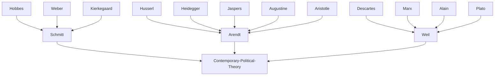

---
cssclasses:
  - Philosophy
  - Political-Science
subclasses:
  - Social-and-Political-Philosophy
  - 20th-Century-Philosophy
  - Ethics
aliases:
  - political philosophy
  - mass society
  - friend enemy
  - vita activa
  - labor work
  - public sphere
  - democratic theory
  - state exception
  - political action
  - banality evil
contributions:
  - Conceptual
authors:
  - "[[Schmitt]]"
  - "[[Arendt]]"
  - "[[Weil]]"
  - "[[Kelsen]]"
  - "[[Marx]]"
reference: "Abbagnano, N., & Fornero, G. (2012). La ricerca del pensiero. Vol. 3C. Dalla crisi della modernità agli sviluppi più recenti. Paravia."
related:
  - "[[Totalitarianism]]"
  - "[[Political Philosophy]]"
  - "[[Mass Society]]"
  - "[[Phenomenology]]"
  - "[[Critical Theory]]"
  - "[[Legal Positivism]]"
  - "[[Democracy]]"
  - "[[Public Sphere]]"
  - "[[Labor Theory]]"
  - "[[Existentialism]]"
---

#### Central Problem

How can political action be refounded in an era of mass society, totalitarianism, and the collapse of traditional forms of civic engagement? The twentieth century witnessed both the greatest expansion of democracy and the horrors of fascism, Nazism, and Stalinism. This paradox forced philosophers to rethink the very nature of the political—its foundations, its essence, and its possibilities in a world where the Western "juridical civilization" that had accompanied the modern state seemed to be in terminal decline.

[[Schmitt]] asks: what is the autonomous essence of the political, irreducible to morality, economics, or law? [[Arendt]] asks: how did totalitarianism become possible, and what authentic form of political life could prevent its return? [[Weil]] asks: can human labor be liberated from oppression, and what would a civilization centered on free manual work look like? These thinkers, despite radically different backgrounds and political sympathies—[[Schmitt]] briefly collaborating with Nazism, [[Arendt]] fleeing it, [[Weil]] fighting it—all sought to diagnose the pathologies of modern political life and imagine alternatives.

The crisis of parliamentary democracy, the atomization of individuals in mass society, the triumph of bureaucracy and technology over human agency, and the transformation of war from a regulated interstate affair into "world civil war"—these phenomena demanded new categories for understanding political existence.

#### Main Thesis

**[[Schmitt]]'s Thesis (Decisionismo):** The essence of politics lies not in norms but in the *decision* that establishes them. "Sovereign is he who decides on the exception"—the state of emergency reveals the true nature of sovereignty, which cannot be reduced to legal positivism ([[Kelsen]]'s position). The specifically political distinction is that between *friend and enemy* (*Freund und Feind*)—not private enemies but public ones, collectivities in potential conflict. Every political grouping constitutes itself in opposition to another; a unified world-state is impossible. Politics is constitutively conflictual. The European *ius publicum* that regulated interstate war has collapsed, replaced by utopian universalism (League of Nations, UN) that transforms limited war into permanent "world civil war" fought in the name of humanity against "criminals."

**[[Arendt]]'s Thesis:** Totalitarianism represents a radically new form of domination, distinct from all previous tyrannies, arising from the atomization of mass society. Its essence is the perverse combination of *terror* (secret police, concentration camps) and *ideology* (totalizing worldview claiming to know history's secrets). The camps transform humans into things; ideology transforms minds. Against this, [[Arendt]] retrieves the ancient Greek conception of political life—the *vita activa* comprising labor (biological necessity), work (fabrication of durable world), and *action* (political engagement through speech and deed in the public sphere). Authentic politics is not domination but the revelation of unique human identity through speech and action among equals—a "second birth" into the public realm.

**[[Weil]]'s Thesis:** The oppression inherent in industrial labor cannot be overcome merely by changing property relations, as [[Marx]] believed. Bureaucracy and technology produce alienation regardless of capitalist or socialist organization. The solution lies not in revolution but in reimagining labor itself—making manual work the "supreme value" not for its products but for the worker, connecting theory and practice, spirit and matter. This remains utopia, but a necessary one. Against totalitarianism's roots in force, prestige, and nationalism (traceable to Rome), power must be decentralized and colonized peoples liberated.

#### Historical Context

The twentieth century presented political philosophy with unprecedented challenges. The First World War shattered the European state system that had regulated conflict since the Peace of Westphalia (1648). The interwar period saw the rise of mass politics, the failure of parliamentary democracy in Germany (Weimar Republic), and the emergence of totalitarian regimes. [[Schmitt]] developed his critique of parliamentarism and liberalism during Weimar's crisis, briefly embracing Nazism in 1933 before being marginalized by the regime itself.

[[Arendt]], forced to flee Germany in 1933, witnessed the catastrophe from exile. Her *Origins of Totalitarianism* (1951), written in the immediate postwar period, diagnosed how antisemitism, imperialism, and mass society had produced the unprecedented evil of the death camps. The Eichmann trial (1963) deepened her analysis: the "banality of evil" showed how ordinary people, thoughtless rather than monstrous, could become instruments of genocide.

[[Weil]]'s brief life (1909-1943) combined philosophical reflection with direct experience—factory work, participation in the Spanish Civil War, mystical Christianity. Her analysis of labor and oppression emerged from living alongside workers, not merely theorizing about them. Writing during fascism's triumph, she sought to understand why the promises of revolutionary socialism had failed.

The postwar period brought the United Nations and the Nuremberg trials—attempts, in [[Schmitt]]'s critical view, to impose universal moral judgment on politics, transforming enemies into criminals and legitimate war into police action.

#### Philosophical Lineage

#### Key Thinkers

| Thinker | Dates | Movement | Main Work | Core Concept |
|---------|-------|----------|-----------|--------------|
| [[Schmitt]] | 1888-1985 | [[Political Philosophy]] | *The Concept of the Political* | Friend-enemy distinction |
| [[Arendt]] | 1906-1975 | [[Phenomenology]] | *The Origins of Totalitarianism* | Banality of evil, vita activa |
| [[Weil]] | 1909-1943 | [[Mysticism]] | *Reflections on Liberty and Oppression* | Free manual labor |
| [[Kelsen]] | 1881-1973 | [[Legal Positivism]] | *Pure Theory of Law* | Norm-based sovereignty |
| [[Marx]] | 1818-1883 | [[Socialism]] | *Capital* | Alienated labor |

#### Key Concepts

| Concept | Definition | Related to |
|---------|------------|------------|
| Decisionismo | Doctrine that sovereignty lies in the decision establishing norms, not in norms themselves; revealed in state of exception | [[Schmitt]], [[Political Philosophy]] |
| Friend-enemy distinction | The specifically political criterion defining groups in potential conflict; basis of collective identity | [[Schmitt]], [[Political Philosophy]] |
| Political theology | Method revealing structural parallels between theological and political concepts (e.g., omnipotent God/omnipotent legislator) | [[Schmitt]], [[Political Philosophy]] |
| Totalitarianism | Novel form of domination combining terror and ideology to atomize individuals and transform human nature | [[Arendt]], [[Political Philosophy]] |
| Banality of evil | Evil arising from thoughtlessness in ordinary people following orders, not from demonic malice | [[Arendt]], [[Ethics]] |
| Vita activa | Three forms of human activity: labor (biological), work (fabrication), action (political speech/deed) | [[Arendt]], [[Phenomenology]] |
| Public sphere | Space of appearance where humans reveal identity through speech and action among equals | [[Arendt]], [[Political Philosophy]] |
| World civil war | Permanent conflict between "humanity" and its "enemies," replacing regulated interstate war | [[Schmitt]], [[Political Philosophy]] |
| Free manual labor | Work as supreme human value connecting spirit to matter, theory to practice | [[Weil]], [[Ethics]] |

#### Authors Comparison

| Theme | [[Schmitt]] | [[Arendt]] | [[Weil]] |
|-------|-------------|------------|----------|
| Central problem | Essence of the political | Origins of totalitarianism | Oppression in labor |
| Political foundation | Decision, conflict | Action, speech, plurality | Decentralized power |
| View of liberalism | Critical (masks conflict) | Ambivalent | Critical (preserves oppression) |
| Democracy | Plebiscitary, presidential | Participatory, Greek model | Utopian, worker-centered |
| Violence | Constitutive possibility | Negation of politics | To be overcome |
| Mass society | Requires strong state | Produces totalitarianism | Produces alienation |
| Relation to Nazism | Brief collaboration | Fled, analyzed | Fought, analyzed |
| Philosophical sources | [[Hobbes]], Weber, theology | [[Aristotle]], Heidegger, Augustine | [[Marx]], [[Descartes]], mysticism |

#### Influences & Connections

- **Predecessors:** [[Schmitt]] ← influenced by ← [[Hobbes]], [[Weber]], Catholic theology
- **Predecessors:** [[Arendt]] ← influenced by ← [[Heidegger]], [[Jaspers]], [[Husserl]], [[Aristotle]], [[Augustine]]
- **Predecessors:** [[Weil]] ← influenced by ← [[Marx]], [[Descartes]], [[Plato]], Alain
- **Contemporaries:** [[Schmitt]] ↔ debate with ↔ [[Kelsen]] on sovereignty
- **Contemporaries:** [[Arendt]] ↔ dialogue with ↔ [[Jaspers]] on German guilt
- **Followers:** [[Schmitt]] → influenced → Chantal Mouffe, Giorgio Agamben
- **Followers:** [[Arendt]] → influenced → Jürgen [[Habermas]], contemporary republicanism
- **Opposing views:** [[Schmitt]] ← criticized by ← liberals for anti-parliamentarism; [[Arendt]] ← criticized by ← Jewish community for Eichmann analysis

#### Summary Formulas

- **[[Schmitt]]:** The political is defined by the friend-enemy distinction; sovereignty belongs to whoever decides on the exception; the collapse of European *ius publicum* has produced permanent world civil war masked as humanitarian intervention.
- **[[Arendt]]:** Totalitarianism arises from mass society's atomization of individuals; authentic political life requires action and speech in a public sphere, revealing human plurality—a "second birth" beyond biological necessity.
- **[[Weil]]:** Industrial oppression cannot be overcome by revolution alone; only a civilization making free manual labor its supreme value, connecting theory and practice, spirit and matter, could liberate humanity.

#### Timeline

| Year | Event |
|------|-------|
| 1922 | [[Schmitt]] publishes *Political Theology* |
| 1927 | [[Schmitt]] publishes *The Concept of the Political* |
| 1929 | [[Weil]] completes thesis on [[Descartes]] |
| 1931 | [[Schmitt]] publishes *The Guardian of the Constitution* |
| 1933 | [[Schmitt]] joins Nazi Party; [[Arendt]] flees Germany |
| 1934 | [[Weil]] publishes *Reflections on Liberty and Oppression* |
| 1934-35 | [[Weil]] works as factory laborer |
| 1936-39 | [[Weil]] participates in Spanish Civil War |
| 1943 | [[Weil]] dies in England |
| 1950 | [[Schmitt]] publishes *The Nomos of the Earth* |
| 1951 | [[Arendt]] publishes *The Origins of Totalitarianism* |
| 1958 | [[Arendt]] publishes *The Human Condition* (*Vita Activa*) |
| 1963 | [[Arendt]] publishes *Eichmann in Jerusalem: A Report on the Banality of Evil* |

#### Notable Quotes

> "Sovereign is he who decides on the exception." — [[Schmitt]]

> "The sad truth of the matter is that most evil is done by people who never made up their minds to be either bad or good." — [[Arendt]]

> "Manual labor must become the supreme value, not for its relation to what it produces but for its relation to the human being who performs it." — [[Weil]]

---
> [!NOTE]
> *This summary has been created to present the key points from the source text, which was automatically extracted using LLM. Please note that the summary may contain errors. It serves as an essential starting point for study and reference purposes.*
