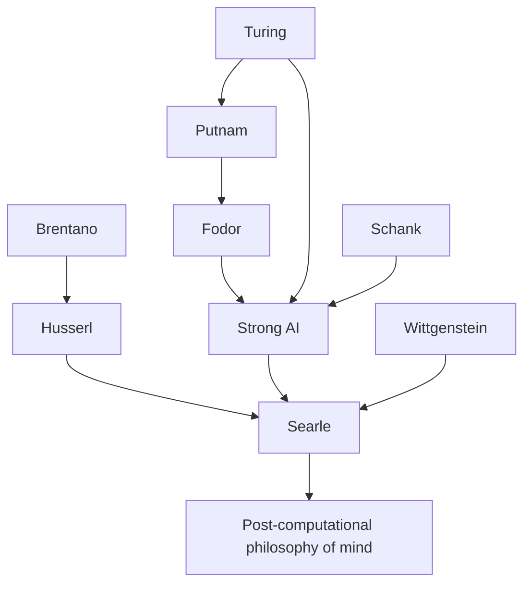

---
cssclasses:
  - Philosophy
subclasses:
  - Epistemology
  - Phenomenology
  - 20th-Century-Philosophy
related:
  - "[[Intentionality]]"
  - "[[Functionalism]]"
  - "[[Computational Theory of Mind]]"
  - "[[Turing Test]]"
  - "[[Phenomenology]]"
  - "[[Philosophy of Mind]]"
aliases:
  - minds brains
  - chinese room
  - searle chinese
  - searle 1980
  - strong ai
  - weak ai
  - intentionality argument
  - syntax semantics
  - symbol manipulation
  - causal powers
reference:
  - Searle, J. R. (1980). Minds, brains, and programs. Behavioral and Brain Sciences, 3(3), 417–424. https://doi.org/10.1017/S0140525X00005756
---

#### Central Problem

The Chinese Room argument addresses a fundamental question in philosophy of mind and artificial intelligence: Can a computer program, by virtue of running the right formal operations on symbols, actually *understand* anything? [[Searle]] argues that the answer is decisively no. The core problem is the relationship between **syntax** (formal symbol manipulation) and **semantics** (meaning, understanding, intentionality).

Strong AI claims that the appropriately programmed computer literally has cognitive states — it understands, thinks, and has other mental states. This is not merely the claim that computers are useful tools for studying cognition (Weak AI), but that they actually *are* minds. [[Searle]] finds this thesis "incredible in every sense of the word" and constructs the Chinese Room thought experiment to refute it.

The deeper problem concerns **intrinsic intentionality**: the capacity of mental states to be *about* something, to have semantic content. [[Searle]] argues that biological brains have this capacity through their specific causal powers, while computers — which merely instantiate formal programs — can never have it solely by virtue of running programs.

#### Main Thesis

[[Searle]]'s central thesis is that **instantiating a formal program can never be constitutive of intentionality**. No matter how sophisticated the program, no matter how indistinguishable its outputs from human responses, the program itself adds nothing by way of understanding or meaning.

The argument proceeds through the Chinese Room thought experiment: Imagine a native English speaker locked in a room, given Chinese characters as input, and using a rule book (the program) to produce Chinese characters as output. From outside, the person's responses are indistinguishable from a native Chinese speaker. Yet the person in the room understands nothing of Chinese — they merely manipulate uninterpreted formal symbols according to rules.

Key implications:

**Syntax Is Not Sufficient for Semantics:** Formal symbol manipulation, however complex, never produces genuine understanding. The symbols remain meaningless marks unless interpreted by a mind that already has intentionality.

**The Distinction Between Strong and Weak AI:** Weak AI uses computers as tools to model cognition — [[Searle]] endorses this enterprise. Strong AI claims the computer *is* a mind — [[Searle]] rejects this as conceptually confused.

**Intrinsic vs. Observer-Relative Intentionality:** Thermostats, computers, and cars have "beliefs" and "intentions" only in an observer-relative sense — we attribute intentionality to them for our purposes. Only biological brains (or systems with equivalent causal powers) have intrinsic intentionality.

**Causal Powers of the Brain:** The brain produces mental phenomena through its specific neurobiological causal powers. Any system that duplicates these powers could have intentionality, but merely running the same program is not sufficient.

#### Historical Context

The article appeared in 1980, responding to the optimism of classical AI research, particularly work on natural language understanding by [[Schank]] and others. Programs like SAM and PAM could answer questions about stories, leading researchers to claim these systems "understood" the stories.

The computational theory of mind, developed by [[Putnam]], [[Fodor]], and others, treated mental processes as formal operations on syntactic structures — the mind as software running on the brain's hardware. This view seemed to receive empirical support from AI successes.

[[Searle]] challenged this orthodoxy by distinguishing simulation from duplication. A computer simulation of a storm doesn't get us wet; a simulation of digestion doesn't digest anything. Why should a simulation of understanding actually understand? The target article provoked 27 peer commentaries from leading philosophers and AI researchers, making it one of the most debated papers in philosophy of mind.

#### Philosophical Lineage

#### Key Thinkers

| Thinker | Dates | Movement | Main Work | Core Concept |
|---------|-------|----------|-----------|--------------|
| [[Searle]] | 1932-2022 | [[Philosophy of Mind]] | *Minds, Brains, and Programs* | Chinese Room, intrinsic intentionality |
| [[Turing]] | 1912-1954 | [[Computer Science]] | *Computing Machinery and Intelligence* | Turing Test, machine intelligence |
| [[Fodor]] | 1935-2017 | [[Functionalism]] | *The Language of Thought* | Computational theory of mind |
| [[Dennett]] | 1942-2024 | [[Functionalism]] | *Brainstorms* | Intentional stance |
| [[Schank]] | 1946- | [[Artificial Intelligence]] | *Scripts, Plans, Goals* | Story understanding programs |
| [[Putnam]] | 1926-2016 | [[Functionalism]] | *Mind, Language and Reality* | Machine functionalism |

#### Key Concepts

| Concept | Definition | Related to |
|---------|------------|------------|
| Chinese Room | Thought experiment showing formal symbol manipulation doesn't produce understanding | [[Searle]], [[Philosophy of Mind]] |
| Strong AI | Thesis that appropriately programmed computers literally have minds | [[Turing]], [[Functionalism]] |
| Weak AI | Use of computers as tools to study and simulate cognition | [[Searle]], [[Cognitive Science]] |
| Intrinsic Intentionality | Mental states that genuinely possess semantic content | [[Brentano]], [[Phenomenology]] |
| Observer-Relative Intentionality | Intentionality we attribute to systems for our purposes | [[Searle]], [[Philosophy of Mind]] |
| Syntax vs. Semantics | Distinction between formal symbol structure and meaning | [[Searle]], [[Philosophy of Language]] |
| Causal Powers | The specific capacities of the brain that produce mental phenomena | [[Searle]], [[Naturalism]] |
| Systems Reply | Objection that the whole system (not just the person) understands | [[Functionalism]], [[AI]] |
| Robot Reply | Objection that embodied systems with causal connections would understand | [[Embodied Cognition]], [[AI]] |

#### Authors Comparison

| Theme | [[Searle]] | [[Dennett]] | [[Fodor]] |
|-------|------------|-------------|-----------|
| Central question | What is genuine understanding? | What is the intentional stance? | What is computational cognition? |
| On Strong AI | Rejects — syntax insufficient for semantics | Accepts — intentionality is observer-relative | Qualified acceptance — causal connections matter |
| Intentionality | Intrinsic property of biological brains | Attributional stance we take toward systems | Real but computationally realized |
| Chinese Room | Proves computers can't understand | Misunderstands nature of intentionality | Needs proper causal connections |
| Mind-brain relation | Mental states caused by and realized in brain | Functionalist — multiple realizability | Functionalist — language of thought |

#### Influences & Connections

- **Predecessors:** [[Searle]] ← influenced by ← [[Brentano]] (intentionality), [[Husserl]] (phenomenology), [[Wittgenstein]] (meaning as use)
- **Contemporaries:** [[Searle]] ↔ debate with ↔ [[Dennett]], [[Fodor]], [[Putnam]], [[Hofstadter]]
- **Followers:** [[Searle]] → influenced → [[Dreyfus]], embodied cognition movement, situated AI critique
- **Opposing views:** [[Searle]] ← criticized by ← [[Dennett]] (intuitions unreliable), [[Hofstadter]] (misunderstands computation)

#### Summary Formulas

- **[[Searle]]:** Syntax is not sufficient for semantics — no formal program can produce genuine understanding because symbol manipulation lacks intrinsic intentionality.
- **Strong AI position:** The mind is to the brain as software is to hardware — running the right program constitutes having mental states.
- **Systems Reply:** Understanding is a property of the whole system, not its components — refuted by internalizing the system.
- **Robot Reply:** Embodied systems with causal connections to the world would have intentionality — refuted because causal connections without awareness add nothing.

#### Timeline

| Year | Event |
|------|-------|
| 1950 | [[Turing]] publishes "Computing Machinery and Intelligence" proposing the Turing Test |
| 1960 | [[Putnam]] develops machine functionalism in "Minds and Machines" |
| 1975 | [[Schank]] develops scripts theory for story understanding |
| 1980 | [[Searle]] publishes "Minds, Brains, and Programs" with Chinese Room argument |
| 1980 | 27 peer commentaries respond; intense debate begins |
| 1984 | [[Searle]] expands argument in *Minds, Brains and Science* (Reith Lectures) |
| 1992 | [[Searle]] develops biological naturalism in *The Rediscovery of the Mind* |

#### Notable Quotes

> "No one supposes that computer simulations of a five-alarm fire will burn the neighborhood down. Why on earth would anyone suppose that a computer simulation of understanding actually understood anything?" — [[Searle]]

> "Instantiating a program could not be constitutive of intentionality, because it would be possible for an agent to instantiate the program and still not have the right kind of intentionality." — [[Searle]]

> "Mental states are as real as any other biological phenomena. They are both caused by and realized in the brain." — [[Searle]]

---
> [!warning]-
> This annotation was normalised using a large language model and may contain inaccuracies. These texts serve as preliminary study resources rather than exhaustive references.
