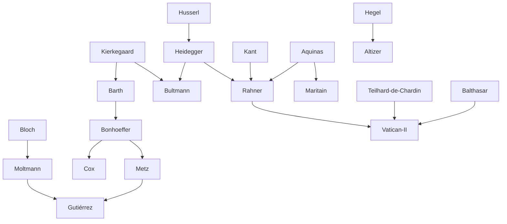

---
cssclasses:
  - Philosophy
subclasses:
  - Philosophy-of-Religion
  - 20th-Century-Philosophy
  - Continental-Philosophy
aliases:
  - theology twentieth
  - liberation theology
  - dialectical theology
  - anthropological turn
  - ecumenical theology
  - political theology
  - theology hope
  - christian atheism
  - omega point
contributions:
  - Conceptual
  - Constructive
authors:
  - "[[Barth]]"
  - "[[Bultmann]]"
  - "[[Tillich]]"
  - "[[Bonhoeffer]]"
  - "[[Rahner]]"
  - "[[Balthasar]]"
  - "[[Chardin]]"
  - "[[Moltmann]]"
  - "[[Gutiérrez]]"
  - "[[Küng]]"
reference: Abbagnano, N., & Fornero, G. (2012). La ricerca del pensiero. Vol. 3B. Dalla fenomenologia a Gadamer. Paravia.
related:
  - "[[Dialectical Theology]]"
  - "[[Existentialism]]"
  - "[[Phenomenology]]"
  - "[[Liberation Theology]]"
  - "[[Secularization]]"
  - "[[Vatican II]]"
  - "[[Thomism]]"
  - "[[Philosophy of Religion]]"
  - "[[Eschatology]]"
  - "[[Hermeneutics]]"
---

#### Central Problem

Twentieth-century Christian theology confronted an unprecedented crisis: how to articulate faith in God within a civilization marked by mass atheism, two catastrophic world wars, the Holocaust, rapid secularization, and profound social upheaval. Unlike nineteenth-century atheism, which remained largely an intellectual phenomenon among elites, twentieth-century unbelief became a mass phenomenon, transforming entire societies into religiously indifferent or explicitly post-Christian cultures.

The "masters of suspicion" — [[Feuerbach]], [[Marx]], [[Nietzsche]], and [[Freud]] — had reduced religious belief to illusory projection, false consciousness, pre-scientific thinking, or infantile neurosis. Meanwhile, the modern world had learned to organize knowledge and ethics on autonomous, secular foundations. The theological challenge was thus twofold: to respond credibly to the philosophical critiques of religion while simultaneously engaging the new socio-political realities — the "Marxist challenge" of social justice, liberation movements in the Third World, and advanced industrial societies where God seemed to have become an "unnecessary hypothesis."

This context gave rise to the "new theologies": various currents of Christian thought attempting to rethink faith in dialogue with contemporary philosophy, science, and social concerns, from theologies of secularization and the "death of God" to theologies of hope, liberation, and ecumenism.

#### Main Thesis

Twentieth-century theology responded to modernity's challenges through multiple, sometimes conflicting strategies, all sharing a common concern: to make the Christian message meaningful and credible for contemporary humanity.

**Protestant Dialectical Theology:** [[Barth]] proclaimed the "infinite qualitative difference" between time and eternity, God and humanity. Against all immanentism and natural theology, Barth insisted that God remains absolutely transcendent and unknowable through human reason. Religion itself, as a human possibility, cannot reach God; it can only bring humanity to consciousness of guilt and nothingness, preparing the crisis that opens toward grace. The gap between Creator and creature is bridged only through God's free self-revelation and the "leap of faith."

**Demythologization:** [[Bultmann]] argued that the mythological worldview of the New Testament must be "demythologized" — reinterpreted in terms of existential anthropology. Using [[Heidegger]]'s categories, Bultmann translated Christian proclamation into the language of authentic existence: facing anxiety, making decisive choices, and finding salvation through faith's encounter with the eschatological event of Christ.

**Evolutionary Synthesis:** [[Teilhard de Chardin]] attempted to reconcile science and faith by interpreting evolution as a cosmic process moving toward increasing consciousness, culminating in the "Omega Point" — identified with Christ as universal consciousness in whom humanity finds its completion.

**Anthropological Turn:** [[Rahner]] developed a "transcendental anthropology" showing that human openness to Being constitutes an a priori openness to God, making revelation possible. His "salvific optimism" held that God offers grace to all, including "anonymous Christians" outside the visible Church.

**Theology of Hope:** [[Moltmann]] and others recovered Christianity's eschatological dimension, presenting God not as static eternity but as "power of the future" — a message of transformative hope that must be realized in historical praxis, not merely awaited passively.

**Liberation Theology:** [[Gutiérrez]] and Latin American theologians insisted on theology "from below," constructed from the perspective of the poor and oppressed, emphasizing orthopraxis over orthodoxy and the Church's "preferential option for the poor."

**Ecumenical Theology:** [[Küng]] pursued dialogue across confessional and religious boundaries, arguing that peace among peoples requires peace among religions, which requires dialogue among religions.

#### Historical Context

The twentieth century's theological ferment emerged from multiple crises. The First World War shattered Enlightenment optimism and liberal Protestant theology's accommodation to culture. The rise of totalitarianism — fascism and Nazism — posed fundamental questions about human nature and divine providence. The Holocaust confronted theology with the scandal of Auschwitz: how to speak credibly of God after such absolute evil?

The Cold War division between capitalism and communism presented competing secular salvific visions. Decolonization movements in Africa, Asia, and Latin America raised urgent questions about Christianity's complicity with imperialism and its responsibility toward the poor. The Second Vatican Council (1962-1965) marked Catholicism's epochal opening to modernity, ecumenism, and dialogue with the contemporary world.

Philosophically, [[Kierkegaard]]'s "rediscovery" provided resources for challenging Hegelian synthesis and liberal accommodation. [[Husserl]]'s phenomenology and [[Heidegger]]'s existential analytic offered new conceptual tools. The Frankfurt School's critical theory, [[Bloch]]'s philosophy of hope, and various Marxist currents challenged theology to engage social-political transformation.

By the 1960s, advanced industrial societies experienced rapid secularization, declining church attendance, and cultural shifts toward individual autonomy, pleasure, and this-worldly fulfillment. The "death of God" seemed confirmed not only philosophically but sociologically.

#### Philosophical Lineage

#### Key Thinkers

| Thinker | Dates | Movement | Main Work | Core Concept |
|---------|-------|----------|-----------|--------------|
| [[Barth]] | 1886-1968 | [[Dialectical Theology]] | *Epistle to the Romans* | Infinite qualitative difference |
| [[Bultmann]] | 1884-1976 | [[Existential Theology]] | *New Testament and Mythology* | Demythologization |
| [[Tillich]] | 1886-1965 | [[Systematic Theology]] | *Systematic Theology* | Correlation principle |
| [[Bonhoeffer]] | 1906-1945 | [[Religionless Christianity]] | *Resistance and Surrender* | World come of age |
| [[Teilhard de Chardin]] | 1881-1955 | [[Evolutionary Theology]] | *The Phenomenon of Man* | Omega Point |
| [[Rahner]] | 1904-1984 | [[Transcendental Thomism]] | *Foundations of Christian Faith* | Anthropological turn |
| [[Balthasar]] | 1905-1988 | [[Theological Aesthetics]] | *The Glory of the Lord* | Beauty of revelation |
| [[Moltmann]] | 1926- | [[Theology of Hope]] | *Theology of Hope* | God as future |
| [[Gutiérrez]] | 1928- | [[Liberation Theology]] | *A Theology of Liberation* | Preferential option for the poor |
| [[Küng]] | 1928-2021 | [[Ecumenical Theology]] | *Global Responsibility* | Peace through dialogue |

#### Key Concepts

| Concept | Definition | Related to |
|---------|------------|------------|
| Infinite qualitative difference | Absolute gap between time and eternity, humanity and God, bridged only by grace | [[Barth]], [[Kierkegaard]] |
| Demythologization | Reinterpretation of New Testament mythology in existential-anthropological terms | [[Bultmann]], [[Heidegger]] |
| Correlation principle | Mutual relationship between human questions and divine answers in revelation | [[Tillich]], [[Systematic Theology]] |
| World come of age | Humanity's mature autonomy, no longer needing God as explanatory hypothesis | [[Bonhoeffer]], [[Secularization]] |
| Omega Point | Final evolutionary convergence of consciousness, identified with Christ | [[Teilhard de Chardin]], [[Evolution]] |
| Anthropological turn | Grounding theology in analysis of human existence's transcendental openness to God | [[Rahner]], [[Transcendental Thomism]] |
| Anonymous Christians | Those outside visible Church who implicitly accept grace through authentic existence | [[Rahner]], [[Soteriology]] |
| Eschatological theology | Christianity understood primarily as message of hope and future transformation | [[Moltmann]], [[Theology of Hope]] |
| Orthopraxis | Primacy of right action over right belief; theology as reflection on liberating practice | [[Gutiérrez]], [[Liberation Theology]] |
| Preferential option for the poor | Church's fundamental commitment to solidarity with oppressed and marginalized | [[Liberation Theology]], [[Social Justice]] |

#### Authors Comparison

| Theme | [[Barth]] | [[Bultmann]] | [[Rahner]] | [[Bonhoeffer]] |
|-------|-----------|--------------|------------|----------------|
| God-world relation | Absolute transcendence | Transcendence in existential encounter | Transcendence in human openness | God's presence through absence |
| Method | Revelation alone | Existential interpretation | Transcendental anthropology | Christocentric worldliness |
| Human knowledge of God | Impossible without grace | Through authentic decision | Through a priori openness | In solidarity with others |
| Role of philosophy | Rejected (natural theology) | Heidegger's existential analytic | [[Kant]] + Thomism | Critical engagement |
| Church and world | Prophetic witness | Proclamation (kerygma) | Anonymous Christianity | Religionless Christianity |
| Salvation | Through faith alone | Eschatological existence | Universal offer of grace | Participation in Christ's suffering |

#### Influences & Connections

- **Predecessors:** [[Barth]] ← influenced by ← [[Kierkegaard]], [[Luther]]; [[Bultmann]] ← influenced by ← [[Heidegger]]; [[Rahner]] ← influenced by ← [[Kant]], [[Aquinas]], [[Heidegger]]
- **Contemporaries:** [[Barth]] ↔ dialogue with ↔ [[Bultmann]]; [[Rahner]] ↔ debate with ↔ [[Balthasar]]; [[Moltmann]] ↔ dialogue with ↔ [[Bloch]]
- **Followers:** [[Bonhoeffer]] → influenced → [[Cox]], [[Hamilton]], [[Altizer]]; [[Moltmann]] → influenced → [[Gutiérrez]], [[Metz]]
- **Opposing views:** [[Barth]] ← criticized by ← [[Brunner]] (natural theology debate); [[Liberation Theology]] ← criticized by ← [[Vatican]] (certain formulations)

#### Summary Formulas

- **[[Barth]]:** God is wholly other, infinitely distant from humanity; religion is human presumption, while faith is God's gracious self-revelation crossing the unbridgeable gap.
- **[[Bultmann]]:** The mythological New Testament must be demythologized into existential categories, translating salvation into authentic existence through decision.
- **[[Bonhoeffer]]:** The world has come of age and no longer needs the "god of the gaps"; authentic Christianity means living before God and with God — without God.
- **[[Rahner]]:** Human existence is constitutively open to transcendence; theology begins from this anthropological "place" where grace is already at work.
- **[[Moltmann]]:** Christianity is essentially eschatological hope; God is not eternal present but the power of the transformative future calling us to action.
- **[[Gutiérrez]]:** Theology is reflection on liberating praxis from the perspective of the poor; the Kingdom must be anticipated in concrete historical liberation.

#### Timeline

| Year | Event |
|------|-------|
| 1919 | [[Barth]] publishes *Epistle to the Romans*, launching dialectical theology |
| 1927 | [[Barth]] begins publication of *Church Dogmatics* |
| 1941 | [[Bultmann]] presents "New Testament and Mythology" lecture on demythologization |
| 1944-1945 | [[Bonhoeffer]] writes *Letters and Papers from Prison*; executed by Nazis |
| 1955 | [[Teilhard de Chardin]] dies; works published posthumously |
| 1962-1965 | Second Vatican Council transforms Catholic theology |
| 1964 | [[Moltmann]] publishes *Theology of Hope* |
| 1965 | [[Cox]] publishes *The Secular City* |
| 1966 | [[Altizer]] publishes *The Gospel of Christian Atheism* |
| 1972 | [[Gutiérrez]] publishes *A Theology of Liberation* |
| 1976 | [[Rahner]] publishes *Foundations of Christian Faith* |
| 1979 | [[Küng]] loses canonical teaching license |
| 1987 | [[Küng]] publishes *Theology on the Way* |

#### Notable Quotes

> "If I have a system, it consists in keeping in view as steadily as possible what Kierkegaard called the 'infinite qualitative difference' between time and eternity. God is in heaven and you are on earth." — [[Barth]]

> "Man has learned to deal with all important questions without the help of the 'working hypothesis: God'. He has learned to cope with himself in all questions without recourse to God." — [[Bonhoeffer]]

> "No peace among the nations of this world without peace among the world religions. No peace among the world religions without peace among the Christian churches." — [[Küng]]

---
> [!NOTE]
> *This summary has been created to present the key points from the source text, which was automatically extracted using LLM. Please note that the summary may contain errors. It serves as an essential starting point for study and reference purposes.*
