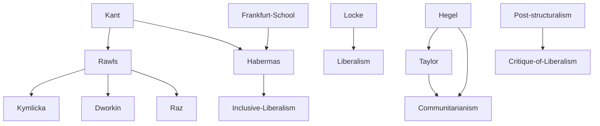

---
cssclasses:
  - Philosophy
  - Political-Science
  - Sociology
subclasses:
  - Social-and-Political-Philosophy
  - 20th-Century-Philosophy
  - Ethics
aliases:
  - cultural diversity
  - recognition politics
  - liberalism politics
  - identity politics
  - cultural rights
  - minority rights
  - overlapping consensus
  - inclusive society
  - melting pot
contributions:
  - Conceptual
  - Constructive
authors:
  - "[[Taylor]]"
  - "[[Rawls]]"
  - "[[Kymlicka]]"
  - "[[Sen]]"
  - "[[Habermas]]"
  - "[[Malinowski]]"
reference: "Abbagnano, N., & Fornero, G. (2012). La ricerca del pensiero. Vol. 3C. Dalla crisi della modernità agli sviluppi più recenti. Paravia."
related:
  - "[[Communitarianism]]"
  - "[[Liberalism]]"
  - "[[Politics of Recognition]]"
  - "[[Cultural Rights]]"
  - "[[Globalization]]"
  - "[[Tolerance]]"
  - "[[Identity Politics]]"
  - "[[Pluralism]]"
  - "[[Democracy]]"
  - "[[Human Rights]]"
---

#### Central Problem

The central problem addressed in this chapter is how culturally diverse societies can guarantee both social unity and respect for cultural differences. Multiculturalism poses a fundamental philosophical-political challenge: can we maintain social cohesion while allowing diverse cultures—with their different languages, religions, customs, and values—to flourish under the same political and juridical order? This problem has become increasingly urgent in the era of globalization, where peoples, languages, rights, religions, and customs intersect at a planetary level.

The philosophical stakes are high. Multiculturalism can be experienced either as a loss of irreplaceable singular identities (generating ineliminable tensions) or as a source of enrichment and an opportunity for constructing a new type of public sphere. The chapter examines whether the current multicultural challenge is genuinely new or merely the latest form of the perennial problem of tolerance that has accompanied political thought since the modern state emerged. Some scholars argue it is the phenomenal form of the old tolerance question; others insist it arises from the end of colonial empires and has accelerated unprecedentedly since 1989 and globalization.

The key questions are: (a) Is it possible to guarantee unity and social cohesion while preserving differences? (b) To what extent can cultural diversity be combined with the equal civil rights guaranteed by democratic institutions? These questions require philosophical engagement with two fundamental paradigms: communitarianism (emphasizing difference) and liberalism (emphasizing equality).

#### Main Thesis

The chapter presents a spectrum of philosophical positions on multiculturalism, ultimately pointing toward a synthesis that can balance political equality with cultural difference.

**The Problem of Recognition:** Multiculturalism raises the question of recognizing the Other—the different, the stranger, the foreigner. This requires moving beyond both the monocultural "melting pot" model (which privileged the majority culture, typically WASP—White/Anglo-Saxon/Male/Protestant) and the "mosaic" multiculturalism that seals each culture within impermeable boundaries (leading to both relativism and fundamentalism).

**Communitarian Position ([[Taylor]]):** Taylor argues that multiethnic society must recognize not only individual rights but also the rights of various communities. This preserves the difference of values in a collective, public sphere—unlike liberalism, which confines difference to the private realm. Taylor emphasizes the necessity of separations and boundaries as the only means of guaranteeing differences, arguing that not everything can coexist with everything. He explicitly notes that for most of Islam, separating politics from religion is unthinkable, making liberalism incompatible with some cultural systems.

**Liberal Position ([[Rawls]]):** Rawls argues that late-millennium society is characterized by multiple reasonable but incompatible systems that will likely never reunify. The only solution is the practice of tolerance and what he calls "overlapping consensus"—the common convergence of various traditions around a shared nucleus of elements that each subgroup justifies from its own perspective. This represents a search for a "lowest common denominator" among diverse beliefs and values to transform society into a fair system of cooperation.

**Hybrid Multiculturalism ([[Kymlicka]]):** Kymlicka distinguishes "multiculturalism" (from absorption of previously autonomous populations) from "multinationality" (arising from immigration), proposing a "hybrid" or "pluralizing" model that simultaneously safeguards individuals, majority groups, and minority groups within the state. National minorities should receive decentralization and self-government; ethnic groups should receive cultural recognition without special rights.

**Warning Against Miniaturization ([[Sen]]):** Sen warns against the "miniaturization of individuals"—attributing a fixed, immovable social identity to individuals or groups based on a single criterion. His "anti-solitarist approach" emphasizes that every person possesses multiple, non-contradictory identities simultaneously.

**Inclusive Liberal Society ([[Habermas]]):** Habermas mediates between liberalism and communitarianism, seeking a society that balances "political equality" with "cultural difference." He accepts liberalism's universality of rights and communitarianism's need to safeguard differences, but argues that law, being universal, cannot incorporate cultural particularity without losing its super partes regulatory function. The solution is an "inclusive" liberal society that hosts differences without compromising political equality, requiring both political culture and material preconditions (integrated schools, equal labor market access).

#### Historical Context

The term "multiculturalism" emerged in America during the 1960s, particularly in the United States and Canada, initially referring to local conflicts arising from the presence of diverse cultures and languages in the same geographic area—specifically, the end of peaceful coexistence between Anglophones and Francophones (the end of the melting pot era). During the 1980s and 1990s, the term expanded significantly due to profound political and ideological changes worldwide.

The question of the Other is not new—it has arisen throughout history, from the Greek-Barbarian distinction to European judgments on Amerindians during the "discovery" of America. However, the contemporary multicultural problem emerged specifically from the end of colonial empires and accelerated dramatically with the events of 1989 (fall of communism) and globalization.

The post-war period saw the dominance of the "assimilationist" model based on WASP (White/Anglo-Saxon/Male/Protestant) norms. The recognition of the value and rights of the Other signals the irreversible crisis of this neutralizing model. Post-structuralist and postmodern critiques accused the classical liberal state of "abstract neutralism" and "blindness" toward differences—attitudes seen as underlying nationalist tribalism and religious fundamentalism, with September 11, 2001 as their emblematic expression.

#### Philosophical Lineage

#### Key Thinkers

| Thinker | Dates | Movement | Main Work | Core Concept |
|---------|-------|----------|-----------|--------------|
| [[Taylor]] | 1931- | [[Communitarianism]] | *The Politics of Recognition* (1992) | Community rights, boundaries preserve difference |
| [[Rawls]] | 1921-2002 | [[Liberalism]] | *Political Liberalism* (1993) | Overlapping consensus, tolerance |
| [[Kymlicka]] | 1962- | [[Liberal Multiculturalism]] | *Multicultural Citizenship* (1995) | Hybrid/pluralizing multiculturalism |
| [[Sen]] | 1933- | [[Development Economics]] | *Identity and Violence* (2006) | Anti-miniaturization, multiple identities |
| [[Habermas]] | 1929- | [[Critical Theory]] | *The Inclusion of the Other* (1996) | Inclusive liberal society, mediation |

#### Key Concepts

| Concept | Definition | Related to |
|---------|------------|------------|
| Multiculturalism | Problem of coexistence of diverse cultures under same political-juridical order; can be "mosaic" (separatist) or recognition-based | Contemporary politics |
| Melting Pot | Assimilationist integration model based on WASP norms that privileged majority culture | Post-war America |
| Politics of Recognition | Demand that society recognize not just individual rights but the value of diverse cultural communities | [[Taylor]], Communitarianism |
| Overlapping Consensus | Common convergence of diverse traditions around shared elements each justifies from own perspective | [[Rawls]], Liberalism |
| Mosaic Multiculturalism | Model sealing each culture in impermeable boundaries, leading to relativism and fundamentalism | Anti-integrationism |
| Miniaturization | Risk of reducing individuals to single, fixed identity category (solitarist approach) | [[Sen]], Identity critique |
| Inclusive Liberal Society | Society balancing political equality with cultural difference through universal rights and material preconditions | [[Habermas]], Critical Theory |
| Hybrid Multiculturalism | Model simultaneously protecting individuals, majorities, and minorities with differentiated strategies | [[Kymlicka]], Liberal pluralism |

#### Authors Comparison

| Theme | [[Taylor]] | [[Rawls]] | [[Habermas]] |
|-------|------------|-----------|--------------|
| Primary concern | Community rights, difference | Individual rights, equality | Balancing both |
| View of liberalism | Too abstractly neutral, blind to difference | Foundation requiring tolerance | Valid but needs inclusion |
| Role of boundaries | Essential to preserve difference | Transcended by consensus | Mediated by inclusive institutions |
| Cultural rights | Collective, publicly recognized | Private, individually exercised | Protected without special legal status |
| Integration model | Separation preserves identity | Overlapping consensus | Inclusive citizenship |
| State role | Recognize communities | Neutral arbiter | Enable equal participation |

#### Influences & Connections

- **Predecessors:** [[Taylor]] ← influenced by ← [[Hegel]], [[Rawls]] ← influenced by ← [[Kant]], [[Locke]]
- **Contemporaries:** [[Taylor]] ↔ debate with ↔ [[Habermas]], [[Rawls]] ↔ dialogue with ↔ [[Dworkin]], [[Raz]]
- **Followers:** [[Rawls]] → influenced → [[Kymlicka]], [[Habermas]] → influenced → contemporary political theory
- **Opposing views:** [[Taylor]] ← criticized by ← liberals (separatism risk), [[Rawls]] ← criticized by ← communitarians (abstract neutralism)

#### Summary Formulas

- **[[Taylor]]:** Multiethnic society must recognize collective community rights, not just individual rights; boundaries and separations are necessary because not everything can coexist with everything.
- **[[Rawls]]:** Given irreducible pluralism of reasonable but incompatible worldviews, tolerance and overlapping consensus around shared principles enable fair social cooperation.
- **[[Kymlicka]]:** A hybrid multiculturalism must simultaneously protect individuals, majorities, and minorities through differentiated strategies appropriate to each situation.
- **[[Sen]]:** Avoid miniaturizing individuals into single identities; every person embodies multiple, non-contradictory affiliations that must all be recognized.
- **[[Habermas]]:** An inclusive liberal society can host differences without compromising political equality, requiring both appropriate political culture and material preconditions for equal participation.

#### Timeline

| Year | Event |
|------|-------|
| 1960s | Term "multiculturalism" emerges in North America |
| 1971 | Canada adopts official multiculturalism policy |
| 1989 | Fall of [[Berlin]] Wall accelerates multicultural debates |
| 1992 | [[Taylor]] publishes *The Politics of Recognition* |
| 1993 | [[Rawls]] publishes *Political Liberalism* |
| 1995 | [[Kymlicka]] publishes *Multicultural Citizenship* |
| 1996 | [[Habermas]] publishes *The Inclusion of the Other* |
| 2001 | September 11 attacks intensify debates on cultural conflict |
| 2006 | [[Sen]] publishes *Identity and Violence* |

#### Notable Quotes

> "We cannot possibly achieve knowledge of ourselves if we never leave the narrow confines of the customs, beliefs, and prejudices within which every man is born." — [[Malinowski]]

> "For the majority of Islam it is unthinkable to separate politics and religion in that way which seems obvious to us in Western liberal societies. Liberalism is not a possible meeting ground for all cultures and seems quite incompatible with other sets." — [[Taylor]]

> "The same person can be, without the slightest contradiction, of American citizenship, of Caribbean origin, with African ancestry, Christian, progressive, woman, vegetarian, marathon runner, historian, teacher, novelist, feminist, heterosexual, supporter of gay and lesbian rights, theater lover, environmentalist, tennis enthusiast, jazz musician, and deeply convinced that intelligent beings exist in space." — [[Sen]]

---
> [!NOTE]
> *This summary has been created to present the key points from the source text, which was automatically extracted using LLM. Please note that the summary may contain errors. It serves as an essential starting point for study and reference purposes.*
