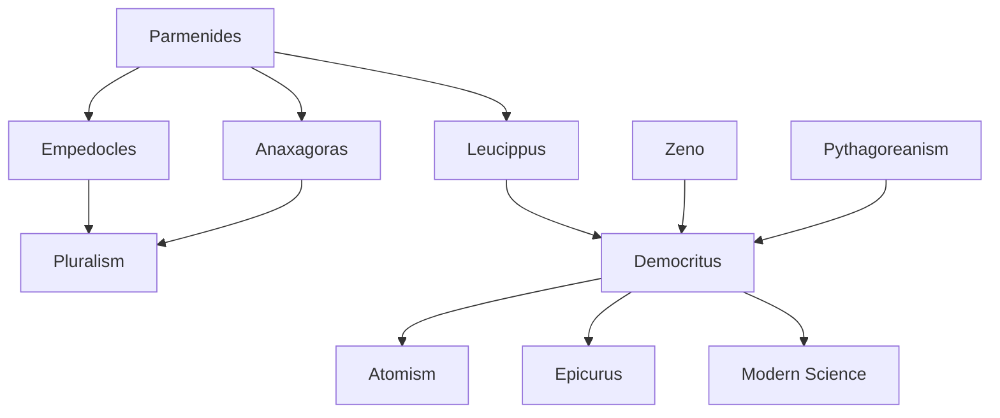

---
cssclasses:
  - Philosophy
subclasses:
  - Ancient-Greek-and-Roman-Philosophy
  - Metaphysics
  - Epistemology
related:
  - "[[Parmenides]]"
aliases:
  - four elements
  - cosmic cycle
reference:
  - "Abbagnano, N., & Fornero, G. (2012). La ricerca del pensiero. Vol. 1A. Dalle origini ad Aristotele. Paravia."
---

#### Central Problem

How can we explain the multiplicity, change, and diversity of natural phenomena while respecting the Parmenidean principle that nothing comes from nothing and nothing returns to nothing?

#### Main Thesis

The pluralist philosophers solve the Eleatic problem by positing multiple eternal principles—whether four elements (Empedocles), infinite seeds (Anaxagoras), or atoms (Democritus)—that combine and separate to produce apparent generation and destruction. The atomists provide the most radical solution: reality consists of indivisible material particles moving in void, operating through mechanical necessity rather than divine purpose.

#### Historical Context

The pluralist philosophers emerged in the 5th century BCE as responses to the Eleatic paradox: [[Parmenides]] had demonstrated the impossibility of generation and destruction, yet our senses testify to constant change. [[Empedocles]] of Agrigentum and Anaxagoras of Clazomene sought to reconcile reason and experience by multiplying the eternal principles. Democritus of Abdera, building on Leucippus's foundations, developed atomism into a comprehensive materialist worldview that represents a powerful alternative to the teleological thinking that would dominate through [[Aristotle]]. Notably, Democritus was contemporary with [[Socrates]] and [[Plato]], and his encyclopedic philosophy absorbed influences from sophistic culture while remaining focused on natural philosophy.

#### Philosophical Lineage

#### Key Thinkers

| Thinker | Dates | Movement | Main Work | Core Concept |
|---------|-------|----------|-----------|---------------|
| [[Empedocles]] | c. 490-430 BCE | [[Pluralism]] | *On Nature* | Four roots + Love/Strife |
| [[Anaxagoras]] | c. 500-428 BCE | [[Pluralism]] | *On Nature* | Seeds ordered by Noús |
| [[Leucippus]] | 5th century BCE | [[Atomism]] | *Great Cosmology* | Being = Full, Non-being = Void |
| [[Democritus]] | c. 460-370 BCE | [[Atomism]] | *Little Cosmology* | Atoms + Void + Mechanism |

#### Key Concepts

| Concept | Definition | Related to |
|---------|------------|------------|
| Four Roots | [[Empedocles]]' four eternal elements: fire, water, earth, air | [[Empedocles]], [[Elements]] |
| Love and Strife | Cosmic forces that unite (Love) and separate (Strife) the elements | [[Empedocles]], [[Cosmic Cycle]] |
| Cosmic Cycle | Eternal alternation between Sphere (unity) and Chaos (separation) | [[Empedocles]], [[Cosmology]] |
| Seeds/Homeomeries | Anaxagoras' infinite qualitatively distinct particles | [[Anaxagoras]], [[Noús]] |
| Noús | Anaxagoras' ordering Mind that separates the original mixture | [[Anaxagoras]], [[Teleology]] |
| Atoms | Indivisible, eternal, qualitatively identical material particles | [[Democritus]], [[Materialism]] |
| Void | Empty space in which atoms move | [[Leucippus]], [[Atomism]] |
| Materialism | Doctrine that matter is the sole substance and cause | [[Democritus]], [[Mechanism]] |
| Mechanism | Explanation through efficient causes without purpose | [[Atomism]], [[Determinism]] |
| Determinism | Everything occurs through necessary causes | [[Leucippus]], [[Mechanism]] |

#### Authors Comparison

| Theme | [[Empedocles]] | [[Anaxagoras]] | [[Democritus]] |
|-------|----------------|----------------|----------------|
| Number of principles | Four elements | Infinite seeds | Infinite atoms |
| Qualitative nature | Qualitatively distinct | Qualitatively distinct | Qualitatively identical |
| Divisibility | Not discussed | Infinitely divisible | Physically indivisible |
| Moving cause | Love and Strife | Noús (Mind) | Mechanical necessity |
| Epistemology | Like knows like | Unlike knows unlike | Dark vs. genuine knowledge |
| Teleology | Quasi-mythical forces | Mind as ordering principle | Completely rejected |

#### Influences & Connections

- **Parmenides**: All pluralists accept that nothing comes from nothing; they multiply eternal principles to save appearances
- **Zeno**: Democritus responds to paradoxes of infinite divisibility by distinguishing mathematical from physical divisibility
- **Pythagoreanism**: Atomist reduction of quality to quantity echoes Pythagorean mathematization of nature
- **Epicurus**: Later develops atomism with theory of atomic "swerve" (clinamen)
- **Modern Science**: Democritus anticipates atomic theory, causal explanation, primary/secondary quality distinction

#### Summary Formulas

1. **Empedocles' Principle**: Generation = combination of eternal elements; Destruction = their separation
2. **Cosmic Cycle**: Sphere (Love) → World (Love + Strife) → Chaos (Strife) → World → Sphere...
3. **Anaxagoras' Formula**: "All things were together" (mígma) → Noús separates → ordered cosmos
4. **Atomist Ontology**: Being = Full = Atoms; Non-being = Empty = Void
5. **Democritean Epistemology**: Atoms + Void + Motion = Reality (genuine knowledge) ≠ Qualities (opinion)
6. **Mechanist Principle**: Everything occurs by necessity; no teleology, no divine providence
7. **Moral Rationalism**: Happiness = inner tranquility achieved through reason and moderation

#### Timeline

| Year | Event |
|------|-------|
| c. 500-496 BCE | Birth of Anaxagoras in Clazomenae |
| c. 490 BCE | Birth of [[Empedocles]] in Agrigentum |
| c. 460-459 BCE | Birth of Democritus in Abdera |
| c. 450 BCE | Anaxagoras introduces philosophy to Athens under [[Pericles]] |
| c. 440 BCE | Leucippus founds atomist school |
| c. 430 BCE | Death of [[Empedocles]] |
| c. 428 BCE | Death of Anaxagoras |
| c. 370 BCE | Death of Democritus (reputedly over 100 years old) |

#### Notable Quotes

> "We know earth with earth, water with water, divine ether with ether, destructive fire with fire, love with love, and baneful strife with strife."
> — [[Empedocles]], Fragment 109

> "All things were together."
> — [[Anaxagoras]], Fragment 1

> "Nothing occurs at random, but everything for a reason and by necessity."
> — [[Leucippus]], Fragment 2

> "By convention sweet, by convention bitter, by convention hot, by convention cold, by convention color; but in reality atoms and void."
> — [[Democritus]], Fragment 125

> "I would rather discover one causal explanation than become king of the Persians."
> — [[Democritus]], Fragment 118

> "For the wise man, the whole earth is open; for the excellent soul, the entire world is a fatherland."
> — [[Democritus]], Fragment 247

 - Eleatic principles that pluralists sought to reconcile with experience
- [[Zeno of Elea]] - Paradoxes of divisibility that atomism addresses
- [[Epicurus]] - Later development of atomist philosophy
- [[Lucretius]] - Roman atomist who preserved Democritean cosmology
- [[Galilei]] - Modern revival of primary/secondary quality distinction
- [[Locke]] - Primary and secondary qualities in modern epistemology

---
> [!warning]-
> This annotation was normalised using a large language model and may contain inaccuracies. These texts serve as preliminary study resources rather than exhaustive references.
