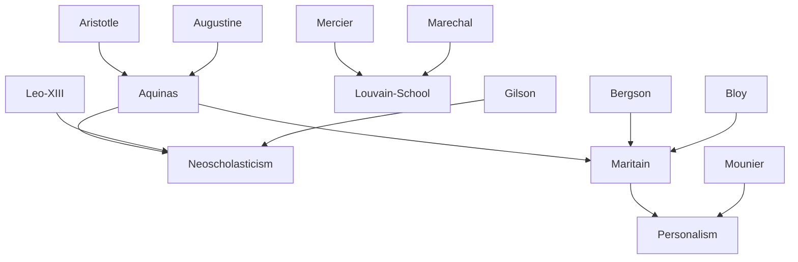

---
cssclasses:
  - Philosophy
subclasses:
  - Ethics
  - Social-and-Political-Philosophy
  - 20th-Century-Philosophy
aliases:
  - neoscholasticism
  - neotomism
  - thomism
  - integral humanism
  - personalism
  - maritain
  - common good
  - human person
  - grades knowledge
  - christian philosophy
  - democracy ethics
  - natural law
contributions:
  - Conceptual
authors:
  - "[[Maritain]]"
  - "[[Aquinas]]"
  - "[[Gilson]]"
  - "[[Mercier]]"
  - "[[XIII]]"
  - "[[Bergson]]"
reference: "[[06 The search for thought - Unit 9 Chapter 1.pdf]]"
---

#### Central Problem

How can medieval Christian philosophy, particularly Thomism, be renewed to address modern philosophical challenges while preserving its perennial truths? The neoscholastic movement confronts the task of rehabilitating scholastic thought against modern philosophies that have either separated (Luther, Descartes, Rousseau) or identified (idealism, positivism) fundamental categories such as nature and grace, reason and faith, matter and spirit.

At its core, the challenge is to develop a philosophy of the human person that avoids both the individualism of bourgeois liberalism and the collectivism of Marxism, while also transcending the relativism and nihilism of contemporary culture. The central problem is anthropological and political: how to ground human dignity, rights, and democracy on a metaphysical foundation that respects both the individual and the community, temporal goods and eternal values.

Maritain's formulation captures this problematic: modern humanism, while rightly valuing the human being, has adopted an anthropocentric orientation that ultimately undermines authentic humanism. The task is to achieve an "integral humanism" — antimodern in its critique of immanentism, yet ultramodern in its capacity to absorb modernity's genuine achievements.

#### Main Thesis

Neoscholasticism, especially in its Thomistic form, represents the renewal of Christian philosophy capable of engaging critically with modernity while preserving the "perennial" truths of scholastic thought. This renewal operates through four theoretical moments:

**The Critical Problem:** A theory of abstraction grounds a gnoseology alternative to both innatism/empiricism and apriorism/sensism.

**The Psychological Problem:** The theory of soul as form of body supports a unitary anthropology against both monism (idealistic and materialistic) and dualism (ancient and modern).

**The Physical Problem:** Hylomorphism provides a doctrine independent of scientific development, opposing positivism and materialism judged as reductionistic.

**The Metaphysical Problem:** The theory of act and potency grounds a philosophy of being (actus essendi) that renews ancient substance philosophy while opposing modern philosophy of thought.

Maritain's "integral humanism" synthesizes these theoretical achievements into a practical program: an antimodern humanism that traverses modernity to achieve ultramodernity. This involves:

- **Personalism:** The person is more than an individual — a microcosm containing the universe through knowledge and love, whose dignity derives from being imago Dei
- **Pluralistic Democracy:** Politics as ethical rationalization of social life, founded on the primacy of the person, respect for pluralism, pursuit of the common good, and anti-perfectionism
- **Grades of Knowledge:** Distinguishing empirical sciences, mathematics, philosophy of nature, metaphysics, and theology (dogmatic and mystical) according to degrees of abstraction

#### Historical Context

Neoscholasticism emerged in the nineteenth century and received official ecclesiastical endorsement with Pope Leo XIII's encyclical *Aeterni Patris* (1879), which called for a living Thomism capable of valorizing its perennial aspects while critically traversing modernity. The encyclical distanced itself from a Thomism too bound to its particular historical epoch, reproposing it as the highest expression of Christian philosophy.

Subsequent papal interventions reinforced this orientation: Pius X's *Pascendi* (1907) against modernism, Pius XII's *Humani generis* (1950) presenting "perennial philosophy" against modernism, Vatican II (1962-1965) recommending Thomas Aquinas as master while allowing pluralism, Paul VI's *Lumen Ecclesiae* (1974), and John Paul II's confirmation (1979) and *Fides et ratio* (1998), which praised Thomas for his dialogical engagement with Arab and Jewish thought.

The twentieth-century neoscholastic movement was characterized by openness to modern problems and orientations, engaging with Kantianism, idealism, Marxism, phenomenology, existentialism, and analytic philosophy. Three major groups emerged: the Louvain school (Mercier, Maréchal) emphasizing gnoseological realism; the Milan Sacred Heart school (Olgiati, Masnovo, Zamboni, Padovani, Vanni Rovighi, Bontadini) emphasizing ontological realism; and independent thinkers (Gilson, Maritain) conducting both historical and theoretical research.

Maritain's personal journey included conversion to Catholicism (1906) under Léon Bloy's influence, departure from Action Française after papal condemnation (1926), opposition to fascism and the Spanish Civil War, French Resistance activity during exile in America (1940-1944), and service as French ambassador to the Holy See (1944-1948).

#### Philosophical Lineage

#### Key Thinkers

| Thinker | Dates | Movement | Main Work | Core Concept |
|---------|-------|----------|-----------|--------------|
| [[Aquinas]] | 1225-1274 | [[Scholasticism]] | *Summa Theologica* | Act and potency, natural law |
| [[Leo XIII]] | 1810-1903 | [[Neoscholasticism]] | *Aeterni Patris* | Renewal of Thomism |
| [[Mercier]] | 1851-1926 | [[Neoscholasticism]] | *Critériologie* | Gnoseological realism |
| [[Gilson]] | 1884-1978 | [[Neoscholasticism]] | *Being and Some Philosophers* | Christian philosophy, existential Thomism |
| [[Maritain]] | 1882-1973 | [[Personalism]] | *Integral Humanism* | Person, integral humanism, democracy |
| [[Maréchal]] | 1878-1944 | [[Transcendental Thomism]] | *Point of Departure of Metaphysics* | Dynamism of intellect |

#### Key Concepts

| Concept | Definition | Related to |
|---------|------------|------------|
| Integral Humanism | Humanism respecting the totality of the person (anthropological) and integrating positive aspects of various theories (axiological) | [[Maritain]], [[Personalism]] |
| Person | An individual who governs itself through intelligence and will; exists spiritually in knowledge and love; a microcosm containing the universe | [[Maritain]], [[Aquinas]] |
| Common Good | The ensemble of material and moral goods that are communicable and help each person complete their life and freedom | [[Maritain]], [[Social-and-Political-Philosophy]] |
| Grades of Knowledge | Hierarchy from empirical sciences (first abstraction) through mathematics (second) to metaphysics (third) and theology (wisdom) | [[Maritain]], [[Epistemology]] |
| Perennial Philosophy | The enduring truths of Thomistic philosophy capable of critically engaging each historical epoch | [[Neoscholasticism]], [[Aquinas]] |
| Machiavellism | Political conception subordinating man to the State, pursuing immediate success at the cost of ethical values | [[Maritain]], [[Political-Science]] |
| Antimodern | Critical stance toward modernity's immanentism while preserving its genuine achievements for an "ultramodern" synthesis | [[Maritain]], [[Neoscholasticism]] |
| Hylomorphism | Aristotelian-Thomistic doctrine of substance as unity of matter (hyle) and form (morphe) | [[Aquinas]], [[Aristotle]] |

#### Authors Comparison

| Theme | [[Maritain]] | [[Gilson]] | [[Mercier]] |
|-------|--------------|------------|-------------|
| Central concern | Integral humanism, personalistic politics | History and nature of Christian philosophy | Criteria of certainty, gnoseology |
| Method | Thomism applied to contemporary problems | Historical-speculative investigation | Critical realism |
| Modernity | Antimodern → ultramodern synthesis | Critique of modern rationalism | Dialogue with Kantian epistemology |
| Person | Spiritual-material unity, image of God | Existential act of being | Knowing subject |
| Politics | Personalistic democracy, common good | Historical-cultural critique | Less developed |
| Key innovation | Grades of knowledge, integral humanism | Existential Thomism | Transcendental criteria |

#### Influences & Connections

- **Predecessors:** [[Maritain]] ← influenced by ← [[Aquinas]], [[Bergson]], [[Bloy]]
- **Predecessors:** [[Neoscholasticism]] ← influenced by ← [[Aristotle]], [[Augustine]], [[Aquinas]]
- **Contemporaries:** [[Maritain]] ↔ dialogue with ↔ [[Gilson]], [[Mounier]]
- **Contemporaries:** [[Maritain]] ↔ opposition to ↔ [[Sartre]], [[Marxism]], [[Positivism]]
- **Followers:** [[Maritain]] → influenced → [[Catholic Social Teaching]], [[Human Rights discourse]]
- **Opposing views:** [[Maritain]] ← criticized ← [[Machiavellism]], [[Liberalism]], [[Collectivism]]

#### Summary Formulas

- **[[Leo XIII]]:** The encyclical *Aeterni Patris* inaugurates the neoscholastic renewal, calling for a living Thomism capable of critically traversing modernity while preserving perennial truths.
- **[[Maritain]]:** Integral humanism transcends both individualism and collectivism through a personalism that grounds democracy on the dignity of the person as image of God, pursuing the common good through ethical means.
- **[[Gilson]]:** Christian philosophy is neither a contradiction nor a mere application of theology; it represents a genuine philosophical development animated by faith yet proceeding according to rational demonstration.
- **[[Mercier]]:** Thomistic epistemology provides criteria of certainty grounding a gnoseological realism alternative to both Kantian apriorism and empiricist sensism.

#### Timeline

| Year | Event |
|------|-------|
| 1879 | [[Leo XIII]] publishes encyclical *Aeterni Patris* — official beginning of neoscholasticism |
| 1882 | [[Maritain]] born in Paris |
| 1906 | [[Maritain]] converts to Catholicism |
| 1907 | Pius X publishes *Pascendi* against modernism |
| 1914 | [[Maritain]] publishes *Bergsonian Philosophy* |
| 1922 | [[Maritain]] publishes *Antimodern*; creates Thomistic circles |
| 1932 | [[Maritain]] publishes *Distinguish to Unite, or The Degrees of Knowledge* |
| 1936 | [[Maritain]] publishes *Integral Humanism* |
| 1943 | [[Maritain]] publishes *Education at the Crossroads* |
| 1947 | [[Maritain]] publishes *The Person and the Common Good* |
| 1951 | [[Maritain]] publishes *Man and the State* |
| 1962-1965 | Vatican Council II — pluralism while maintaining reference to Aquinas |
| 1973 | [[Maritain]] dies in Toulouse |
| 1998 | John Paul II publishes *Fides et Ratio* — confirms Thomistic orientation |

#### Notable Quotes

> "When we say that a man is a person, we do not mean only that he is an individual like an atom, a blade of grass, a fly, or an elephant. Man is an individual who governs himself through intelligence and will; he does not exist only in a physical mode, but superexists spiritually in knowledge and in love." — [[Maritain]]

> "The end, for democracy, is both justice and liberty. In a democracy, the use of means incompatible with justice and liberty would be an operation of self-destruction." — [[Maritain]]

> "The fear of soiling oneself by entering into the midst of history is not virtue, but a way of fleeing virtue." — [[Maritain]]

#### See Also

- [[Thomism]]
- [[Personalism]]
- [[Natural Law]]
- [[Catholic Social Teaching]]
- [[Human Rights]]
- [[Democracy]]
- [[Common Good]]
- [[Christian Philosophy]]
- [[Scholasticism]]
- [[Vatican II]]

> [!NOTE]
> *This summary has been created to present the key points from the source text, which was automatically extracted using LLM. Please note that the summary may contain errors. It serves as an essential starting point for study and reference purposes.*
