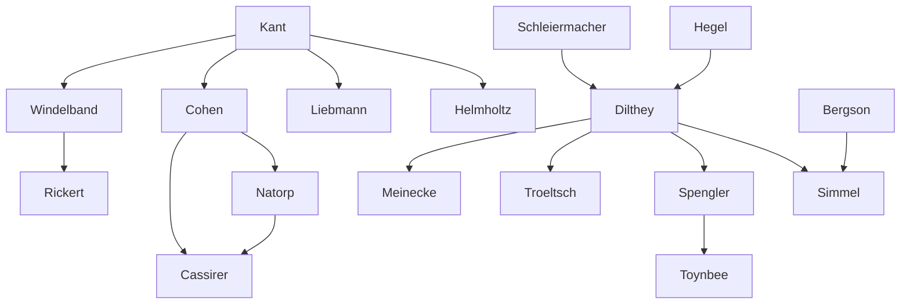

---
cssclasses:
  - Philosophy
  - History
subclasses:
  - Epistemology
  - 19th-Century-Philosophy
  - Hermeneutics
aliases:
  - neokantanism
  - historicism
  - verstehen
  - lived experience
  - symbolic forms
  - animal symbolicum
  - nomothetic
  - idiographic
  - marburg school
  - baden school
  - sciences spirit
  - decline west
  - historical relativism
contributions:
  - Conceptual
  - Constructive
authors:
  - "[[Dilthey]]"
  - "[[Cassirer]]"
  - "[[Windelband]]"
  - "[[Rickert]]"
  - "[[Cohen]]"
  - "[[Simmel]]"
  - "[[Spengler]]"
reference: "[[05 The search for thought - Unit 4 Chapter 2.pdf]]"
---

#### Central Problem

The chapter addresses two interconnected problems stemming from the reaction against positivism: (1) What are the conditions that guarantee the validity of scientific and other forms of human knowledge? (2) What distinguishes the human sciences (Geisteswissenschaften) from the natural sciences, and what methods are appropriate to each?

Neo-Kantianism returns to Kant's fundamental teaching: philosophy must not be reduced to psychology, physiology, metaphysics, or theology, but must analyze the conditions of validity for the human world. It opposes both the metaphysics of matter (positivism) and the metaphysics of spirit (idealism), as well as empiricism and psychologism that reduce the validity of knowledge to mere subjective or psychological conditions.

German Historicism confronts a parallel question: How can we establish a critique of historical reason analogous to Kant's critique of pure reason? What makes historical knowledge possible and valid? The historicists recognize that historical objects are fundamentally different from natural objects — they are individual, unrepeatable, and meaningful in ways that require a distinctive method of understanding (Verstehen) rather than causal explanation.

A further problem emerges: if all values and knowledge are historically conditioned, does this lead to relativism? Can there be any absolute or universal values in a world where everything is subject to historical change?

#### Main Thesis

**Neo-Kantianism** maintains Kant's distinction between the validity of knowledge (or morality, or art) and the empirical, psychological, or subjective conditions under which these activities manifest themselves in humans. Philosophy's task is to analyze validity conditions, not to engage in metaphysics.

The **Marburg School** (Cohen, Natorp, Cassirer) reduces subjective cognitive processes to objective methods guaranteeing validity, integrating Kant with Plato to argue that pure ideas ground the meaning and objective value of all possible knowledge.

The **Baden School** (Windelband, Rickert) proposes a theory of values as absolute, universal, and eternal — independent of temporal and historical vicissitudes:
- Windelband distinguishes **nomothetic sciences** (seeking general laws) from **idiographic sciences** (seeking the particular in its historically determined form)
- Rickert argues the distinction depends on logical-methodological choice: "reality becomes nature if we consider it in reference to the general, and becomes history if we consider it in reference to the particular and individual"

**Cassirer** develops Neo-Kantianism most significantly by emphasizing **symbolic expression** in constituting the human world. Humans are not primarily *animal rationale* but ***animal symbolicum*** — symbol-using creatures. Language is not merely communication but the means for organizing experience and bringing it from passive impressions to authentic rational objectivity. The symbol is "the necessary and essential organ of thought... the instrument by virtue of which conceptual content itself is constituted."

**Dilthey's Historicism** argues:
- The object of the human sciences is humanity in its social relations — its history
- Historical objects have a specific character distinguishing them from natural objects: they are internal, not external, to the human knower
- **Erlebnis** (lived experience) is the material of understanding
- **Verstehen** (understanding) is the fundamental cognitive operation: "the rediscovery of the I in the Thou"
- The **categories of historical reason** (life, dynamic connection, meaning, epoch) are not a priori forms but structures of the historical world itself
- All historical forms — including philosophy itself — are finite and historically conditioned

#### Historical Context

Neo-Kantianism emerged in Germany after the mid-nineteenth century as a "return to Kant," receiving its first impulse from Hermann Helmholtz's writings, Kuno Fischer's monograph on Kant (1860), and Eduard Zeller's work on epistemology (1862). In 1865, Otto Liebmann's *Kant and the Epigones* concluded each analysis of post-Kantian philosophy with the slogan: "We must therefore return to Kant."

German Historicism developed between Dilthey's *Introduction to the Human Sciences* (1883) and Meinecke's *Origins of Historicism* (1936). Dilthey worked as a professor in Berlin alongside great German historians like Mommsen, Burckhardt, and Zeller, and devoted his life to a universal history of the European spirit.

The period witnessed the consolidation of positivistic natural science and growing recognition that human phenomena — history, culture, society — might require fundamentally different approaches than physics or biology. The question of methodology in the human sciences became acute as scholars sought to establish these disciplines on rigorous foundations while respecting their distinctive character.

The early twentieth century brought crises that intensified these debates: World War I prompted Spengler's pessimistic *Decline of the West* (1918-1922) and Simmel's reflections on war and cultural conflict. The interwar period saw continued debates about historical relativism and the possibility of absolute values.

#### Philosophical Lineage

#### Key Thinkers

| Thinker | Dates | Movement | Main Work | Core Concept |
|---------|-------|----------|-----------|--------------|
| [[Cohen]] | 1842-1918 | [[Marburg School]] | Kant interpretations | Pure idea as ground of validity |
| [[Natorp]] | 1854-1924 | [[Marburg School]] | Neo-Kantian epistemology | Objective method |
| [[Cassirer]] | 1874-1945 | [[Marburg School]] | *Philosophy of Symbolic Forms* | Animal symbolicum |
| [[Windelband]] | 1848-1915 | [[Baden School]] | *History and Natural Science* | Nomothetic/idiographic distinction |
| [[Rickert]] | 1863-1936 | [[Baden School]] | *The Limits of Concept Formation* | Value-relation in history |
| [[Dilthey]] | 1833-1911 | [[German Historicism]] | *Introduction to the Human Sciences* | Verstehen, Erlebnis |
| [[Simmel]] | 1858-1918 | [[Philosophy of Life]] | *Philosophy of Money* | Life as metaphysical reality |
| [[Spengler]] | 1880-1936 | [[Cultural Morphology]] | *The Decline of the West* | Cultures as organisms |

#### Key Concepts

| Concept | Definition | Related to |
|---------|------------|------------|
| Verstehen (Understanding) | The fundamental cognitive operation of the human sciences — reliving and reproducing others' experience, the "rediscovery of the I in the Thou" | [[Dilthey]], hermeneutics |
| Erlebnis (Lived Experience) | The immediate inner experience through which humans grasp themselves; the material or starting point of understanding | [[Dilthey]], consciousness |
| Nomothetic Sciences | Sciences seeking the general in the form of natural law; sciences of what "always is" | [[Windelband]], natural science |
| Idiographic Sciences | Sciences seeking the particular in its historically determined form; sciences of what "once was" | [[Windelband]], history |
| Animal Symbolicum | Cassirer's definition of the human being as a symbol-using creature, replacing the traditional "animal rationale" | [[Cassirer]], language |
| Symbolic Forms | The various modes (language, myth, art, science, religion) through which humans organize experience and constitute their world | [[Cassirer]], culture |
| Dynamic Connection | A structure or totality centered around values and purposes; individuals, civilizations, epochs as self-centered structures | [[Dilthey]], historicism |
| Objective Spirit | Dilthey's term (borrowed from Hegel) for the totality of manifestations in which life has objectified itself through historical development | [[Dilthey]], [[Hegel]] |
| Culture/Civilization | Spengler's distinction: Culture (Kultur) is a living organism; Civilization (Zivilisation) is its final mature phase preceding death | [[Spengler]], decline |
| Historical Relativism | The theory that values exist only "in relation to" determinate contexts, not absolutely | [[Dilthey]], [[Spengler]] |

#### Authors Comparison

| Theme | [[Dilthey]] | [[Cassirer]] | [[Spengler]] |
|-------|-------------|--------------|--------------|
| Central question | How is historical knowledge possible? | How do symbolic forms constitute human culture? | What is the destiny of civilizations? |
| View of history | Individualizing understanding | Symbolic mediation | Organic life-cycles |
| Method | Verstehen (understanding) | Analysis of symbolic forms | Morphological comparison |
| Status of values | Historically relative | Symbolically constituted | Absolutely relative to culture |
| Role of subject | Rediscovery of I in Thou | Animal symbolicum | Subject to cultural destiny |
| Metaphysics | Critique of metaphysics | Transformation of Kantian critique | Metaphysics of history |
| Historical necessity | Freedom within conditions | Creative symbolic activity | Fatalistic destiny |

#### Influences & Connections

- **Predecessors:** [[Dilthey]] ← influenced by ← [[Schleiermacher]], [[Hegel]], [[Kant]]
- **Predecessors:** [[Cassirer]] ← influenced by ← [[Cohen]], [[Natorp]], [[Kant]], [[Plato]]
- **Contemporaries:** [[Dilthey]] ↔ dialogue with ↔ [[Windelband]], [[Rickert]]
- **Contemporaries:** [[Simmel]] ↔ dialogue with ↔ [[Bergson]]
- **Followers:** [[Dilthey]] → influenced → [[Simmel]], [[Spengler]], [[Troeltsch]], [[Meinecke]]
- **Followers:** [[Dilthey]] → influenced → [[Heidegger]], [[Gadamer]] (hermeneutic tradition)
- **Opposing views:** [[Spengler]] ← criticized by ← [[Toynbee]] (against historical fatalism)

#### Summary Formulas

- **[[Dilthey]]:** The human sciences require understanding (Verstehen) rather than explanation; through lived experience (Erlebnis) and the categories of historical reason, we achieve the "rediscovery of the I in the Thou" that constitutes historical knowledge.

- **[[Cassirer]]:** Humans are not primarily rational animals but symbol-using animals (animal symbolicum); language and other symbolic forms are not mere communication but the constitutive organs of thought through which we create and inhabit a cultural world.

- **[[Windelband]]:** Sciences are either nomothetic (seeking general laws of what "always is") or idiographic (seeking the particular of what "once was"); the human sciences are fundamentally idiographic.

- **[[Spengler]]:** Cultures are organisms that necessarily pass through cycles of birth, flourishing, and death; Western civilization has entered its final phase (Zivilisation) and its decline is inevitable destiny.

#### Timeline

| Year | Event |
|------|-------|
| 1860 | Kuno Fischer publishes monograph on [[Kant]] |
| 1862 | Eduard Zeller publishes *On the Significance of Epistemology* |
| 1865 | Otto Liebmann publishes *Kant and the Epigones* ("return to Kant") |
| 1867 | [[Dilthey]] publishes *Life of Schleiermacher* |
| 1883 | [[Dilthey]] publishes *Introduction to the Human Sciences* |
| 1894 | [[Dilthey]] publishes *Ideas for a Descriptive Psychology* |
| 1900 | [[Simmel]] publishes *Philosophy of Money* |
| 1910 | [[Cassirer]] publishes *Substance and Function* |
| 1910 | [[Dilthey]] publishes *The Construction of the Historical World* |
| 1918-22 | [[Spengler]] publishes *The Decline of the West* |
| 1921 | [[Cassirer]] publishes *Einstein's Theory of Relativity* |
| 1923-29 | [[Cassirer]] publishes *Philosophy of Symbolic Forms* (3 vols.) |
| 1934-61 | [[Toynbee]] publishes *A Study of History* (12 vols.) |
| 1936 | [[Meinecke]] publishes *Origins of Historicism* |

#### Notable Quotes

> "We understand ourselves and others only insofar as we transpose our lived experience into every kind of expression of our own and others' life." — [[Dilthey]]

> "Instead of defining man as an animal rationale, we should define him as an animal symbolicum. By so doing we can designate what specifically distinguishes him and understand the new road open to man: the road toward civilization." — [[Cassirer]]

> "The historical consciousness of the finitude of every historical phenomenon, of every human and social situation, the consciousness of the relativity of every form of belief, is the last step toward the liberation of humanity." — [[Dilthey]]

#### See Also

- [[Kant]]
- [[Hermeneutics]]
- [[Philosophy of History]]
- [[Epistemology]]
- [[Philosophy of Culture]]
- [[Verstehen]]
- [[Symbolic Forms]]
- [[Cultural Relativism]]
- [[Phenomenology]]
- [[Gadamer]]

> [!NOTE]
> *This summary has been created to present the key points from the source text, which was automatically extracted using LLM. Please note that the summary may contain errors. It serves as an essential starting point for study and reference purposes.*
