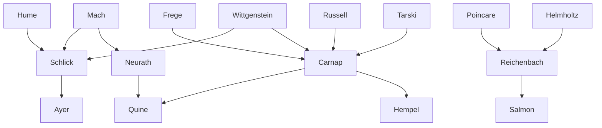

---
cssclasses:
  - Philosophy
subclasses:
  - Analytic-Philosophy
  - Epistemology
  - Philosophy-of-Science
related:
  - "[[Vienna Circle]]"
  - "[[Berlin Group]]"
  - "[[Analytic Philosophy]]"
  - "[[Verification Principle]]"
  - "[[Logical Atomism]]"
  - "[[Philosophy of Science]]"
  - "[[Unified Science]]"
  - "[[Emotivism]]"
  - "[[Legal Positivism]]"
  - "[[Post-Empiricism]]"
aliases:
  - logical positivism
  - vienna circle
  - verification principle
  - protocol statements
  - logical empiricism
  - unified science
  - analytic synthetic
reference:
  - "[Abbagnano, N., & Fornero, G. (2012). La ricerca del pensiero. Vol. 3B. Dalla fenomenologia a Gadamer. Paravia.](https://archive.org/download/ssp-s06-e08/The%20search%20for%20thought%20-%20Unit%2012%20Chapter%203.pdf)"
tags:
  - Podcast
---

#### Podcast

<iframe src="https://archive.org/embed/ssp-s06-e08" width="100%" height="30" frameborder="0" webkitallowfullscreen="true" mozallowfullscreen="true" allowfullscreen></iframe>

---

#### Central Problem

Logical positivism (also called neopositivism, logical empiricism, or neo-empiricism) confronts the fundamental question: what distinguishes meaningful cognitive discourse from meaningless pseudo-statements? This question emerges from the conviction that much traditional philosophy, particularly metaphysics, consists of linguistically well-formed but cognitively empty assertions. The movement sought to articulate a clear criterion of meaningfulness that would validate scientific knowledge while exposing metaphysical claims as lacking cognitive content.

The central problem branches into several interconnected issues: What constitutes the basis of empirical knowledge? How can propositions be verified or confirmed? What is the relationship between language and reality? How can the various sciences be unified under a common method and language? And what role remains for philosophy once metaphysics has been eliminated? These questions arose in the context of revolutionary developments in logic (Frege, [[Russell]]), physics (relativity, quantum mechanics), and mathematics (foundations crisis), which demanded a reconceptualization of scientific knowledge and its philosophical interpretation.

#### Main Thesis

The logical positivists' central thesis is the **verification principle of meaning**: a proposition has cognitive significance only if it can be empirically verified or is analytically true (true by definition). This principle serves both a positive and negative function: positively, it legitimizes scientific knowledge; negatively, it exposes metaphysical statements as meaningless pseudo-propositions lacking any method of verification.

The Vienna Circle's 1929 manifesto articulated the core commitments:
1. **Empiricism**: Only empirical knowledge based on immediate data is genuine knowledge
2. **Logical analysis**: The method of philosophy is the logical analysis of language
3. **Unity of science**: All genuine knowledge can be expressed in a unified physicalist language
4. **Anti-metaphysics**: Metaphysical statements lack cognitive content and must be eliminated

[[Schlick]] formulated the principle: "the meaning of a proposition is the method of its verification." This implies that a statement is meaningful only when empirical procedures exist to verify or falsify it. Metaphysics, offering no such methods, produces not false but *senseless* propositions.

The movement distinguished between:
- **Analytic propositions**: True by virtue of meaning (tautologies like "triangles have three sides")
- **Synthetic propositions**: True only if confirmed by experience (factual claims about the world)

This dichotomy left no room for synthetic a priori knowledge (contra [[Kant]]), declaring such claims either reducible to analytic truths or empirically testable hypotheses.

#### Historical Context

Logical positivism emerged in Vienna and [[Berlin]] during the 1920s-1930s, representing a philosophical response to multiple intellectual and political crises. The foundations of mathematics had been shaken by paradoxes (Russell's paradox) and the discovery of non-Euclidean geometries. Physics underwent revolutionary transformation through relativity theory and quantum mechanics, challenging traditional conceptions of space, time, and causality. These scientific upheavals demanded new philosophical frameworks.

The **first Vienna Circle** (1907-1914) brought together Hahn, Philipp Frank, and Neurath to discuss [[Mach]], Poincaré, and [[Duhem]]. The **second Vienna Circle** formed in 1924 when [[Schlick]] assumed [[Mach]]'s former chair at Vienna University. Regular Thursday evening discussions attracted [[Carnap]], Waismann, Feigl, Gödel, and Kelsen. Wittgenstein's *Tractatus Logico-Philosophicus* (1921) provided crucial inspiration.

The **Berlin Group** (1927) formed around [[Reichenbach]], including Hempel, von Mises, and Lewin. Collaboration between Vienna and [[Berlin]] was facilitated by the journal *Erkenntnis* (1930-1938) and international congresses beginning in Prague (1929).

Political circumstances proved devastating: [[Schlick]] was assassinated in 1936; the Nazi annexation of Austria (1938) scattered the movement. Most members emigrated to the United States, where they found receptive audiences among pragmatists like Quine and [[Nagel]]. The *International Encyclopedia of Unified Science* began publication in Chicago (1938) under Neurath, Carnap, and [[Morris]].

#### Philosophical Lineage

#### Key Thinkers

| Thinker | Dates | Movement | Main Work | Core Concept |
|---------|-------|----------|-----------|--------------|
| [[Schlick]] | 1882-1936 | [[Vienna Circle]] | *General Theory of Knowledge* | Verification principle, constatations |
| [[Carnap]] | 1891-1970 | [[Logical Positivism]] | *Logical Structure of the World* | Logical construction, confirmability |
| [[Neurath]] | 1882-1945 | [[Vienna Circle]] | *Empirical Sociology* | Physicalism, protocol sentences |
| [[Reichenbach]] | 1891-1953 | [[Berlin Group]] | *Philosophy of Space and Time* | Probability, conventionalism |
| [[Wittgenstein]] | 1889-1951 | [[Analytic Philosophy]] | *Tractatus Logico-Philosophicus* | Picture theory, logical form |
| [[Kelsen]] | 1881-1973 | [[Legal Positivism]] | *Pure Theory of Law* | Normative validity, basic norm |
| [[Hempel]] | 1905-1997 | [[Logical Empiricism]] | *Aspects of Scientific Explanation* | Covering-law model |
| [[Tarski]] | 1901-1983 | [[Analytic Philosophy]] | *The Concept of Truth* | Semantic theory of truth |

#### Key Concepts

| Concept | Definition | Related to |
|---------|------------|------------|
| Verification principle | A proposition is meaningful only if empirically verifiable or analytically true | [[Schlick]], [[Vienna Circle]] |
| Protocol sentences | Basic observation statements recording immediate experience, forming the empirical foundation | [[Neurath]], [[Carnap]] |
| Physicalism | The thesis that all meaningful statements are translatable into the language of physics | [[Neurath]], [[Vienna Circle]] |
| Analytic/Synthetic distinction | Analytic truths hold by meaning alone; synthetic truths require empirical confirmation | [[Carnap]], [[Hume]] |
| Unified science | The project of expressing all scientific knowledge in a common physicalist language | [[Neurath]], [[Vienna Circle]] |
| Confirmability | The weaker criterion replacing strict verification, allowing degrees of evidential support | [[Carnap]], [[Logical Positivism]] |
| Theoretical terms | Scientific terms not directly observable but connected to observables via correspondence rules | [[Carnap]], [[Philosophy of Science]] |
| Principle of tolerance | "In logic there is no morality" - different logical systems are equally legitimate conventions | [[Carnap]], [[Logical Positivism]] |
| Emotivism | The view that ethical statements express emotions rather than cognitive propositions | [[Ayer]], [[Vienna Circle]] |
| Metalanguage | A language used to speak about another language (the object-language) | [[Carnap]], [[Tarski]] |

#### Authors Comparison

| Theme | [[Schlick]] | [[Carnap]] | [[Neurath]] |
|-------|-------------|------------|-------------|
| Basis of knowledge | Constatations (certain, evident) | Protocol sentences (revisable) | Protocol sentences (fallible, holistic) |
| Language-reality relation | Realist reference to given data | Conventionalist, later semantic | Coherentist, no external reference |
| Truth criterion | Correspondence to immediate experience | Syntactic coherence, later semantic | Coherence among propositions |
| Protocol sentences | Certain but context-bound | Hypothetical, intersubjective | Revisable, theory-laden |
| Verification | Strong verification required | Confirmability sufficient | Holistic confirmation |
| Metaphysics | Meaningless pseudo-propositions | Lack cognitive significance | To be dissolved via physicalism |
| Unity of science | Methodological unity | Linguistic unity (physicalism) | Social-political project |

#### Influences & Connections

- **Predecessors:** [[Schlick]] ← influenced by ← [[Mach]], [[Helmholtz]], [[Hume]]
- **Predecessors:** [[Carnap]] ← influenced by ← [[Frege]], [[Russell]], [[Wittgenstein]]
- **Contemporaries:** [[Schlick]] ↔ debate with ↔ [[Neurath]] (protocol sentences controversy)
- **Contemporaries:** [[Carnap]] ↔ dialogue with ↔ [[Reichenbach]], [[Popper]]
- **Followers:** [[Carnap]] → influenced → [[Quine]], [[Hempel]], [[Goodman]]
- **Followers:** [[Neurath]] → influenced → [[Quine]] (holism), [[Post-empiricism]]
- **Opposing views:** [[Vienna Circle]] ← criticized by ← [[Popper]] (falsificationism), [[Kuhn]] (paradigms)
- **Opposing views:** [[Carnap]] ← criticized by ← [[Quine]] (two dogmas)

#### Summary Formulas

- **[[Schlick]]:** The meaning of a proposition is the method of its verification; metaphysics produces not falsehoods but meaningless noises masquerading as thought.
- **[[Carnap]]:** Scientific knowledge is a logical construction from elementary experiences; philosophy's task is syntactic and semantic analysis of the language of science, not discovery of truths.
- **[[Neurath]]:** Language is intrascendible—we cannot step outside it to compare propositions with "reality"; truth is coherence within the total system of accepted propositions.
- **[[Reichenbach]]:** Scientific knowledge rests on probability and convention; there is no fixed a priori apparatus but only historically evolving conceptual frameworks.
- **[[Kelsen]]:** Law is a normative system independent of moral or sociological foundations; legal validity derives from the hierarchical structure of norms, not from justice or fact.

#### Timeline

| Year | Event |
|------|-------|
| 1907 | First Vienna Circle meetings begin (Hahn, Frank, [[Neurath]]) |
| 1921 | [[Wittgenstein]] publishes *Tractatus Logico-Philosophicus* |
| 1922 | [[Schlick]] assumes [[Mach]]'s chair at Vienna; second Circle begins |
| 1927 | [[Berlin]] Group forms around [[Reichenbach]] |
| 1928 | [[Carnap]] publishes *Logical Structure of the World* |
| 1929 | Vienna Circle manifesto *The Scientific Conception of the World* published |
| 1930 | Journal *Erkenntnis* founded (editors: [[Carnap]], [[Reichenbach]]) |
| 1932 | [[Carnap]] publishes "Elimination of Metaphysics through Logical Analysis" |
| 1934 | [[Carnap]] publishes *Logical Syntax of Language*; [[Kelsen]] publishes *Pure Theory of Law* |
| 1936 | [[Schlick]] assassinated; [[Carnap]] emigrates to USA; "Testability and Meaning" published |
| 1938 | *International Encyclopedia of Unified Science* begins publication in Chicago |

#### Notable Quotes

> "The empiricist does not say to the metaphysician: 'your words assert what is false,' but rather: 'your words assert nothing at all!' He does not contradict him, but says: 'I don't understand you.'" — [[Schlick]]

> "In logic there is no morality. Everyone is at liberty to build up his own logic, i.e. his own form of language, as he wishes." — [[Carnap]]

> "We cannot verify the law, but we can test it by testing its particular instances. If in a continued series of such testing experiments no negative instance is found, but the number of positive instances increases, then our confidence in the law increases step by step. Thus, instead of verification, we may speak of the gradually increasing confirmation of the law." — [[Carnap]]

---
> [!warning]-
> This annotation was normalised using a large language model and may contain inaccuracies. These texts serve as preliminary study resources rather than exhaustive references.
