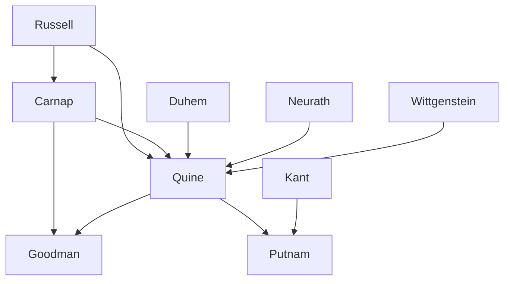

---
cssclasses:
  - Philosophy
subclasses:
  - Philosophy-of-Science
  - Epistemology
  - Analytic-Philosophy
related:
  - "[[Logical Positivism]]"
  - "[[Vienna Circle]]"
  - "[[Analytic Philosophy]]"
  - "[[Holism]]"
  - "[[Scientific Realism]]"
  - "[[Constructivism]]"
  - "[[Philosophy of Language]]"
  - "[[Naturalism]]"
  - "[[Pragmatism]]"
  - "[[Carnap]]"
aliases:
  - quine holism
  - ontological relativity
  - naturalized epistemology
  - two dogmas
  - indeterminacy translation
  - constructivism goodman
  - scientific realism
  - internal realism
  - analytic synthetic
  - radical translation
  - theory laden
  - museum myth
reference:
  - "Abbagnano, N., & Fornero, G. (2012). La ricerca del pensiero. Vol. 3B. Dalla fenomenologia a Gadamer. Paravia."
---

#### Central Problem

Post-positivist philosophy of science confronts the fundamental question: what is the relationship between scientific theories, language, and reality? After the decline of logical positivism's "standard conception," epistemologists grappled with several interconnected problems: Can we distinguish analytic truths (true by virtue of meaning) from synthetic truths (true by virtue of experience)? Can individual scientific statements be verified or falsified in isolation? What is the relationship between our conceptual schemes and the world they purport to describe? Do scientific theories describe reality as it actually is, or are they merely useful constructions?

The central tension lies in reconciling the critique of empiricism—which revealed that facts are always theory-laden and observations never neutral—with the need to maintain some connection to experience that would justify the success and progress of science. While extreme positions like [[Feyerabend]]'s seemed to dissolve scientific rationality altogether, other post-positivists sought to defend the scientific enterprise while acknowledging the force of anti-empiricist critiques, sometimes paradoxically recovering aspects of neopositivist thought in revised forms.

#### Main Thesis

Post-positivist epistemology, as developed by [[Quine]], [[Goodman]], and [[Putnam]], advances several interconnected theses that transform our understanding of knowledge, language, and reality:

**Quine's Critique of Empiricism:**
- **Rejection of the Analytic/Synthetic Distinction:** The supposed division between analytic truths (true by meaning alone) and synthetic truths (true by experience) cannot be maintained. The concepts of analyticity, synonymy, and meaning are interconnected in a vicious circle—each can only be explained by reference to the others.
- **Holism:** Following [[Duhem]], Quine argues that scientific statements cannot be verified or falsified individually. The "unit of empirical significance" is not the single proposition but the whole of science. Any statement can be maintained as true if sufficient adjustments are made elsewhere in the system; even logical and mathematical truths are revisable in principle.
- **Ontological Relativity:** We cannot say what objects exist independently of our theoretical framework. Ontology is relative to a background language; objects are "cultural posits" whose existence depends on our conceptual scheme.
- **Naturalized Epistemology:** Philosophy cannot provide foundations for science from an external standpoint. Epistemology should become a branch of psychology, studying how we move from sensory stimulation to scientific theory.

**Goodman's Constructivism:**
- Knowledge does not reproduce reality but constructs "maps" of it—schematic, selective, conventional representations that reveal structures difficult to discover through direct exploration.
- Pluralism: Multiple versions of the world can coexist, evaluated by their structural isomorphism rather than correspondence to a single "true" reality.
- Symbols (broadly conceived to include words, images, diagrams) are constitutive rather than merely representive; they help bring realities into being rather than simply referring to pre-existing objects.

**Putnam's Internal Realism:**
- Against "metaphysical realism" (the view that there is one true description of reality independent of our theories), Putnam develops "internal realism": the world exists for us only within our theoretical frameworks.
- This Kantian perspective aims to preserve both scientific inquiry and common-sense intuitions about external reality.

#### Historical Context

The post-positivist developments in philosophy of science emerged from the 1950s onward as the "standard conception" of logical positivism entered decline. [[Quine]]'s seminal 1951 article "Two Dogmas of Empiricism" marked a watershed, attacking the foundational assumptions of the Vienna Circle while working within the analytic tradition.

The broader intellectual context included: the maturation of logical analysis as a philosophical method; the influence of [[Wittgenstein]]'s later philosophy on the understanding of meaning and use; developments in physics (especially quantum mechanics) that challenged classical logic; and growing awareness of the historical and sociological dimensions of scientific practice.

[[Quine]] himself had direct contact with [[Carnap]] and other neopositivists during visits to Europe in the 1930s, making his critique an internal one that emerged from deep engagement with the logical empiricist program. [[Goodman]]'s constructivism developed partly through collaboration with Quine (their 1947 paper "Steps Toward a Constructive Nominalism") and continued the project of logical construction initiated by [[Russell]] and [[Carnap]].

By the 1970s and 1980s, debates about scientific realism came to dominate philosophy of science, with [[Putnam]]'s evolving positions—from metaphysical realism to internal realism—representing one of the most influential trajectories in this discussion.

#### Philosophical Lineage

#### Key Thinkers

| Thinker | Dates | Movement | Main Work | Core Concept |
|---------|-------|----------|-----------|--------------|
| [[Quine]] | 1908-2000 | [[Analytic Philosophy]] | *Word and Object* | Ontological relativity, holism |
| [[Goodman]] | 1906-1998 | [[Analytic Philosophy]] | *Ways of Worldmaking* | Constructivism, symbolic systems |
| [[Putnam]] | 1926-2016 | [[Analytic Philosophy]] | *Reason, Truth and History* | Internal realism |
| [[Carnap]] | 1891-1970 | [[Logical Positivism]] | *The Logical Structure of the World* | Logical construction |
| [[Duhem]] | 1861-1916 | [[Philosophy of Science]] | *The Aim and Structure of Physical Theory* | Holism, underdetermination |

#### Key Concepts

| Concept | Definition | Related to |
|---------|------------|------------|
| Two dogmas of empiricism | The analytic/synthetic distinction and reductionism (that statements can be individually verified by experience) | [[Quine]], [[Analytic Philosophy]] |
| Holism | The thesis that statements cannot be verified in isolation but only as part of a whole theoretical system | [[Quine]], [[Duhem]] |
| Ontological relativity | The view that what exists can only be specified relative to a background language or theory | [[Quine]], [[Analytic Philosophy]] |
| Indeterminacy of translation | The thesis that there is no fact of the matter about correct translation between languages | [[Quine]], [[Analytic Philosophy]] |
| Radical translation | Translation between languages with no shared cultural background, revealing the indeterminacy of meaning | [[Quine]], [[Analytic Philosophy]] |
| Naturalized epistemology | The reduction of epistemology to a branch of empirical psychology | [[Quine]], [[Analytic Philosophy]] |
| Myth of the museum | The illusion that meanings exist independently as "exhibits" with words as "labels" | [[Quine]], [[Analytic Philosophy]] |
| Constructivism | The view that knowledge constructs "maps" of reality rather than reproducing it | [[Goodman]], [[Analytic Philosophy]] |
| Internal realism | The position that the world exists for us only within our theoretical frameworks | [[Putnam]], [[Analytic Philosophy]] |
| Inference to best explanation | The argument that the success of theories is best explained by their being (approximately) true | [[Putnam]], [[Philosophy of Science]] |

#### Authors Comparison

| Theme | [[Quine]] | [[Goodman]] | [[Putnam]] |
|-------|-----------|-------------|------------|
| Central concern | Critique of meaning, naturalized epistemology | Construction of world-versions | Realism and truth |
| View of language | Behavioral, stimulus-meaning | Symbolic systems, metaphorical | Theory-dependent reference |
| Ontology | Relative to background theory | Pluralist, multiple versions | Internal to conceptual schemes |
| Empiricism | Reformed holistic empiricism | Constructivist pluralism | Pragmatic realism |
| Meaning | Anti-mentalist, behavioral | Symbolic, contextual | Use-based, internal |
| Truth | Deflationary, pragmatic | Relative to versions | Idealized rational acceptability |
| Relation to neopositivism | Internal critique, partial recovery | Extension of logical construction | Critical engagement |

#### Influences & Connections

- **Predecessors:** [[Quine]] ← influenced by ← [[Carnap]], [[Duhem]], [[Neurath]], [[Russell]]
- **Predecessors:** [[Goodman]] ← influenced by ← [[Carnap]], [[Russell]], [[Quine]]
- **Predecessors:** [[Putnam]] ← influenced by ← [[Kant]], [[Quine]], [[Wittgenstein]]
- **Contemporaries:** [[Quine]] ↔ debate with ↔ [[Carnap]], [[Goodman]] ↔ collaboration with ↔ [[Quine]]
- **Followers:** [[Quine]] → influenced → [[Davidson]], [[Rorty]], contemporary naturalism
- **Followers:** [[Goodman]] → influenced → constructivist epistemology, aesthetics
- **Opposing views:** [[Quine]] ← criticized by ← defenders of analytic/synthetic distinction

#### Summary Formulas

- **[[Quine]]:** The analytic/synthetic distinction is untenable; knowledge forms a holistic web where any statement can be revised; epistemology should be naturalized as empirical psychology studying the path from stimulus to science.
- **[[Goodman]]:** Knowledge constructs multiple "world-versions" through symbolic systems; pluralism about descriptions does not entail relativism, since structural isomorphism provides evaluative criteria.
- **[[Putnam]]:** Internal realism holds that we can only speak of reality from within our conceptual schemes; the world exists for us, reconciling scientific inquiry with the Kantian insight that knowledge is always perspectival.

#### Timeline

| Year | Event |
|------|-------|
| 1908 | [[Quine]] born in Akron, Ohio |
| 1906 | [[Goodman]] born |
| 1926 | [[Putnam]] born in Chicago |
| 1932 | [[Quine]] visits Europe, meets [[Carnap]] and Vienna Circle |
| 1947 | [[Quine]] and [[Goodman]] publish "Steps Toward a Constructive Nominalism" |
| 1950 | [[Quine]] publishes *Methods of Logic* |
| 1951 | [[Quine]] publishes "Two Dogmas of Empiricism"; [[Goodman]] publishes *The Structure of Appearance* |
| 1960 | [[Quine]] publishes *Word and Object* |
| 1968 | [[Goodman]] publishes *Languages of Art* |
| 1969 | [[Quine]] publishes *Ontological Relativity and Other Essays* |
| 1978 | [[Putnam]] publishes *Meaning and the Moral Sciences*, develops internal realism; [[Goodman]] publishes *Ways of Worldmaking* |
| 1995 | [[Quine]] publishes *From Stimulus to Science* |
| 2000 | [[Quine]] dies |

#### Notable Quotes

> "The totality of our so-called knowledge or beliefs, from the most casual matters of geography and history to the profoundest laws of atomic physics or even of pure mathematics and logic, is a man-made fabric which impinges on experience only along the edges." — [[Quine]]

> "Language is a social art which we all acquire on the evidence solely of other people's overt behavior under publicly recognizable circumstances." — [[Quine]]

> "To believe in the existence of chairs and not in that of the Homeric gods is only due to the cultural context in which we find ourselves: objects are mere 'cultural posits.'" — [[Quine]]

---
> [!warning]-
> This annotation was normalised using a large language model and may contain inaccuracies. These texts serve as preliminary study resources rather than exhaustive references.
