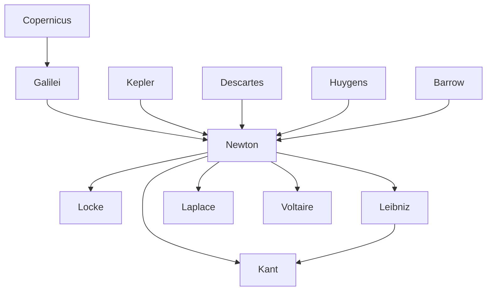

---
cssclasses:
  - Philosophy
  - Physical-Sciences
subclasses:
  - Philosophy-of-Science
  - Epistemology
  - 17th-18th-Century-Philosophy
related:
  - "[[Scientific Revolution]]"
  - "[[Classical Mechanics]]"
  - "[[Universal Gravitation]]"
  - "[[Calculus]]"
  - "[[British Empiricism]]"
  - "[[Enlightenment]]"
  - "[[Philosophy of Science]]"
  - "[[Absolute Space]]"
  - "[[Newtonian Physics]]"
  - "[[Principia Mathematica]]"
aliases:
  - classical physics
  - scientific method
  - principia mathematica
  - hypotheses non
reference:
  - "Abbagnano, N., & Fornero, G. (2012). La ricerca del pensiero. Vol. 2A. Dall'Umanesimo all'empirismo. Paravia."
---

#### Central Problem

The central problem addressed by [[Newton]] concerns the completion of the Scientific Revolution initiated by [[Copernicus]] and Galilei: how can the diverse phenomena of nature—from the motion of celestial bodies to the fall of objects on Earth—be unified under a single mathematical framework? [[Newton]] sought to establish a comprehensive science that would describe natural phenomena and their laws while avoiding metaphysical hypotheses that transcend the possibilities of empirical verification.

The challenge was both methodological and substantive. Methodologically, [[Newton]] needed to develop new mathematical tools capable of handling continuously varying quantities (fluents and fluxions)—what we now call calculus. Substantively, he needed to demonstrate that the same force governing the fall of an apple governs the orbital motion of the Moon around the Earth and the planets around the Sun.

Beyond physics proper, [[Newton]]'s work raised fundamental philosophical questions about the nature of space, time, and causation. His conception of absolute space and absolute time, independent of any external reference, and his frank acknowledgment that gravitational attraction operates instantaneously across empty space without any apparent mechanism, generated debates that would occupy philosophers for centuries.

#### Main Thesis

Newton's main thesis is that the universe operates according to universal mathematical laws discoverable through the combination of experimental observation and mathematical reasoning, without recourse to metaphysical hypotheses. His famous declaration "hypotheses non fingo" (I do not feign hypotheses) expresses this commitment to a purely descriptive science that admits only those causes necessary to explain phenomena.

**On Universal Gravitation:** [[Newton]]'s stroke of genius consists in embracing with a single formula the force that maintains planets in their orbits and the force that makes objects fall to Earth. The law of universal gravitation states that bodies attract each other proportionally to the product of their masses and inversely to the square of their distances. This unifies terrestrial and celestial mechanics, showing that the Moon's orbital motion is, at every instant, a kind of "falling" toward Earth, balanced by its tangential velocity.

**On Dynamics:** [[Newton]] established the three fundamental principles of dynamics that would remain unchallenged for over two centuries: (1) the principle of inertia—every body perseveres in its state of rest or uniform rectilinear motion unless compelled to change by impressed forces; (2) the principle of proportionality between force and acceleration (F=ma); (3) the principle of action and reaction—every action has an equal and opposite reaction.

**On Method:** [[Newton]]'s four methodological rules establish a framework for scientific inquiry: (1) admit only causes necessary to explain phenomena; (2) attribute similar effects to similar causes; (3) extend to all bodies qualities found universally in those examined; (4) treat inductively derived propositions as true until contradicted by new phenomena. These rules authorize scientific induction while maintaining epistemic humility.

**On Absolute Space and Time:** [[Newton]] posited absolute time—"true and mathematical," flowing uniformly without relation to anything external—and absolute space, permanent, always similar, and immobile. These concepts provide the framework for defining absolute motion.

#### Historical Context

[[Newton]] (1642-1727) was born at Woolsthorpe on Christmas Day 1642, the same year Galilei died—a symbolic passing of the torch of the Scientific Revolution. His education at Trinity College, Cambridge, under mathematician Isaac Barrow prepared him for his revolutionary discoveries. The plague years of 1665-1667, which forced [[Newton]] to return to Woolsthorpe, proved extraordinarily productive for his early work on calculus, optics, and gravitation.

Newton's work emerged from a rich tradition of mathematical and physical inquiry. [[Copernicus]] had recognized gravity as a force attracting celestial bodies. Huygens had developed the formula for centrifugal force. Borelli had observed that centrifugal force must be balanced by a centripetal force to maintain planetary orbits. Galilei had pioneered the mathematization of physics but lacked adequate mathematical tools. Cavalieri, Fermat, Wallis, and Barrow had all contributed to the developing calculus.

The publication of the *Philosophiae naturalis principia mathematica* (1687) marked the culmination of the Scientific Revolution, establishing physics as a rigorous mathematical science. [[Newton]]'s subsequent career included positions as Warden and Master of the Mint, President of the Royal Society (1703), and knighthood (1705). His influence extended far beyond physics: British empiricism from [[Locke]] onward was inspired by his methodology, the Enlightenment saw him as the methodologist par excellence, and [[Kant]]'s critical philosophy can be understood as an attempt to provide philosophical justification for Newtonian physics.

#### Philosophical Lineage

#### Key Thinkers

| Thinker | Dates | Movement | Main Work | Core Concept |
|---------|-------|----------|-----------|--------------|
| [[Newton]] | 1642-1727 | [[Scientific Revolution]] | *Principia Mathematica* | Universal gravitation, dynamics |
| [[Galilei]] | 1564-1642 | [[Scientific Revolution]] | *Dialogue* | Mathematization of physics |
| [[Descartes]] | 1596-1650 | [[Rationalism]] | *Principia Philosophiae* | Mechanical philosophy |
| [[Huygens]] | 1629-1695 | [[Scientific Revolution]] | *Horologium Oscillatorium* | Wave theory, centrifugal force |
| [[Leibniz]] | 1646-1716 | [[Rationalism]] | *Nova methodus* | Calculus, vis viva |
| [[Kant]] | 1724-1804 | [[Critical Philosophy]] | *Critique of Pure Reason* | Synthetic a priori |

#### Key Concepts

| Concept | Definition | Related to |
|---------|------------|------------|
| Universal gravitation | Bodies attract proportionally to the product of masses and inversely to the square of distances | [[Newton]], [[Mechanics]] |
| Fluxions | [[Newton]]'s term for derivatives; the instantaneous rate of change of a "fluent" (variable quantity) | [[Newton]], [[Calculus]] |
| Inertia | The tendency of bodies to persevere in their state of rest or uniform rectilinear motion | [[Newton]], [[Galilei]] |
| Mass | Quantity of matter in a body, distinct from weight (which varies by location) | [[Newton]], [[Dynamics]] |
| Hypotheses non fingo | "I do not feign hypotheses"; rejection of explanations invoking occult qualities or unverifiable causes | [[Newton]], [[Scientific Method]] |
| Absolute space | Space that is permanent, always similar, and immobile, independent of anything external | [[Newton]], [[Metaphysics]] |
| Absolute time | True mathematical time flowing uniformly without relation to anything external | [[Newton]], [[Metaphysics]] |
| Corpuscular theory | Theory that light consists of particles emitted from incandescent bodies | [[Newton]], [[Optics]] |
| Action and reaction | Every action has an equal and opposite reaction (third law of dynamics) | [[Newton]], [[Dynamics]] |
| Scientific induction | Extension to all possible cases of a law verified for a limited number of cases | [[Newton]], [[Methodology]] |

#### Authors Comparison

| Theme | [[Newton]] | [[Descartes]] | [[Leibniz]] |
|-------|------------|---------------|-------------|
| Method | Experimental-mathematical, hypotheses non fingo | A priori deduction from clear ideas | Rational analysis, principle of sufficient reason |
| Mathematics | Calculus of fluxions (geometrical) | Analytic geometry | Differential calculus (algebraic notation) |
| Space | Absolute, independent of bodies | Extension identical with matter | Relational, order of coexistences |
| Time | Absolute, mathematical | Duration of things | Relational, order of successions |
| Causation | Gravitational attraction (action at a distance) | Mechanical contact (vortices) | Pre-established harmony |
| Light | Corpuscular theory | Pressure in ether | Wave theory |
| God's role | Initial impulse, absolute space as sensorium | Creator of matter and laws | Creator of pre-established harmony |

#### Influences & Connections

- **Predecessors:** [[Newton]] ← influenced by ← [[Galilei]], [[Descartes]], [[Kepler]], [[Huygens]], [[Barrow]], [[Wallis]]
- **Contemporaries:** [[Newton]] ↔ dispute with ↔ [[Leibniz]] (priority of calculus), [[Newton]] ↔ dialogue with ↔ [[Huygens]]
- **Followers:** [[Newton]] → influenced → [[Locke]], [[Voltaire]], [[Kant]], [[Laplace]], [[Euler]]
- **Opposing views:** [[Newton]] ← criticized by ← [[Leibniz]] (absolute space), [[Berkeley]] (abstract concepts)

#### Summary Formulas

- **[[Newton]]:** The universe operates according to universal mathematical laws—principally universal gravitation—discoverable through experimental observation combined with mathematical reasoning, without recourse to metaphysical hypotheses.
- **[[Galilei]]:** Nature is written in the language of mathematics; the book of nature can be read through observation and geometrical demonstration.
- **[[Leibniz]]:** The calculus provides a universal symbolic method for analyzing continuous change, grounded in the principle of sufficient reason.

#### Timeline

| Year | Event |
|------|-------|
| 1642 | [[Newton]] born at Woolsthorpe; [[Galilei]] dies |
| 1661 | [[Newton]] enters Trinity College, Cambridge |
| 1665-1667 | [[Newton]] develops calculus, optics, gravitation during plague years |
| 1669 | [[Newton]] succeeds [[Barrow]] as Lucasian Professor of Mathematics |
| 1673 | [[Huygens]] publishes *Horologium Oscillatorium* |
| 1682 | Jean Picard provides accurate measurement of Earth's radius |
| 1684 | [[Newton]] presents *Propositions on Motion* |
| 1687 | [[Newton]] publishes *Principia Mathematica* |
| 1703 | [[Newton]] elected President of Royal Society |
| 1704 | [[Newton]] publishes *Opticks* |
| 1705 | [[Newton]] knighted by Queen Anne |
| 1727 | [[Newton]] dies in London |

#### Notable Quotes

> "Hypotheses non fingo." (I do not feign hypotheses.) — [[Newton]]

> "Nature does nothing in vain and would do something useless if it used a greater number of causes to do what can be done with fewer." — [[Newton]]

> "In experimental philosophy, propositions reached by induction from phenomena must be considered, notwithstanding contrary hypotheses, exactly or approximately true until other phenomena confirm them entirely or show that they are subject to exceptions." — [[Newton]]

---
> [!warning]-
> This annotation was normalised using a large language model and may contain inaccuracies. These texts serve as preliminary study resources rather than exhaustive references.
