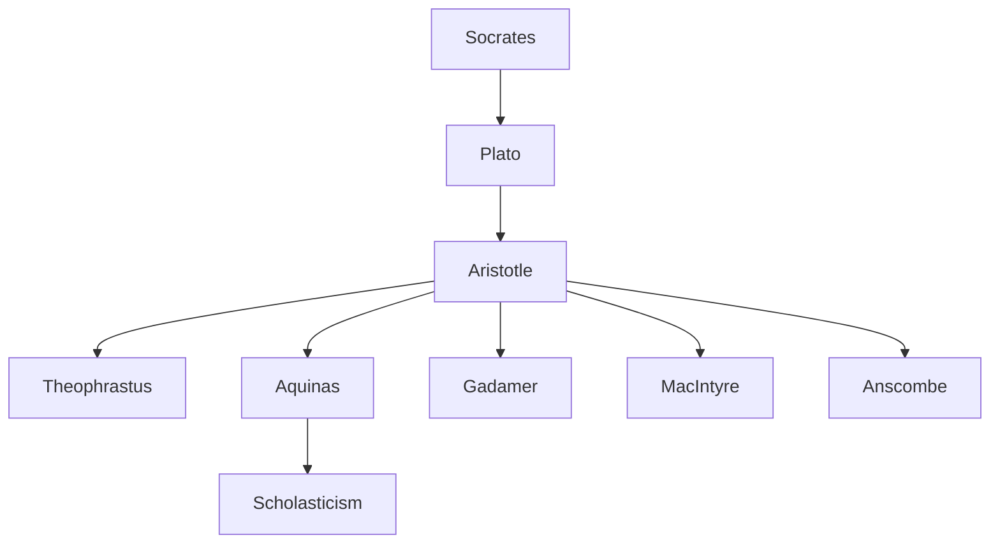

---

cssclasses:
  - Philosophy
subclasses:
  - Ethics
  - Epistemology
  - Ancient-Greek-and-Roman-Philosophy
related:
  - "[[Aristotle]]"
  - "[[Virtue]]"
  - "[[Prudence]]"
  - "[[Wisdom]]"
  - "[[Practical Reason]]"
aliases:
  - nicomachean ethics
  - intellectual virtues
  - practical wisdom
  - phronesis aristotle
  - sophia aristotle
  - virtue ethics
  - deliberation choice
  - scientific knowledge
  - correct reason
  - moral virtue
reference:
  - Aristote, Ross, W. D., & Brown, L. (2009). The Nicomachean ethics (ed. rev). Oxford university press. (pp. 115-134)
tags:
  - Podcast
---

#### Podcast

<iframe allow="autoplay *; encrypted-media *; fullscreen *; clipboard-write" frameborder="0" height="150" style="width:100%;overflow:hidden;border-radius:10px;background:transparent;" sandbox="allow-forms allow-popups allow-same-origin allow-scripts allow-storage-access-by-user-activation allow-top-navigation-by-user-activation" src="https://embed.podcasts.apple.com/us/podcast/aristotles-nicomachean-ethics/id1786764068?i=1000684650884&uo=4&l=en-GB&theme=auto"></iframe>

---

#### Central Problem

What are the intellectual virtues, and how do they relate to moral virtue and human flourishing? Book VI of the *Nicomachean Ethics* addresses a fundamental question left open from earlier discussions: what exactly is "correct reason" (*orthos logos*) that guides virtuous action? Aristotle had established that virtue is a mean determined by reason "as the prudent person would determine it," but this formula remains empty without an account of what prudence is and how it operates.

The central tension lies in the relationship between theoretical and practical knowledge. If virtue requires correct reason, we must understand the different modes of rational activity—scientific knowledge (*episteme*), art (*techne*), prudence (*phronesis*), wisdom (*sophia*), and intellect (*nous*)—and determine which governs ethical life. The question becomes acute when considering whether practical wisdom is subordinate to theoretical wisdom, and whether knowledge of the good automatically produces virtuous action.

#### Main Thesis

Aristotle develops a comprehensive account of the intellectual virtues, distinguishing five ways by which the soul attains truth:

**1. The Division of the Rational Soul:** The rational part of the soul divides into "the scientific" (*to epistemonikon*), which contemplates necessary and eternal truths, and "the calculative" (*to logistikon*), which deliberates about contingent matters. Each part has its own virtue: wisdom (*sophia*) perfects the scientific part, prudence (*phronesis*) perfects the calculative part.

**2. Scientific Knowledge (*Episteme*):** Science concerns what is necessary and eternal, proceeding by demonstration from first principles. What is known scientifically cannot be otherwise; it is teachable through syllogism from universals or induction from particulars. Science, however, cannot grasp its own first principles—these require intellect (*nous*).

**3. Art (*Techne*):** Art is "a characteristic bound up with making that is accompanied by true reason." It concerns production (*poiesis*), bringing into being things that could either exist or not exist. The origin of what is made lies in the maker, not in the thing made. Art differs fundamentally from action (*praxis*): making aims at a product beyond the activity, while action has its end in itself.

**4. Prudence (*Phronesis*):** Prudence is "a true characteristic that is bound up with action, accompanied by reason, and concerned with things good and bad for a human being." Unlike science, it concerns contingent matters; unlike art, it concerns action, not production. The prudent person deliberates well about what conduces to living well in general—not partially (like the doctor about health) but comprehensively. Prudence requires knowledge of both universals and particulars, "but more so of the latter," since action concerns particulars.

**5. Wisdom (*Sophia*):** Wisdom is "intellect and science" concerning the highest matters—"a science of the most honorable matters that has, as it were, its capstone." It combines demonstrative knowledge with intuitive grasp of first principles. Wisdom contemplates what is most divine by nature, even if such knowledge seems "useless" for human affairs.

**6. Intellect (*Nous*):** Intellect grasps the first principles from which demonstration proceeds, and also the ultimate particulars that prudence must recognize in action. It operates at both ends of reasoning: the indemonstrable starting points of theoretical science and the concrete particulars of practical deliberation.

**7. The Unity of the Virtues:** Prudence and moral virtue are inseparable. Virtue makes the end correct; prudence identifies the means. Natural virtue without prudence is "harmful," like a strong body moving without sight. Conversely, prudence cannot exist without moral virtue, for "corruption distorts and causes one to be mistaken about the principles bound up with action." All moral virtues are present when prudence is present.

#### Historical Context

The *Nicomachean Ethics* was composed in the fourth century BCE, during the mature period of Aristotle's philosophical career at the Lyceum in Athens. Book VI represents Aristotle's most sustained treatment of practical rationality and forms a crucial bridge between his theoretical philosophy and his political philosophy.

The text engages implicitly with Socratic intellectualism—the view that virtue is knowledge and that no one does wrong willingly. Aristotle acknowledges Socrates's insight that virtue requires reason but criticizes his identification of virtue with knowledge: "Socrates used to suppose that the virtues are reasoned accounts.. but we hold that they are accompanied by reason." Virtue is not merely knowing the good but being disposed to act well.

The discussion also responds to Platonic themes, particularly the relationship between theoretical and practical knowledge. While Plato subordinates practical wisdom to contemplation of the Forms, Aristotle develops a more autonomous account of practical reason, insisting that prudence has its own irreducible domain.

Historical figures appear as exemplars: Pericles represents political prudence; Pheidias and Polycleitus exemplify artistic wisdom; Anaxagoras and Thales embody theoretical wisdom that is "useless" for practical life. The tragic poet Agathon is quoted twice, underscoring the limits of human agency before what has already occurred.

#### Philosophical Lineage

#### Key Thinkers

| Thinker | Dates | Movement | Main Work | Core Concept |
|---------|-------|----------|-----------|--------------|
| [[Aristotle]] | 384-322 BCE | [[Peripatetic Philosophy]] | *Nicomachean Ethics* | Phronesis, eudaimonia |
| [[Socrates]] | 470-399 BCE | [[Ancient Philosophy]] | (oral teaching) | Virtue as knowledge |
| [[Plato]] | c. 428-348 BCE | [[Ancient Philosophy]] | *Republic* | Forms, philosopher-king |
| [[Aquinas]] | 1225-1274 | [[Scholasticism]] | *Summa Theologiae* | Prudence as recta ratio agibilium |
| [[Anscombe]] | 1919-2001 | [[Analytic Philosophy]] | *Intention* | Modern virtue ethics revival |
| [[MacIntyre]] | 1929- | [[Virtue Ethics]] | *After Virtue* | Tradition-constituted rationality |

#### Key Concepts

| Concept | Definition | Related to |
|---------|------------|------------|
| Phronesis | Practical wisdom; true characteristic bound up with action, accompanied by reason, concerned with human goods | [[Aristotle]], [[Prudence]] |
| Sophia | Theoretical wisdom; intellect and science of the most honorable matters | [[Aristotle]], [[Contemplation]] |
| Episteme | Scientific knowledge; demonstrative knowledge of necessary and eternal truths | [[Aristotle]], [[Epistemology]] |
| Techne | Art; characteristic bound up with making accompanied by true reason | [[Aristotle]], [[Poiesis]] |
| Nous | Intellect; grasps first principles and ultimate particulars | [[Aristotle]], [[Epistemology]] |
| Euboulia | Good deliberation; correctness in accord with what is advantageous toward the end | [[Aristotle]], [[Deliberation]] |
| Sunesis | Comprehension; capacity to judge correctly what another says about practical matters | [[Aristotle]], [[Judgment]] |
| Gnome | Sympathetic judgment; correct decision about what is equitable | [[Aristotle]], [[Equity]] |
| Deinotes | Cleverness; capacity to hit whatever target is posited, whether noble or base | [[Aristotle]], [[Prudence]] |
| Orthos logos | Correct reason; reason in accord with prudence that guides virtuous action | [[Aristotle]], [[Virtue]] |

#### Authors Comparison

| Theme | [[Aristotle]] | [[Plato]] |
|-------|--------------|-----------|
| Virtue and knowledge | Virtue accompanied by reason, not identical to it | Virtue is knowledge (intellectualism) |
| Practical wisdom | Autonomous domain; irreducible to theory | Subordinate to contemplation of Forms |
| Particulars | Essential to prudence; perception-like grasp required | Inferior to universals |
| The good | Achieved through action in contingent circumstances | Transcendent Form grasped by intellect |
| Unity of virtues | All present when prudence is present | Grounded in knowledge of the Good |
| Role of experience | Essential; the young cannot be prudent | Potentially misleading; cave-dwellers |

#### Influences & Connections

- **Predecessors:** [[Aristotle]] ← influenced by ← [[Plato]], [[Socrates]], [[Heraclitus]]
- **Sources:** [[Aristotle]] ← draws on ← [[Homer]], [[Agathon]], [[Euripides]]
- **Contemporaries:** [[Aristotle]] ↔ dialogue with ↔ [[Theophrastus]], [[Speusippus]]
- **Followers:** [[Aristotle]] → influenced → [[Aquinas]], [[Gadamer]], [[Anscombe]], [[MacIntyre]]
- **Opposing views:** [[Aristotle]] ← critiques ← [[Socrates]] (virtue as knowledge), [[Plato]] (subordination of practical to theoretical)

#### Summary Formulas

- **[[Aristotle]] on prudence:** Prudence is a true characteristic bound up with action, accompanied by reason, and concerned with things good and bad for a human being; it requires both universal knowledge and, especially, knowledge of particulars.

- **[[Aristotle]] on wisdom:** Wisdom is intellect and science of the most honorable matters—theoretical knowledge complete with its capstone, concerned with what is most divine by nature.

- **[[Aristotle]] on the unity of virtues:** Moral virtue makes the end correct, prudence the means; neither exists without the other, and all moral virtues are present when prudence is present.

- **[[Aristotle]] on correct reason:** Virtue is not only the characteristic that accords with correct reason but also the one accompanied by correct reason; and prudence is correct reason concerning such things.

#### Timeline

| Year | Event |
|------|-------|
| 384 BCE | [[Aristotle]] born in Stagira |
| 367 BCE | [[Aristotle]] enters [[Plato]]'s Academy |
| 347 BCE | [[Plato]] dies; [[Aristotle]] leaves Athens |
| 343 BCE | [[Aristotle]] becomes tutor to Alexander |
| 335 BCE | [[Aristotle]] founds the Lyceum in Athens |
| c. 330 BCE | Composition of *Nicomachean Ethics* |
| 322 BCE | [[Aristotle]] dies in Chalcis |
| c. 1250 CE | [[Aquinas]] composes *Commentary on the Nicomachean Ethics* |
| 1958 | [[Anscombe]] publishes "Modern Moral Philosophy" |

#### Notable Quotes

> "Prudence is a true characteristic that is bound up with action, accompanied by reason, and concerned with things good and bad for a human being." — [[Aristotle]]

> "It is not possible to be good in the authoritative sense in the absence of prudence, nor is it possible to be prudent in the absence of moral virtue." — [[Aristotle]]

> "Virtue makes the target correct, prudence the things conducive to that target." — [[Aristotle]]

---
> [!warning]-
> This annotation was normalised using a large language model and may contain inaccuracies. These texts serve as preliminary study resources rather than exhaustive references.
