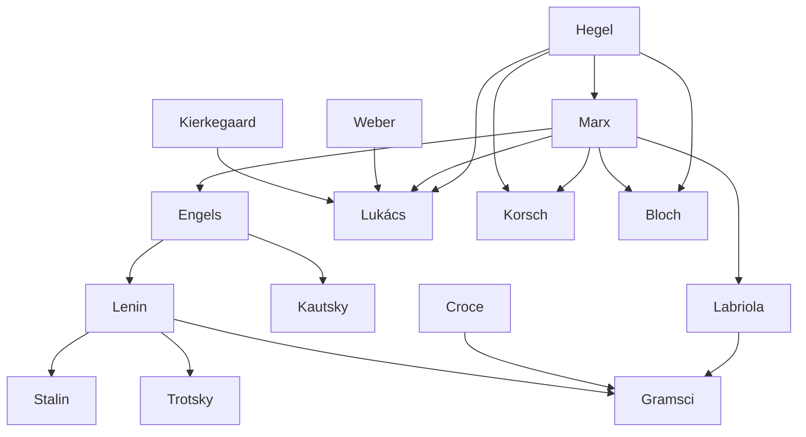

---
cssclasses:
  - Philosophy
  - Political-Science
subclasses:
  - Social-and-Political-Philosophy
  - 20th-Century-Philosophy
  - Critical-Theory
aliases:
  - marxism twentieth
  - dialectical materialism
  - class consciousness
  - western marxism
  - philosophy praxis
  - organic intellectuals
  - utopia hope
  - soviet marxism
  - historical materialism
contributions:
  - Conceptual
  - Constructive
authors:
  - "[[Lenin]]"
  - "[[Lukács]]"
  - "[[Gramsci]]"
  - "[[Korsch]]"
  - "[[Bloch]]"
  - "[[Labriola]]"
  - "[[Trotsky]]"
  - "[[Stalin]]"
reference: "Abbagnano, N., & Fornero, G. (2012). La ricerca del pensiero. Vol. 3B. Dalla fenomenologia a Gadamer. Paravia."
related:
  - "[[Historical Materialism]]"
  - "[[Dialectics]]"
  - "[[Frankfurt School]]"
  - "[[Critical Theory]]"
  - "[[Ideology]]"
  - "[[Class Struggle]]"
  - "[[Revolution]]"
  - "[[Alienation]]"
  - "[[Praxis]]"
  - "[[Utopia]]"
---

#### Central Problem

Twentieth-century Marxism confronted a fundamental crisis of identity and direction: how to recover the authentic theoretical content of [[Marx]]'s thought after its distortion by the positivist, economistic, and evolutionary interpretations of the Second International (1889-1917). Under the influence of [[Kautsky]] and others, Marxism had been read through positivist lenses, reducing it to a fatalistic determinism that saw the transition from capitalism to communism as inevitable, scientifically predictable, and mechanistically guaranteed by economic laws.

This "bastardization" of Marxism had practical consequences: theoretical impotence translated into revolutionary impotence. The dialectical and philosophical core of [[Marx]]'s thought — inherited from [[Hegel]] — had been progressively abandoned in favor of naturalistic, materialistic categories borrowed from the natural sciences. Revisionism (Bernstein) proposed abandoning revolution altogether; Austro-Marxism and neo-Kantian Marxism sought ethical rather than materialist foundations.

The challenge was thus to recover Marxism's philosophical autonomy, its dialectical structure, and its revolutionary potential. This recovery took different forms: Soviet dialectical materialism emphasized necessary laws of nature and history; Western Marxism (Lukács, Korsch, [[Bloch]]) returned to [[Hegel]] and focused exclusively on the historical-social world; Italian Marxism (Labriola, Gramsci) developed original analyses of culture, hegemony, and the role of intellectuals.

#### Main Thesis

Twentieth-century Marxism developed along three main trajectories, each offering distinctive responses to the crisis of orthodox Marxism:

**Soviet Dialectical Materialism:** [[Lenin]] defended philosophical realism against empiriocriticism (Mach, Avenarius), insisting that matter exists independently of consciousness and that objective truth is progressively attainable. The dialectic constitutes both the rhythm of knowledge (from ignorance to knowledge) and the "objective logic" governing historical development toward communism. [[Lenin]] combined this determinism with voluntarism: the Party, guided by revolutionary theory, translates historical possibility into actuality. The dictatorship of the proletariat represents a transitional phase; the State will "wither away" once class antagonisms disappear.

**Western Marxism:** [[Lukács]] identified class consciousness as the subject of history. Only the proletariat can achieve genuine class consciousness because the bourgeoisie, to survive, must mystify and deny the contradictions of capitalism. The category of totality — grasping facts within their structural-processual whole — distinguishes dialectical from bourgeois science, which reifies social products into natural facts. [[Korsch]] emphasized Marxism's global character: it cannot be confined to any single academic discipline but must critique the totality of bourgeois civilization. [[Bloch]] developed an "ontology of the not-yet," presenting the universe as incomplete process tending toward fulfillment, with hope and utopia as fundamental human orientations.

**Italian Marxism:** [[Labriola]] defended Marxism's specificity against both positivism (which naturalizes history) and idealism (which ignores material conditions). [[Gramsci]] developed the concept of hegemony — intellectual and moral direction exercised through civil society institutions (schools, churches, parties, media) — as distinct from mere political domination. The revolutionary strategy must be a "war of position," gradually conquering civil society's strategic points. The Communist Party functions as the "modern Prince," the collective intellectual embodying proletarian consciousness and will.

#### Historical Context

The chapter covers roughly 1900-1970, a period marked by world wars, the Russian Revolution (1917), the rise of fascism and Nazism, the establishment and consolidation of Soviet power, decolonization, and the Cold War.

The Second International's collapse with World War I discredited its evolutionary optimism. The Russian Revolution demonstrated that revolutionary transformation was possible but raised questions about whether the Western path could replicate the Eastern model. Lenin's distinction between advanced capitalist societies (with developed civil societies requiring gradual conquest) and Russia (where frontal assault on the State sufficed) became crucial for Western Marxists.

The rise of fascism — which [[Lukács]] analyzed as the culmination of bourgeois irrationalism — posed urgent political and theoretical questions. [[Gramsci]]'s imprisonment by Mussolini's regime (1926-1937) produced the *Prison Notebooks*, written under censorship and developed into a sophisticated analysis of hegemony, intellectuals, and the specificity of Italian conditions.

After 1945, Soviet Marxism became the official ideology of Eastern bloc states, while Western Marxism developed in critical dialogue with (and often opposition to) Soviet orthodoxy. [[Bloch]]'s conflict with East German authorities exemplified this tension. In Italy, the PCI under Togliatti and later Berlinguer developed the "Italian road to socialism" based on Gramscian principles of hegemonic struggle within civil society.

#### Philosophical Lineage

#### Key Thinkers

| Thinker | Dates | Movement | Main Work | Core Concept |
|---------|-------|----------|-----------|--------------|
| [[Lenin]] | 1870-1924 | [[Soviet Marxism]] | *Materialism and Empiriocriticism* | Dialectical materialism |
| [[Stalin]] | 1879-1953 | [[Soviet Marxism]] | *History of the CPSU* | Relations of production |
| [[Trotsky]] | 1879-1940 | [[Soviet Marxism]] | *History of the Russian Revolution* | Permanent revolution |
| [[Lukács]] | 1885-1971 | [[Western Marxism]] | *History and Class Consciousness* | Class consciousness, totality |
| [[Korsch]] | 1886-1961 | [[Western Marxism]] | *Marxism and Philosophy* | Marxism as global critique |
| [[Bloch]] | 1885-1977 | [[Western Marxism]] | *The Principle of Hope* | Utopia, not-yet-being |
| [[Labriola]] | 1843-1904 | [[Italian Marxism]] | *On Historical Materialism* | Autonomy of Marxist method |
| [[Gramsci]] | 1891-1937 | [[Italian Marxism]] | *Prison Notebooks* | Hegemony, organic intellectuals |

#### Key Concepts

| Concept | Definition | Related to |
|---------|------------|------------|
| Dialectical materialism | Philosophical doctrine holding that dialectic governs nature and history, enabling prediction of communist society's inevitable emergence | [[Lenin]], [[Soviet Marxism]] |
| Class consciousness | The proletariat's awareness of its historical position and revolutionary mission; the true subject of history | [[Lukács]], [[Western Marxism]] |
| Totality | Dialectical category grasping facts within their structural-processual whole, against bourgeois parcellization of knowledge | [[Lukács]], [[Korsch]] |
| Reification | Transformation of social products and relations into thing-like, natural, immutable facts | [[Lukács]], [[Marx]] |
| Hegemony | Intellectual and moral direction exercised through civil society institutions, distinct from political domination | [[Gramsci]], [[Italian Marxism]] |
| Organic intellectuals | Intellectuals organically connected to a class, elaborating and transmitting its worldview | [[Gramsci]], [[Italian Marxism]] |
| Philosophy of praxis | Gramsci's term for Marxism, emphasizing human agency and revolutionary transformation | [[Gramsci]], [[Italian Marxism]] |
| Ontology of not-yet | [[Bloch]]'s view of being as incomplete process tending toward fulfillment through hope and utopia | [[Bloch]], [[Western Marxism]] |
| Historic bloc | Alliance of social forces unified by hegemonic worldview | [[Gramsci]], [[Italian Marxism]] |
| Modern Prince | The Communist Party as collective intellectual embodying proletarian will | [[Gramsci]], [[Machiavelli]] |

#### Authors Comparison

| Theme | [[Lenin]] | [[Lukács]] | [[Gramsci]] | [[Bloch]] |
|-------|-----------|------------|-------------|-----------|
| Dialectic's scope | Nature and history | History and society only | History and society | Cosmic process |
| Subject of history | Objective laws + Party | Class consciousness | Hegemonic class | Hope, utopia |
| Revolution | Vanguard seizure of State | Class consciousness awakening | War of position in civil society | Realization of utopia |
| Role of theory | Guide to action, Party ideology | Self-understanding of proletariat | Hegemonic worldview construction | Anticipation of the possible |
| Determinism | Strong (with voluntarist element) | Weak (consciousness decisive) | Weak (praxis central) | Weak (future open) |
| Base/superstructure | Superstructure reflects base | Totality, no strict determination | Relative autonomy of culture | Utopian surplus in culture |

#### Influences & Connections

- **Predecessors:** [[Lenin]] ← influenced by ← [[Marx]], [[Engels]]; [[Lukács]] ← influenced by ← [[Hegel]], [[Weber]], [[Kierkegaard]]; [[Gramsci]] ← influenced by ← [[Labriola]], [[Croce]], [[Lenin]]
- **Contemporaries:** [[Lukács]] ↔ dialogue with ↔ [[Korsch]], [[Bloch]]; [[Gramsci]] ↔ conflict with ↔ [[Croce]]
- **Followers:** [[Gramsci]] → influenced → [[Togliatti]], [[PCI]], [[Cultural Studies]]; [[Lukács]] → influenced → [[Frankfurt School]]; [[Bloch]] → influenced → [[Moltmann]], [[Theology of Hope]]
- **Opposing views:** [[Lukács]] ← criticized by ← [[Third International]]; [[Gramsci]] ← criticized by ← [[Bobbio]] (on liberal institutions)

#### Summary Formulas

- **[[Lenin]]:** Dialectical materialism guarantees objective truth and historical necessity; the Party translates this necessity into revolutionary action.
- **[[Lukács]]:** Class consciousness is the subject of history; only the proletariat, through dialectical totality, can achieve genuine historical understanding.
- **[[Korsch]]:** Marxism is a global critique that cannot be confined to any single discipline; it must attack bourgeois civilization in all its manifestations.
- **[[Bloch]]:** The world is an incomplete process; hope and utopia are ontological categories revealing being's tendency toward fulfillment.
- **[[Labriola]]:** Marxism is neither naturalistic positivism nor speculative idealism, but a specific method for understanding human self-creation through labor.
- **[[Gramsci]]:** Revolution requires hegemony — intellectual and moral direction through civil society — before and beyond political domination; the Party is the modern Prince.

#### Timeline

| Year | Event |
|------|-------|
| 1895 | [[Labriola]] publishes *In Memory of the Communist Manifesto* |
| 1909 | [[Lenin]] publishes *Materialism and Empiriocriticism* |
| 1917 | [[Lenin]] publishes *State and Revolution*; Russian Revolution |
| 1918 | [[Bloch]] publishes *Spirit of Utopia* |
| 1919 | [[Gramsci]] founds "Ordine Nuovo" in Turin |
| 1921 | Italian Communist Party founded; [[Gramsci]] among founders |
| 1923 | [[Lukács]] publishes *History and Class Consciousness*; [[Korsch]] publishes *Marxism and Philosophy* |
| 1926 | [[Gramsci]] arrested by fascist police |
| 1929-1935 | [[Gramsci]] writes *Prison Notebooks* |
| 1937 | [[Gramsci]] dies in Rome |
| 1948 | [[Lukács]] publishes *The Young [[Hegel]]* |
| 1954-1959 | [[Bloch]] publishes *The Principle of Hope* |

#### Notable Quotes

> "The proletariat can become the ruling and dominant class to the extent that it succeeds in creating a system of class alliances permitting it to mobilize the majority of the working population against capitalism and the bourgeois State." — [[Gramsci]]

> "The root of history is the laboring, creating human being, who transforms and overcomes the given conditions. When humanity has grasped itself and grounded what is its own without alienation or estrangement, in a real democracy, then something arises in the world that shines into everyone's childhood and where no one has yet been: the homeland." — [[Bloch]]

> "Only a party guided by an advanced theory can fulfill the function of an advanced combatant." — [[Lenin]]

---
> [!NOTE]
> *This summary has been created to present the key points from the source text, which was automatically extracted using LLM. Please note that the summary may contain errors. It serves as an essential starting point for study and reference purposes.*
