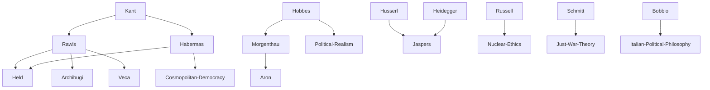

---
cssclasses:
  - Philosophy
  - Political-Science
subclasses:
  - Social-and-Political-Philosophy
  - 20th-Century-Philosophy
  - Ethics
related:
  - "[[Political Philosophy]]"
  - "[[Just War Theory]]"
  - "[[Cosmopolitanism]]"
  - "[[Perpetual Peace]]"
  - "[[Nuclear Ethics]]"
  - "[[Globalization]]"
  - "[[European Union]]"
  - "[[International Law]]"
  - "[[Human Rights]]"
  - "[[Liberalism]]"
aliases:
  - international relations
  - war philosophy
  - peace philosophy
  - just war
  - political realism
  - nuclear deterrence
  - world government
  - global justice
  - post national
  - cosmopolitan democracy
reference:
  - "Abbagnano, N., & Fornero, G. (2012). La ricerca del pensiero. Vol. 3C. Dalla crisi della modernità agli sviluppi più recenti. Paravia."
---

#### Central Problem

The central problem addressed in this chapter is how philosophy should respond to the fundamental transformation of international relations in the post-World War II era, particularly given the threat of nuclear annihilation and the subsequent challenges of globalization. The atomic bombings of Hiroshima and Nagasaki in 1945, followed by the Cold War between the United States and Soviet Union, created an unprecedented situation where war could potentially destroy not just nations but all life on Earth. This radically changed the terms under which political philosophy could discuss war, peace, and international justice.

The philosophical challenge is multifaceted: How can states relate to one another in a way that prevents catastrophic conflict? Is war ever justified, and if so, under what conditions? Can traditional notions of state sovereignty survive in an age of globalization and transnational economic forces? What institutional arrangements—whether a balance of powers, a federation of states, or a world government—best serve the goals of peace and justice? These questions require philosophers to engage interdisciplinarily with historians, sociologists, economists, and political scientists, while also confronting the limits of Eurocentrism and the need to acknowledge perspectives from postcolonial and subaltern studies.

#### Main Thesis

The chapter presents a spectrum of positions on international relations, from political realism to cosmopolitan utopianism, ultimately arguing for what [[Rawls]] calls a "realistic utopia"—a vision of global justice that is neither naively idealistic nor cynically resigned to the status quo.

**Political Realism:** [[Morgenthau]] represents the realist position, arguing that international relations are fundamentally determined by power interests rather than ideologies or moral principles. States inevitably pursue their own interests, which leads to conflicts that are inscribed in human nature itself. Ethical values may regulate domestic politics but count for little in international affairs. The only safeguard against catastrophic war is a balance of power, legitimately founded even on mutual terror of destruction.

**Existential-Liberal Position:** [[Jaspers]] views the atomic bomb as symbolizing the nihilism of modern science—a technology that claims unlimited power but ends up destroying its objects. He supports Western liberal democracies against Soviet totalitarianism but ultimately relies on deterrence rather than dialogue, representing a philosophical defense of the Cold War status quo.

**Pragmatic Deterrence:** [[Russell]] and [[Aron]] both accept nuclear deterrence as necessary but seek alternatives. [[Russell]] proposes eventual movement toward world government; Aron advocates a prudent balance between military deterrence and diplomatic dialogue, rejecting ideological rigidity in favor of pragmatic responses to concrete situations.

**Just War Theory:** [[Bobbio]] addresses whether any war can be justified, distinguishing between nuclear war (which negates the very concept of "purpose" by potentially destroying all life) and conventional conflict. He supports wars legitimated by international law (such as UN-sanctioned interventions) while advocating pacifism and conscientious objection at the individual level.

**Cosmopolitan Federalism:** Following [[Kant]]'s vision in *Perpetual Peace*, [[Rawls]] proposes a "law of peoples" based on eight principles of international justice. His "realistic utopia" envisions a federation of liberal and "decent" peoples—not a world state (which could become despotic) but a confederation bound by mutual respect for sovereignty, human rights, and peaceful resolution of conflicts.

**Post-National Constellation:** [[Habermas]] goes further than Rawls, arguing that the concept of sovereign state is historically obsolete. In the age of globalization, political control must be transferred to transnational organisms. He envisions something like an expanded European Union—a form of democratic governance beyond the nation-state that preserves local identities while enabling global cooperation.

**Cosmopolitan Democracy:** [[Held]] and [[Archibugi]] propose the most ambitious vision: a directly elected world parliament, a supranational criminal court with coercive power, and transformation of the UN Security Council into an executive body with peacekeeping forces.

#### Historical Context

The chapter spans the period from the end of World War II to the early 21st century, marked by several transformative developments. The atomic bombings of August 1945 inaugurated the nuclear age, raising for the first time the possibility of human self-annihilation. The Cold War (1947-1989) divided the world between NATO (formed 1949) and the Warsaw Pact (1955), with the Cuban Missile Crisis of 1962 bringing the superpowers to the brink of nuclear war. The START treaties eventually eliminated 80% of nuclear weapons.

The fall of the [[Berlin]] Wall (1989) and collapse of the Soviet Union ended the bipolar world order but did not bring perpetual peace. Instead, new conflicts emerged: the Kosovo War, the two Gulf Wars, the intervention in Afghanistan, and controversies over South Ossetia's independence. These conflicts revived debates about "just war" that had theological roots in medieval crusades and jihads but now took secular forms involving international law and human rights.

The era also saw the rise of globalization, eroding traditional state sovereignty and creating transnational economic forces that escape democratic control. Interdisciplinary fields such as Subaltern Studies, Postcolonial Studies, and Cultural Studies emerged in dialogue with post-structuralist philosophy (Althusser, Derrida, Foucault, [[Deleuze]], Lyotard), forcing Western philosophy to confront its own Eurocentrism and misconceptions of otherness. The European Union emerged as a partial model of post-national governance.

#### Philosophical Lineage

#### Key Thinkers

| Thinker | Dates | Movement | Main Work | Core Concept |
|---------|-------|----------|-----------|--------------|
| [[Morgenthau]] | 1904-1980 | [[Political Realism]] | *Politics Among Nations* (1948) | Power-based realism, balance of terror |
| [[Jaspers]] | 1883-1969 | [[Existentialism]] | *The Atom Bomb and the Future of Man* (1958) | Bomb as symbol of nihilism |
| [[Russell]] | 1872-1970 | [[Analytic Philosophy]] | *The Atom Bomb* (1949) | World government proposal |
| [[Aron]] | 1905-1983 | [[Liberalism]] | *Peace and War* (1962) | Prudent deterrence-diplomacy balance |
| [[Bobbio]] | 1909-2004 | [[Italian Liberalism]] | *The Problem of War and the Roads to Peace* | Justified vs just war distinction |
| [[Rawls]] | 1921-2002 | [[Liberalism]] | *The Law of Peoples* (1999) | Realistic utopia, eight principles |
| [[Habermas]] | 1929- | [[Critical Theory]] | *The Postnational Constellation* (1998) | Post-national democratic governance |
| [[Held]] | 1951- | [[Cosmopolitanism]] | *Cosmopolitan Democracy* (1995) | World parliament proposal |
| [[Archibugi]] | 1958- | [[Cosmopolitanism]] | *Cosmopolitan Democracy* (1995) | Global citizenship beyond states |

#### Key Concepts

| Concept | Definition | Related to |
|---------|------------|------------|
| Political Realism | Theory that international relations are determined by power interests, not moral principles; war is inscribed in human nature | [[Morgenthau]], [[Hobbes]] |
| Balance of Terror | Strategy of maintaining peace through mutual fear of nuclear destruction | [[Morgenthau]], Cold War |
| Just War | War considered legitimate on juridical (self-defense), theological (divine command), or ethical (defense of universal values) grounds | [[Bobbio]], [[Schmitt]] |
| Law of Peoples | Rawls's eight principles of international justice governing relations among liberal and decent peoples | [[Rawls]], [[Kant]] |
| Realistic Utopia | Project of a world society of free peoples that reconciles idealism with historical possibility | [[Rawls]], [[Veca]] |
| Post-National Constellation | Transnational form of democratic governance beyond sovereign nation-states, exemplified by the EU | [[Habermas]], Globalization |
| Cosmopolitan Democracy | Proposal for world parliament, supranational courts, and global citizenship transcending state boundaries | [[Held]], [[Archibugi]] |
| Decent Peoples | Non-liberal societies that respect human rights and allow political participation without Western-style democracy | [[Rawls]], Pluralism |

#### Authors Comparison

| Theme | [[Morgenthau]] | [[Rawls]] | [[Habermas]] |
|-------|----------------|-----------|--------------|
| Human nature | Innately aggressive (Hobbesian) | Capable of reasonable cooperation | Communicatively rational |
| State sovereignty | Fundamental, ineliminable | Limited by federation | Historically obsolete |
| War prevention | Balance of power/terror | Law of peoples, federation | Transnational democracy |
| Scope of ethics | Domestic only | Extended to decent peoples | Universal discourse ethics |
| Ideal outcome | Stable equilibrium | Federation of free peoples | Post-national constellation |
| Philosophical method | Descriptive realism | Constructive contractualism | Critical-reconstructive |
| [[Kant]]'s relevance | Rejected | Central inspiration | Requires updating |

#### Influences & Connections

- **Predecessors:** [[Rawls]] ← influenced by ← [[Kant]], [[Morgenthau]] ← influenced by ← [[Hobbes]], [[Jaspers]] ← influenced by ← [[Heidegger]]
- **Contemporaries:** [[Rawls]] ↔ debate with ↔ [[Habermas]], [[Bobbio]] ↔ dialogue with ↔ Italian peace movements
- **Followers:** [[Rawls]] → influenced → [[Held]], [[Archibugi]], [[Veca]]
- **Opposing views:** [[Morgenthau]] ← criticized by ← [[Rawls]] (cosmopolitan alternative), [[Habermas]] ← criticized by ← realists (impracticality)

#### Summary Formulas

- **[[Morgenthau]]:** International relations are governed by power interests, not morality; peace is maintained only through balance of terror among states.
- **[[Jaspers]]:** The atomic bomb symbolizes the nihilism of limitless technological power that destroys the very alterity it seeks to dominate.
- **[[Aron]]:** Neither ideology nor pure pacifism, but prudent diplomacy balancing deterrence and dialogue, can prevent catastrophic war.
- **[[Bobbio]]:** Nuclear war negates the concept of purpose itself; only UN-legitimated interventions can be called "just" in the sense of legally justified.
- **[[Rawls]]:** A realistic utopia of federated liberal and decent peoples, bound by eight principles of international justice, offers hope for perpetual peace.
- **[[Habermas]]:** The age of globalization requires transferring democratic governance to post-national constellations beyond obsolete sovereign states.

#### Timeline

| Year | Event |
|------|-------|
| 1795 | [[Kant]] publishes *Perpetual Peace* |
| 1945 | Atomic bombs dropped on Hiroshima and Nagasaki |
| 1946 | [[Morgenthau]] publishes *Scientific Man vs. Power Politics* |
| 1948 | [[Morgenthau]] publishes *Politics Among Nations* |
| 1949 | [[Russell]] publishes essay on atomic bomb; NATO formed |
| 1955 | Warsaw Pact signed |
| 1958 | [[Jaspers]] publishes *The Atom Bomb and the Future of Man* |
| 1962 | [[Aron]] publishes *Peace and War Among Nations*; Cuban Missile Crisis |
| 1979 | [[Bobbio]] publishes *The Problem of War and the Roads to Peace* |
| 1989 | Fall of [[Berlin]] Wall ends Cold War |
| 1991 | First Gulf War; [[Bobbio]]'s controversial "just war" statement |
| 1995 | [[Held]] and [[Archibugi]] publish *Cosmopolitan Democracy* |
| 1998 | [[Habermas]] publishes *The Postnational Constellation* |
| 1999 | [[Rawls]] publishes *The Law of Peoples* |

#### Notable Quotes

> "The question should not be: 'Is the use of atomic bombs justified in case of war?' but rather: 'Is war justified when we are certain that atomic bombs will be used?'" — [[Russell]]

> "To accept constraints means to accept that not everything is possible. But to accept that not everything is possible is not equivalent to claiming that nothing is possible and that the space of the politically possible is an empty space." — [[Veca]]

> "If a reasonably just society of peoples whose members subordinate the power at their disposal to reasonable ends were not possible, and human beings proved to be largely amoral if not incurably cynical and egotistic, we might be forced to ask with [[Kant]] what value living on this earth has for human beings." — [[Rawls]]

---
> [!NOTE]
> *This summary has been created to present the key points from the source text, which was automatically extracted using LLM. Please note that the summary may contain errors. It serves as an essential starting point for study and reference purposes.*
