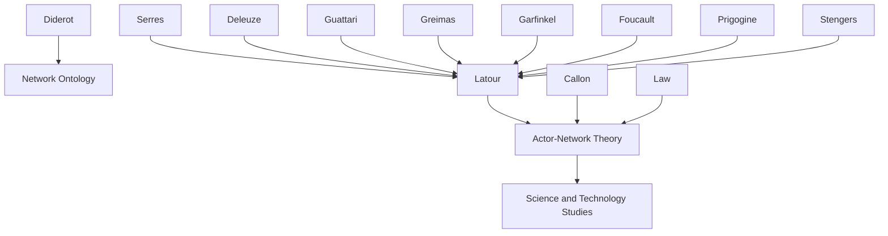

---
cssclasses:
  - Philosophy
  - Sociology
subclasses:
  - Philosophy-of-Science
  - Epistemology
  - 20th-Century-Philosophy
related:
  - "[[Actor-Network Theory]]"
  - "[[Science and Technology Studies]]"
  - "[[Semiotics]]"
  - "[[Social Constructivism]]"
  - "[[Ontology]]"
aliases:
  - actor network
  - ant theory
  - actant
  - quasi objects
  - translation
  - heterogeneous networks
  - irreduction
  - mediators
  - relationism
  - network tracing
reference:
  - "Latour, B. (1996). On actor-network theory: A few clarifications. 47(4), 369–381."
---

#### Central Problem

[[Latour]] addresses persistent misunderstandings of Actor-Network Theory (ANT), a theoretical framework developed by the Paris group of science and technology studies since the early 1980s. The theory has been much abused due to three fundamental confusions arising from common usages of the word "network."

First, ANT should not be confused with technical networks (sewage, telephone, computer networks) which are merely one possible stabilized state of an actor-network. Second, ANT differs fundamentally from social network analysis, which concerns social relations among individual human actors while leaving the social and natural world untouched. Third, the word "actor" has been misread through the Anglo-Saxon tradition as an intentional human individual seeking power through "networking."

The deeper problem is that existing social theory relies on metaphors of surfaces, spheres, levels, layers, territories, structures, and systems that cannot capture the fibrous, thread-like, wiry, stringy, capillary character of modern societies. Traditional sociology fills space with either order or contingencies, creating artificial divides between micro and macro, local and global, inside and outside, description and explanation, history and theory. ANT proposes a radically different topology where there is literally nothing but networks—no "aether" in which networks should be immersed.

#### Main Thesis

[[Latour]] argues that ANT represents a fundamental ontological shift—a change of metaphors to describe essences: instead of surfaces one gets filaments (or rhizomes in [[Deleuze]]'s parlance). This is a change of topology: instead of two or three dimensions, one thinks in terms of nodes that have as many dimensions as they have connections.

**Three Strands of ANT:**

1. **Semiotic definition of entity building:** ANT builds on the "semiotic turn" of the 1960s, using semiotics as a toolbox to study meaning productions. Every entity—self, society, nature—can be understood as selections of embranchments from abstract actants to concrete actors. But ANT extends semiotics to things, dropping the "meaning bit" since semioticians only limited themselves to meaning because they studied texts instead of things.

2. **Methodological framework for heterogeneity:** ANT provides an "infralanguage" (not metalanguage) for recording the deployment of heterogeneous associations. It places the burden of theory on the recording, not on the specific shape recorded. ANT makes no assumptions about actors' shapes, allowing infinite pliability and freedom—necessary conditions for observation.

3. **Ontological claim on networks:** The weakness of semiotics is studying meaning production away from what entities really are. ANT extends meaning productions to all productions, creating continuity between "text," "social," and "nature." These categories are arbitrary cutting points on continuous tracing of action.

**Key Moves:**

- **Counter-Copernican revolution:** Instead of universal laws with local contingencies as exceptions, ANT starts from irreducible, incommensurable localities that sometimes achieve provisional commensurable connections.
- **Explanation as extension:** Networks become more or less explicable as they grow. Explanation is "ex-plicated"—unfolded—indistinguishable from description and deployment of the net.
- **Quasi-objects as tokens:** What circulates transforms and is transformed by those who do the moving. Both movers and moving objects undergo dramatic changes.

#### Historical Context

This 1996 paper emerges from over a decade of ANT development since the early 1980s. The "Paris school" of science and technology studies (including [[Callon]], [[Law]], and [[Latour]]) had been developing actor-network approaches to understand how scientific facts and technological artifacts are constructed.

The broader context includes the "linguistic turn" or "semiotic turn" of the 1960s-70s, which made meaning production the central object of study. Structuralism and post-structuralism had opened the toolbox ANT would selectively appropriate. [[Deleuze]] and [[Guattari]]'s *A Thousand Plateaus* (1980) provided the rhizome metaphor. [[Serres]]'s work on quasi-objects and translations provided crucial ontological resources.

ANT developed in dialogue with ethnomethodology (particularly [[Garfinkel]] and [[Lynch]]), chaos theory ([[Prigogine]] and [[Stengers]]), and the Strong Programme in sociology of scientific knowledge. The paper responds to criticisms that ANT is either social constructivist, naturalist, or textual idealist—arguing it simultaneously rejects all "(x)-isations."

The period also saw debates about reflexivity in science studies, with [[Ashmore]] and others arguing that relativism creates insurmountable epistemological problems. [[Latour]] here offers ANT's solution: abandon the dream of epistemological privilege for "relationism."

#### Philosophical Lineage

#### Key Thinkers

| Thinker | Dates | Movement | Main Work | Core Concept |
|---------|-------|----------|-----------|--------------|
| [[Diderot]] | 1713-1784 | [[Enlightenment]] | *Encyclopédie* | Réseau (network) as ontology |
| [[Serres]] | 1930-2019 | [[French Philosophy]] | *Statues* | Quasi-objects, translations |
| [[Deleuze]] | 1925-1995 | [[Post-Structuralism]] | *A Thousand Plateaus* | Rhizomes, lines of flight |
| [[Greimas]] | 1917-1992 | [[Semiotics]] | *On Meaning* | Actants, generative paths |
| [[Foucault]] | 1926-1984 | [[Post-Structuralism]] | *Discipline and Punish* | Micro-powers |
| [[Garfinkel]] | 1917-2011 | [[Ethnomethodology]] | *Studies in Ethnomethodology* | Local accomplishment |
| [[Callon]] | 1945- | [[Science Studies]] | *Sociology of Translation* | Translation, enrollment |
| [[Prigogine]] | 1917-2003 | [[Complexity Theory]] | *Order Out of Chaos* | Dissipative structures |

#### Key Concepts

| Concept | Definition | Related to |
|---------|------------|------------|
| Actor-network | An entity that does tracing and inscribing; not a traced network but network-tracing activity | [[Latour]], [[ANT]] |
| Actant | Semiotic definition: anything granted to be source of action; no special human motivation implied | [[Greimas]], [[Semiotics]] |
| Quasi-object | A circulating token that transforms those who move it because they transform it | [[Serres]], [[Ontology]] |
| Translation | The infralanguage equivalent of Lorentz transformation; moving between frames of reference | [[Callon]], [[Latour]] |
| Irreduction | Not reducing actors to any single (x)-isation (naturalism, socialisation, textualisation) | [[Latour]], [[Ontology]] |
| Infralanguage | Poor, limited, short language enabling travel between nets; opposite of metalanguage | [[Latour]], [[Methodology]] |
| Generalized symmetry | Using words from any realm (natural, social, textual) to describe others | [[Callon]], [[ANT]] |
| Mediators | Entities that transform, translate, distort what they carry; opposite of intermediaries | [[Latour]], [[ANT]] |
| Punctualization | Black-boxing of networks into single points; summarizing complex associations | [[Callon]], [[Law]] |
| Counter-Copernican revolution | Starting from irreducible localities, not universal laws with local exceptions | [[Latour]], [[Epistemology]] |

#### Authors Comparison

| Theme | [[Latour]] | [[Deleuze]] |
|-------|-----------|-------------|
| Central metaphor | Filaments, networks, fibrous | Rhizomes, lines of flight |
| Ontology | Flat, irreductionist | Plane of immanence |
| Topology | Nodes with connections as dimensions | Smooth vs. striated space |
| Agency | Distributed among human/nonhuman actants | Assemblages, desiring machines |
| Method | Follow the actors, describe associations | Schizoanalysis, cartography |
| Politics | Diplomatic, empirical | Revolutionary, conceptual |

#### Influences & Connections

- **Predecessors:** [[Latour]] ← influenced by ← [[Diderot]], [[Serres]], [[Deleuze]], [[Guattari]], [[Greimas]], [[Foucault]], [[Garfinkel]]
- **Contemporaries:** [[Latour]] ↔ collaboration with ↔ [[Callon]], [[Law]], [[Mol]], [[Stengers]]
- **Followers:** [[Latour]] → influenced → [[Science and Technology Studies]], [[New Materialism]], [[Object-Oriented Ontology]]
- **Opposing views:** [[Latour]] ← criticized by ← [[Social Constructivists]] (too realist), [[Realists]] (too constructivist), [[Critical Theory]] (apolitical)

#### Summary Formulas

- **[[Diderot]]:** The word "réseau" describes matter and bodies to avoid the Cartesian divide between matter and spirit—network has ontological component from the beginning.
- **[[Serres]]:** Quasi-objects are circulating tokens that transform both what moves and who does the moving; there is no stable mover or stable moved.
- **[[Deleuze]]:** Rhizomes have no beginning or end but always a middle; networks are all boundary without inside and outside.
- **[[Latour]]:** ANT is a change of topology—from surfaces and spheres to nodes with as many dimensions as connections; there is literally nothing but networks, no aether in between.

#### Timeline

| Year | Event |
|------|-------|
| 1980 | [[Deleuze]] and [[Guattari]] publish *A Thousand Plateaus* |
| 1983 | [[Hughes]] publishes *Networks of Power* |
| 1986 | [[Callon]] publishes "Sociology of Translation" |
| 1986 | [[Callon]], [[Law]], and [[Rip]] publish *Mapping the Dynamics of Science and Technology* |
| 1987 | [[Serres]] publishes *Statues* (quasi-objects) |
| 1987 | [[Latour]] publishes *Science in Action* |
| 1988 | [[Latour]] publishes *The Pasteurization of France* |
| 1993 | [[Latour]] publishes *We Have Never Been Modern* |
| 1996 | [[Latour]] publishes "On Actor-Network Theory: A Few Clarifications" |

#### Notable Quotes

> "ANT is a change of metaphors to describe essences: instead of surfaces one gets filaments... Instead of thinking in terms of surfaces or spheres, one is asked to think in terms of nodes that have as many dimensions as they have connections." — [[Latour]]

> "Literally there is nothing but networks, there is nothing in between them, or, to use a metaphor from the history of physics, there is no aether in which networks should be immersed." — [[Latour]]

> "Actor-networks do connect, and by connecting with one another provide an explanation of themselves, the only one there is for ANT." — [[Latour]]

---
> [!warning]-
> This annotation was normalised using a large language model and may contain inaccuracies. These texts serve as preliminary study resources rather than exhaustive references.
