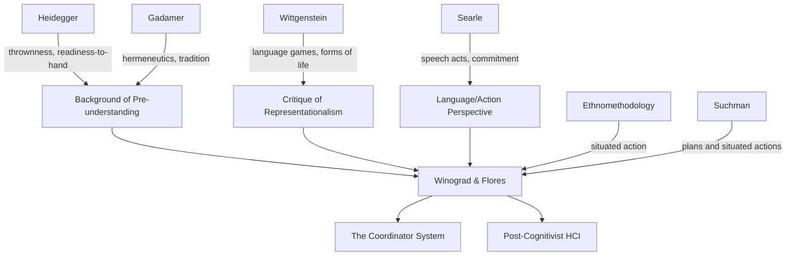

---

cssclasses:
  - Philosophy
  - Computer-Science
subclasses:
  - Phenomenology
  - Philosophy-of-Science
related:
  - "[[Heidegger]]"
  - "[[Gadamer]]"
  - "[[Wittgenstein]]"
  - "[[Searle]]"
  - "[[Suchman]]"
  - "[[Kuhn]]"
aliases:
  - understanding computers
  - language action
  - committed speaking
  - background understanding
  - preunderstanding hermeneutics
  - breakdown theory
  - hermeneutic computer
  - the coordinator
  - antirepresentationalism cognition
  - listening speaking
  - thrown background
  - design methodology
reference:
  - "Winograd, T., & Flores, F. (1987). On understanding computers and cognition: A new foundation for design. Artificial Intelligence, 31(2), 250–261. https://doi.org/10.1016/0004-3702(87)90026-9"
tags:
  - Podcast
---

#### Podcast

<iframe allow="autoplay *; encrypted-media *; fullscreen *; clipboard-write" frameborder="0" height="150" style="width:100%;overflow:hidden;border-radius:10px;background:transparent;" sandbox="allow-forms allow-popups allow-same-origin allow-scripts allow-storage-access-by-user-activation allow-top-navigation-by-user-activation" src="https://embed.podcasts.apple.com/us/podcast/understanding-computers-and-cognition-a-response/id1786764068?i=1000693901120&uo=4&l=en-GB&theme=auto"></iframe>

---

#### Central Problem

How can a hermeneutic-phenomenological theory of language provide better foundations for computer technology design than the rationalistic tradition, and how can this theory account for the different interpretations that arise from the same text among readers with different backgrounds?

#### Main Thesis

Language does not convey information but *evokes* understanding through an interaction between utterance and the listener's pre-understanding — a background of concerns, practices, and breakdowns generated within a tradition. This background-dependent theory of interpretation explains why the same book produced radically different readings among reviewers, and provides the foundation for designing computer systems as tools for human commitment and action rather than as representations of knowledge.

#### Historical Context

Writing in 1987 as a response to reviews of their influential *Understanding Computers and Cognition* (1986), Winograd and Flores defend their critique of the rationalistic tradition in AI and cognitive science. The mid-1980s marked a period of both AI optimism (expert systems boom) and growing disillusionment with symbolic AI's foundational assumptions. Drawing on Continental philosophy (Heidegger, Gadamer), speech act theory (Searle, Austin), and ethnomethodology (Suchman), they challenge the prevailing representationalist paradigm and advocate for a "language/action perspective" on computer design, exemplified by their commercial product "The Coordinator."

#### Philosophical Lineage

#### Key Thinkers

| Thinker | Dates | Movement | Main Work | Core Concept |
|---------|-------|----------|-----------|--------------|
| [[Heidegger]] | 1889–1976 | Phenomenology | *Being and Time* | Thrownness, readiness-to-hand, breakdown |
| [[Hans-Georg Gadamer]] | 1900–2002 | Hermeneutics | *Truth and Method* | Tradition, pre-understanding, fusion of horizons |
| [[Wittgenstein]] | 1889–1951 | Ordinary Language Philosophy | *Philosophical Investigations* | Language games, meaning as use |
| [[Searle]] | 1932–2025 | Speech Act Theory | *Speech Acts* | Illocutionary acts, commitment |
| [[Suchman]] | 1951– | Ethnomethodology | *Plans and Situated Actions* | Situated action vs. planning |
| [[Kuhn]] | 1922–1996 | Philosophy of Science | *The Structure of Scientific Revolutions* | Paradigm shifts, serious listening |

#### Key Concepts

| Concept | Definition | Related to |
|---------|------------|------------|
| **Pre-understanding** | The background of concerns, practices, and history that shapes interpretation before any explicit understanding occurs | Thrownness, tradition |
| **Background** | Not a "set of beliefs" but the lived context of practices and breakdowns that generates possibilities for interpretation | Pre-understanding, tradition |
| **Tradition** | Shared history of conversations that shapes language and thought; not a definable "school" but a ground on which we work | Background, culture |
| **Breakdown** | Disruption in transparent practice that reveals what was previously taken for granted | Readiness-to-hand, design |
| **Listening** | Active interpretation shaped by background; different listeners hear different meanings from the same utterance | Pre-understanding, openness |
| **Commitment** | Language act in which one allows others to anticipate future actions; the basis of coordination | Speech acts, The Coordinator |
| **Readiness-to-hand** | Heidegger's term for transparent tool use; what good design achieves | Breakdown, thrownness |
| **Rationalistic tradition** | Western intellectual heritage assuming thought can be reduced to logical manipulation of explicit representations | Representationalism, AI |

#### Authors Comparison

| Theme | Winograd & Flores | Traditional AI | Ethnomethodology |
|-------|-------------------|----------------|------------------|
| View of language | Evokes understanding through background | Conveys information through symbols | Constitutes social reality |
| Role of representation | Emerges from breakdown, not foundation | Foundation of cognition | Insufficient for capturing practice |
| Design approach | Language/action perspective | Knowledge representation | Systematic study of practices |
| Background treatment | Constitutive, unarticulable | Reducible to explicit beliefs | Observable through methodology |
| Computer's role | Tool for commitment and conversation | Intelligent agent | Artefact embedded in practice |

#### Influences & Connections

- **Draws from**: [[Heidegger]] (thrownness, readiness-to-hand, breakdown), [[Hans-Georg Gadamer]] (hermeneutics, tradition), [[Wittgenstein]] (language games), [[Searle]] (speech acts), [[Suchman]] (situated action)
- **Responds to**: Rationalistic tradition in AI, cognitivism, expert systems optimism, representationalism
- **Influences**: Computer-Supported Cooperative Work (CSCW), third-wave HCI, post-cognitivist design, workflow systems
- **Critique of**: Symbolic AI, knowledge representation, naive technological optimism, detached methodology

#### Summary Formulas

1. **Language ≠ Information Transfer**: Language evokes understanding through interaction with pre-understanding, not transmission of content
2. **Tradition Thesis**: Thought and language are shaped by shared history that cannot be chosen, designed, or precisely defined
3. **Background Irreducibility**: Background cannot be articulated as "a set of beliefs, desires, and dispositions" — it is lived, not represented
4. **Design as Commitment**: Computer systems should be tools for making and tracking commitments, not simulations of intelligence
5. **Serious Listening**: Understanding requires looking for how "apparent absurdities" make sense, not judging logical arguments

#### Timeline

- **1958**: [[Wittgenstein]]'s *Philosophical Investigations* published (posthumously, English edition)
- **1960**: [[Hans-Georg Gadamer]] publishes *Truth and Method*
- **1969**: [[Searle]] publishes *Speech Acts*
- **1972**: Terry Winograd publishes *Understanding Natural Language* (early AI work)
- **1976**: Joseph Weizenbaum publishes *Computer Power and Human Reason*
- **1986**: Winograd & Flores publish *Understanding Computers and Cognition*
- **1986**: [[Suchman]] publishes *Plans and Situated Actions*
- **1987**: Winograd & Flores publish this response to reviewers
- **1986–1990s**: The Coordinator deployed as commercial workflow system

#### Notable Quotes

> "Language does not convey information. It evokes an understanding, or 'listening,' which is an interaction between what was said and the preunderstanding already present in the listener." — [[Winograd]] & [[Flores]]

> "We participate in a tradition and it changes through our participation. But we do not choose it or design it. It would be foolish to ignore the power of this particular tradition because it cannot be precisely defined." — [[Winograd]] & [[Flores]]

> "This book is anti-illusion, not anti-technology." — William Clancey (quoted approvingly by [[Winograd]] & [[Flores]])

---
> [!warning]-
> This annotation was normalised using a large language model and may contain inaccuracies. These texts serve as preliminary study resources rather than exhaustive references.
