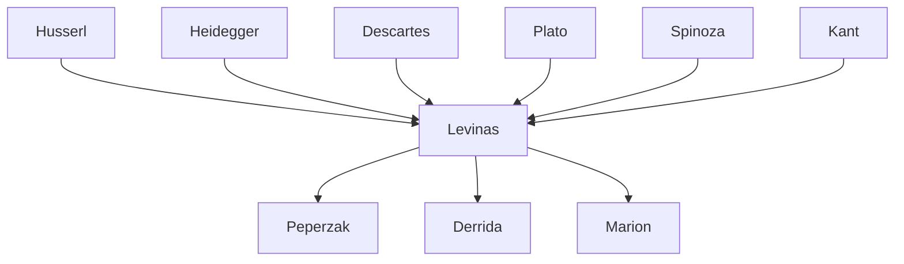

---

cssclasses:
  - Philosophy
subclasses:
  - Continental-Philosophy
  - Phenomenology
  - Ethics
related:
  - "[[Levinas]]"
  - "[[Phenomenology]]"
  - "[[Ethics]]"
  - "[[Alterity]]"
  - "[[Totality and Infinity]]"
  - "[[Husserl]]"
aliases:
  - levinas philosophy
  - face other
  - il ya
  - metaphysical desire
  - same other
  - ethical relation
  - infinite idea
  - heteronomy ethics
  - egological consciousness
  - visage alterity
reference:
  - "Peperzak, A. T., & Lévinas, E. (1993). To the other: an introduction to the philosophy of Emmanuel Levinas. Purdue University Press. (pp.18-22)"
tags:
  - Podcast
---

#### Podcast

<iframe allow="autoplay *; encrypted-media *; fullscreen *; clipboard-write" frameborder="0" height="150" style="width:100%;overflow:hidden;border-radius:10px;background:transparent;" sandbox="allow-forms allow-popups allow-same-origin allow-scripts allow-storage-access-by-user-activation allow-top-navigation-by-user-activation" src="https://embed.podcasts.apple.com/us/podcast/levinas-and-the-other/id1786764068?i=1000685490376&uo=4&l=en-GB&theme=auto"></iframe>

---

#### Central Problem

How can philosophy account for ethical relation if Western ontology has systematically reduced all otherness to the Same? Peperzak's introduction to Levinas confronts the fundamental problem that animates Levinas's entire philosophical project: the totalizing tendency of Western thought to absorb, appropriate, and neutralize everything that is genuinely other into the structures of egological consciousness.

The central tension lies between two modes of relating to reality: the ontological mode, which treats all beings as phenomena to be comprehended, integrated, and possessed by a self-centered subject; and the ethical mode, which encounters the Other as that which radically exceeds and resists such integration. The problem is not merely epistemological but existential and ethical: if consciousness naturally tends toward appropriation and domination, how can genuine encounter with alterity occur? How can the Other emerge as Other rather than as a moment of my world?

This question challenges the entire phenomenological tradition from [[Husserl]] to [[Heidegger]]. Against Husserl's theory of intentionality, which presupposes an adequate correlation between noesis and noema, Levinas argues that the Other exceeds any possible intentional object. Against Heidegger's celebration of Being's generosity (*es gibt*), Levinas poses the anonymous horror of the *il y a*—the impersonal rumbling of existence that threatens rather than illuminates.

#### Main Thesis

Peperzak expounds Levinas's thesis that the ethical relation to the Other constitutes the primary structure of human existence, prior to and more fundamental than ontological comprehension. The Other is not a phenomenon among phenomena but an "enigma" that breaks through the horizon of egological consciousness, revealing a dimension of "height" (*hauteur*) that commands responsibility.

**The Face as Revelation:** The otherness of the Other is concretized in the face (*visage*). When another faces me, looks at me, speaks to me, something happens that cannot be reduced to perception, aesthetic appreciation, or functional assessment. The face is "naked"—stripped of roles, functions, and qualities that would allow me to categorize and thus neutralize the other. The face commands: "You shall not kill me; you must accord me a place under the sun."

**Beyond Phenomenon to Enigma:** Since the Other resists integration into any totality of beings ruled by egological understanding, Levinas reserves the word "phenomenon" for what fits within consciousness and calls the Other an "enigma." The Other transcends the limits of self-consciousness and its horizon; the look and voice that surprise me are "too much" for my capacity of assimilation.

**The Idea of the Infinite:** Levinas retrieves from [[Descartes]]'s Third Meditation the formal structure of consciousness thinking more than it can think—the "idea of the infinite" as an immediate, a priori relation to a reality that can neither be constituted nor embraced by the subject. This structure, rather than Husserl's noetic-noematic correlation, describes the ethical relation.

**Desire versus Need:** Levinas distinguishes metaphysical Desire from need. While needs (hunger, thirst, aesthetic and spiritual pursuits) move from lack toward satisfaction, Desire is directed toward the absolutely Other and grows rather than diminishes as it approaches the desirable. True Desire is "a hunger that feeds on hunger itself," dedicating the self to the well-being of others rather than seeking self-satisfaction.

**Fact and Norm United:** The face-to-face encounter dissolves the is/ought distinction that has troubled philosophy since [[Hume]]. The Other's presence is simultaneously factual and normative—the very emergence of the Other obligates me. Responsibility is not chosen but discovered as the primary structure of subjectivity.

#### Historical Context

Peperzak's *To the Other* appeared in 1993, at a moment when Levinas's philosophy was gaining increasing recognition in the Anglophone world after decades of relative obscurity outside France. Levinas had died in 1995, and his major works—*Totality and Infinity* (1961) and *Otherwise than Being* (1974)—were being widely translated and discussed.

The text situates Levinas within the phenomenological tradition inaugurated by [[Husserl]], whom Levinas had studied with in Freiburg in the late 1920s. Levinas was among the first to introduce phenomenology to France, but his relationship to the tradition was always critical. His early work *De l'évasion* (1935-36) already opposed Heidegger's account of Being, and *De l'existence à l'existant* (1947) developed the concept of the *il y a* as a counter to Heideggerian ontology.

The broader context includes the post-Holocaust reconsideration of Western philosophy. Levinas, a Lithuanian Jew who lost most of his family in the Shoah and spent years as a prisoner of war, saw in the history of Western ontology an implicit violence—the reduction of the Other to the Same that found its ultimate expression in totalitarianism. His ethics of alterity responds to this historical catastrophe by grounding philosophy in the irreducible demand of the Other's face.

#### Philosophical Lineage

#### Key Thinkers

| Thinker | Dates | Movement | Main Work | Core Concept |
|---------|-------|----------|-----------|--------------|
| [[Levinas]] | 1906-1995 | [[Phenomenology]] | *Totality and Infinity* | Face, alterity, ethical relation |
| [[Husserl]] | 1859-1938 | [[Phenomenology]] | *Logical Investigations* | Intentionality, noesis-noema |
| [[Heidegger]] | 1889-1976 | [[Phenomenology]] | *Being and Time* | Being, es gibt, Dasein |
| [[Descartes]] | 1596-1650 | [[Rationalism]] | *Meditations* | Idea of the infinite, cogito |
| [[Spinoza]] | 1632-1677 | [[Rationalism]] | *Ethics* | Conatus essendi |
| [[Plato]] | 428-348 BCE | [[Ancient Philosophy]] | *Symposium* | Eros, desire |

#### Key Concepts

| Concept | Definition | Related to |
|---------|------------|------------|
| Il y a | The anonymous, impersonal "there is"—a chaotic, depersonalizing rumbling of pure existence that generates terror rather than illumination | [[Levinas]], [[Heidegger]] |
| The Face (visage) | The naked presence of the other person that breaks through egological consciousness, commanding responsibility | [[Levinas]], [[Ethics]] |
| The Same (le Même) | The self-centered, appropriating ego that reduces all reality to moments of its own world | [[Levinas]], [[Egology]] |
| The Other (l'Autre) | That which radically exceeds and resists integration into the totality of the Same | [[Levinas]], [[Alterity]] |
| Metaphysical Desire | A desire for the absolutely Other that grows rather than diminishes, distinct from need | [[Levinas]], [[Plato]] |
| Idea of the Infinite | Descartes's notion of consciousness thinking more than it can think, the formal structure of ethical relation | [[Descartes]], [[Levinas]] |
| Enigma | What the Other is, as opposed to phenomenon—that which does not fit into phenomenological categories | [[Levinas]], [[Phenomenology]] |
| Heteronomy | The condition of being commanded by the Other, as opposed to autonomous self-legislation | [[Levinas]], [[Kant]] |
| Hauteur (height) | The dimension from which the Other comes—"from on high"—indicating asymmetry and command | [[Levinas]], [[Ethics]] |
| Interestedness (interesse) | Being's essence as universal self-interest that makes all beings competitive and creates war | [[Levinas]], [[Spinoza]] |

#### Authors Comparison

| Theme | [[Levinas]] | [[Husserl]] | [[Heidegger]] |
|-------|-------------|-------------|---------------|
| Consciousness structure | Idea of the infinite | Noesis-noema correlation | Being-in-the-world |
| The Other | Absolute alterity, enigma | Alter ego by analogy | Das Man, Mitsein |
| Being | Il y a as horror; interesse | Bracketed (epoché) | es gibt as generosity |
| Primary relation | Ethical (face-to-face) | Epistemological (intentionality) | Ontological (Being) |
| Method | Beyond phenomenology | Transcendental phenomenology | Fundamental ontology |
| Totality | Violence of the Same | Constitution by consciousness | Horizon of Being |

#### Influences & Connections

- **Predecessors:** [[Levinas]] ← influenced by ← [[Husserl]], [[Heidegger]], [[Descartes]], [[Plato]]
- **Critical appropriation:** [[Levinas]] ← critiques and transforms ← [[Phenomenology]], [[Ontology]]
- **Contemporaries:** [[Levinas]] ↔ dialogue with ↔ [[Sartre]], [[Merleau-Ponty]], [[Blanchot]]
- **Followers:** [[Levinas]] → influenced → [[Derrida]], [[Marion]], [[Peperzak]], [[Critchley]]
- **Opposing views:** [[Levinas]] ← contested by ← [[Ontology]], [[Egology]], [[Totality]]

#### Summary Formulas

- **[[Levinas]]:** The Other's face commands me before I can choose; ethics is first philosophy, prior to ontology, because the infinite exceeds the totality.
- **[[Peperzak]]:** Levinas replaces the overt or hidden monism of ontology with a pluralism whose basic ground model is the relation of the Same and the Other.
- **[[Descartes]] (as read by Levinas):** The cogito is structured by the idea of the infinite—consciousness thinks more than it can think.
- **[[Husserl]] (as critiqued by Levinas):** Intentionality presupposes an adequate correlation between noesis and noema that cannot account for the Other's excess.

#### Timeline

| Year | Event |
|------|-------|
| 1935-36 | [[Levinas]] publishes "De l'évasion," first critique of Heidegger |
| 1947 | *De l'existence à l'existant* introduces the concept of *il y a* |
| 1961 | *Totality and Infinity* published |
| 1974 | *Otherwise than Being* (*Autrement qu'être*) published |
| 1978 | Reprint of *De l'existence à l'existant* with new preface |
| 1993 | [[Peperzak]] publishes *To the Other: An Introduction to the Philosophy of Emmanuel Levinas* |

#### Notable Quotes

> "The other's face (i.e., any other's facing me) or the other's speech (i.e., any other's speaking to me) interrupts and disturbs the order of my, ego's world; it makes a hole in it by disarraying my arrangements without ever permitting me to restore the previous order." — [[Peperzak]]

> "The other imposes its exceptional and enigmatic otherness on me by way of a command and a prohibition: you are not allowed to kill me; you must accord me a place under the sun and everything that is necessary to live a truly human life!" — [[Peperzak]]

> "Descartes still knew (as all great metaphysicians before him) that consciousness 'thinks more than [or beyond] that which it can think.'" — [[Peperzak]]

---
> [!warning]-
> This annotation was normalised using a large language model and may contain inaccuracies. These texts serve as preliminary study resources rather than exhaustive references.
