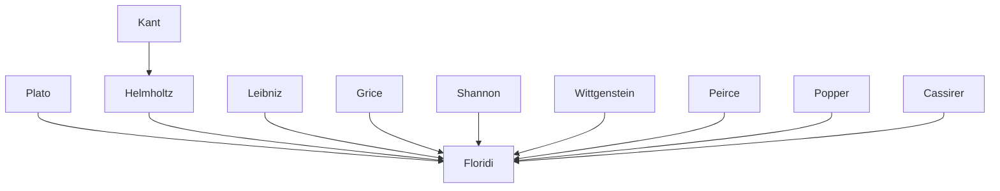

---

cssclasses:
  - Philosophy
  - Psychology
  - Computer-Science
subclasses:
  - Epistemology
  - Philosophy-of-Mind
  - Philosophy-of-Language
related:
  - "[[Philosophy as Conceptual Design (1 of 9)]]"
  - "[[Constructionism as Non-naturalism (2 of 9)]]"
  - "[[Perception and Testimony as Data Providers (3 of 9)]]"
  - "[[Information Quality (4 of 9)]]"
  - "[[Informational Scepticism and the Logically Possible (5 of 9)]]"
  - "[[A Defence of Information Closure (6 of 9)]]"
  - "[[Logical Fallacies as Bayesian Informational Shortcuts (7 of 9)]]"
  - "[[Maker’s Knowledge, between A Priori and A Posteriori (8 of 9)]]"
  - "[[Logic of Design as a Conceptual Logic of Information (9 of 9)]]"
aliases:
  - perception testimony
  - data hacking
  - symbol grounding
  - natural semantics
  - semantic information
  - constructionist epistemology
  - data provider
  - mutual information
  - nonnatural meaning
  - informational realism
  - cognitive decoupling
  - action semantics
reference:
  - "Floridi, L. (2019). The logic of information: A theory of philosophy as conceptual design (First edition). Oxford University Press. (pp. 71-100)"
tags:
  - Podcast
---

#### Podcast

<iframe allow="autoplay *; encrypted-media *; fullscreen *; clipboard-write" frameborder="0" height="150" style="width:100%;overflow:hidden;border-radius:10px;background:transparent;" sandbox="allow-forms allow-popups allow-same-origin allow-scripts allow-storage-access-by-user-activation allow-top-navigation-by-user-activation" src="https://embed.podcasts.apple.com/us/podcast/the-logic-of-information-a-theory-of/id1786764068?i=1000681417145&uo=4&l=en-GB&theme=auto"></iframe>

> [!tip] This episode is part of a series — click "See More" for all the episodes.

---

#### Central Problem

How can perception, understood as a process of data acquisition rather than knowledge in the full sense, generate meaning and ultimately empirical knowledge? The chapter addresses two interconnected difficulties: (1) if knowledge is accounted information, how do we explain perceptual and testimonial knowledge, given that perception and testimony seem to require no explicit "account"? (2) If perception and testimony are reduced to "data providers," how can raw data become semantically meaningful without presupposing already-given meanings?

The problem is rooted in the tension between an inflated view of perception (which equates it directly with knowledge) and a deflated view (which reduces it to mere sensory input). Floridi seeks a middle path: perception provides "constraining affordances" that cognitive agents creatively repurpose to generate non-natural meanings. This raises the "symbol grounding problem" (SGP): how can a formal system acquire intrinsic semantics without presupposing already-available semantic resources?

#### Main Thesis

The central thesis is that human beings are "natural-born data hackers": cognitive agents who repurpose natural data and signals for epistemic, communicative, and semantic purposes that transcend their original natural meanings. This capacity for "semantic hacking" explains how non-natural (conventional) meanings emerge from natural meanings without violating the "Data Processing Theorem" (DPT), according to which data processing cannot increase mutual information.

**Perception as data provider:** Perception is not knowledge in the full sense, but the process through which agents acquire first-hand data about the environment. To qualify as knowledge, perceptual information must pass the "Phaedrus' Test" (Platonic test): the agent must be able to answer questions about the why and how of their perceptions.

**Testimony as transfer:** Testimony transfers already-formed and meaningful information, but does not generate knowledge in itself. To qualify as knowledge, it must pass the "Parrot's Test" (Cartesian test): receiving true information is not the same as knowing it if one cannot do anything else with it.

**Praxical solution to the SGP:** Through Action-based Semantics (AbS), agents with a two-module architecture (M1 operational, M2 meta-level) can semantically ground symbols to their sensorimotor interactions with the environment.

**Retro-fitness:** The correspondence between perception and reality is not passive representation but "retro-fitness": perceptual models of the world are outputs of data hacking, not inputs, and compete evolutionarily for correctness and fitness for purpose.

#### Historical Context

The chapter fits within the post-cognitivist debate on the nature of perception and knowledge, developing themes from the neo-Kantian philosophy of Helmholtz (1878), who already interpreted sensations as "signs" rather than "images" of reality. Floridi takes up the Gricean distinction (1957) between natural and non-natural meaning (meaningNN), criticizing naturalist attempts (Skyrms 2010) to completely reduce the latter to the former.

The scientific context includes Shannon's information theory, the data processing theorem (DPT), and contemporary neuroscience showing the brain as a proactive "predictor" rather than a passive "mirror" (Nobre et al. 2007). The approach opposes both naive realism and relativism, proposing a relational "third way" inspired by Platonic metaxy.

On the artificial intelligence front, the failure of the classical AI project is interpreted as confirmation of the insufficiency of syntactic processing to generate genuine semantics ("semantics-from-syntax fallacy").

#### Philosophical Lineage

#### Key Thinkers

| Thinker | Dates | Movement | Main Work | Core Concept |
|---------|-------|----------|-----------|--------------|
| [[Helmholtz]] | 1821-1894 | [[Neo-Kantianism]] | *Handbook of Physiological Optics* | Perceptions as signs, not images |
| [[Grice]] | 1913-1988 | [[Analytic Philosophy]] | *Meaning* (1957) | Natural vs non-natural meaning |
| [[Shannon]] | 1916-2001 | [[Information Theory]] | *A Mathematical Theory of Communication* | Mutual information, DPT |
| [[Cassirer]] | 1874-1945 | [[Neo-Kantianism]] | *Substance and Function* | Mathematical structuralism |
| [[Popper]] | 1902-1994 | [[Critical Rationalism]] | *Objective Knowledge* | World 3, subjectless knowledge |

#### Key Concepts

| Concept | Definition | Related to |
|---------|------------|------------|
| Data hacking | Repurposing natural data/signals for non-natural semantic purposes | [[Floridi]], [[Constructionism]] |
| Symbol Grounding Problem | How formal symbols acquire intrinsic meaning without presupposing semantics | [[Harnad]], [[AI]] |
| Action-based Semantics | Theory of meaning based on internal states correlated with actions | [[Floridi]], [[Pragmatics]] |
| Phaedrus' Test | Criterion: knowing requires being able to answer questions about one's knowledge | [[Plato]], [[Epistemology]] |
| Parrot's Test | Criterion: receiving true information is not the same as knowing it | [[Descartes]], [[Testimony]] |
| Data Processing Theorem | Data processing does not increase mutual information: I(X;Y) ≥ I(X;Z) | [[Shannon]], [[Information Theory]] |
| Constraining affordances | Data as enabling constraints for semantic construction | [[Floridi]], [[Perception]] |
| Retro-fitness | Perceptual models are outputs of data hacking, competing for correctness | [[Floridi]], [[Constructionism]] |
| Dedomena | Data "in the wild" before cognitive interpretation | [[Floridi]], [[Ontology]] |
| Natural-born data hackers | Definition of humans as creative repurposers of meanings | [[Floridi]], [[Cognitive Science]] |

#### Authors Comparison

| Theme | [[Floridi]] | [[Grice]] | [[Helmholtz]] |
|-------|-------------|-----------|---------------|
| Nature of perception | Data provider, constraining affordances | Presupposes semantics | Signs, not images |
| Meaning | Natural → non-natural via hacking | Natural vs non-natural (meaningsNN) | Sign relation, not pictorial |
| World-mind relationship | Constructionism, retro-fitness | Not systematically thematized | Neo-Kantianism, mediation |
| Knowledge | Accounted information | Intentional communication | Inferred regularities |

#### Influences & Connections

- **Predecessors:** [[Floridi]] ← influenced by ← [[Kant]], [[Helmholtz]], [[Grice]], [[Shannon]], [[Cassirer]]
- **Contemporaries:** [[Floridi]] ↔ dialogue with ↔ [[Piazza]], [[Harnad]], [[Skyrms]]
- **Followers:** [[Floridi]] → influenced → Philosophy of Information, Informational Structural Realism
- **Opposing views:** [[Floridi]] ← criticized by ← Naturalisti semantici, Rappresentazionalisti, AI classica

#### Summary Formulas

- **[[Floridi]]:** Perception provides data that agents creatively "hack" to generate non-natural meanings; knowledge is accounted information, not mere reception of data.
- **[[Helmholtz]]:** Sensations are signs of external reality, not images; they represent regularities, not resemblances.
- **[[Grice]]:** Non-natural meaning (meaningsNN) cannot be reduced to natural meaning through mere causal processing or conditioning.
- **Data Processing Theorem:** Data processing does not generate new information; I(X;Y) ≥ I(X;Z) implies that non-natural semantics requires something beyond processing.

#### Timeline

| Year | Event |
|------|-------|
| 1878 | [[Helmholtz]] publishes the theory of sensations as signs |
| 1957 | [[Grice]] distinguishes natural and non-natural meaning |
| 1948 | [[Shannon]] formalizes information theory |
| 1990 | [[Harnad]] formulates the Symbol Grounding Problem |
| 2011 | [[Floridi]] proposes the praxical solution to SGP in *The Philosophy of Information* |
| 2019 | [[Floridi]] develops the "data hacking" hypothesis in *The Logic of Information* |

#### Notable Quotes

> "Humans are natural-born data hackers." — [[Floridi]]

> "Our sensations are effects brought forth in our organs by means of exterior causes [...] a sign need have no similarity of any sort whatever with that of which it is the sign." — [[Helmholtz]]

> "We are not evolution's finest moment, the peak of the process, some kind of Über-animal, but Nature's beautiful glitch." — [[Floridi]]

---
> [!warning]-
> This annotation was normalised using a large language model and may contain inaccuracies. These texts serve as preliminary study resources rather than exhaustive references.
