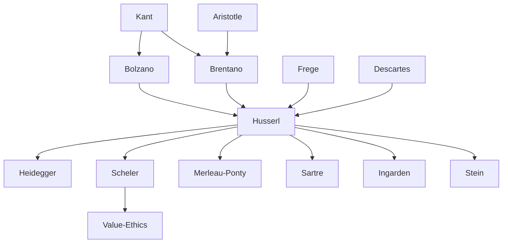

---
cssclasses:
  - Philosophy
subclasses:
  - Phenomenology
  - Epistemology
  - 20th-Century-Philosophy
related:
  - "[[Phenomenology]]"
  - "[[Intentionality]]"
  - "[[Transcendental Philosophy]]"
  - "[[Lifeworld]]"
  - "[[Existentialism]]"
  - "[[Hermeneutics]]"
  - "[[Heidegger]]"
  - "[[Brentano]]"
  - "[[Value Ethics]]"
  - "[[Crisis of Sciences]]"
aliases:
  - eidetic reduction
  - noesis noema
  - transcendental ego
  - essence intuition
reference:
  - "Abbagnano, N., & Fornero, G. (2012). La ricerca del pensiero. Vol. 3B. Dalla fenomenologia a Gadamer. Paravia."
---

#### Central Problem

The chapter addresses the fundamental problem of how philosophy can become a rigorous science capable of grasping essential truths about consciousness and the world. The central question is: how can we access the essential structures of experience and consciousness, moving beyond both naive realism (which assumes the independent existence of external objects) and psychologism (which reduces logical truths to psychological facts)?

The phenomenological approach seeks to overcome the limitations of both positions by developing a method that suspends ("brackets") our natural assumptions about reality in order to focus on how objects appear to consciousness — not as facts among other facts, but as phenomena revealing their essential structures. This requires clarifying the nature of consciousness itself as intentionality: consciousness is always consciousness *of* something.

A further problem emerges in [[Husserl]]'s later work: the crisis of modern science, which has become alienated from the "world of life" (Lebenswelt) through its mathematization and objectivism, losing touch with the human subject who is the source and purpose of all scientific activity.

#### Main Thesis

Phenomenology, as developed by [[Husserl]], conceives philosophy as the analysis of consciousness in its intentionality. Since consciousness is essentially intentionality — always consciousness *of* something — analyzing it means examining all possible ways in which something can be "given" to consciousness and all types of "meaning" or "validity" that can be attributed to objects of consciousness.

**The Phenomenological Method:** Two fundamental operations are required:
- **Eidetic Reduction:** Replacing consideration of facts or natural things with the intuition of essences (eide) — universal, invariant structures of which individual objects are merely particular instances
- **Epoché (Bracketing):** Suspending the thesis of the effective existence of the real world — not denying it, but putting it "out of action" to focus on phenomena as they appear to consciousness

**The Structure of Consciousness:** [[Husserl]] distinguishes:
- **Noesis:** The acts of consciousness (perceiving, remembering, imagining)
- **Noema:** The objective element of lived experience — the object considered in its various modes of being given (perceived, remembered, imagined)
- The object itself remains a transcendent pole around which noematic experiences are oriented

**The Transcendental Turn:** In his later works, [[Husserl]] moves toward a transcendental idealism, positing a transcendental ego that cannot itself be subjected to epoché since it is the very subject performing the bracketing. This raises the problem of solipsism, which [[Husserl]] addresses through the concept of intersubjectivity: the world must be founded on the constitutive activity of multiple co-subjects within transcendental subjectivity.

**The Crisis of European Sciences:** [[Husserl]]'s final work diagnoses modern science as having lost contact with the Lebenswelt — the pre-categorical, concrete dimension of lived experience. Science has become a "sustruzione" (construction upon) that covers over its vital roots. The task of phenomenology is to restore science's connection to human life and to reassert the philosopher's role as "functionary of humanity."

#### Historical Context

Phenomenology emerged in the early 20th century as a response to two dominant tendencies: the psychologism that sought to ground logic and mathematics in psychological processes, and the positivist-naturalist worldview that reduced all knowledge to factual sciences.

[[Husserl]] (1859-1938) was born in Moravia to a Jewish family. He studied mathematics in [[Berlin]] with Weierstrass and Kronecker before encountering Brentano in Vienna, which turned him toward philosophy. He converted to Protestantism in 1886 and began his academic career at Halle (1887), later moving to Göttingen (1901) and Freiburg (1916).

The phenomenological movement grew through the circles at Munich and Göttingen, including figures like Adolf Reinach, Alexandre Koyré, Roman Ingarden, and Edith Stein. [[Husserl]]'s relationship with [[Heidegger]], initially one of friendship and collaboration, soured after *Being and Time* (1927) developed phenomenology in a direction [[Husserl]] found incompatible with his own.

In 1933, following the Nazi rise to power, [[Husserl]] was removed from the academic body due to his Jewish origins. He remained in Germany, continuing to work on *The Crisis of European Sciences* until his death in 1938. His massive archive of over 40,000 pages of stenographic manuscripts was saved by the Franciscan friar Herman Leo van Breda and transferred to the [[Husserl]] Archives at Leuven.

#### Philosophical Lineage

#### Key Thinkers

| Thinker | Dates | Movement | Main Work | Core Concept |
|---------|-------|----------|-----------|--------------|
| [[Bolzano]] | 1781-1848 | [[Logic]] | *Theory of Science* | Proposition-in-itself, truth-in-itself |
| [[Brentano]] | 1838-1917 | [[Descriptive Psychology]] | *Psychology from an Empirical Standpoint* | Intentionality of consciousness |
| [[Husserl]] | 1859-1938 | [[Phenomenology]] | *Logical Investigations*, *Ideas I* | Epoché, eidetic reduction, lifeworld |
| [[Scheler]] | 1874-1928 | [[Phenomenology]] | *Formalism in Ethics* | Material value ethics, emotional intuition |
| [[Frege]] | 1848-1925 | [[Logic]] | *Foundations of Arithmetic* | Anti-psychologism, sense and reference |

#### Key Concepts

| Concept | Definition | Related to |
|---------|------------|------------|
| Intentionality | The essential nature of consciousness as always being consciousness *of* something; every cogito has its cogitatum | [[Brentano]], [[Husserl]] |
| Epoché | Phenomenological suspension of the natural attitude's affirmation of reality; "bracketing" the world to focus on consciousness | [[Husserl]], [[Phenomenology]] |
| Eidetic Reduction | Transition from consideration of individual facts to intuition of essences (eide) — universal, invariant structures | [[Husserl]], essence |
| Noesis/Noema | Noesis: acts of consciousness (perceiving, remembering); Noema: object in its modes of being given to consciousness | [[Husserl]], intentionality |
| Phenomenological Residue | What remains after epoché — consciousness itself, which cannot be bracketed since it performs the bracketing | [[Husserl]], transcendental ego |
| Transcendental Ego | The pure ego presupposed by all reduction, protagonist of meaning-conferral, distinct from empirical-natural ego | [[Husserl]], [[Phenomenology]] |
| Lebenswelt (Lifeworld) | The pre-categorical dimension of concrete lived experience; the "realm of original evidences" underlying science | [[Husserl]], Crisis |
| Intersubjectivity | The constitutive role of other egos as co-subjects; solution to the problem of transcendental solipsism | [[Husserl]], phenomenology |
| Material Value Ethics | Ethics based on objective values given to emotional intuition, contrasted with [[Kant]]'s formal ethics | [[Scheler]], values |
| Sustruzione | Construction-upon: science's overlay on the lifeworld that conceals its vital roots | [[Husserl]], Crisis |

#### Authors Comparison

| Theme | [[Husserl]] | [[Brentano]] | [[Scheler]] |
|-------|-------------|--------------|-------------|
| Intentionality | Constitutive of consciousness; basis for phenomenology | Distinguishing mark of psychic phenomena | Applied to emotional life |
| Objects | Can be real or ideal; constituted in consciousness | Initially both real/unreal; later only real | Values as objects of emotional intuition |
| Method | Eidetic reduction, epoché | Descriptive psychology | Phenomenological analysis of emotions |
| Ethics | Implicit in responsibility toward humanity | Origin of moral knowledge | Material ethics based on value hierarchy |
| Focus | Consciousness, essences, lifeworld | Classification of psychic phenomena | Values, sympathy, religious experience |

#### Influences & Connections

- **Predecessors:** [[Husserl]] ← influenced by ← [[Brentano]] (intentionality), [[Bolzano]] (logic), [[Frege]] (anti-psychologism), [[Descartes]] (cogito), [[Kant]] (transcendental method)
- **Contemporaries:** [[Husserl]] ↔ dialogue with ↔ [[Scheler]], [[Heidegger]] (later rupture), Munich and Göttingen circles
- **Followers:** [[Husserl]] → influenced → [[Heidegger]], [[Sartre]], [[Merleau-Ponty]], [[Levinas]], [[Ricoeur]], [[Stein]], [[Ingarden]]
- **Opposing views:** [[Husserl]] ← criticized by ← psychologism, naturalism, [[Heidegger]] (existential turn)

#### Summary Formulas

- **[[Husserl]]:** Phenomenology is the rigorous science of consciousness in its intentionality; through epoché and eidetic reduction, we access essential structures of experience and restore philosophy's foundational role for science and human existence.
- **[[Brentano]]:** Every psychic phenomenon is characterized by intentionality — the reference to an immanent object; this distinguishes mental from physical phenomena.
- **[[Bolzano]]:** Beyond subjective acts of thought exist "propositions-in-themselves" and "truths-in-themselves" — the objective logical dimension independent of whether they are expressed or thought.
- **[[Scheler]]:** Values are objective essences given to emotional intuition in a hierarchical order (sensible → vital → spiritual → religious); material ethics overcomes the limitations of Kantian formalism.

#### Timeline

| Year | Event |
|------|-------|
| 1837 | [[Bolzano]] publishes *Theory of Science* |
| 1859 | [[Husserl]] born in Prossnitz, Moravia |
| 1874 | [[Brentano]] publishes *Psychology from an Empirical Standpoint* |
| 1891 | [[Husserl]] publishes *Philosophy of Arithmetic* (psychologistic phase) |
| 1900-01 | [[Husserl]] publishes *Logical Investigations* (break with psychologism) |
| 1907 | [[Husserl]] develops the notion of phenomenological reduction in *The Idea of Phenomenology* |
| 1913 | [[Husserl]] publishes *Ideas I*; [[Scheler]] begins *Formalism in Ethics* |
| 1916 | [[Husserl]] moves to Freiburg; meets [[Heidegger]] |
| 1929 | [[Husserl]] delivers Cartesian Meditations in Paris |
| 1933 | [[Husserl]] removed from academic body by Nazi regime |
| 1936 | First parts of *The Crisis of European Sciences* published |
| 1938 | [[Husserl]] dies in Freiburg; archives saved by van Breda |

#### Notable Quotes

> "We put out of action the general thesis which belongs to the essence of the natural attitude; we place in brackets everything it embraces from an ontic standpoint: thus the entire natural world." — [[Husserl]]

> "In the misery of our life — so we hear — this science has nothing to say to us. It excludes in principle precisely those questions which are the most burning for human beings." — [[Husserl]]

> "Philosophers become functionaries of humanity, responsible not only before themselves, but before the destiny of the species." — [[Husserl]]

---
> [!warning]-
> This annotation was normalised using a large language model and may contain inaccuracies. These texts serve as preliminary study resources rather than exhaustive references.
