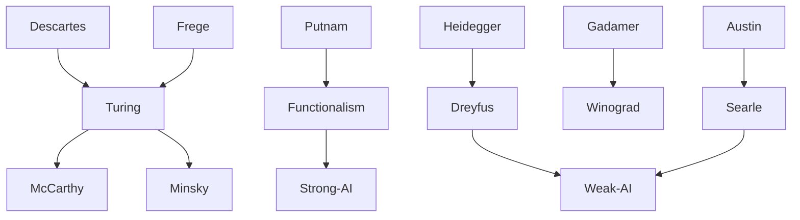

---
cssclasses:
  - Philosophy
  - Computer-Science
subclasses:
  - Philosophy-of-Mind
  - Philosophy-of-Cognitive-Science
  - 20th-Century-Philosophy
related:
  - "[[Philosophy of Mind]]"
  - "[[Cognitive Science]]"
  - "[[Functionalism]]"
  - "[[Phenomenology]]"
  - "[[Consciousness]]"
  - "[[Intentionality]]"
  - "[[Computationalism]]"
  - "[[Embodied Cognition]]"
  - "[[Heidegger]]"
  - "[[Speech Acts]]"
aliases:
  - artificial intelligence
  - turing test
  - chinese room
  - mind computer
  - strong ai
  - weak ai
  - machine intelligence
  - neural networks
  - computational mind
reference:
  - "[Abbagnano, N., & Fornero, G. (2012). La ricerca del pensiero. Vol. 3B. Dalla fenomenologia a Gadamer. Paravia.](https://archive.org/download/ssp-s06-e12/The%20search%20for%20thought%20-%20Unit%2014%20Chapter%202.pdf)"
tags:
  - Podcast
---

#### Podcast

<iframe src="https://archive.org/embed/ssp-s06-e12" width="100%" height="30" frameborder="0" webkitallowfullscreen="true" mozallowfullscreen="true" allowfullscreen></iframe>

---

#### Central Problem

The philosophical problem posed by Artificial Intelligence concerns the nature of mind, thought, and intelligence: Can machines truly think? What is the relationship between human intelligence and computational processes? The development of AI since the 1956 Dartmouth conference—which officially launched the discipline—has generated fundamental questions about whether the operations of electronic computers can genuinely reproduce or merely simulate human cognitive capacities.

The central tension lies between those who maintain that intelligence is essentially computational (and therefore reproducible in machines) and those who argue that human intelligence possesses irreducible features—intentionality, consciousness, embodiment, situatedness in the world, common sense understanding—that cannot be captured by formal symbol manipulation. The practical difficulties encountered by AI research (in robotics, speech recognition, natural language understanding, and especially in programming "common sense") have intensified philosophical scrutiny of its foundational assumptions.

The debate involves not only theoretical questions about the nature of mind but also ethical questions about what machines should or should not do, and potentially about the rights of future intelligent machines.

#### Main Thesis

The chapter presents the development of AI and the philosophical critiques that have prompted a shift from "strong AI" to "weak AI":

**Functionalism and the Mind-Computer Analogy:**
- [[Putnam]]'s functionalism holds that mental states are defined by their functional roles (input-output relations) rather than their material constitution. A mind could theoretically be "instantiated" by any physical substrate capable of generating the same functional relations—even "Swiss cheese."
- This leads to the mind-computer analogy: the mind relates to the brain as software relates to hardware. The mind is a program that can "run" on different physical substrates (biological neurons or electronic circuits).

**The Turing Test:**
- [[Turing]] proposed an operational criterion for machine intelligence: if an expert in blind conversation cannot reliably distinguish between a human and a machine, the machine can be said to "think."
- This behaviorist-operationalist approach defines intelligence by external performance rather than internal processes.

**Philosophical Critiques:**

*Searle's Chinese Room:*
- [[Searle]]'s thought experiment imagines someone following instructions to manipulate Chinese symbols without understanding their meaning. This demonstrates that syntactic manipulation (what computers do) does not constitute semantic understanding.
- Computers operate "as if" they understood, but lack consciousness and intentionality. Their apparent intelligence exists only in the minds of their programmers.

*Dreyfus's Critique:*
- [[Dreyfus]] argues that human intelligence is fundamentally different from computational processes: it is holistic (grasping parts within wholes, not building from atoms to totality) and situational (organized by interests, needs, and cultural context).
- Human intelligence presupposes a background of common-sense beliefs that cannot be formalized or explicitly programmed—leading to infinite regress.
- Only in completely formalizable domains (games, theorems) can AI succeed; in domains involving flexible, context-dependent understanding (natural language, practical wisdom), it fails.

*Winograd and Flores:*
- Drawing on [[Heidegger]] and [[Gadamer]], they argue that computers lack Dasein—concrete being-in-the-world with corporeality and emotivity—and therefore cannot possess the contextual pre-understanding that constitutes common sense.
- "Intelligence" applied to both natural and artificial systems expresses homonymy rather than genuine analogy.

**From Strong to Weak AI:**
- The difficulties of AI have prompted abandonment of the original ambition to create a "synthetic mind" that duplicates human cognition.
- The distinction between "simulation" (reproducing human cognitive powers) and "emulation" (creating effective intelligent tools without anthropomorphic pretensions) marks the shift to a more pragmatic, technologically-oriented approach.

#### Historical Context

Artificial Intelligence emerged as a distinct discipline at the 1956 Dartmouth conference organized by John McCarthy, Marvin Minsky, Nathaniel Rochester, and Claude Shannon. The field inherited the optimism of postwar cybernetics and information theory, along with the development of electronic computers.

The functionalist paradigm, with [[Putnam]] as a major theoretician, provided philosophical support for the strong AI program by arguing that mental states are substrate-independent functional states. This suggested that minds could in principle be realized in machines.

However, by the 1970s and 1980s, AI encountered persistent difficulties that fell short of initial expectations—particularly in robotics, speech recognition, natural language understanding, and the notorious problem of programming "common sense." These failures stimulated philosophical critique.

[[Dreyfus]]'s *What Computers Can't Do* (1972) offered the first systematic philosophical criticism of AI, drawing on phenomenological and hermeneutic traditions. [[Searle]]'s Chinese Room argument (1980) attacked the foundations of strong AI from within analytic philosophy. The emergence of connectionism (neural networks) represented an alternative paradigm that sought to model the brain rather than formal logic.

By the late twentieth century, the field largely shifted toward "weak AI"—the construction of useful intelligent tools rather than the reproduction of human intelligence—though ambiguity persists about ultimate goals.

#### Philosophical Lineage

#### Key Thinkers

| Thinker | Dates | Movement | Main Work | Core Concept |
|---------|-------|----------|-----------|--------------|
| [[Turing]] | 1912-1954 | [[Philosophy of Mind]] | *Computing Machinery and Intelligence* | Turing test, computability |
| [[Putnam]] | 1926-2016 | [[Analytic Philosophy]] | *Philosophical Papers* | Functionalism, multiple realizability |
| [[Searle]] | b. 1932 | [[Analytic Philosophy]] | *Minds, Brains and Programs* | Chinese Room, intentionality |
| [[Dreyfus]] | 1929-2017 | [[Phenomenology]] | *What Computers Can't Do* | Embodied intelligence, situatedness |
| [[Minsky]] | 1927-2016 | [[Cognitive Science]] | *Semantic Information Processing* | AI research, frames |

#### Key Concepts

| Concept | Definition | Related to |
|---------|------------|------------|
| Artificial Intelligence | The attempt to make machines do things that would require intelligence if done by humans | [[Minsky]], [[Cognitive Science]] |
| Functionalism | The view that mental states are defined by functional roles rather than material constitution | [[Putnam]], [[Philosophy of Mind]] |
| Mind-computer analogy | The thesis that mind relates to brain as software relates to hardware | [[Putnam]], [[Cognitive Science]] |
| Turing test | Operational criterion: a machine "thinks" if indistinguishable from humans in blind conversation | [[Turing]], [[Philosophy of Mind]] |
| Chinese Room | Thought experiment showing syntactic symbol manipulation does not constitute understanding | [[Searle]], [[Philosophy of Mind]] |
| Intentionality | The mind's capacity to be "about" or directed toward objects; lacking in computers | [[Searle]], [[Phenomenology]] |
| Strong AI | The thesis that computers can genuinely think and have minds | [[Philosophy of Mind]], [[Cognitive Science]] |
| Weak AI | The thesis that computers are useful tools for studying or emulating intelligence | [[Philosophy of Mind]], [[Cognitive Science]] |
| Connectionism | Research program modeling intelligence through neural networks rather than symbol manipulation | [[Cognitive Science]], [[Philosophy of Mind]] |
| Common sense | Background of pre-understandings and beliefs that cannot be formalized; AI's "black beast" | [[Dreyfus]], [[Phenomenology]] |

#### Authors Comparison

| Theme | [[Turing]] | [[Searle]] | [[Dreyfus]] |
|-------|------------|------------|-------------|
| Definition of intelligence | Behavioral, operational | Intentional, conscious | Embodied, situational |
| Can machines think? | Yes, if behaviorally indistinguishable | No, syntax ≠ semantics | No, intelligence requires Dasein |
| Criterion | External performance | Internal understanding | Contextual pre-understanding |
| View of mind | Computational | Biological, intentional | Phenomenological, holistic |
| AI assessment | Optimistic | Critical of strong AI | Critical, limited domains possible |
| Philosophical tradition | Logic, behaviorism | Analytic philosophy | Phenomenology, hermeneutics |

#### Influences & Connections

- **Predecessors:** [[Turing]] ← influenced by ← [[Frege]], [[Russell]], mathematical logic
- **Predecessors:** [[Dreyfus]] ← influenced by ← [[Heidegger]], [[Merleau-Ponty]], phenomenology
- **Predecessors:** [[Searle]] ← influenced by ← [[Austin]], speech act theory
- **Contemporaries:** [[Putnam]] ↔ debate with ↔ [[Searle]], [[Dreyfus]]
- **Followers:** [[Dreyfus]] → influenced → embodied cognition, situated AI
- **Followers:** [[Searle]] → influenced → critiques of computationalism
- **Opposing views:** [[Dreyfus]] ← criticized by ← AI researchers; [[Searle]] ← criticized by ← functionalists

#### Summary Formulas

- **[[Turing]]:** A machine can be said to think if its performance in conversation is indistinguishable from that of a human; intelligence is defined operationally by behavior.
- **[[Putnam]]:** Mental states are functional states that can be multiply realized; the mind relates to brain as software to hardware, making machine minds theoretically possible.
- **[[Searle]]:** Syntactic symbol manipulation (what computers do) does not constitute semantic understanding; computers lack intentionality and consciousness, so strong AI is impossible.
- **[[Dreyfus]]:** Human intelligence is holistic and situational, grounded in embodiment and common sense that cannot be formalized; AI succeeds only in limited, fully formalizable domains.

#### Timeline

| Year | Event |
|------|-------|
| 1936 | [[Turing]] develops concept of Turing machine |
| 1950 | [[Turing]] publishes "Computing Machinery and Intelligence" with the Turing test |
| 1956 | Dartmouth conference officially launches AI as a discipline |
| 1964 | [[Putnam]] publishes "Robots: Machines or Artificially Created Life?" |
| 1967 | [[Putnam]] develops functionalism in philosophy of mind |
| 1972 | [[Dreyfus]] publishes *What Computers Can't Do* |
| 1980 | [[Searle]] publishes "Minds, Brains and Programs" with Chinese Room argument |
| 1986 | Connectionism/neural networks gain prominence |
| 1987 | Winograd and Flores publish *Understanding Computers and Cognition* |

#### Notable Quotes

> "The question is not whether machines can think, but whether we can distinguish their performance from that of thinking beings." — [[Turing]]

> "No system that limits itself to formal manipulation of symbols, without being conscious of their meanings, can be considered identical to a thinking being." — [[Searle]]

> "Every intelligibility and every intelligent behavior must be traced back to the common sense of what we are, which necessarily, if we want to avoid infinite regress, is knowledge that cannot be made explicit." — [[Dreyfus]]

---
> [!warning]-
> This annotation was normalised using a large language model and may contain inaccuracies. These texts serve as preliminary study resources rather than exhaustive references.
