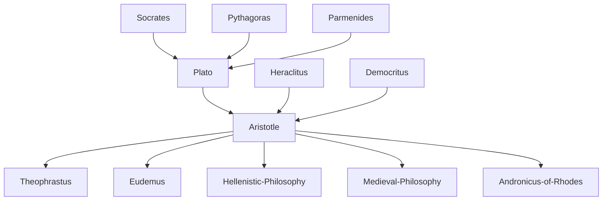

---
cssclasses:
  - Philosophy
subclasses:
  - Ancient-Greek-and-Roman-Philosophy
  - Metaphysics
  - Epistemology
aliases:
  - first philosophy
  - esoteric writings
  - exoteric writings
contributions:
  - Conceptual
authors:
  - "[[Aristotle]]"
  - "[[Plato]]"
  - "[[Alexander]]"
reference: "Abbagnano, N., & Fornero, G. (2012). La ricerca del pensiero. Vol. 1A. Dalle origini ad Aristotele. Paravia."
related:
  - "[[Platonism]]"
  - "[[Peripatetic School]]"
  - "[[Lyceum]]"
  - "[[Metaphysics]]"
  - "[[Theory of Forms]]"
  - "[[Alexander the Great]]"
  - "[[Hellenistic Philosophy]]"
  - "[[Medieval Philosophy]]"
  - "[[Organon]]"
  - "[[Nicomachean Ethics]]"
---

#### Central Problem

The chapter addresses the fundamental question of how [[Aristotle]]'s philosophy represents both a continuation and a departure from Platonic thought, and how the changed historical circumstances of fourth-century Greece influenced this philosophical transformation. At the core lies the problem of understanding the different conceptions of knowledge and reality that distinguish [[Aristotle]] from [[Plato]]: while [[Plato]] conceived philosophy as serving political ends and viewed the philosopher as ideally a ruler and legislator of the city, [[Aristotle]] fixed the goal of philosophy in the disinterested knowledge of reality and saw the philosopher as a sage or scientist-professor wholly dedicated to research and teaching.

Additionally, there is the philological problem of understanding the relationship between [[Aristotle]]'s two types of writings—the exoteric dialogues intended for the public (now mostly lost) and the esoteric or acroamatic treatises used for teaching (which form the corpus we possess today). This distinction is crucial for understanding the development of [[Aristotle]]'s thought, as the dialogues reveal a thinker who initially adhered to Platonic thought before gradually distancing himself from it.

#### Main Thesis

Aristotle's philosophy represents a fundamental shift from the Platonic worldview toward an encyclopedic conception of knowledge. Where [[Plato]] viewed the world through a vertical and hierarchical optic—distinguishing between "true" and "apparent" realities, between "superior" and "inferior" forms of knowledge—the mature [[Aristotle]] comes to view the world through a tendentially horizontal and unitary optic, considering all realities on a plane of equal ontological dignity and all sciences on a plane of equal gnoseological dignity.

For [[Aristotle]], reality, while unitary, divides into various "regions," each constituting the object of study for a group of sciences based on their own principles. Philosophy (understood as metaphysics) differs from other sciences only because it investigates being or reality in general, rather than particular aspects. Just as all dimensions of being presuppose being itself, so all sciences presuppose philosophy, which studies reality in general. Philosophy thus becomes the "first science"—the discipline that studies the common object of all sciences (being) and the common principles of all sciences (the principles of being).

This conception makes philosophy the unifying and organizing soul of the sciences, presenting a complete picture of all disciplines in their relations of coordination and subordination. [[Aristotle]]'s philosophy thus produces an "encyclopedia of knowledge" destined to direct and organize Western culture for many centuries, while preserving the autonomy of individual branches of knowledge.

#### Historical Context

Aristotle lived during a period of profound transformation in the Greek world. Although only a few years separated him from [[Plato]], the times had already changed dramatically. The crisis of the polis had become irreversible, and all attempts to contain it foundered against the pressure of Macedonian power, which in the second half of the fourth century BCE began the progressive subjugation of Greece and the erosion of polis freedom.

In this changed situation, the Greek citizen, no longer directly involved in government affairs and absorbed into a larger state organism controlled by others, lost that passion for politics that had also been the driving force of Platonism. From this emerged other interests, especially cognitive and ethical ones, that would constitute one of the characteristics of the Hellenistic age.

Aristotle's own life reflected these changes: born in Stagira in 384 BCE, he spent twenty years at [[Plato]]'s Academy, then left after [[Plato]]'s death in 347 BCE. He spent time at Assos under the protection of Hermias, was called to Pella in 342 BCE by Philip of Macedonia to educate the young [[Alexander]], and finally returned to Athens in 335-334 BCE to found the Lyceum. The death of [[Alexander]] in 323 BCE provoked an anti-Macedonian uprising that forced [[Aristotle]] to flee to Chalcis, where he died in 322 BCE.

#### Philosophical Lineage

#### Key Thinkers

| Thinker | Dates | Movement | Main Work | Core Concept |
|---------|-------|----------|-----------|--------------|
| [[Aristotle]] | 384-322 BCE | [[Peripateticism]] | *Metaphysics*, *Nicomachean Ethics*, *Physics* | Being qua being, Encyclopedia of sciences |
| [[Plato]] | 427-347 BCE | [[Platonism]] | *Republic*, *Timaeus* | Theory of Forms, Philosopher-king |
| [[Theophrastus]] | c. 371-287 BCE | [[Peripateticism]] | *Characters*, *On Plants* | Continuation of Aristotelian natural science |
| [[Eudemus]] | fl. 4th c. BCE | [[Peripateticism]] | *Eudemian Ethics* (published) | History of mathematics and astronomy |
| [[Andronicus of Rhodes]] | fl. 1st c. BCE | [[Peripateticism]] | Edition of [[Aristotle]]'s works | First systematic edition of Corpus Aristotelicum |

#### Key Concepts

| Concept | Definition | Related to |
|---------|------------|------------|
| Esoteric/Acroamatic writings | Works composed for teaching, serving as lecture notes; the corpus of Aristotelian treatises we possess | [[Aristotle]], [[Lyceum]] |
| Exoteric writings | Dialogues intended for the public, written in elegant literary form; now mostly lost | [[Aristotle]], [[Plato]] |
| First Philosophy | The science that studies being qua being and the first principles common to all sciences | [[Aristotle]], [[Metaphysics]] |
| Encyclopedia of knowledge | The systematic organization of all sciences according to their objects and principles | [[Aristotle]], [[Epistemology]] |
| Organon | The collection of [[Aristotle]]'s logical writings, conceived as the "instrument" of scientific research | [[Aristotle]], [[Logic]] |
| Horizontal conception of reality | The view that all regions of being possess equal ontological dignity | [[Aristotle]], [[Ontology]] |
| Disinterested knowledge | Knowledge pursued for its own sake, not for practical or political utility | [[Aristotle]], [[Contemplation]] |
| Protrepticus | [[Aristotle]]'s early exhortation to philosophy, still Platonic in orientation | [[Aristotle]], [[Platonism]] |

#### Authors Comparison

| Theme | [[Plato]] | [[Aristotle]] |
|-------|-----------|---------------|
| Purpose of philosophy | Political: philosopher as ruler and legislator | Cognitive: philosopher as sage and scientist |
| View of reality | Vertical and hierarchical: true vs. apparent | Horizontal and unitary: equal ontological dignity |
| Conception of knowledge | Superior (Ideas) vs. inferior (sensible) | Equal gnoseological dignity of all sciences |
| Relationship to poetry | Uses myths, recovers poetic wisdom | Rigorous rational speculation, break with poetry |
| Mathematical interest | Strong interest in mathematics | Limited propensity; greater interest in natural science |
| Philosophical system | Open, problematic, continually questioning | Tendency toward closed, systematic organization |
| Ideal philosopher | Philosopher-king engaged in politics | Scientist-professor dedicated to research and teaching |

#### Influences & Connections

- **Predecessors:** [[Aristotle]] ← influenced by ← [[Plato]], [[Socrates]], [[Heraclitus]], [[Democritus]]
- **Contemporaries:** [[Aristotle]] ↔ dialogue with ↔ [[Theophrastus]], [[Eudemus]], [[Speusippus]], [[Xenocrates]]
- **Followers:** [[Aristotle]] → influenced → [[Theophrastus]], [[Eudemus]], [[Andronicus of Rhodes]]
- **Followers:** [[Aristotle]] → influenced → [[Medieval Philosophy]], [[Islamic Philosophy]], [[Scholasticism]]
- **Opposing views:** [[Aristotle]] ← departed from ← [[Plato]] (critique of Forms)

#### Summary Formulas

- **[[Aristotle]]:** Philosophy is the disinterested knowledge of being qua being, serving as the first science that grounds and unifies the encyclopedia of all particular sciences.
- **[[Plato]]:** Philosophy aims at the political governance of the city through knowledge of the eternal Forms, with the philosopher ideally serving as ruler.
- **[[Aristotle]] (on autonomy of sciences):** Each science has its own proper object and principles; philosophy provides their common foundation without absorbing them into a hierarchical pyramid.

#### Timeline

| Year | Event |
|------|-------|
| 384 BCE | [[Aristotle]] born at Stagira in the Chalcidian peninsula |
| 367 BCE | [[Aristotle]] enters [[Plato]]'s Academy at age 17 |
| 347 BCE | Death of [[Plato]]; [[Aristotle]] leaves the Academy and goes to Assos |
| 344 BCE | [[Aristotle]] moves to Mytilene |
| 342 BCE | [[Aristotle]] called to Pella by Philip II to educate [[Alexander]] |
| 335-334 BCE | [[Aristotle]] returns to Athens and founds the Lyceum |
| 323 BCE | Death of [[Alexander]] the Great; anti-Macedonian uprising in Athens |
| 322 BCE | [[Aristotle]] dies at Chalcis in Euboea |
| 1st c. BCE | [[Andronicus of Rhodes]] publishes the acroamatic writings |

#### Notable Quotes

> "Friendship and truth are both dear, but it is a sacred duty to honor truth more."
> — [[Aristotle]]

> "Either one must philosophize or one must not: but to decide not to philosophize is still to philosophize: therefore in every case philosophizing is necessary."
> — [[Aristotle]]

> "One of the most important outcomes of Aristotelian philosophy is the construction of an encyclopedia of knowledge, destined to direct and organize Western culture for many centuries."
> — [[Viano]]

---
> [!NOTE]
> *This summary has been created to present the key points from the source text, which was automatically extracted using LLM. Please note that the summary may contain errors. It serves as an essential starting point for study and reference purposes.*
