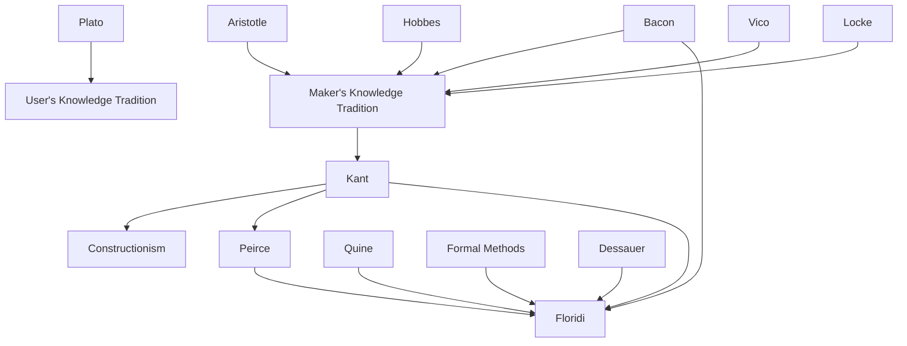

---
cssclasses:
  - Philosophy
  - Computer-Science
subclasses:
  - Epistemology
  - Philosophy-of-Science
  - Philosophy-of-Mind
related:
  - "[[Philosophy as Conceptual Design (1 of 9)]]"
  - "[[Constructionism as Non-naturalism (2 of 9)]]"
  - "[[Perception and Testimony as Data Providers (3 of 9)]]"
  - "[[Information Quality (4 of 9)]]"
  - "[[Informational Scepticism and the Logically Possible (5 of 9)]]"
  - "[[A Defence of Information Closure (6 of 9)]]"
  - "[[Logical Fallacies as Bayesian Informational Shortcuts (7 of 9)]]"
  - "[[Maker’s Knowledge, between A Priori and A Posteriori (8 of 9)]]"
  - "[[Logic of Design as a Conceptual Logic of Information (9 of 9)]]"
aliases:
  - makers knowledge
  - users knowledge
  - conceptual design
  - philosophy information
  - constructionist epistemology
  - levels abstraction
  - semantic artefacts
  - poietic knowledge
  - platonic dogma
  - verum factum
reference:
  - "Floridi, L. (2019). The logic of information: A theory of philosophy as conceptual design (First edition). Oxford University Press. (pp. 27-52)"
---

#### Central Problem

This text confronts a fundamental epistemological question: how do we truly know? Floridi identifies a deep tension in Western philosophy between two competing accounts of knowledge—the "user's knowledge" tradition stemming from Plato, which privileges passive reception and mimetic representation of pre-existing truths, versus the "maker's knowledge" tradition, which holds that genuine knowledge arises through active construction, production, and modelling of semantic artefacts.

The central problem is that Plato's epistemological framework—treating knowledge as passive contemplation of ideal Forms accessed through recollection—has dominated Western philosophy for twenty-five centuries despite being practically untenable and philosophically implausible. This "Platonic dogma" privileges theory over practice, thinking over doing, representations as copies over representations as models. The result is an epistemology divorced from actual epistemic practices: scientists run experiments, engineers design artefacts, children learn by doing, yet our epistemological theories treat knowers as passive receivers of information.

The challenge Floridi identifies is "radically moderate": neither succumbing to naive realism (Plato) nor collapsing into relativistic constructivism (postmodernism), but charting a middle course through "constructionism"—knowledge as inscription rather than description or prescription.

#### Main Thesis

Floridi's main thesis is that [[Plato]]'s user's knowledge tradition should be complemented, if not replaced, by a constructionist approach: "Epistemic agents know something when they are able to build (reproduce, simulate, model, construct etc.) that something and plug the obtained information in the correct network of relations that account for it."

This thesis has several components:

**Philosophy as Conceptual Design:** Philosophy, understood as the study of open questions, becomes primarily a form of conceptual design rather than conceptual analysis alone. Philosophers are makers of semantic artefacts—concepts, models, theories—not passive consumers of pre-existing truths.

**The Maker's Knowledge Principle:** One can only truly know what one makes. This inverts Plato's hierarchy: the maker of an artefact (or information) knows it better than the user. The dialectician who knows is "the person who knows how to ask and answer questions"—but as a maker, not a user.

**Constructionist Methodology:** Floridi outlines six principles: (1) only what is constructible can be known; (2) working hypotheses are investigated through models; (3) models must be controllable; (4) confirmation concerns the model, not the modelled system; (5) economy of conceptual resources; (6) isomorphism between simulation and simulated is only local, not global.

**Levels of Abstraction (LoA):** Knowledge is always relative to a chosen level of abstraction—a finite set of observables with well-defined values. This enables pluralism without relativism: different LoAs are assessable and comparable against purposes.

#### Historical Context

Floridi situates his argument within a long-running epistemological debate traceable to ancient Greece. [[Plato]]'s dialogues (Cratylus, Republic, Euthydemus) established the priority of user's over maker's knowledge, partly from cultural bias against artisans as mere "living tools" and partly from the philosophical agenda of attacking sophists and poets as dangerous imitators.

The maker's knowledge tradition emerged as a minority report within the Aristotelian-Scholastic tradition, finding champions in [[Bacon]]'s *Novum Organum* ("Vere scire, esse per causas scire"—to know truly is to know through causes), [[Hobbes]]'s account of demonstrable arts, and [[Vico]]'s *verum ipsum factum* principle. [[Kant]]'s transcendental epistemology represents a crucial transformation: we can only know phenomena we are epistemically responsible for constructing.

The scientific revolution intensified this tension: episteme and techne became bedfellows in every lab, yet epistemological orthodoxy remained Platonic. Contemporary information societies—where "the expert and intelligent handling of data and information is the primary value-adding occupation"—make the discrepancy between epistemic practice and epistemological theory increasingly untenable.

The text explicitly engages with computer science's formal methods tradition, adapting the concept of "levels of abstraction" for philosophical methodology. This represents philosophy learning from poietic disciplines.

#### Philosophical Lineage

#### Key Thinkers

| Thinker | Dates | Movement | Main Work | Core Concept |
|---------|-------|----------|-----------|--------------|
| [[Plato]] | 428–348 BCE | [[Ancient Philosophy]] | *Republic*, *Cratylus* | User's knowledge, mimesis |
| [[Bacon]] | 1561–1626 | [[Empiricism]] | *Novum Organum* | Vere scire per causas scire |
| [[Hobbes]] | 1588–1679 | [[Materialism]] | *Six Lessons* | Demonstrable vs indemonstrable arts |
| [[Vico]] | 1668–1744 | [[Historicism]] | *New Science* | Verum ipsum factum |
| [[Kant]] | 1724–1804 | [[Transcendental Idealism]] | *Critique of Pure Reason* | Conditions of possibility |
| [[Peirce]] | 1839–1914 | [[Pragmatism]] | *Collected Papers* | Pragmatic constructionism |

#### Key Concepts

| Concept | Definition | Related to |
|---------|------------|------------|
| User's Knowledge | Passive, mimetic reception of pre-existing information; the user knows an artefact better than its maker | [[Plato]], Platonic Dogma |
| Maker's Knowledge | Active, poietic construction; one knows what one builds, reproduces, simulates, or models | [[Bacon]], [[Vico]], [[Hobbes]] |
| Constructionism | Epistemological position that knowledge is acquired through creating semantic artefacts, not passive reception | [[Floridi]], Philosophy of Information |
| Level of Abstraction (LoA) | A finite set of observables with well-defined values that constitutes the conceptual interface for analysing a system | Formal Methods, [[Floridi]] |
| Semantic Artefact | Information as a constructed, human-made product; reality as we experience it | [[Floridi]], Conceptual Design |
| Minimalism | Erotetic principle: choose starting problems that rely minimally on other open problems | Descartes, Quine |
| Ontological Commitment | What a theory commits to exist through its choice of LoA (types) and models (tokens) | [[Quine]], [[Floridi]] |
| Poiesis vs Mimesis | Creating/making vs imitating/copying as epistemic modes | [[Aristotle]], [[Plato]] |

#### Authors Comparison

| Theme | [[Floridi]] | [[Plato]] |
|-------|-------------|-----------|
| Who knows best? | The maker of an artefact | The user of an artefact |
| Nature of knowledge | Poietic construction | Mimetic reception |
| Role of artisan | Epistemic authority | Inferior to user, near slave |
| Reality access | Through models at LoAs | Through recollection of Forms |
| Epistemology | Constructionist, Kantian | Realist, transcendent |
| Philosophy's method | Conceptual design | Dialectic contemplation |
| Knowledge-that | Conclusion of process | Foundational starting point |

#### Influences & Connections

- **Predecessors:** [[Floridi]] ← influenced by ← [[Kant]], [[Bacon]], [[Vico]], [[Hobbes]], [[Peirce]], [[Quine]]
- **Contemporaries:** [[Floridi]] ↔ dialogue with ↔ [[Dretske]], [[Hintikka]]
- **Opposing views:** [[Floridi]] ← criticizes ← [[Plato]] (user's knowledge), Postmodern Constructivism (relativism)
- **Methodological sources:** Computer Science Formal Methods → Levels of Abstraction → [[Floridi]]
- **Philosophical descendants:** Philosophy of Information → Conceptual Design methodology

#### Summary Formulas

- **[[Plato]]:** The user of an artefact knows it better than its maker; knowledge is passive reception of ideal Forms through mimetic representation and recollection.

- **[[Bacon]]:** "Vere scire, esse per causas scire"—to know truly is to know through causes; we as epistemic agents can only know what we make as Ur-makers.

- **[[Vico]]:** Verum ipsum factum—what is true and what is made are interchangeable; knowledge requires the ability to produce and reproduce the known.

- **[[Floridi]]:** Philosophy is conceptual design; knowledge is construction of semantic artefacts at explicit levels of abstraction; constructionism steers between naive realism and relativistic constructivism.

#### Timeline

| Year | Event |
|------|-------|
| c. 380 BCE | [[Plato]] establishes user's knowledge priority in *Republic* and *Cratylus* |
| 1620 | [[Bacon]] publishes *Novum Organum*, articulating maker's knowledge |
| 1656 | [[Hobbes]] distinguishes demonstrable from indemonstrable arts |
| 1725 | [[Vico]] formulates verum ipsum factum in *New Science* |
| 1781 | [[Kant]] publishes *Critique of Pure Reason*, transcendental constructionism |
| 1900 | [[Pearson]] publishes *The Grammar of Science*, statistical epistemology |
| 2008 | [[Floridi]] formalizes method of levels of abstraction |
| 2011 | [[Floridi]] develops constructionist philosophy of information |

#### Notable Quotes

> "Epistemic agents know something when they are able to build (reproduce, simulate, model, construct etc.) that something and plug the obtained information in the correct network of relations that account for it." — [[Floridi]]

> "Knowledge is not about getting the message from the world; it is first and foremost about negotiating the right sort of communication with it." — [[Floridi]]

> "Reality as we experience it is a semantic artefact. Any talk of things in themselves is just metaphysics." — [[Floridi]]

---
> [!warning]-
> This annotation was normalised using a large language model and may contain inaccuracies. These texts serve as preliminary study resources rather than exhaustive references.
