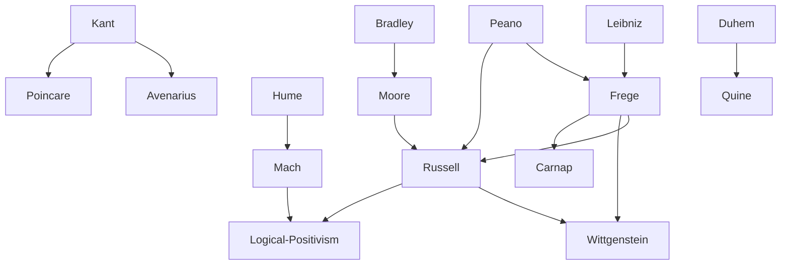

---
cssclasses:
  - Philosophy
  - Mathematics
subclasses:
  - Philosophy-of-Science
  - Epistemology
  - Analytic-Philosophy
related:
  - "[[Logical Positivism]]"
  - "[[Vienna Circle]]"
  - "[[Philosophy of Mathematics]]"
  - "[[Philosophy of Language]]"
  - "[[Sense and Reference]]"
  - "[[Theory of Descriptions]]"
  - "[[Non-Euclidean Geometry]]"
  - "[[Principia Mathematica]]"
  - "[[Common Sense Philosophy]]"
  - "[[Emotivism]]"
aliases:
  - sense reference
  - common sense
  - analytic philosophy
  - denotation theory
  - knowledge acquaintance
  - scientific method
  - logical atomism
reference:
  - "[Abbagnano, N., & Fornero, G. (2012). La ricerca del pensiero. Vol. 3B. Dalla fenomenologia a Gadamer. Paravia.](https://archive.org/download/ssp-s06-e07/The%20search%20for%20thought%20-%20Unit%2012%20Chapter%202.pdf)"
tags:
  - Podcast
---

#### Podcast

<iframe src="https://archive.org/embed/ssp-s06-e07" width="100%" height="30" frameborder="0" webkitallowfullscreen="true" mozallowfullscreen="true" allowfullscreen></iframe>

---

#### Central Problem

The chapter addresses the fundamental epistemological question: what is the nature of scientific knowledge and how does it relate to experience, language, and logic? At the turn of the twentieth century, philosophers confronted the inadequacy of nineteenth-century positivism's naive realism and its claim that science could penetrate the ultimate structure of reality.

Multiple interconnected problems emerge: How should we understand the relationship between sensations, concepts, and the external world? What is the logical status of scientific laws and mathematical axioms — are they empirical discoveries, a priori truths, or conventions? How can language adequately express thought, and what determines the meaning and reference of linguistic expressions? How do we move from private, immediate experience to shared scientific and common-sense knowledge?

These questions require reconceiving the foundations of science, mathematics, and logic, while also clarifying the nature of philosophical analysis itself and its relationship to ordinary language and common-sense beliefs.

#### Main Thesis

The chapter presents several interconnected positions that together constitute the foundations of modern epistemology and analytic philosophy:

**Empiriocriticism** ([[Avenarius]], [[Mach]]): Knowledge is a progressive biological adaptation to facts of experience. [[Mach]] dissolves the distinction between physical and psychological, reducing both to "elements" (sensations). Facts are ensembles of sensations; concepts are economical reactions to sensible activity; scientific laws are instruments of prediction, not descriptions of ultimate reality. This marks the abandonment of positivism's naive realism.

**Conventionalism** ([[Poincaré]], [[Duhem]]): Geometric axioms are neither synthetic a priori judgments nor experimental facts, but conventions — our choice among possible conventions is guided by experience but remains free. However, [[Poincaré]] refuses to extend conventionalism to all science: scientific laws have objective value derived from their reference to a reality common to all thinking beings. [[Duhem]] develops **holism** (the "D-thesis"): scientific propositions cannot be verified individually but only as interconnected wholes.

**Logicism and Semantic Theory** ([[Frege]]): Logic can be formalized as a calculus through **ideography** — an artificial language eliminating the ambiguities of ordinary language. Every expression has both **Bedeutung** (reference/denotation — the object designated) and **Sinn** (sense/meaning — the mode of presentation). Mathematics can be reduced to logic. [[Russell]]'s paradox later revealed problems in Frege's theory of classes.

**Common Sense Realism and Analysis** ([[Moore]]): Philosophy's task is the analysis of concepts through careful study of language and meaning. Against idealism, [[Moore]] defends the common-sense belief in an external world independent of perception, distinguishing between the content of perception (internally related to the act) and its object (externally related, existing independently).

**Logical Atomism and Theory of Knowledge** ([[Russell]]): Language consists of propositions; symbols signify constituents of facts. The **theory of descriptions** shows how we can meaningfully speak of non-existent objects. Knowledge divides into **knowledge by acquaintance** (immediate awareness of sense-data, universals, and possibly the self) and **knowledge by description** (inferential knowledge of objects satisfying certain descriptions). Ethical judgments express desires, not facts — though moral desires claim universality.

#### Historical Context

The late nineteenth and early twentieth centuries witnessed a profound crisis in the foundations of mathematics, physics, and philosophy. The discovery of non-Euclidean geometries challenged [[Kant]]'s claim that Euclidean geometry expressed synthetic a priori truths about space. The development of set theory by [[Cantor]] raised paradoxes that threatened the consistency of mathematics itself.

In physics, the classical Newtonian framework was being questioned, preparing the ground for [[Einstein]]'s relativity and quantum mechanics. [[Mach]]'s critique of Newtonian absolute space and time directly influenced [[Einstein]]. The positivist confidence that science would progressively reveal the ultimate structure of reality gave way to more modest and critical conceptions.

[[Frege]], working in relative isolation at Jena, created modern mathematical logic with his *Begriffsschrift* (1879), though his work was initially ignored by leading mathematicians like [[Cantor]], Dedekind, and [[Hilbert]]. [[Russell]]'s discovery of the paradox bearing his name (1902) devastated [[Frege]]'s logicist program but stimulated new developments in logic and set theory.

In Britain, [[Moore]] and [[Russell]] rebelled against the dominant neo-Hegelian idealism of [[Bradley]], McTaggart, and Green, founding what would become analytic philosophy. [[Russell]]'s pacifism during World War I cost him his Cambridge position and led to imprisonment; his unconventional ethical views later caused scandal in America.

#### Philosophical Lineage

#### Key Thinkers

| Thinker | Dates | Movement | Main Work | Core Concept |
|---------|-------|----------|-----------|--------------|
| [[Avenarius]] | 1843-1896 | [[Empiriocriticism]] | *Critique of Pure Experience* | Pure experience |
| [[Mach]] | 1838-1916 | [[Empiriocriticism]] | *The Analysis of Sensations* | Elements/sensations |
| [[Poincaré]] | 1854-1912 | [[Conventionalism]] | *Science and Hypothesis* | Geometric conventions |
| [[Duhem]] | 1861-1916 | [[Conventionalism]] | *The Aim and Structure of Physical Theory* | Holism |
| [[Frege]] | 1848-1925 | [[Analytic Philosophy]] | *Begriffsschrift* | Sense and reference |
| [[Moore]] | 1873-1958 | [[Analytic Philosophy]] | *Principia Ethica* | Common sense, analysis |
| [[Russell]] | 1872-1970 | [[Analytic Philosophy]] | *Principia Mathematica* | Logical atomism |

#### Key Concepts

| Concept | Definition | Related to |
|---------|------------|------------|
| Empiriocriticism | Critique of mechanistic physics and its claim to know ultimate reality; science has only instrumental value for experience | [[Mach]], [[Avenarius]] |
| Conventionalism | Axioms of deductive systems are decided by postulation, not intrinsic evidence; applies especially to geometry | [[Poincaré]], [[Duhem]] |
| Holism | Scientific propositions cannot be verified individually but only as interconnected systems; falsification applies to whole theories | [[Duhem]], [[Quine]] |
| Ideography | Formalized language of pure thought eliminating ambiguities; reveals logical structure of reasoning as calculus | [[Frege]], [[Logic]] |
| Sense (Sinn) | The mode in which an object is presented or given to us; determines how we think of the reference | [[Frege]], [[Semantics]] |
| Reference (Bedeutung) | The object designated by a linguistic expression; what the expression denotes | [[Frege]], [[Semantics]] |
| Analysis | Clarification of concepts through study of language, meanings, and uses of terms | [[Moore]], [[Analytic Philosophy]] |
| Knowledge by acquaintance | Immediate awareness without inference; applies to sense-data, universals, and possibly the self | [[Russell]], [[Epistemology]] |
| Knowledge by description | Knowledge of objects as the unique satisfiers of certain descriptions, obtained through inference | [[Russell]], [[Epistemology]] |
| Logicism | Program to reduce all mathematics to logic; all mathematical truths derivable from logical axioms | [[Frege]], [[Russell]] |
| Theory of descriptions | Analysis showing how phrases like "the present King of France" have meaning without denoting existing objects | [[Russell]], [[Analytic Philosophy]] |

#### Authors Comparison

| Theme | [[Mach]] | [[Frege]] | [[Moore]] | [[Russell]] |
|-------|----------|-----------|-----------|-------------|
| Starting point | Sensations/elements | Logic and language | Common sense | Experience and logic |
| Nature of science | Economy of thought, prediction | Rigorous formalization | — | Logical construction |
| Metaphysics | Anti-metaphysical | Platonism about meanings | Realism | Logical atomism |
| Mathematics | Empirical origin | Reducible to logic | — | Reducible to logic |
| Ethics | — | — | Intuitionistic, non-natural good | Emotivist, desires |
| Method | Analysis of sensations | Formal analysis | Conceptual analysis | Logical analysis |
| Legacy | Influenced [[Einstein]], positivism | Founded modern logic | Founded analytic philosophy | Founded analytic philosophy |

#### Influences & Connections

- **Predecessors:** [[Mach]] ← influenced by ← [[Hume]], biological evolutionism
- **Predecessors:** [[Frege]] ← influenced by ← [[Leibniz]] (universal language), [[Peano]]
- **Predecessors:** [[Russell]] ← influenced by ← [[Peano]], [[Frege]], [[Moore]]
- **Contemporaries:** [[Russell]] ↔ collaboration with ↔ [[Whitehead]] (*Principia Mathematica*)
- **Contemporaries:** [[Moore]] ↔ dialogue with ↔ [[Russell]] (against idealism)
- **Followers:** [[Frege]] → influenced → [[Russell]], [[Wittgenstein]], [[Carnap]]
- **Followers:** [[Mach]] → influenced → [[Einstein]], [[Vienna Circle]]
- **Followers:** [[Duhem]] → influenced → [[Quine]] (holism)
- **Opposing views:** [[Moore]] ← criticized ← [[Bradley]], British Idealists
- **Opposing views:** [[Russell]] ← criticized by ← neo-Hegelians, later [[Wittgenstein]]

#### Summary Formulas

- **[[Mach]]:** Facts are ensembles of sensations; concepts are economical reactions; scientific laws are instruments of prediction, not descriptions of ultimate reality.
- **[[Poincaré]]:** Geometric axioms are conventions guided by experience; scientific laws have objective value through their reference to shared reality.
- **[[Duhem]]:** Physical theories are systems of mathematical propositions for representing experimental laws; verification applies only to whole theoretical systems (holism).
- **[[Frege]]:** Every expression has sense (mode of presentation) and reference (object designated); logic is a calculus expressible through ideography; mathematics reduces to logic.
- **[[Moore]]:** Philosophy analyzes concepts through language; common sense correctly affirms the existence of an external world independent of perception; the good is indefinable and known by intuition.
- **[[Russell]]:** Knowledge divides into acquaintance (immediate) and description (inferential); language ideally mirrors the structure of facts; ethical judgments express universal desires, not objective truths.

#### Timeline

| Year | Event |
|------|-------|
| 1879 | [[Frege]] publishes *Begriffsschrift*, founding modern logic |
| 1883 | [[Mach]] publishes *The Mechanics in Its Historical-Critical Development* |
| 1884 | [[Frege]] publishes *The Foundations of Arithmetic* |
| 1888-1890 | [[Avenarius]] publishes *Critique of Pure Experience* |
| 1892 | [[Frege]] publishes "Sense and Reference" |
| 1900 | [[Mach]] publishes *The Analysis of Sensations* (expanded edition) |
| 1902 | [[Poincaré]] publishes *Science and Hypothesis*; [[Russell]] discovers paradox in Frege's system |
| 1903 | [[Moore]] publishes *Principia Ethica*; [[Russell]] publishes *Principles of Mathematics* |
| 1905 | [[Russell]] publishes "On Denoting" |
| 1906 | [[Duhem]] publishes *The Aim and Structure of Physical Theory* |
| 1910-1913 | [[Russell]] and [[Whitehead]] publish *Principia Mathematica* |
| 1912 | [[Russell]] publishes *The Problems of Philosophy* |
| 1918 | [[Russell]] develops logical atomism |
| 1925 | [[Moore]] publishes "A Defence of Common Sense" |
| 1948 | [[Russell]] publishes *Human Knowledge: Its Scope and Limits* |
| 1950 | [[Russell]] receives Nobel Prize for Literature |

#### Notable Quotes

> "Geometric axioms are neither synthetic a priori judgments nor experimental facts. They are conventions." — [[Poincaré]]

> "We shall say that we have acquaintance with anything of which we are directly aware, without the intermediary of any process of inference or any knowledge of truths." — [[Russell]]

> "The realization and interpretation of any physics experiment implies adherence to a whole set of theoretical propositions." — [[Duhem]]

---
> [!warning]-
> This annotation was normalised using a large language model and may contain inaccuracies. These texts serve as preliminary study resources rather than exhaustive references.
