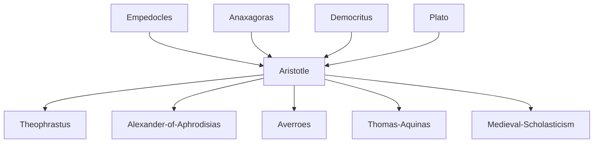

---
cssclasses:
  - Philosophy
subclasses:
  - Philosophy-of-Science
  - Philosophy-of-Mind
  - Ancient-Greek-and-Roman-Philosophy
related:
  - "[[Physics]]"
  - "[[Natural Philosophy]]"
  - "[[Teleology]]"
  - "[[Hylomorphism]]"
  - "[[Soul]]"
  - "[[Active Intellect]]"
  - "[[Four Elements]]"
  - "[[Natural Places]]"
  - "[[Geocentrism]]"
  - "[[Atomism]]"
  - "[[Mechanism]]"
  - "[[Epistemology]]"
aliases:
  - aristotelian physics
  - natural philosophy
  - natural places
  - sense perception
reference:
  - "[Abbagnano, N., & Fornero, G. (2012). La ricerca del pensiero. Vol. 1A. Dalle origini ad Aristotele. Paravia.](https://archive.org/download/ssp-s01-e12/The%20search%20for%20thought%20-%20Unit%204%20Chapter%203.pdf)"
tags:
  - Podcast
---

#### Podcast

<iframe src="https://archive.org/embed/ssp-s01-e12" width="100%" height="30" frameborder="0" webkitallowfullscreen="true" mozallowfullscreen="true" allowfullscreen></iframe>

---

#### Central Problem

This chapter addresses two interconnected questions: What is the nature of the physical world and how does it move? And what is the soul (psyche) and how does it know? [[Aristotle]] must explain motion without recourse to [[Democritus]]'s atomistic mechanism or [[Plato]]'s transcendent causes. He must account for the regularity and apparent purposiveness of nature while keeping explanatory principles immanent to natural things themselves. For psychology, he must explain how an immaterial soul relates to the body it animates, and how knowledge—especially intellectual knowledge of universals—arises from sense experience of particulars.

The physics raises the question: If every movement requires a mover, what prevents an infinite regress? How do we explain the different movements of terrestrial and celestial bodies? The psychology asks: How can the soul be both the form of the body (and thus inseparable from it) and yet possess an intellective function that transcends material conditions? The famous problem of the "active intellect"—whether it is individual or cosmic, mortal or immortal—will generate centuries of debate.

#### Main Thesis

**Physics as the Science of Motion:** Physics studies substances in motion—the second theoretical science after metaphysics. [[Aristotle]] classifies four types of movement: substantial (generation/corruption), qualitative (alteration), quantitative (increase/decrease), and local (locomotion). Local motion is fundamental, as all other changes presuppose spatial movement of elements.

**Natural Places:** Each of the four elements (earth, water, air, fire) has a "natural place" determined by its weight. Earth, heaviest, occupies the center; then water, air, and fire in ascending spheres. When displaced, elements naturally return to their proper places. This explains why stones fall and flames rise. The celestial realm, composed of ether (the fifth element), moves only in perfect circles and is therefore eternal and incorruptible.

**Teleological Nature:** Nature acts always for an end (telos), not by chance or blind necessity. The regularity of natural processes, the adaptation of animal organs to functions, and the developmental patterns of living things all point to intrinsic finality. Unlike Anaxagoras's external nous or [[Plato]]'s Demiurge, [[Aristotle]]'s final causes are immanent to substances themselves. The form of a thing is its final cause—the oak is the final cause of the acorn.

**Finite, Perfect, Eternal Universe:** The cosmos is finite (infinite means incomplete/imperfect), unique, spherical, and eternal—without beginning or end. There is no void within or beyond the cosmos. Space is always "place-of-something," the boundary of containing bodies. Time is "the measure of motion according to before and after" and requires a soul to enumerate it, though the succession itself is objective.

**The Soul as Form of the Body:** Psychology is part of physics because it studies embodied form. The soul is defined as "the first entelechy of a natural body having life potentially"—the actualization of organic capacities. Against materialists, soul is formal principle; against Pythagorean-Orphic dualism, soul cannot exist separately from body (with one exception). Three functions: vegetative (nutrition, reproduction—plants), sensitive (perception, movement—animals), intellective (thought—humans). Higher functions include lower ones.

**Theory of Knowledge:** The five external senses provide specific sensations; the "common sense" unifies them and provides awareness of sensing. Imagination produces, retains, and combines images independently of objects, generating "general images" that are sensory precursors to concepts. The intellect abstracts universal forms from sensory data—knowledge derives from experience (anti-innatism/empiricism).

**Active and Passive Intellect:** Since both the intelligible (in things) and the intellect (in the soul) are initially potential, something must actualize them. The passive/potential intellect is like a blank tablet receiving forms. The active/actual intellect is "separate, unmixed, impassible"—it acts on the passive intellect as light acts on colors, making potential knowledge actual. Only the active intellect is immortal and eternal.

#### Historical Context

Aristotle's physics represents both a synthesis of earlier Greek natural philosophy and a decisive rejection of atomistic mechanism. The debate between teleological and mechanistic explanations of nature will continue through the Scientific Revolution, when Democritean-style mechanism finally triumphs. [[Aristotle]]'s physics, integrated with Ptolemaic astronomy, will dominate Western science until [[Copernicus]], [[Galileo]], and [[Newton]].

The theory of natural places reflects common-sense observation (heavy things fall, flames rise) but prevents the concept of inertia and empty space necessary for modern physics. The distinction between celestial and terrestrial physics—different substances, different laws—will be overthrown only in the 17th century.

The psychology addresses the soul-body problem that [[Plato]]'s dualism left unresolved. [[Aristotle]]'s hylomorphic solution—soul as form of body—influences medieval philosophy profoundly. The ambiguous status of the active intellect generates the great medieval debate: Is it individual (Aquinas) or a single cosmic intellect shared by all humans (Averroes)?

#### Philosophical Lineage

#### Key Thinkers

| Thinker | Dates | Movement | Main Work | Core Concept |
|---------|-------|----------|-----------|--------------|
| [[Aristotle]] | 384-322 BCE | [[Peripatetic School]] | *Physics*, *On the Soul* | Teleology, hylomorphism, active intellect |
| [[Democritus]] | 460-370 BCE | [[Atomism]] | Fragments | Mechanism, atoms in void, inertia |
| [[Plato]] | 428-348 BCE | [[Platonism]] | *Timaeus* | Demiurge, world-soul, dualism |
| [[Anaxagoras]] | 500-428 BCE | [[Pluralism]] | *On Nature* | Nous as external ordering principle |
| [[Empedocles]] | 490-430 BCE | [[Pluralism]] | *On Nature* | Four elements, Love and Strife |

#### Key Concepts

| Concept | Definition | Related to |
|---------|------------|------------|
| Natural place | The location to which each element naturally tends based on its weight; displacement causes natural motion to return | [[Aristotle]], [[Physics]] |
| Teleology/Finalism | The doctrine that nature acts for ends; the form of a thing is its final cause | [[Aristotle]], [[Final Cause]] |
| Ether | The fifth element composing celestial bodies; moves only in eternal circular motion; incorruptible | [[Aristotle]], [[Cosmology]] |
| Entelechy | The actualization or full realization of potential; the soul is entelechy of the body | [[Aristotle]], [[Actuality]] |
| Soul (psyche) | The first entelechy of a natural organic body; form that makes body alive | [[Aristotle]], [[Hylomorphism]] |
| Vegetative soul | The soul function governing nutrition and reproduction; present in all living things | [[Aristotle]], [[Biology]] |
| Sensitive soul | The soul function governing perception and locomotion; present in animals and humans | [[Aristotle]], [[Perception]] |
| Common sense | The unified sensory awareness that perceives qualities common to multiple senses and is aware of sensing | [[Aristotle]], [[Epistemology]] |
| Imagination (phantasia) | Faculty producing, retaining, and combining images; creates general images as precursors to concepts | [[Aristotle]], [[Knowledge]] |
| Active intellect | The "separate, unmixed, impassible" intellect that actualizes potential knowledge; immortal and eternal | [[Aristotle]], [[Nous]] |

#### Authors Comparison

| Theme | [[Aristotle]] | [[Democritus]] | [[Plato]] |
|-------|---------------|----------------|-----------|
| Cause of motion | Natural places, intrinsic teleology | Atoms moving in void, mechanical necessity | World-soul, Demiurge |
| Void | Impossible; space is always place-of-something | Necessary for atomic motion | Receptacle (chora) |
| Universe | Finite, unique, eternal, geocentric | Infinite, multiple worlds, eternal | Created, unique, finite |
| Celestial/terrestrial | Different substances (ether vs four elements) | Same atoms everywhere | Mathematical order |
| Soul-body relation | Soul is form of body (hylomorphism) | Soul is fine atoms | Soul imprisoned in body (dualism) |
| Knowledge | Abstraction from sense experience | Convention vs reality | Recollection of Forms |
| Finality in nature | Intrinsic, immanent to substances | None; mechanical necessity | External (Demiurge) |

#### Influences & Connections

- **Predecessors:** [[Aristotle]] ← influenced by ← [[Empedocles]] (four elements), [[Anaxagoras]] (nous), [[Plato]] (Forms, Timaeus)
- **Contemporaries:** [[Aristotle]] ↔ dialogue with ↔ [[Speusippus]], [[Xenocrates]], [[Eudoxus]]
- **Followers:** [[Aristotle]] → influenced → [[Theophrastus]], [[Ptolemy]], [[Medieval Scholasticism]], [[Aquinas]]
- **Opposing views:** [[Aristotle]] ← opposed to ← [[Democritus]] (mechanism, void, atoms), [[Epicureans]]

#### Summary Formulas

- **[[Aristotle]] on nature:** Nature acts always for an end immanent to substances; each element tends toward its natural place; the cosmos is finite, unique, and eternal, with incorruptible celestial spheres and corruptible terrestrial elements.
- **[[Aristotle]] on the soul:** The soul is the first entelechy of a natural organic body—the form that actualizes life; vegetative, sensitive, and intellective functions form a hierarchy where higher includes lower.
- **[[Aristotle]] on knowledge:** Knowledge arises from sense experience through imagination's general images and intellect's abstraction of universals; the active intellect—separate, unmixed, immortal—actualizes potential knowledge as light actualizes colors.
- **[[Democritus]] vs [[Aristotle]]:** Where Democritus sees atoms in void moving by mechanical necessity, [[Aristotle]] sees formed substances in continuous space acting for intrinsic ends—a difference that will separate ancient from modern physics.

#### Timeline

| Year | Event |
|------|-------|
| 460 BCE | [[Democritus]] born; develops atomistic mechanism |
| 428 BCE | [[Plato]] born; will develop dualistic psychology |
| 384 BCE | [[Aristotle]] born in Stagira |
| 367 BCE | [[Aristotle]] enters [[Plato]]'s Academy |
| 335 BCE | [[Aristotle]] founds the Lyceum; lectures on physics and psychology |
| 322 BCE | [[Aristotle]] dies; Theophrastus continues Peripatetic physics |
| 13th c. CE | [[Aquinas]] interprets active intellect as individual |
| 15th c. CE | [[Nicholas of Cusa]] challenges celestial/terrestrial distinction |
| 17th c. CE | [[Galileo]] and [[Newton]] overthrow Aristotelian physics |

#### Notable Quotes

> "Everything that is by nature exists for an end."
> — [[Aristotle]]

> "The soul is the first entelechy of a natural body having life potentially."
> — [[Aristotle]]

> "This intellect is separate, unmixed, impassible, and in its essence actuality... and this alone is immortal and eternal."
> — [[Aristotle]]

---
> [!warning]-
> This annotation was normalised using a large language model and may contain inaccuracies. These texts serve as preliminary study resources rather than exhaustive references.
