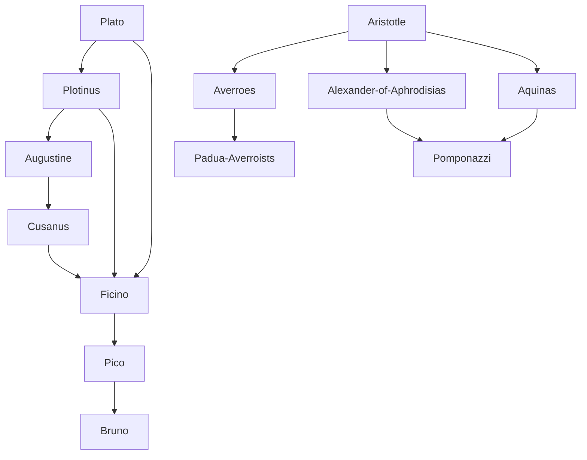

---
cssclasses:
  - Philosophy
subclasses:
  - Medieval-and-Renaissance-Philosophy
  - Metaphysics
  - Epistemology
related:
  - "[[Neoplatonism]]"
  - "[[Florentine Academy]]"
  - "[[University of Padua]]"
  - "[[Hermeticism]]"
  - "[[Learned Ignorance]]"
  - "[[Soul]]"
  - "[[Immortality]]"
  - "[[Faith and Reason]]"
  - "[[Double Truth]]"
  - "[[Human Dignity]]"
aliases:
  - platonism renaissance
  - aristotelianism renaissance
  - learned ignorance
  - coincidence opposites
  - soul immortality
  - double truth
  - copula mundi
  - platonic academy
  - padua school
  - dignity man
reference:
  - "[Abbagnano, N., & Fornero, G. (2012). La ricerca del pensiero. Vol. 2A. Dall'Umanesimo all'empirismo. Paravia.](https://archive.org/download/ssp-s03-e02/The%20search%20for%20thought%20-%20Unit%201%20Chapter%202.pdf)"
tags:
  - Podcast
---

#### Podcast

<iframe src="https://archive.org/embed/ssp-s03-e02" width="100%" height="30" frameborder="0" webkitallowfullscreen="true" mozallowfullscreen="true" allowfullscreen></iframe>

---

#### Central Problem

The Renaissance philosophical scene was dominated by a fundamental dispute between two rival traditions: Platonism and Aristotelianism. Each represented not merely different interpretations of ancient texts, but fundamentally opposed cultural orientations and visions of human knowledge, nature, and salvation.

The central questions at stake included: What is the proper relationship between faith and reason? Can human knowledge attain absolute truth, or must it remain forever limited? What is the nature of the soul, and can its immortality be demonstrated through rational argument? How should philosophy relate to religious renewal? Is the natural world the proper object of philosophical inquiry, or should philosophy concern itself primarily with transcendent realities?

These questions were not merely academic: they reflected the broader Renaissance tension between religious renewal (sought by Platonists through mystical union with the divine) and rational-naturalistic inquiry (pursued by Aristotelians through investigation of the natural world). The dispute also raised crucial questions about intellectual freedom: could philosophers reach conclusions that contradicted Church teaching, and if so, what was the proper relationship between philosophical and theological truth?

#### Main Thesis

**Renaissance Platonism**, centered at the Florentine Academy founded by [[Ficino]] and supported by Cosimo de' Medici, sought to renew religious and philosophical life through a return to [[Plato]] — understood not in his authentic form but through Neoplatonic and Hermetic lenses as the synthesis of all ancient religious wisdom. The Platonists held that [[Plato]]'s doctrine derived from Moses through an unbroken tradition, representing the most ancient religious wisdom of humanity.

**Key Platonic Doctrines:**
- [[Cusanus]]'s "learned ignorance" (docta ignorantia): human knowledge can never attain the infinite truth of God; the highest wisdom is awareness of our limitations
- God as coincidentia oppositorum (coincidence of opposites): unity of all contradictory determinations
- The soul as "copula mundi" (bond of the world): the mediating essence connecting body and God through love
- [[Pico]]'s synthesis of all wisdom traditions and defense of human dignity and freedom

**Renaissance Aristotelianism**, centered at the University of Padua, pursued a different agenda: natural philosophy and rational inquiry into the physical world. This movement split into two main currents:
- **Averroists**: maintained a single separate immortal intellect, while individual souls are mortal
- **Alexandrists** (following [[Alexander]] of Aphrodisias): denied any immortal intellect, holding that nothing survives bodily death

**[[Pomponazzi]]'s Position:** The world has a necessary rational order; so-called miracles are natural phenomena explicable through celestial influences. The immortality of the soul cannot be demonstrated rationally — it can only be accepted on faith. Yet this does not destroy morality, since virtue is its own reward.

Both traditions shared the "double truth" doctrine: what philosophy demonstrates may differ from what faith teaches, allowing philosophers to pursue rational inquiry while nominally accepting Church dogma.

#### Historical Context

The rediscovery of [[Plato]] was facilitated by crucial historical events: the Council of Florence (1438-1445), which brought Greek scholars to Italy for discussions of Church reunification, and the fall of Constantinople (1453), which prompted the emigration of Byzantine intellectuals westward. Where the Middle Ages had known only fragments of [[Plato]] (Meno, Phaedo, Timaeus), the Renaissance now possessed the complete Dialogues and could read them in the original Greek.

[[Ficino]] translated all of [[Plato]]'s dialogues into Latin, along with [[Plotinus]]'s Enneads and the Hermetic corpus — texts attributed to Hermes Trismegistus, believed to be an ancient Egyptian prophet. The Platonic Academy in Florence became the center of this religious-mystical interpretation of Platonism.

Meanwhile, Aristotelianism continued its medieval tradition at universities, especially Padua, where scholars had studied the Stagirite since the 13th century using Averroes's commentaries. The humanist demand to discover the "true" [[Aristotle]] led to new philological translations based on Greek commentators like [[Alexander]] of Aphrodisias and Simplicius.

The dispute between Platonists and Aristotelians began when the Byzantine scholar Gemistus Pletho wrote "Differences between the Philosophies of [[Plato]] and [[Aristotle]]" (c. 1439), provoking responses from George of Trebizond (defending [[Aristotle]]) and Cardinal Bessarion (seeking reconciliation).

#### Philosophical Lineage

#### Key Thinkers

| Thinker | Dates | Movement | Main Work | Core Concept |
|---------|-------|----------|-----------|--------------|
| [[Cusanus]] | 1401-1464 | [[Renaissance Platonism]] | *On Learned Ignorance* | Learned ignorance, coincidence of opposites |
| [[Ficino]] | 1433-1499 | [[Renaissance Platonism]] | *Platonic Theology* | Soul as copula mundi, love |
| [[Pico]] | 1463-1494 | [[Renaissance Platonism]] | *Oration on the Dignity of Man* | Universal synthesis, human dignity |
| [[Pomponazzi]] | 1462-1525 | [[Renaissance Aristotelianism]] | *On the Immortality of the Soul* | Soul's mortality, virtue as its own reward |
| [[Pletho]] | 1355-1452 | [[Byzantine Platonism]] | *Differences of [[Plato]] and [[Aristotle]]* | Platonic superiority |
| [[Bessarion]] | 1403-1472 | [[Conciliationism]] | *Against a Calumniator of [[Plato]]* | Plato-Aristotle harmony |

#### Key Concepts

| Concept | Definition | Related to |
|---------|------------|------------|
| Docta ignorantia | "Learned ignorance" — highest wisdom is knowing we cannot know infinite truth | [[Cusanus]], [[Epistemology]] |
| Coincidentia oppositorum | Coincidence of opposites — God as unity of all contradictory determinations | [[Cusanus]], [[Metaphysics]] |
| Copula mundi | Soul as "bond of the world" — mediating essence between body and God | [[Ficino]], [[Neoplatonism]] |
| Double truth | A proposition may be true in philosophy but false in theology (or vice versa) | [[Averroism]], [[Renaissance Aristotelianism]] |
| Averroism | Doctrine of single separate immortal intellect, individual soul mortal | [[Averroes]], [[Padua School]] |
| Alexandrism | Denial of any immortal intellect; soul as inseparable function of body | [[Alexander of Aphrodisias]], [[Pomponazzi]] |
| Impetus | Force imparted to a moving body that continues its motion | [[Cusanus]], [[Physics]] |
| Natural magic | Manipulation of natural forces without supernatural intervention | [[Pico]], [[Renaissance Philosophy]] |
| Cabala | Jewish mystical tradition used to penetrate divine mysteries | [[Pico]], [[Mysticism]] |
| Five grades of reality | Body, quality, soul, angel, God — hierarchical ontology | [[Ficino]], [[Neoplatonism]] |

#### Authors Comparison

| Theme | [[Cusanus]] | [[Ficino]] | [[Pomponazzi]] |
|-------|-------------|------------|----------------|
| Central concern | Limits of human knowledge | Unity of philosophy and religion | Rational order of nature |
| View of God | Infinite, coincidence of opposites | Source and goal of love | Acts through celestial intermediaries |
| Soul's nature | Limited but reaches toward infinite | Copula mundi, immortal mediator | Inseparable from body, mortality probable |
| Method | Mathematical analogies, negative theology | Neoplatonic hierarchy, love | Aristotelian naturalism |
| Cosmology | Infinite universe, no center | Hierarchical emanation | Natural causation through stars |
| Faith and reason | Complementary, reason points to faith | Unity in [[Plato]]nic wisdom | Separate domains (double truth) |

#### Influences & Connections

- **Predecessors:** [[Cusanus]] ← influenced by ← [[Augustine]], [[Eckhart]], [[Pseudo-Dionysius]]
- **Predecessors:** [[Ficino]] ← influenced by ← [[Plato]], [[Plotinus]], [[Proclus]], Hermetic texts
- **Predecessors:** [[Pomponazzi]] ← influenced by ← [[Aristotle]], [[Alexander of Aphrodisias]], [[Averroes]]
- **Contemporaries:** [[Ficino]] ↔ dialogue with ↔ [[Pico]], [[Poliziano]], Medici circle
- **Followers:** [[Cusanus]] → influenced → [[Bruno]], [[Kepler]], [[Leibniz]]
- **Followers:** [[Pico]] → influenced → [[Reuchlin]], Christian Cabalists
- **Opposing views:** [[Pomponazzi]] ← criticized by ← Church authorities, [[Nifo]]

#### Summary Formulas

- **[[Cusanus]]:** Human knowledge asymptotically approaches but never reaches infinite truth; learned ignorance is the highest wisdom, and God is the coincidence of all opposites.
- **[[Ficino]]:** The soul is the living bond of creation, mediating between body and God through love; Platonic philosophy and Christian faith are fundamentally one.
- **[[Pico]]:** Human dignity consists in our indeterminate nature and freedom to shape ourselves; all wisdom traditions can be harmonized into universal peace.
- **[[Pomponazzi]]:** The world operates according to necessary rational order; the soul's immortality cannot be demonstrated rationally, but virtue is its own reward regardless.

#### Timeline

| Year | Event |
|------|-------|
| 1401 | Birth of [[Cusanus]] |
| 1438-1445 | Council of Florence brings Greek scholars to Italy |
| 1440 | [[Cusanus]] writes *On Learned Ignorance* |
| 1439 | [[Pletho]] writes *Differences of [[Plato]] and [[Aristotle]]* |
| 1453 | Fall of Constantinople; Greek scholars emigrate West |
| 1462 | [[Ficino]] founds Platonic Academy in Florence |
| 1463 | Birth of [[Pico]] |
| 1469 | [[Ficino]] completes Latin translation of [[Plato]]'s dialogues |
| 1486 | [[Pico]] proposes disputation on 900 theses; writes *Oration on the Dignity of Man* |
| 1489 | [[Pico]] writes *Heptaplus* and *On Being and the One* |
| 1516 | [[Pomponazzi]] publishes *On the Immortality of the Soul* |

#### Notable Quotes

> "The most perfect thing that a man deeply interested in knowledge can achieve in his learning is full awareness of the ignorance that is proper to him." — [[Cusanus]]

> "I have not given you, Adam, any fixed place, nor any form of your own, nor any particular prerogative, so that you may obtain and possess whatever place, form, and prerogatives you yourself desire." — [[Pico]]

> "The essential reward of virtue is virtue itself, which makes man happy; and the punishment of vice is vice itself, which makes him miserable." — [[Pomponazzi]]

---
> [!warning]-
> This annotation was normalised using a large language model and may contain inaccuracies. These texts serve as preliminary study resources rather than exhaustive references.
