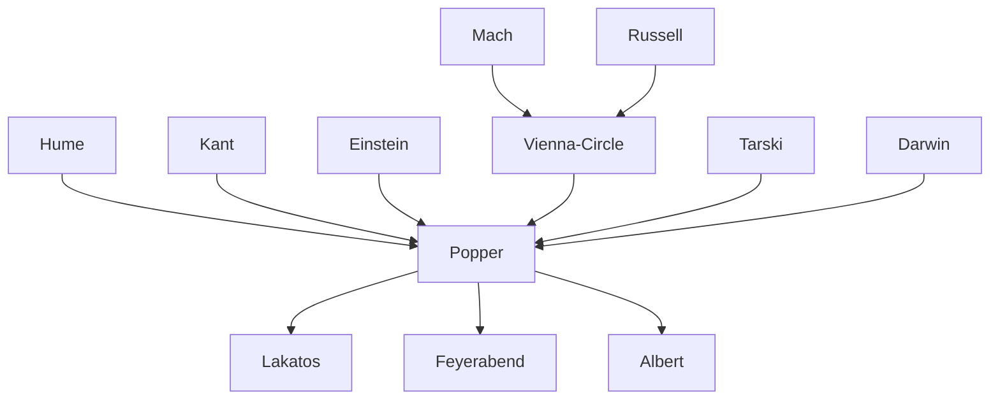

---
cssclasses:
  - Philosophy
subclasses:
  - Epistemology
  - Philosophy-of-Science
  - Analytic-Philosophy
related:
  - "[[Falsificationism]]"
  - "[[Vienna Circle]]"
  - "[[Philosophy of Science]]"
  - "[[Scientific Method]]"
  - "[[Problem of Induction]]"
  - "[[Critical Rationalism]]"
  - "[[Post-Positivism]]"
  - "[[Kuhn]]"
  - "[[Lakatos]]"
  - "[[Logical Positivism]]"
aliases:
  - critical rationalism
  - conjectures refutations
  - demarcation problem
  - three worlds
  - scientific method
reference:
  - "Abbagnano, N., & Fornero, G. (2012). La ricerca del pensiero. Vol. 3B. Dalla fenomenologia a Gadamer. Paravia."
---

#### Central Problem

The central problem of Popper's epistemology is the **demarcation problem**: what distinguishes genuine science from pseudo-science and non-science? This question emerges from dissatisfaction with the neopositivist verification criterion, which held that a statement is meaningful only if empirically verifiable. Popper recognized that this criterion fails to capture what actually makes scientific theories scientific, while simultaneously being too restrictive (excluding meaningful metaphysical claims) and too permissive (allowing unfalsifiable theories like Marxism and psychoanalysis to masquerade as science).

The problem branches into interconnected issues: How do scientific theories relate to experience? Can induction justify scientific knowledge? What is the logical structure of scientific testing? How does science progress? What role does error play in knowledge? Popper's engagement with these questions was decisively shaped by [[Einstein]]'s revolution in physics, which showed that even [[Newton]]'s apparently certain theory could be overthrown, and by his observation that Marxism and psychoanalysis, unlike [[Einstein]]'s relativity, seemed designed to accommodate any possible evidence rather than risk genuine refutation.

#### Main Thesis

Popper's central thesis is **falsificationism**: a theory is scientific not because it can be verified, but because it can be falsified—that is, because it makes predictions that could potentially be refuted by observation. The criterion of demarcation is falsifiability, not verifiability.

**The Falsifiability Criterion:** A theory is scientific if and only if there exist potential falsifiers—possible basic statements that logically conflict with it. The more a theory forbids, the more it says about the world; the more falsifiable it is, the greater its empirical content. Conversely, a theory compatible with any conceivable observation has no empirical content.

**Asymmetry of Verification and Falsification:** While no finite number of confirmations can verify a universal law (we cannot observe all ravens to confirm "all ravens are black"), a single negative instance can falsify it (one white raven refutes the claim). This logical asymmetry grounds the superiority of falsification over verification.

**Conjectures and Refutations:** Science proceeds not by induction (generalizing from observations to laws) but by the method of conjectures and refutations—bold hypotheses subjected to severe tests. Scientific method consists of three steps: (1) encountering a problem; (2) proposing a tentative solution (conjecture); (3) learning from errors through critical discussion.

**Fallibilism:** All scientific knowledge is conjectural—provisional hypotheses that have not yet been refuted. Science is not epistēmē (certain knowledge) but dóxa (opinion). The image of science as an edifice built on solid rock must be replaced by science as "a building erected on piles" driven into a swamp, with no natural foundation.

**Theory-Laden Observation:** Against naive empiricism, observation is always "theory-laden." The mind is not a tabula rasa but a "searchlight" that illuminates reality through pre-existing expectations and hypotheses.

#### Historical Context

Popper (1902-1994) developed his philosophy in Vienna during the 1920s-1930s, in dialogue with but distinct from the Vienna Circle. While acquainted with [[Schlick]], Carnap, and other neopositivists, Popper claimed to have formulated his core ideas before encountering their work. His fundamental inspiration came not from neopositivism but from [[Einstein]]'s revolution in physics.

The young Popper was struck by the contrast between [[Einstein]]'s theory of relativity and the pseudo-scientific pretensions of Marxism and psychoanalysis. [[Einstein]]'s theory made "risky" predictions that could be tested and potentially falsified (the 1919 eclipse observations), while [[Marx]] and [[Freud]] seemed able to explain everything and hence predicted nothing specific. This observation crystallized into the falsifiability criterion.

With the rise of Nazism, Popper fled to New Zealand (1937-1945), where he wrote *The Open Society and Its Enemies* and *The Poverty of Historicism*, applying his epistemological principles to political philosophy. After the war, he settled in London at the London School of Economics, where he became one of the most influential philosophers of science of the twentieth century.

Popper's influence extended through his students (Lakatos, [[Feyerabend]], Agassi) and critics (Kuhn, Quine), shaping the subsequent development of philosophy of science even among those who rejected his specific proposals.

#### Philosophical Lineage

#### Key Thinkers

| Thinker | Dates | Movement | Main Work | Core Concept |
|---------|-------|----------|-----------|--------------|
| [[Popper]] | 1902-1994 | [[Critical Rationalism]] | *Logic of Scientific Discovery* | Falsifiability, conjectures and refutations |
| [[Einstein]] | 1879-1955 | [[Modern Physics]] | *Relativity: The Special and General Theory* | Theory as hypothesis, risky predictions |
| [[Carnap]] | 1891-1970 | [[Logical Positivism]] | *Logical Structure of the World* | Verification principle, confirmability |
| [[Lakatos]] | 1922-1974 | [[Critical Rationalism]] | *Proofs and Refutations* | Research programmes, sophisticated falsificationism |
| [[Tarski]] | 1901-1983 | [[Analytic Philosophy]] | *The Concept of Truth* | Correspondence theory of truth |
| [[Kuhn]] | 1922-1996 | [[Post-Positivism]] | *Structure of Scientific Revolutions* | Paradigms, normal science |

#### Key Concepts

| Concept | Definition | Related to |
|---------|------------|------------|
| Falsifiability | Criterion of demarcation: a theory is scientific if potentially refutable by experience | [[Popper]], [[Philosophy of Science]] |
| Basic statements | Singular observation statements, intersubjectively testable, serving as potential falsifiers | [[Popper]], [[Empiricism]] |
| Corroboration | A theory is corroborated when it survives severe tests; not verification but temporary non-falsification | [[Popper]], [[Scientific Method]] |
| Conjectures and refutations | Scientific method proceeds by bold hypotheses subjected to critical testing | [[Popper]], [[Critical Rationalism]] |
| Fallibilism | All knowledge is conjectural and corrigible; science is dóxa not epistēmē | [[Popper]], [[Epistemology]] |
| Verisimilitude | Closeness to truth; theories can approach truth without reaching it | [[Popper]], [[Realism]] |
| Demarcation problem | The question of what distinguishes science from non-science and pseudo-science | [[Popper]], [[Philosophy of Science]] |
| Theory-ladenness | Observation is always shaped by prior theoretical expectations | [[Popper]], [[Post-Positivism]] |
| Three worlds | World 1 (physical), World 2 (mental), World 3 (objective knowledge) | [[Popper]], [[Ontology]] |
| Anti-inductivism | Rejection of induction as logical method; theories are not derived from but tested against facts | [[Popper]], [[Hume]] |

#### Authors Comparison

| Theme | [[Popper]] | [[Carnap]] | [[Kuhn]] |
|-------|------------|------------|----------|
| Demarcation criterion | Falsifiability | Verifiability/confirmability | Puzzle-solving within paradigms |
| Scientific method | Conjectures and refutations | Logical analysis, confirmation | Normal science and revolutions |
| Metaphysics | Meaningful but not scientific | Cognitively meaningless | Part of paradigms |
| Progress | Verisimilitude, approaching truth | Accumulation of confirmed theories | Paradigm replacement |
| Induction | Rejected as myth | Confirmed through probability | Implicit in normal science |
| Theory change | Rational choice, critical testing | Degree of confirmation | Revolutionary gestalt switch |
| Scientific community | Universal critical rationality | Methodological conventions | Sociological, paradigm-bound |

#### Influences & Connections

- **Predecessors:** [[Popper]] ← influenced by ← [[Hume]] (problem of induction), [[Kant]] (categories as conjectures), [[Einstein]] (falsifiable theories)
- **Predecessors:** [[Popper]] ← in dialogue with ← [[Vienna Circle]] (Schlick, Carnap, Neurath)
- **Contemporaries:** [[Popper]] ↔ debate with ↔ [[Carnap]] (verification vs. falsification), [[Kuhn]] (rationality of science)
- **Followers:** [[Popper]] → influenced → [[Lakatos]] (research programmes), [[Feyerabend]] (later critic), [[Albert]] (critical rationalism)
- **Opposing views:** [[Popper]] ← criticized by ← [[Kuhn]] (incommensurability), [[Quine]] (holism), [[Feyerabend]] (methodological anarchism)

#### Summary Formulas

- **[[Popper]]:** Science proceeds by conjectures and refutations; a theory is scientific if falsifiable, and all knowledge remains conjectural—we learn from our errors, approaching but never reaching truth.
- **[[Einstein]] (as interpreted by Popper):** Scientific theories are bold hypotheses making risky predictions; [[Newton]]'s overthrow proves that even our best-confirmed theories remain fallible conjectures.
- **[[Hume]] (Popper's reading):** Induction cannot logically justify universal laws; no finite number of observations validates a general statement, though one negative instance can refute it.
- **[[Tarski]] (as adopted by Popper):** Truth is correspondence between statements and facts; though we cannot know we have reached truth, we can rationally prefer theories that seem closer to it.

#### Timeline

| Year | Event |
|------|-------|
| 1902 | [[Popper]] born in Vienna |
| 1919 | [[Einstein]]'s relativity confirmed by eclipse observations; Popper begins questioning Marxism and psychoanalysis |
| 1928 | [[Popper]] completes doctorate in philosophy |
| 1934 | *Logik der Forschung* (*Logic of Scientific Discovery*) published in German |
| 1937 | [[Popper]] emigrates to New Zealand |
| 1944-45 | *The Open Society and Its Enemies* and *The Poverty of Historicism* written |
| 1946 | [[Popper]] joins London School of Economics |
| 1959 | English translation of *Logic of Scientific Discovery* published |
| 1963 | *Conjectures and Refutations* published |
| 1972 | *Objective Knowledge* published; three worlds theory elaborated |
| 1994 | [[Popper]] dies in London |

#### Notable Quotes

> "The criterion of the scientific status of a theory is its falsifiability, or refutability, or testability." — [[Popper]]

> "The bold structure of its theories rises, as it were, above a swamp. It is like a building erected on piles. The piles are driven down from above into the swamp, but not down to any natural or 'given' base." — [[Popper]]

> "Our knowledge can only be finite, while our ignorance must necessarily be infinite." — [[Popper]]

---
> [!NOTE]
> *This summary has been created to present the key points from the source text, which was automatically extracted using LLM. Please note that the summary may contain errors. It serves as an essential starting point for study and reference purposes.*
