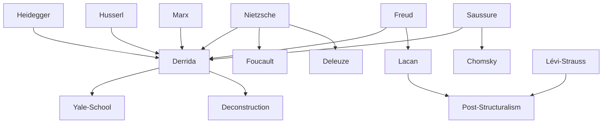

---
cssclasses:
  - Philosophy
  - Languages-Literature
subclasses:
  - 20th-Century-Philosophy
  - Continental-Philosophy
  - Philosophy-of-Language
aliases:
contributions:
  - Conceptual
authors:
  - "[[Derrida]]"
  - "[[Deleuze]]"
  - "[[Foucault]]"
  - "[[Lyotard]]"
  - "[[Chomsky]]"
  - "[[Nietzsche]]"
  - "[[Heidegger]]"
reference: Abbagnano, N., & Fornero, G. (2012). La ricerca del pensiero. Vol. 3C. Dalla crisi della modernità agli sviluppi più recenti. Paravia.
related:
  - "[[Structuralism]]"
  - "[[Phenomenology]]"
  - "[[Hermeneutics]]"
  - "[[Postmodernism]]"
  - "[[Literary Theory]]"
  - "[[French Philosophy]]"
  - "[[Nietzsche]]"
  - "[[Heidegger]]"
  - "[[Writing]]"
  - "[[Nihilism]]"
---

#### Central Problem

Post-structuralism confronts the fundamental question of what happens to thought, language, and meaning when the foundations of Western metaphysics—presence, consciousness, origin, and identity—are subjected to radical critique. If structuralism replaced the autonomous subject with impersonal structures, post-structuralism asks: what remains when even structures are revealed as effects of power, desire, and différance rather than stable frameworks?

The central tension lies between the inherited conceptual apparatus of Western philosophy—organized around binary oppositions (presence/absence, speech/writing, truth/error, identity/difference)—and the recognition that these oppositions conceal hidden hierarchies and exclusions. How can philosophy proceed when its basic categories are shown to be neither natural nor necessary but historical, contingent, and complicit with forms of domination?

Derrida's deconstruction addresses this problem most rigorously: if the "metaphysics of presence" has determined all Western thought from [[Plato]] to [[Husserl]], privileging what is immediately present to consciousness (speech, voice, the living present) over what is mediated, absent, or derivative (writing, trace, repetition), then deconstructing this metaphysics means rethinking the very possibility of meaning, truth, and philosophy itself.

#### Main Thesis

Post-structuralism emerges from the [[Nietzsche]]-Renaissance of the 1960s as both a continuation and critique of structuralism. While structuralism had replaced subjective consciousness with impersonal structures, post-structuralists go further, viewing structure itself as another expression of what [[Nietzsche]] called "moral-metaphysical" thinking. Against structuralist formalism and stasis, they advance vitalistic claims about force, energy, and production.

**From Structure to Production:** The "differences" that structuralism used to guarantee the intelligibility of structures become dynamic principles in post-structuralism. Symbolic activity appears as productive of differences, driven by impersonal forces—Freud's drives, [[Nietzsche]]'s will to power, [[Marx]]'s productive forces, or [[Heidegger]]'s Being. Key targets include: subjectivity, dialectics, structure itself (as "scientistic" rewriting of God), and the "negative economy of desire" (desire as lack).

**Chomsky's Generative Grammar:** Noam Chomsky criticizes structuralism for merely describing language without explaining it. His distinction between "deep structure" (nuclear sentences) and "surface structure" (complex sentences) linked by transformations, and between "competence" (internalized rules) and "performance" (actual use), emphasizes the creative, generative aspect of language and posits innate, universal linguistic structures.

**Derrida's Deconstruction:** Deconstruction is not a method but a practice of writing that destabilizes the system of conceptual oppositions constituting metaphysics. Drawing on [[Nietzsche]], [[Freud]], [[Husserl]], and [[Heidegger]], Derrida targets the "metaphysics of presence"—the systematic privilege accorded to presence, the present, consciousness, voice, and origin throughout Western thought.

**Logocentrism/Phonocentrism:** Western metaphysics is "logocentric" because it identifies truth with logos (speech, reason, the word) and privileges voice (phoné) as guarantor of presence to consciousness. Writing is condemned as derivative, dangerous, capable of circulating without the controlling presence of a speaker—Plato's condemnation of writing in the *Phaedrus* is paradigmatic.

**Différance:** Derrida's neologism (spelled with "a" instead of "e"—a difference visible but inaudible) names the movement by which meaning is produced through differences (synchronic) and deferrals (diachronic). There is no transcendental signified, no ultimate presence grounding the chain of signs—only traces of traces, an infinite play of substitutions.

**Key Concepts:**
- **Trace:** "A past that was never present"—the structure of reference that precedes and makes possible any presence
- **Supplement:** What supposedly comes after and is added to something complete in itself is revealed as "originary"—the supplement precedes what it supplements
- **Grammatology:** The "science" of the trace, of writing in the expanded sense, challenging the privilege of presence in ontology
- **Dissemination:** The irreducible dispersion of meaning, unlike polysemy, cannot be controlled or totalized
- **Undecidable:** Elements (like différance, trace, supplement) that escape binary logic, occupying the "middle voice"

#### Historical Context

Post-structuralism emerged in France during the mid-1960s and flourished in the following decade, though the term itself was initially coined by American commentators. The movement arose from within structuralism as a self-critical development, which is why German scholars sometimes prefer "neo-structuralism."

The intellectual context was the "Nietzsche-Renaissance" of the early 1960s, when [[Nietzsche]]'s genealogical investigations became the lever for cracking structuralism's Apollonian formalism. Genealogical-energetic analysis reads every constitution of form not as structural synchronicity but as dynamic differentiality, as effects of power relations. Every structure represents a form of domination to be unmasked.

Structuralism itself had been a reaction against the subjectivist and humanist climate of 1940s-50s French thought—phenomenology (Merleau-Ponty), spiritualism (Marcel), and especially [[Sartre]]'s existentialism (against which [[Heidegger]] wrote his *Letter on Humanism* in 1947). Structuralism adopted the "death of man" affirmatively as the presupposition of a new way of thinking and working on language.

The broader intellectual heritage includes: [[Freud]] and psychoanalysis (the unconscious as structured like a language); [[Marx]] (critique of ideology, productive forces); Heidegger (critique of metaphysics, ontological difference); and [[Husserl]]'s phenomenology (which Derrida subjects to deconstructive reading). Derrida's work shows affinity with artistic avant-gardes, particularly Dadaism, in its challenge to systematic philosophy.

#### Philosophical Lineage

#### Key Thinkers

| Thinker | Dates | Movement | Main Work | Core Concept |
|---------|-------|----------|-----------|--------------|
| [[Derrida]] | 1930-2004 | [[Deconstruction]] | *Of Grammatology* | Différance, trace, logocentrism |
| [[Deleuze]] | 1925-1995 | [[Post-Structuralism]] | *Difference and Repetition* | Difference, desire as production |
| [[Foucault]] | 1926-1984 | [[Post-Structuralism]] | *The Order of Things* | Power-knowledge, genealogy |
| [[Lyotard]] | 1924-1998 | [[Post-Structuralism]] | *The Postmodern Condition* | Libidinal economy, differend |
| [[Chomsky]] | 1928- | [[Generative Grammar]] | *Syntactic Structures* | Deep structure, competence |

#### Key Concepts

| Concept | Definition | Related to |
|---------|------------|------------|
| Différance | Play of differences (synchronic) and deferrals (diachronic) producing meaning; neologism marked by silent "a" | [[Derrida]], [[Deconstruction]] |
| Deconstruction | Practice destabilizing metaphysical oppositions by revealing their hidden hierarchies and exclusions | [[Derrida]], [[Post-Structuralism]] |
| Logocentrism | Privilege of logos/voice/presence in Western metaphysics; identification of truth with speech | [[Derrida]], [[Metaphysics of Presence]] |
| Trace | "Past that was never present"; structure of reference preceding any presence | [[Derrida]], [[Grammatology]] |
| Supplement | What appears as addition to something complete is revealed as "originary" | [[Derrida]], [[Deconstruction]] |
| Grammatology | "Science" of trace and writing challenging the privilege of presence | [[Derrida]], [[Post-Structuralism]] |
| Dissemination | Irreducible dispersion of meaning that cannot be totalized | [[Derrida]], [[Textuality]] |
| Undecidable | Elements escaping binary logic, occupying the "middle voice" | [[Derrida]], [[Deconstruction]] |
| Deep structure | Underlying nuclear sentences generating surface structures through transformations | [[Chomsky]], [[Generative Grammar]] |
| General textuality | "There is nothing outside the text"; meaning as endless play of substitutions | [[Derrida]], [[Post-Structuralism]] |

#### Authors Comparison

| Theme | [[Derrida]] | [[Deleuze]] | [[Foucault]] | [[Chomsky]] |
|-------|-------------|-------------|--------------|-------------|
| Central problem | Metaphysics of presence | Representation, identity | Power-knowledge | Language acquisition |
| Method | Deconstruction | Transcendental empiricism | Genealogy | Generative grammar |
| View of language | Writing, trace, différance | Expression, sense-event | Discourse, enunciation | Innate competence |
| Subject | Decentered, effect of traces | Dissolved in flows | Produced by power | Creative speaker |
| Critique target | Logocentrism | Platonism, dialectic | Humanism, disciplinary power | Behaviorism |
| Key influence | Heidegger, [[Husserl]] | [[Nietzsche]], [[Spinoza]] | [[Nietzsche]], [[Marx]] | Rationalism, [[Descartes]] |

#### Influences & Connections

- **Predecessors:** [[Derrida]] ← influenced by ← [[Heidegger]], [[Husserl]], [[Nietzsche]], [[Freud]]
- **Predecessors:** [[Chomsky]] ← influenced by ← [[Saussure]], [[Rationalism]], [[Port-Royal Grammar]]
- **Contemporaries:** [[Derrida]] ↔ dialogue with ↔ [[Foucault]], [[Lacan]], [[Gadamer]]
- **Followers:** [[Derrida]] → influenced → [[Yale School]], [[Literary Deconstruction]], [[Butler]]
- **Opposing views:** [[Derrida]] ← criticized by ← [[Searle]], [[Habermas]], [[Analytic Philosophy]]

#### Summary Formulas

- **[[Derrida]]:** Deconstruction reveals that the metaphysics of presence—privileging voice, consciousness, and origin—conceals an "originary" play of traces and differences (différance) that precedes and makes possible any presence.
- **[[Chomsky]]:** Language is a creative, generative system based on innate universal structures; speakers possess competence (internalized rules) that enables them to produce infinite novel sentences.
- **[[Post-Structuralism]]:** Beyond structures lies the dynamic play of forces, desires, and productions; every form is an effect of power relations to be genealogically unmasked.

#### Timeline

| Year | Event |
|------|-------|
| 1957 | [[Chomsky]] publishes *Syntactic Structures* |
| 1962 | [[Derrida]] publishes *Introduction to [[Husserl]]'s "Origin of Geometry"* |
| 1966 | [[Foucault]] publishes *The Order of Things*; [[Derrida]]'s Johns Hopkins lecture |
| 1967 | [[Derrida]] publishes *Of Grammatology*, *Writing and Difference*, *Speech and Phenomena* |
| 1968 | [[Derrida]] delivers "Différance" lecture; May 1968 events in Paris |
| 1972 | [[Derrida]] publishes *Margins of Philosophy*, *Dissemination*, *Positions* |
| 1974 | [[Derrida]] publishes *Glas* |
| 1979 | [[Lyotard]] publishes *The Postmodern Condition* |
| 1993 | [[Derrida]] publishes *Specters of [[Marx]]* |

#### Notable Quotes

> "There is nothing outside the text." — [[Derrida]]

> "Every sentence of the type 'deconstruction is X' or 'deconstruction is not X' is a priori devoid of pertinence." — [[Derrida]]

> "There would be no unique name, were it even the name of Being. And we must think this without nostalgia, outside of the myth of the purely maternal or paternal language, of the lost homeland of thought." — [[Derrida]]

---
> [!NOTE]
> *This summary has been created to present the key points from the source text, which was automatically extracted using LLM. Please note that the summary may contain errors. It serves as an essential starting point for study and reference purposes.*
