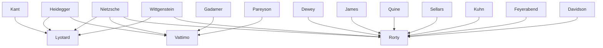

---
cssclasses:
  - Philosophy
subclasses:
  - 20th-Century-Philosophy
  - Continental-Philosophy
  - Hermeneutics
related:
  - "[[Postmodernism]]"
  - "[[Nihilism]]"
  - "[[Hermeneutics]]"
  - "[[Neopragmatism]]"
  - "[[Deconstruction]]"
  - "[[Post-structuralism]]"
  - "[[Critical Theory]]"
  - "[[Discourse Ethics]]"
  - "[[Mass Media Philosophy]]"
  - "[[Multiculturalism]]"
aliases:
  - postmodern philosophy
  - weak thought
  - grand narratives
  - end modernity
  - legitimation crisis
  - language games
  - pensiero debole
reference:
  - Abbagnano, N., & Fornero, G. (2012). La ricerca del pensiero. Vol. 3C. Dalla crisi della modernità agli sviluppi più recenti. Paravia.
---

#### Central Problem

What happens to philosophy, knowledge, and society when the foundational certainties of modernity collapse? Postmodern philosophy confronts the exhaustion of what [[Lyotard]] calls the "grand narratives" (*grands récits*) of the modern era—comprehensive worldviews like Enlightenment progressivism, Hegelian idealism, and Marxism that provided unified legitimation for knowledge and action. The central question becomes: how can we think, act, and organize society without recourse to absolute foundations, universal truths, or totalizing systems?

This problem emerges from multiple sources: the philosophical critiques of [[Nietzsche]] and [[Heidegger]], who dismantled Western metaphysics; the historical catastrophes of the twentieth century (world wars, Holocaust, failures of socialism) that discredited faith in progress; and the transformations of post-industrial society with its information technologies and cultural pluralism. The postmodern thinkers ask whether the modern ideals of unity, totality, progress, and emancipation can survive their historical delegitimation, and what forms of thought and life become possible after their dissolution.

The debate between postmodernists like [[Lyotard]] and [[Vattimo]] and defenders of modernity like [[Habermas]] centers on whether universal reason remains viable as a basis for ethics and politics, or whether we must embrace the plurality and incommensurability of different "language games" and cultural horizons.

#### Main Thesis

Postmodern philosophy argues that modernity, understood as the era from [[Descartes]] to [[Nietzsche]], was characterized by several fundamental tendencies that have now exhausted themselves: (a) belief in comprehensive worldviews providing legitimation; (b) faith in progress and the equation of "new" with "better"; (c) understanding history as emancipation toward predetermined goals; (d) conception of reason as technical-scientific mastery over nature; (e) subordination of multiplicity to unity and totality under strong hierarchical structures.

**[[Lyotard]]'s Thesis:** The postmodern condition is fundamentally defined as "incredulity toward metanarratives." The grand narratives of modernity—Enlightenment emancipation, Hegelian Spirit, Marxist revolution, capitalist progress—have been delegitimated both internally (through their own self-reflexive critique) and externally (through historical events like Auschwitz, Budapest 1956, May 1968). What remains is not chaos but a plurality of heterogeneous "language games" without a meta-game to unify them. Legitimation must now be "paralogy"—the invention of new moves in knowledge—based on local, temporary, revisable consensus rather than universal foundations.

**[[Vattimo]]'s Thesis:** The transition from modern to postmodern is the transition from "strong thought" (*pensiero forte*) to "weak thought" (*pensiero debole*). Strong thought speaks in the name of truth, unity, and totality, seeking absolute foundations. Weak thought refuses these categories, accepting the "ontological weakening" revealed by [[Nietzsche]]'s death of God and [[Heidegger]]'s destruction of metaphysics. Nihilism becomes our "chance"—not as tragic loss but as liberation into a world of half-truths and interpretations, lived without neurosis. The postmodern individual accepts finitude and groundlessness, practicing *Verwindung* (convalescence/distortion) rather than *Überwindung* (overcoming) toward the metaphysical past.

**[[Rorty]]'s Thesis:** Philosophy's self-image as foundational discipline—the tribunal of reason judging all other knowledge claims—must be abandoned. The "mirror of nature" metaphor, the idea that mind accurately represents reality, has held philosophy captive since [[Descartes]] and [[Kant]]. After this image dissolves, philosophy becomes "edifying" conversation rather than systematic science, therapeutic practice rather than foundational theory. Truth is what works for us in our practices, and intellectual life is an ongoing conversation without final arbitration.

#### Historical Context

The term "postmodern" has complex origins: Federico de Onís used it in the 1930s for literary counter-modernism; Arnold [[Toynbee]] applied it to late-nineteenth-century imperialism; from the 1960s it designated architectural and cultural trends, especially in America. [[Lyotard]]'s *The Postmodern Condition* (1979) gave it rigorous philosophical meaning. The term describes both an epochal condition and a mode of sensibility—perhaps, as [[Eco]] suggested, a "metahistorical category" applicable beyond any single period.

The postmodern condition emerged from the ruins of modern certainties. [[Nietzsche]]'s proclamation of God's death signified the collapse of the entire metaphysical framework grounding Western values. The World Wars, Holocaust, failures of "really existing socialism," and ecological crises of industrial capitalism shattered Enlightenment optimism. The society that emerged was "post-industrial" and "complex"—pluralistic, multicultural, dominated by information technologies and mass media that fragment rather than unify worldviews.

The intellectual matrices of postmodernism include: [[Nietzsche]] and [[Heidegger]]'s critique of Western metaphysics; French post-structuralism's deconstructive and anti-hierarchical practices; hermeneutics' contextualist ontology; post-positivist epistemology's anarchic conception of knowledge; [[Wittgenstein]]'s heterogeneous language games; and Arnold Gehlen's sociology of "post-histoire" (the routinization of progress).

Against accusations of neoconservatism ([[Habermas]]) or late-capitalist ideology (Fredric Jameson), postmodern thinkers emphasize their alliance with ecological, pluralist, multicultural, and minority-rights movements. As [[Vattimo]] insists: "the maximum of equality is the possibility of being different."

#### Philosophical Lineage

#### Key Thinkers

| Thinker | Dates | Movement | Main Work | Core Concept |
|---------|-------|----------|-----------|--------------|
| [[Lyotard]] | 1924-1998 | [[Postmodernism]] | *The Postmodern Condition* | Grand narratives, paralogy |
| [[Vattimo]] | 1936- | [[Postmodernism]] | *The End of Modernity* | Weak thought, Verwindung |
| [[Rorty]] | 1931-2007 | [[Neopragmatism]] | *Philosophy and the Mirror of Nature* | Edifying philosophy, conversation |
| [[Nietzsche]] | 1844-1900 | [[Nihilism]] | *Thus Spoke Zarathustra* | Death of God |
| [[Heidegger]] | 1889-1976 | [[Phenomenology]] | *Being and Time* | End of metaphysics |
| [[Gehlen]] | 1904-1976 | [[Philosophical Anthropology]] | *Man: His Nature and Place in the World* | Post-histoire |

#### Key Concepts

| Concept | Definition | Related to |
|---------|------------|------------|
| Grand narratives | Legitimating metanarratives of modernity (Enlightenment, idealism, Marxism) providing universal foundations for knowledge and action | [[Lyotard]], [[Postmodernism]] |
| Paralogy | Legitimation through invention of new "moves" in language games, beyond established paradigms | [[Lyotard]], [[Postmodernism]] |
| Weak thought | Post-metaphysical thinking rejecting strong foundations, accepting groundlessness without neurosis | [[Vattimo]], [[Postmodernism]] |
| Nihilism (positive) | Condition of absence of foundations, embraced as liberating chance rather than tragic loss | [[Vattimo]], [[Nietzsche]] |
| Verwindung | Convalescence from metaphysics—accepting, distorting, carrying traces of the past without overcoming | [[Vattimo]], [[Heidegger]] |
| Mirror of nature | Metaphor of mind as accurately representing external reality—the captivating image postmodernism rejects | [[Rorty]], [[Neopragmatism]] |
| Edifying philosophy | Therapeutic, conversational philosophy that opens new possibilities rather than establishing foundations | [[Rorty]], [[Neopragmatism]] |
| Post-histoire | End of propulsive history; progress reduced to quantitative technological routine | [[Gehlen]], [[Postmodernism]] |
| Language games | Heterogeneous, incommensurable forms of linguistic activity with different rules | [[Wittgenstein]], [[Lyotard]] |
| Performativity | Criterion of technological efficiency as basis for legitimation—rejected by postmodernists | [[Lyotard]], [[Postmodernism]] |

#### Authors Comparison

| Theme | [[Lyotard]] | [[Vattimo]] | [[Rorty]] |
|-------|-------------|-------------|-----------|
| Central problem | Delegitimation of metanarratives | End of metaphysics | Foundationalism in philosophy |
| Main target | Universal legitimation | Strong thought | Mirror of nature |
| Positive proposal | Local/temporary consensus, paralogy | Weak thought, nihilism as chance | Edifying conversation |
| Key philosophical source | [[Kant]], [[Wittgenstein]] | [[Nietzsche]], [[Heidegger]] | [[Dewey]], [[Wittgenstein]] |
| View of modernity | Destroyed, not abandoned | Overcome through Verwindung | Contingent vocabulary |
| Politics | Heterogeneity, dissensus | Pluralism, tolerance | Liberal irony |
| Ethics | Against terror of totality | Secularized Christian charity | Solidarity without foundations |
| Attitude to Habermas | Critical—rejects discourse ethics | Critical—rejects universal reason | Sympathetic but critical |

#### Influences & Connections

- **Predecessors:** [[Lyotard]] ← influenced by ← [[Kant]], [[Wittgenstein]], [[Feyerabend]]
- **Predecessors:** [[Vattimo]] ← influenced by ← [[Nietzsche]], [[Heidegger]], [[Gadamer]], [[Pareyson]]
- **Predecessors:** [[Rorty]] ← influenced by ← [[Dewey]], [[James]], [[Wittgenstein]], [[Quine]], [[Sellars]], [[Davidson]]
- **Contemporaries:** [[Lyotard]] ↔ dialogue with ↔ [[Vattimo]] on postmodern condition
- **Contemporaries:** [[Vattimo]] ↔ dialogue with ↔ [[Rorty]] on pragmatism and religion
- **Opposing views:** [[Habermas]] ← criticized by ← [[Lyotard]], [[Vattimo]] (universal reason rejected)
- **Opposing views:** postmodernists ← criticized by ← [[Habermas]] (neoconservatism charge), Jameson (late-capitalist ideology)

#### Summary Formulas

- **[[Lyotard]]:** The postmodern condition is incredulity toward the grand narratives that legitimated modern knowledge; philosophy must think in terms of heterogeneous language games and local, paralological legitimation.
- **[[Vattimo]]:** The end of modernity requires passage from strong to weak thought; nihilism is our chance, enabling life without neurosis in the groundlessness revealed by [[Nietzsche]] and [[Heidegger]].
- **[[Rorty]]:** Philosophy as mirror of nature and foundational tribunal must give way to edifying conversation; truth is not correspondence but what works in our ongoing cultural practices.

#### Timeline

| Year | Event |
|------|-------|
| 1967 | [[Rorty]] publishes *The Linguistic Turn* anthology |
| 1971 | [[Lyotard]] publishes *Discourse, Figure* |
| 1974 | [[Lyotard]] publishes *Libidinal Economy* |
| 1979 | [[Lyotard]] publishes *The Postmodern Condition*—manifesto of philosophical postmodernism |
| 1979 | [[Rorty]] publishes *Philosophy and the Mirror of Nature* |
| 1980 | [[Vattimo]] publishes *The Adventures of Difference* |
| 1983 | [[Lyotard]] publishes *The Differend* |
| 1983 | [[Vattimo]] and Rovatti publish *Il pensiero debole* (Weak Thought) |
| 1985 | [[Vattimo]] publishes *The End of Modernity* |
| 1989 | [[Vattimo]] publishes *The Transparent Society* |
| 1989 | [[Rorty]] publishes *Contingency, Irony, and Solidarity* |
| 1996 | [[Vattimo]] publishes *Credere di credere* (Belief) |

#### Notable Quotes

> "Simplifying to the extreme, I define postmodern as incredulity toward metanarratives." — [[Lyotard]]

> "Today we are not uncomfortable because we are nihilists, but rather because we are still too little nihilists, because we do not know how to live through to the end the experience of the dissolution of being." — [[Vattimo]]

> "Pragmatists hold that philosophy's greatest aspiration is not to practice Philosophy." — [[Rorty]]

---
> [!warning]-
> This annotation was normalised using a large language model and may contain inaccuracies. These texts serve as preliminary study resources rather than exhaustive references.
