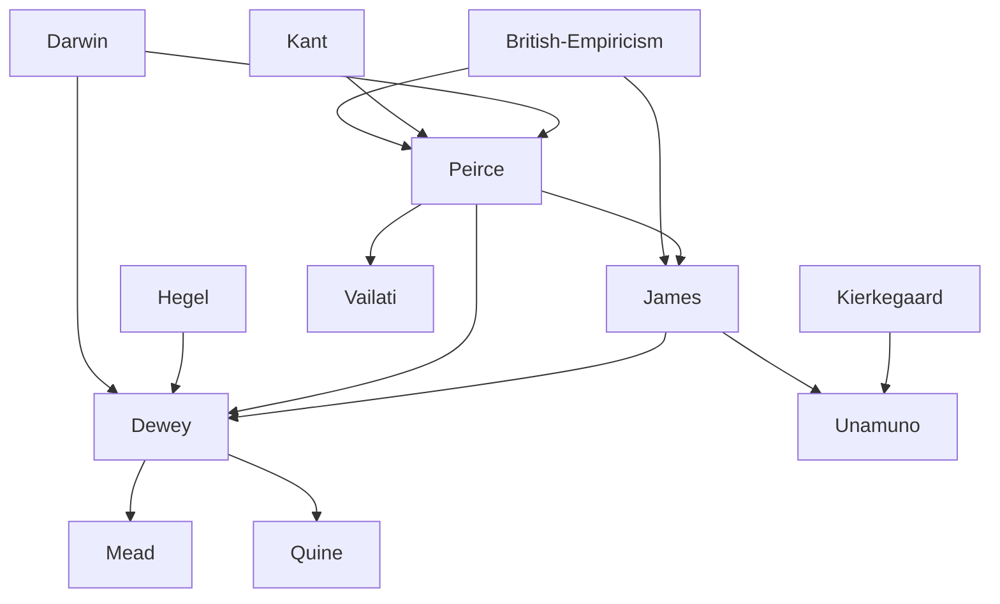

---
cssclasses:
  - Philosophy
subclasses:
  - Epistemology
  - 19th-Century-Philosophy
  - 20th-Century-Philosophy
related:
  - "[[Empiricism]]"
  - "[[Scientific Method]]"
  - "[[Semiotics]]"
  - "[[American Philosophy]]"
  - "[[Logic]]"
  - "[[Democracy]]"
  - "[[Education]]"
  - "[[Naturalism]]"
  - "[[Fallibilism]]"
  - "[[Theory of Inquiry]]"
aliases:
  - truth utility
  - democratic method
reference:
  - "Abbagnano, N., & Fornero, G. (2012). La ricerca del pensiero. Vol. 3A. Da Schopenhauer a Freud. Paravia."
---

#### Central Problem

Pragmatism confronts the fundamental question of how philosophical concepts and beliefs acquire meaning and validity. Against the backdrop of traditional metaphysics that sought eternal, abstract truths detached from human practice, pragmatism asks: what practical difference does a belief or concept make in human conduct? How should we evaluate competing philosophical doctrines when pure theoretical demonstration proves inconclusive?

The movement emerged as America's first original contribution to Western philosophy, arising from a cultural context that valued practical utility over purely contemplative knowledge. Unlike the classical and medieval ideal of the "theoretical life" devoted exclusively to truth contemplation and detached from human interests and needs, American philosophy had always maintained an implicit pragmatic criterion: problems whose solutions made no difference to human attitudes toward life were considered idle.

The central tension pragmatism addresses lies between two conceptions of truth: the traditional view that truth consists in correspondence with an antecedent reality, and the pragmatist view that truth is validated through its consequences for future experience and action. This leads to deeper questions about the nature of knowledge, the function of thought, and the relationship between theory and practice.

#### Main Thesis

Pragmatism's fundamental thesis holds that every truth is a norm for future conduct, a rule of action, where "action" encompasses every form of activity—cognitive, practical, moral, aesthetic, or religious. The meaning of any concept consists entirely in its practical effects, and the validity of any belief must be judged by its consequences in actual human behavior.

**Methodological vs. Metaphysical Pragmatism:** The movement divides into two distinct currents:

1. **Methodological Pragmatism** ([[Peirce]], [[Dewey]]): Presents itself as a theory of meaning, concerning the pragmatic import of propositions and beliefs. The function of thought is to produce "habits of action" (beliefs) subjected to experiential verification. This leads to an experimental, fallibilistic rationalism consonant with scientific procedures. Peirce preferred "pragmaticism" and Dewey "instrumentalism" to distinguish this approach.

2. **Metaphysical Pragmatism** ([[James]]): Constitutes a general theory of truth and reality, holding that an idea's truth resides in its personal or social utility—its capacity to exert beneficial effects on human life. This tends toward irrationalism with metaphysical, religious, and sometimes political undertones.

**Orientation Toward the Future:** Unlike classical empiricism, which treated experience as a concluded patrimony to be inventoried definitively, pragmatism conceives experience as anticipation and forecast of future developments. Truth is not merely what accords with past experience but what is susceptible to use in future experience.

**Fallibilism:** [[Peirce]] argues that only the scientific method, which renounces infallibility and admits continuous correction of results, is legitimate for philosophy. The world is a realm of chance in which regularities constitute the object of scientific inquiry but never absolute necessities.

**Instrumentalism:** [[Dewey]] develops pragmatism into a comprehensive theory where logic becomes a general theory of inquiry—procedures for transforming problematic situations characterized by obscurity, doubt, and conflict into situations that are clear, coherent, and harmonious.

#### Historical Context

Pragmatism emerged in late nineteenth-century America during a period of rapid industrialization, scientific advancement, and democratic expansion. The movement crystallized through the "Metaphysical Club" at Harvard in the 1870s, where [[Peirce]] first formulated the pragmatic maxim.

The American intellectual climate differed fundamentally from Europe's. The young nation lacked the weight of medieval scholastic traditions and embraced a forward-looking, experimental attitude toward knowledge. The success of natural sciences and the Darwinian revolution provided models for understanding mind and knowledge as evolutionary adaptations rather than passive mirrors of eternal truth.

[[Peirce]]'s foundational essay "How to Make Our Ideas Clear" (1878) established the pragmatic criterion during a period when American philosophy sought independence from European thought. [[James]] popularized and transformed pragmatism in the early twentieth century, giving it international reach through his 1907 lectures. [[Dewey]]'s long career (1859-1952) extended pragmatism's influence through the interwar period and into the Cold War era, when his democratic philosophy offered an alternative to totalitarian ideologies.

In Italy, [[Vailati]] developed a distinctive interpretation connecting pragmatism to mathematical logic. In Spain, [[Unamuno]]'s fideistic pragmatism represented an existentialist variant focused on religious belief and immortality. The European reception often misread pragmatism as a "philosophy of success" or "business philosophy," missing its deeper concern with moral, religious, and scientific fecundity.

#### Philosophical Lineage

#### Key Thinkers

| Thinker | Dates | Movement | Main Work | Core Concept |
|---------|-------|----------|-----------|--------------|
| [[Peirce]] | 1839-1914 | [[Pragmatism]] | *Chance, Love and Logic* | Pragmatic maxim, abduction, semiotics |
| [[James]] | 1842-1910 | [[Pragmatism]] | *Pragmatism* (1907) | Will to believe, pluralism |
| [[Dewey]] | 1859-1952 | [[Instrumentalism]] | *Logic: Theory of Inquiry* | Instrumentalism, experience, democracy |
| [[Vailati]] | 1863-1909 | [[Pragmatism]] | Collected Essays | Pragmatism and mathematical logic |
| [[Unamuno]] | 1864-1936 | [[Fideism]] | *The Tragic Sense of Life* | Life as criterion of truth |
| [[Mead]] | 1863-1931 | [[Pragmatism]] | *Mind, Self and Society* | Social behaviorism, transaction |

#### Key Concepts

| Concept | Definition | Related to |
|---------|------------|------------|
| Pragmatic maxim | Consider the practical effects of an object's conception; these effects constitute the entire conception of the object | [[Peirce]], [[Pragmatism]] |
| Fallibilism | The attitude that error is possible at every moment of inquiry, requiring continuous verification and correction | [[Peirce]], [[Dewey]] |
| Abduction | A form of inference from observed facts to an explanatory hypothesis; neither induction nor deduction but hypothesis-formation | [[Peirce]], [[Logic]] |
| Semiotics | The study of signs, their interpretation and use; all thought is sign, referring to previous thought-signs in infinite semiosis | [[Peirce]], [[Logic]] |
| Will to believe | The right and duty to choose beliefs that serve practical life when rational evidence is inconclusive | [[James]], [[Pragmatism]] |
| Instrumentalism | Theory that knowledge and logic are instruments for transforming problematic situations into harmonious ones | [[Dewey]], [[Pragmatism]] |
| Transaction | The vital interconnection between all aspects of reality; knowledge as function of both organism and environment | [[Dewey]], [[Mead]] |
| Experience | Not mere consciousness but the entire field of events, persons, history—including error, ignorance, and death | [[Dewey]], [[Naturalism]] |
| Philosophical fallacy | The artificial simplification that treats values as ontologically guaranteed by reality itself | [[Dewey]], [[Pragmatism]] |
| Ends and means | No ends are absolute; an end achievable only through repugnant means is itself repugnant | [[Dewey]], [[Ethics]] |

#### Authors Comparison

| Theme | [[Peirce]] | [[James]] | [[Dewey]] |
|-------|-----------|----------|----------|
| Central focus | Theory of meaning, logic | Religious belief, personal truth | Social inquiry, democracy |
| Nature of truth | Future verification, public | Personal utility, satisfaction | Warranted assertibility |
| Method | Scientific fallibilism | Pluralistic voluntarism | Experimental inquiry |
| Experience | Semiotic community | Stream of consciousness | Naturalistic, historical |
| Religion | Agnostic methodology | Justified by practical effects | Common faith in intelligence |
| Politics | Community of inquirers | Individualistic pluralism | Democratic socialism |
| Legacy | Semiotics, logic of science | Psychology, religious philosophy | Education, social philosophy |

#### Influences & Connections

- **Predecessors:** [[Peirce]] ← influenced by ← [[Kant]], [[British Empiricism]], [[Darwin]]
- **Predecessors:** [[Dewey]] ← influenced by ← [[Hegel]], [[Darwin]], [[Peirce]]
- **Predecessors:** [[Unamuno]] ← influenced by ← [[Kierkegaard]], [[James]]
- **Contemporaries:** [[James]] ↔ dialogue with ↔ [[Peirce]], [[Bergson]]
- **Contemporaries:** [[Dewey]] ↔ collaboration with ↔ [[Mead]]
- **Followers:** [[Peirce]] → influenced → [[Morris]], [[Quine]], [[Eco]]
- **Followers:** [[Dewey]] → influenced → [[Rorty]], [[Putnam]]
- **Opposing views:** [[James]] ← criticized by ← [[Russell]], [[Moore]]

#### Summary Formulas

- **[[Peirce]]:** The meaning of a concept consists entirely in its conceivable practical effects; truth emerges through the self-correcting method of the scientific community, which alone renounces infallibility.
- **[[James]]:** When rational evidence is insufficient, we have the right and duty to believe what serves our practical life; truth is what works beneficially in experience.
- **[[Dewey]]:** Experience is the entire field of human history in nature; intelligence is the instrument for transforming problematic situations, and democracy is the experimental method applied to social life.
- **[[Vailati]]:** Pragmatism expresses the method of mathematics and science, where a notion's meaning consists in the use that science makes of it.
- **[[Unamuno]]:** Life is the criterion of truth; a belief is true insofar as it drives us to act in ways that enhance life, regardless of its theoretical validity.

#### Timeline

| Year | Event |
|------|-------|
| 1839 | [[Peirce]] born in Cambridge, Massachusetts |
| 1859 | [[Dewey]] born in Burlington, Vermont |
| 1870s | "Metaphysical Club" at Harvard; pragmatism's origins |
| 1878 | [[Peirce]] publishes "How to Make Our Ideas Clear" |
| 1890 | [[James]] publishes *Principles of Psychology* |
| 1903 | [[Dewey]] publishes *Studies in Logical Theory*; Chicago School founded |
| 1907 | [[James]] publishes *Pragmatism* |
| 1914 | [[Peirce]] dies; [[Vailati]] dies (1909) |
| 1925 | [[Dewey]] publishes *Experience and Nature* |
| 1938 | [[Dewey]] publishes *Logic: The Theory of Inquiry* |
| 1952 | [[Dewey]] dies in New York |

#### Notable Quotes

> "Consider what effects, which might conceivably have practical bearings, we conceive the object of our conception to have. Then, our conception of these effects is the whole of our conception of the object." — [[Peirce]]

> "The true is the name of whatever proves itself to be good in the way of belief, and good, too, for definite, assignable reasons." — [[James]]

> "The intelligent recognition of the continuity between nature, man and society is the only basis for the development of a morality that is serious without being fanatical." — [[Dewey]]

---
> [!warning]-
> This annotation was normalised using a large language model and may contain inaccuracies. These texts serve as preliminary study resources rather than exhaustive references.
