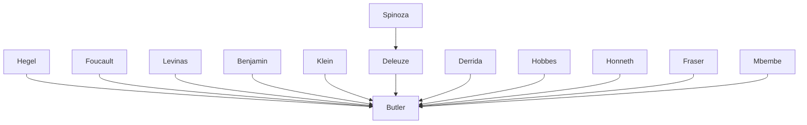

---

cssclasses:
  - Philosophy
  - Political-Science
subclasses:
  - Ethics
  - Social-and-Political-Philosophy
  - Critical-Theory
related:
  - "[[Precariousness]]"
  - "[[Biopolitics]]"
  - "[[Recognition]]"
  - "[[Grievability]]"
  - "[[State Violence]]"
  - "[[Bodily Ontology]]"
aliases:
  - precarious life
  - grievable life
  - frames war
  - differential grievability
  - bodily ontology
  - social ontology
  - recognition precariousness
  - livable life
  - precarity vulnerability
  - ungrievable lives
reference:
  - "Butler, J. (2009). Frames of war: when is life grievable? Verso. (pp.1-32)"
tags:
  - Podcast
---

#### Podcast

<iframe allow="autoplay *; encrypted-media *; fullscreen *; clipboard-write" frameborder="0" height="150" style="width:100%;overflow:hidden;border-radius:10px;background:transparent;" sandbox="allow-forms allow-popups allow-same-origin allow-scripts allow-storage-access-by-user-activation allow-top-navigation-by-user-activation" src="https://embed.podcasts.apple.com/us/podcast/frames-of-war-when-is-life-grievable/id1786764068?i=1000685584417&uo=4&l=en-GB&theme=auto"></iframe>

---

#### Central Problem

How do certain lives come to be recognized as "lives" worth grieving, while others remain ungrievable? Butler addresses the epistemological and ontological problem of how "frames"—normative structures that condition perception and recognition—determine which lives are apprehended as living and which are rendered invisible or disposable. The central problem emerges from the context of contemporary war (particularly post-9/11 conflicts): the selective framing of violence regulates affective and ethical dispositions, producing differential distributions of precariousness and grievability across populations.

The text grapples with the intersection of two registers: the epistemological question of how we apprehend or fail to apprehend lives as injured, lost, or injurable; and the ontological question of what constitutes "a life" when the very "being" of life is produced through selective, politically saturated operations of power. If certain lives are not conceivable as lives within dominant epistemological frames, then they are "never lived nor lost in the full sense." This has direct implications for understanding war's legitimation—how some deaths are mourned while others are treated as necessary sacrifices or non-events.

#### Main Thesis

Butler argues that **precariousness is a generalized condition of all life**, but **precarity** is the politically induced condition whereby certain populations are differentially exposed to violence, injury, and death while being denied the conditions for a livable life. Recognition of this shared precariousness should ground normative commitments to equality and generate ethical obligations to minimize precarity in egalitarian ways.

The argument unfolds through several interconnected claims:

1. **Frames are operations of power**: The perceptual and representational frames through which we apprehend lives are not neutral but politically saturated. They do not merely reflect reality but actively constitute which lives appear as lives and which do not.

2. **Grievability precedes apprehension of life**: For a life to count as a life, it must be apprehended as grievable—as a life that would be mourned if lost. This "future anterior" structure means that lives deemed ungrievable from the start are effectively excluded from the category of "life."

3. **Recognition versus apprehension**: While recognition is a stronger Hegelian term implying reciprocal acknowledgment between subjects, apprehension is more primordial—a mode of sensing and registering that may not yet (or ever) achieve conceptual form. We can apprehend that something is not recognized.

4. **Bodily ontology is social ontology**: The body is constitutively exposed to others, dependent on social conditions and institutions for its persistence. There is no "life itself" independent of the conditions that sustain life. This social ontology of the body challenges liberal individualism.

5. **Precarity as basis for coalitional politics**: Rather than identity politics, Butler proposes precarity as a transversal concept that can ground new alliances against state violence and the differential distribution of vulnerability.

#### Historical Context

The text was written in 2008, completed shortly after Barack Obama's election and in the aftermath of the Bush administration's "War on Terror." Butler explicitly situates the essays as responses to contemporary war, particularly the conflicts in Iraq and Afghanistan, the Abu Ghraib torture photographs, and the detention facility at Guantánamo Bay. The circulation of images from these sites—and the suppression of other images—exemplifies how frames of war operate.

The broader intellectual context includes: the rise of biopolitics as a theoretical framework (following Foucault, Agamben, Rose); debates about recognition in political philosophy (Taylor, Honneth, Fraser); feminist and queer theory's engagement with questions of bodily vulnerability; and post-structuralist critiques of liberal humanism. The text also responds to the mobilization of feminist and LGBTQ+ rights discourses to rationalize military intervention and anti-immigration politics—what has been called "homonationalism" and "femonationalism."

Butler's earlier work *Precarious Life* (2004) established the framework, but *Frames of War* extends it by focusing on the mechanisms of framing themselves and their relationship to affect, media, and the material conditions of war.

#### Philosophical Lineage

#### Key Thinkers

| Thinker | Dates | Movement | Main Work | Core Concept |
|---------|-------|----------|-----------|--------------|
| [[Hegel]] | 1770-1831 | [[German Idealism]] | *Phenomenology of Spirit* | Recognition, dialectic of self-consciousness |
| [[Foucault]] | 1926-1984 | [[Post-structuralism]] | *Society Must Be Defended* | Biopolitics, historical a priori |
| [[Levinas]] | 1906-1995 | [[Phenomenology]] | *Totality and Infinity* | Alterity, ethical obligation to the Other |
| [[Benjamin]] | 1892-1940 | [[Critical Theory]] | *The Work of Art* | Mechanical reproduction, aura |
| [[Klein]] | 1882-1960 | [[Psychoanalysis]] | Selected Works | Aggression, manic-depressive states |
| [[Derrida]] | 1930-2004 | [[Deconstruction]] | *The Truth in Painting* | Frame (parergon), iterability |
| [[Honneth]] | 1949- | [[Critical Theory]] | *Struggle for Recognition* | Recognition, reification |

#### Key Concepts

| Concept | Definition | Related to |
|---------|------------|------------|
| Precariousness | Existential-ontological condition of all life as vulnerable, finite, dependent on conditions for persistence | [[Butler]], [[Vulnerability]] |
| Precarity | Politically induced condition whereby certain populations are differentially exposed to violence and denied conditions for livable life | [[Butler]], [[Biopolitics]] |
| Grievability | The condition of being grievable; the "future anterior" presupposition that a life would be mourned if lost, which constitutes that life as a life | [[Butler]], [[Recognition]] |
| Frame | Normative structure that conditions perception and recognition; operates as power by delimiting what can appear | [[Butler]], [[Derrida]] |
| Apprehension | Mode of knowing that is not yet recognition; sensing, registering, perceiving without full conceptualization | [[Butler]], [[Phenomenology]] |
| Recognition | Act or practice between subjects involving reciprocal acknowledgment; derived from Hegelian tradition | [[Hegel]], [[Honneth]] |
| Recognizability | General conditions that prepare or shape a subject for recognition; precedes the act of recognition | [[Butler]], [[Hegel]] |
| Social ontology | Understanding of the body/life as constitutively social, dependent, and interdependent rather than individualist | [[Butler]], [[Embodiment]] |
| Livable life | Life that has the conditions necessary for persistence and flourishing; what precarity denies to certain populations | [[Butler]], [[Ethics]] |
| Ungrievable lives | Lives that are not recognized as lives, whose loss is not mourned and does not register as loss | [[Butler]], [[Necropolitics]] |

#### Authors Comparison

| Theme | [[Butler]] | [[Agamben]] | [[Foucault]] |
|-------|------------|-------------|--------------|
| Central concern | Differential distribution of precariousness and grievability | Bare life, state of exception | Biopolitics, governmentality |
| Ontology of life | Social ontology; life always conditioned | Zoē/bios distinction | Life as object of power/knowledge |
| State violence | Illegitimate legal coercion, frames of war | Sovereign exception, homo sacer | Disciplinary and biopolitical power |
| Exclusion | Framing as ungrievable, outside recognition | Exclusion through inclusion (ban) | Normalization, abnormality |
| Political response | Coalitional politics based on shared precariousness | Thinking beyond sovereign power | Resistance, counter-conduct |
| Critique of liberalism | Against individualist ontology | Against juridical conception of power | Against repressive hypothesis |

#### Influences & Connections

- **Predecessors:** [[Butler]] ← influenced by ← [[Hegel]], [[Foucault]], [[Levinas]], [[Derrida]], [[Benjamin]], [[Klein]], [[Spinoza]]
- **Contemporaries:** [[Butler]] ↔ dialogue with ↔ [[Honneth]], [[Fraser]], [[Mbembe]], [[Agamben]], [[Haraway]]
- **Followers:** [[Butler]] → influenced → feminist philosophy of vulnerability, critical war studies, affect theory, queer necropolitics
- **Opposing views:** [[Butler]] ← criticized by ← liberal universalists, identity-based politics, some humanist positions

#### Summary Formulas

- **[[Butler]]:** Precariousness is a shared ontological condition of all life, but precarity—the differential distribution of vulnerability—is politically produced. Grievability precedes and makes possible the apprehension of life as life; frames of war constitute which lives are recognizable and grievable.

- **On frames:** The frame does not simply contain what it conveys; it breaks with itself in order to reproduce itself. This iterability creates conditions for subversion—frames can be "framed" to expose the power that seeks to control perception.

- **On bodily ontology:** The body is constitutively social, exposed to others, dependent on conditions. This social ontology of the body challenges liberal individualism and grounds obligations to minimize precarity in egalitarian ways.

- **On recognition:** Recognition is a reciprocal act between subjects; but recognizability—the general conditions that prepare subjects for recognition—is historically contingent and normatively produced. Apprehension is a more primordial mode that can exceed or critique norms of recognition.

#### Notable Quotes

> "If certain lives do not qualify as lives or are, from the start, not conceivable as lives within certain epistemological frames, then these lives are never lived nor lost in the full sense." — [[Butler]]

> "Without grievability, there is no life, or, rather, there is something living that is other than life. Instead, 'there is a life that will never have been lived,' sustained by no regard, no testimony, and ungrieved when lost." — [[Butler]]

> "Precariousness implies living socially, that is, the fact that one's life is always in some sense in the hands of the other." — [[Butler]]

---
> [!warning]-
> This annotation was normalised using a large language model and may contain inaccuracies. These texts serve as preliminary study resources rather than exhaustive references.
