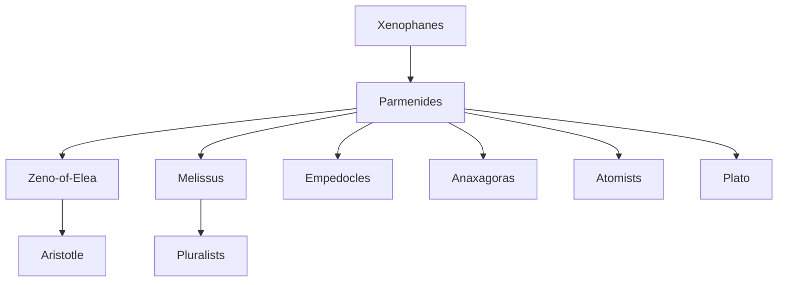

---
cssclasses:
  - Philosophy
subclasses:
  - Ancient-Greek-and-Roman-Philosophy
  - Metaphysics
  - Logic-and-Philosophy-of-Logic
aliases:
  - eleatic school
  - parmenides being
  - zeno paradoxes
  - being non
  - ontology
  - truth opinion
  - achilles tortoise
  - monism
  - immutable being
  - xenophanes
contributions:
  - Conceptual
authors:
  - "[[Parmenides]]"
  - "[[Elea]]"
  - "[[Melissus]]"
  - "[[Xenophanes]]"
reference: "[[01 The search for thought - Unit 1 Chapter 3.pdf]]"
---

#### Central Problem

The Eleatic philosophers confronted the fundamental problem of the relationship between appearance and reality, between what the senses report and what reason demonstrates. While the Ionian philosophers had sought the physical principle or substance capable of explaining multiplicity and change in nature, the Eleatics aimed to go beyond the surface to reach a unique, eternal, and immutable Being, before which our world is mere deceptive appearance.

The central question becomes: what is truly real? The Eleatics argue that things are not as the senses and experience show them, but as reason thinks them according to rigorous logic. This leads to a profound tension: how can we reconcile the rational necessity of an unchanging, unified Being with the testimony of our senses, which present a world of multiplicity, change, and motion?

This problem has profound implications for epistemology (the relationship between reason and sense perception), ontology (the nature of being itself), and logic (the principles of identity and non-contradiction that underlie all reasoning). The Eleatic challenge forced subsequent philosophers to either defend the reality of change and plurality or explain how they could be reconciled with the demands of logical consistency.

#### Main Thesis

**Parmenides' Fundamental Doctrine:** [[Parmenides]] establishes the foundational thesis: "Being is and cannot not be, while non-being is not and cannot be." Only Being exists; non-being, by definition, does not exist and cannot be thought or expressed. Our mind and language can refer only to being; non-being is unthinkable and inexpressible.

From this principle, Parmenides derives the attributes of true Being through rigorous logical deduction:

- **Ungenerated and imperishable:** If Being were born or perished, it would imply non-being (coming from nothing or dissolving into nothing)
- **Eternal:** Being is an eternal present, beyond time's "was" and "will be"
- **Immutable and immobile:** Change or motion would imply states of non-being
- **Unique and homogeneous:** Multiplicity or internal differentiation would require intervals of non-being
- **Finite:** Following Greek thinking, finitude means completeness and perfection (symbolized by the sphere)

**Two Paths of Knowledge:** Parmenides distinguishes:
1. The path of truth (alétheia) — based on reason, leading to knowledge of true Being
2. The path of opinion (dóxa) — based on the senses, leading to knowledge of apparent being

The sensible world of multiplicity and change, implying non-being, is philosophically speaking mere appearance or illusion.

**Zeno's Defense:** [[Zeno of Elea]] defends Parmenides through reductio ad absurdum arguments. He demonstrates that admitting multiplicity and motion leads to worse contradictions than denying them:
- Arguments against plurality: things would be both finite and infinite in number
- Arguments against motion: the Stadium, Achilles and the Tortoise, the Flying Arrow, the Moving Rows

**Melissus' Development:** [[Melissus]] rigorously deduces Being's attributes but introduces important modifications: Being is spatially and temporally infinite (contra Parmenides' finite sphere), and he admits that multiplicity is logically possible provided the multiple entities do not change—opening the door for pluralist physics.

#### Historical Context

The Eleatic school flourished in the Greek colonies of southern Italy, taking its name from the city of Elea (on the coast of Campania, south of Paestum). This geographical shift from Ionia to Magna Graecia marks an important development in early Greek philosophy.

[[Xenophanes]] of Colophon (c. 580-565 BCE), traditionally considered the initiator of Eleatism, was a wandering poet who criticized the anthropomorphism of Greek religion. He argued against Homer and Hesiod for attributing to the gods human forms and moral failings. For Xenophanes, there is one God who "resembles mortals neither in body nor in thought."

[[Parmenides]] was the true founder of the school. Born in Elea, he lived approximately 550-450 BCE. His philosophical poem *On Nature* presents his thought through the image of a divine revelation: the poet is transported by divine maidens to a goddess who reveals "the solid heart of well-rounded Truth." The inspired, oracular tones suggest Parmenides' probable aristocratic background, viewing knowledge as the patrimony of few initiates.

[[Zeno of Elea]] (born c. 489 BCE) was Parmenides' student and friend. He died courageously in 431 BCE under torture for conspiring against a tyrant. According to Plato, his thought was "a kind of reinforcement" of Parmenidean philosophy.

[[Melissus]] of Samos (fl. 442 BCE) was also Parmenides' disciple and an accomplished naval commander who defeated the Athenian fleet led by Pericles. His modifications to Parmenidean doctrine inadvertently opened the path for pluralist philosophy.

#### Philosophical Lineage

#### Key Thinkers

| Thinker | Dates | Movement | Main Work | Core Concept |
|---------|-------|----------|-----------|--------------|
| [[Xenophanes]] | c. 580-475 BCE | [[Eleatic School]] | Poems | Critique of anthropomorphism, one God |
| [[Parmenides]] | c. 550-450 BCE | [[Eleatic School]] | *On Nature* | Being is, non-being is not |
| [[Zeno of Elea]] | c. 489-431 BCE | [[Eleatic School]] | Arguments | Paradoxes against motion and plurality |
| [[Melissus]] | fl. 442 BCE | [[Eleatic School]] | — | Infinite, incorporeal Being |

#### Key Concepts

| Concept | Definition | Related to |
|---------|------------|------------|
| Being (to on) | That which is; the unique, eternal, immutable reality behind appearances | [[Parmenides]], [[Ontology]] |
| Non-being | That which is not; logically impossible, unthinkable, inexpressible | [[Parmenides]], [[Logic]] |
| Alétheia | Truth; the path of reason leading to knowledge of true Being | [[Parmenides]], [[Epistemology]] |
| Dóxa | Opinion; the path of the senses leading to knowledge of appearances | [[Parmenides]], [[Epistemology]] |
| Ontology | The study of Being in its universal characteristics; originated with Parmenides | [[Parmenides]], [[Metaphysics]] |
| Principle of non-contradiction | It is impossible for the same thing to be and not be at the same time | [[Parmenides]], [[Aristotle]] |
| Dialectic | Method of refutation by accepting opponent's premise and deriving absurd consequences | [[Zeno of Elea]], [[Logic]] |
| Reductio ad absurdum | Proof method showing a thesis leads to contradiction | [[Zeno of Elea]], [[Logic]] |
| Infinite divisibility | The logical possibility of endlessly dividing any magnitude | [[Zeno of Elea]], [[Mathematics]] |
| Anthropomorphism | Attribution of human characteristics to gods; criticized by Xenophanes | [[Xenophanes]], [[Philosophy of Religion]] |

#### Authors Comparison

| Theme | [[Parmenides]] | [[Zeno of Elea]] | [[Melissus]] |
|-------|----------------|------------------|--------------|
| Main contribution | Doctrine of Being | Defense through paradoxes | Systematic deduction of attributes |
| Method | Direct logical argument | Reductio ad absurdum | Rigorous deduction |
| Being's extent | Finite (sphere = perfection) | — | Infinite (spatially and temporally) |
| Multiplicity | Impossible (implies non-being) | Leads to contradiction | Logically possible if unchanging |
| Motion | Impossible | Leads to paradoxes | Impossible |
| Corporeality | Ambiguous | — | Incorporeal |
| Primary targets | Common opinion, Heracliteans | Pythagoreans, pluralists | — |

#### Influences & Connections

- **Predecessors:** [[Parmenides]] ← influenced by ← [[Xenophanes]], [[Pythagoreans]]
- **Contemporaries:** [[Parmenides]] ↔ opposed to ↔ [[Heraclitus]]
- **Contemporaries:** [[Zeno of Elea]] ↔ refutes ↔ [[Pythagoreans]], [[Anaxagoras]]
- **Followers:** [[Parmenides]] → influenced → [[Plato]], [[Aristotle]]
- **Followers:** [[Melissus]] → opened path for → [[Empedocles]], [[Anaxagoras]], [[Atomists]]
- **Opposing views:** [[Eleatic School]] ← challenged by ← [[Pluralist Philosophy]]

#### Summary Formulas

- **[[Xenophanes]]:** There is one God unlike mortals in body or thought—human conceptions of deity are mere anthropomorphic projections.
- **[[Parmenides]]:** Being is and cannot not be; non-being is not and cannot be thought—the world of change and multiplicity is mere appearance, while true Being is eternal, unique, immutable, and necessary.
- **[[Zeno of Elea]]:** Those who admit plurality and motion fall into worse contradictions than those who deny them—Achilles can never overtake the tortoise, and the flying arrow is at rest.
- **[[Melissus]]:** Being is infinite in space and time, unique and incorporeal—but the logical prohibition falls only on becoming, not on plurality as such.

#### Timeline

| Year | Event |
|------|-------|
| c. 580 BCE | Birth of [[Xenophanes]] of Colophon |
| c. 550 BCE | Birth of [[Parmenides]] at Elea |
| c. 500 BCE | [[Parmenides]] composes *On Nature* |
| c. 489 BCE | Birth of [[Zeno of Elea]] |
| c. 475 BCE | Death of [[Xenophanes]] |
| c. 460 BCE | [[Zeno]] develops his paradoxes |
| c. 450 BCE | Death of [[Parmenides]] |
| 442 BCE | [[Melissus]] defeats Athenian fleet under Pericles |
| 431 BCE | Death of [[Zeno of Elea]] under torture |

#### Notable Quotes

> "It is necessary to say and think that Being is: for Being is, and nothing is not." — [[Parmenides]]

> "It is the same thing to think and to be." — [[Parmenides]]

> "Being is ungenerated and imperishable, whole, of one kind, unshaken and complete." — [[Parmenides]]

#### See Also

- [[Presocratic Philosophy]]
- [[Ontology]]
- [[Metaphysics]]
- [[Philosophy of Logic]]
- [[Zeno's Paradoxes]]
- [[Pluralist Philosophy]]
- [[Plato]]
- [[Aristotle]]
- [[Heraclitus]]
- [[Being and Becoming]]

> [!NOTE]
> *This summary has been created to present the key points from the source text, which was automatically extracted using LLM. Please note that the summary may contain errors. It serves as an essential starting point for study and reference purposes.*
