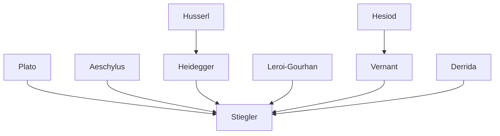

---
cssclasses:
  - Philosophy
subclasses:
  - Continental-Philosophy
  - Phenomenology
  - Philosophy-of-Mind
related:
  - "[[Technics]]"
  - "[[Heidegger]]"
  - "[[Prometheus]]"
  - "[[Epimetheus]]"
  - "[[Temporality]]"
  - "[[Mortality]]"
aliases:
  - fault epimetheus
  - technics time
  - prometheus epimetheus
  - originary technicity
  - default origin
  - prosthetic being
  - mortality technics
  - anticipation delay
  - hermeneutic finitude
  - prometheia epimetheia
reference:
  - Stiegler, B., & Stiegler, B. (1998). The Fault of Epimetheus. Stanford Univ. Pr. (pp.185-203)
---

#### Central Problem

What is the relationship between technics, temporality, and the human condition? Stiegler interrogates the philosophical significance of the Promethean myth, arguing that Western metaphysics has systematically forgotten the figure of Epimetheus—the one who thinks "after the event"—in favor of Prometheus, the foresighted one. This forgetting conceals the originary technicity of human existence: that humans are constitutively prosthetic beings, defined by a fundamental "default of origin" (*défaut d'origine*).

The central tension lies in the opposition that metaphysics establishes between *logos* and *tekhne*, *phusis* and *nomos*, the intelligible and the sensible. Stiegler argues that this opposition obscures the tragic Greek understanding of technics, in which mortality, anticipation, and technical existence are inseparably intertwined. The existential analytic of Heidegger, despite its attention to finitude and temporality, fails to recognize the irreducible rootedness of Dasein's temporal structure in technicity—a rootedness that the myth of Prometheus and Epimetheus reveals.

#### Main Thesis

Stiegler advances a radical reinterpretation of human existence through the myth of Prometheus and Epimetheus:

**1. The Fault as Origin:** Humans emerge not from a positive gift but from a double fault—Epimetheus's forgetting (he distributed all qualities to animals, leaving humans with nothing) and Prometheus's theft (of fire and *tekhne* from the gods). There is no origin, only "the duplicity of an originary flaw." Humans appear through disappearing; they exist through their being forgotten. The origin is itself a de-fault (*le défaut d'origine ou l'origine comme défaut*).

**2. Anthropogony as Thanatology:** The myth is not properly an anthropogony but a thanatology. Humans are defined not by what they are but by their mortality—their position "between beasts and gods." Unlike animals who merely perish, mortals know death and relate to immortality through sacrifice, religion, and the cult of the divine. This relation to death, configured through the interplay of *prometheia* (foresight/anticipation) and *epimetheia* (reflection after the event), constitutes the structure of temporality itself.

**3. Prosthetic Being:** The being of humankind is to be outside itself. Technics is not an addition to a pre-existing human nature but the very constitution of the human. "Prometheus gives humans the present of putting them outside themselves." The prosthesis—that which is placed in front, outside—constitutes the very being of what it lies outside of. Humans are "unqualifiable" because they are without qualities; they must invent themselves through technics.

**4. Temporality as Technical:** The intertwining of *prometheia* (anticipation, advance) and *epimetheia* (delay, reflection after the event) yields the structure of temporality as described in Heidegger's being-toward-the-end. But Stiegler argues that this temporal structure is originarily rooted in technicity—a rooting that "undermines any possibility of placing in opposition authentic time and the time of calculation and concern."

**5. The Political as Technical:** The question of community (*polis*) arises from the de-fault of origin. Zeus sends Hermes with *aido* (shame/respect) and *dike* (justice) to all mortals—not as specialized skills but as the shared feeling of finitude that makes community possible. Politics is itself a *tekhne*, "the community of those who have no community," no essence, no quality.

#### Historical Context

Stiegler writes in the wake of Heidegger's thinking on technology and drawing heavily on Jean-Pierre Vernant's classical scholarship on Greek religion and myth. The text engages with the late 20th-century French reception of phenomenology, particularly the post-Heideggerian turn toward questions of technics and exteriorization.

The analysis builds on André Leroi-Gourhan's paleontological anthropology, which demonstrated that tool use and brain development co-evolved, challenging the metaphysical separation of spirit from technical animality. Stiegler sees in Leroi-Gourhan both a breakthrough and a residual metaphysics that must be overcome.

The political horizon is shaped by questions about citizenship, writing, and democracy in ancient Greece—particularly Marcel Détienne's work on writing as constitutive of political practices. The reference to "the community of those who have no community" invokes Georges Bataille and the problematic of communal existence without essence.

#### Philosophical Lineage

#### Key Thinkers

| Thinker | Dates | Movement | Main Work | Core Concept |
|---------|-------|----------|-----------|--------------|
| [[Heidegger]] | 1889-1976 | [[Phenomenology]] | *Being and Time* | Dasein, being-toward-death, facticity |
| [[Vernant]] | 1914-2007 | [[Classical Studies]] | *Myth and Thought among the Greeks* | Tragic Greek understanding of technics |
| [[Leroi-Gourhan]] | 1911-1986 | [[Paleontology]] | *Gesture and Speech* | Exteriorization, technical evolution |
| [[Plato]] | c. 428-348 BCE | [[Ancient Philosophy]] | *Protagoras* | Myth of Prometheus |
| [[Hesiod]] | c. 700 BCE | [[Ancient Poetry]] | *Theogony*, *Works and Days* | Golden age, elpis, Pandora |
| [[Détienne]] | 1935-2019 | [[Classical Studies]] | *The Masters of Truth* | Writing and political practices |

#### Key Concepts

| Concept | Definition | Related to |
|---------|------------|------------|
| Default of origin | The originary fault/lack that constitutes human existence; there is no positive origin, only the duplicity of an originary flaw | [[Stiegler]], [[Finitude]] |
| Prometheia | Foresight, anticipation, advance; worry in advance; the Promethean relation to the future | [[Temporality]], [[Stiegler]] |
| Epimetheia | Reflection after the event, delay, wisdom that comes too late; essential technicity as condition of finitude | [[Temporality]], [[Stiegler]] |
| Prosthesis | That which is placed in front/outside; constitutes the very being of what it lies outside of; technics as prosthetic | [[Technics]], [[Stiegler]] |
| Thanatology | The study of mortality; anthropogony understood as the configuration of dying rather than of living | [[Heidegger]], [[Mortality]] |
| Elpis | Anticipation/expectation (neither hope nor fear specifically); blind hopes that balance consciousness of death | [[Hesiod]], [[Temporality]] |
| Aido | Shame, respect, modesty; the feeling of finitude shared by all mortals; basis of political community | [[Ethics]], [[Politics]] |
| Dike | Justice; hermeneutical knowledge shared by all; must be interpreted in each situation of decision | [[Politics]], [[Ethics]] |
| Eris | Spirit of competition/strife; good eris is emulation, bad eris is fratricidal war; permanent threat to polis | [[Politics]], [[Vernant]] |
| Différance | Deferred difference; the temporal structure of technicity as both advance and delay | [[Derrida]], [[Stiegler]] |

#### Authors Comparison

| Theme | [[Stiegler]] | [[Heidegger]] |
|-------|-------------|---------------|
| Technicity | Originary, constitutive of human existence | Derivative, a falling from authentic temporality |
| Epimetheus | Central figure of finitude, forgotten by metaphysics | Absent from existential analytic |
| Temporality | Rooted irreducibly in technics | Distinguished from calculative/concerned time |
| Being-toward-death | Configured through prometheia/epimetheia | Individualizing, authentic possibility |
| Facticity | Technical, prosthetic having-to-be | Thrownness into the "there" |
| Community | De-fault of community; no essence or quality | Mitsein (being-with) |
| Authenticity | No opposition to technical existence | Distinguished from inauthentic fallenness |

#### Influences & Connections

- **Predecessors:** [[Stiegler]] ← influenced by ← [[Heidegger]], [[Derrida]], [[Leroi-Gourhan]], [[Vernant]]
- **Sources:** [[Stiegler]] ← draws on ← [[Hesiod]], [[Plato]], [[Aeschylus]]
- **Contemporaries:** [[Stiegler]] ↔ dialogue with ↔ [[Derrida]], [[Simondon]]
- **Followers:** [[Stiegler]] → influenced → philosophy of technology, media theory, digital humanities
- **Opposing views:** [[Stiegler]] ← critiques ← [[Heidegger]] (absence of Epimetheus), [[Leroi-Gourhan]] (residual metaphysics)

#### Summary Formulas

- **[[Stiegler]] on technicity:** The being of humankind is to be outside itself; technics is not added to a pre-existing human nature but constitutes it as prosthetic, originary, and mortal.

- **[[Stiegler]] on temporality:** Prometheia (anticipation/advance) and epimetheia (delay/reflection after the event) together form the structure of temporality, which is irreducibly rooted in technicity.

- **[[Stiegler]] on origin:** There is no origin, only the fault—the de-fault of origin or the origin as de-fault. Humans appear through disappearing, exist through being forgotten.

- **[[Stiegler]] on politics:** The polis is "the community of those who have no community"—no essence, no quality—held together by aido and dike, the shared feeling of finitude that must be interpreted anew in each situation.

#### Timeline

| Year | Event |
|------|-------|
| c. 700 BCE | [[Hesiod]] composes *Theogony* and *Works and Days* |
| c. 450 BCE | [[Aeschylus]] writes *Prometheus Bound* |
| c. 385 BCE | [[Plato]] writes *Protagoras* with myth of Prometheus/Epimetheus |
| 1927 | [[Heidegger]] publishes *Being and Time* |
| 1964-1965 | [[Leroi-Gourhan]] publishes *Gesture and Speech* |
| 1974 | [[Vernant]] publishes *Myth and Thought among the Greeks* |
| 1994 | [[Stiegler]] publishes *La technique et le temps, 1* (French) |
| 1998 | English translation: *Technics and Time, 1: The Fault of Epimetheus* |

#### Notable Quotes

> "The being of humankind is to be outside itself. In order to make up for the fault of Epimetheus, Prometheus gives humans the present of putting them outside themselves." — [[Stiegler]]

> "There will have been nothing at the origin but the fault, a fault that is nothing but the de-fault of origin or the origin as de-fault. There will have been no appearance except through disappearance." — [[Stiegler]]

> "Tragic anthropogony is thus a thanatology that is configured in two moves, the doubling-up of Prometheus by Epimetheus. Epimetheus is not simply the forgetful one... he is also the one who is forgotten. The forgotten of metaphysics." — [[Stiegler]]

---
> [!warning]-
> This annotation was normalised using a large language model and may contain inaccuracies. These texts serve as preliminary study resources rather than exhaustive references.
