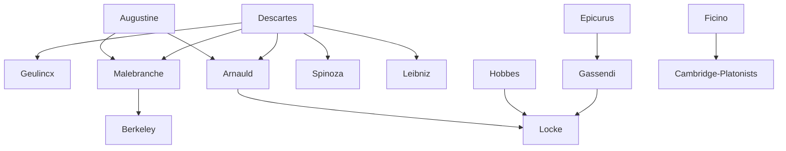

---
cssclasses:
  - Philosophy
subclasses:
  - 17th-18th-Century-Philosophy
  - Metaphysics
  - Philosophy-of-Religion
related:
  - "[[Rationalism]]"
  - "[[Occasionalism]]"
  - "[[Cartesian Dualism]]"
  - "[[Jansenism]]"
  - "[[Port-Royal Logic]]"
  - "[[Deism]]"
  - "[[Libertinism]]"
  - "[[Mind-Body Problem]]"
  - "[[Causation]]"
  - "[[Enlightenment]]"
aliases:
  - port royal
  - divine causation
  - vision god
  - english platonism
  - rational religion
  - struggle reason
  - finite reason
  - natural religion
reference:
  - "Abbagnano, N., & Fornero, G. (2012). La ricerca del pensiero. Vol. 2A. Dall'Umanesimo all'empirismo. Paravia."
---

#### Central Problem

How should the philosophy of [[Descartes]] be understood and developed — as a methodological technique of autonomous rational inquiry applicable to all domains, or as a metaphysical system of doctrines about mind, body, and God? The seventeenth century witnessed a profound "struggle for reason" (*lotta per la ragione*) in which competing interpretations of rationalism battled over the scope, nature, and limits of human reason.

The central questions included: Can the Cartesian method be extended beyond physics to morality, politics, and religion? What is the relationship between the two radically heterogeneous substances — thinking and extended — that [[Descartes]] posited? If mind and body cannot causally interact (as seems implied by their complete heterogeneity), how do we explain the apparent coordination between mental and physical events? And how should the claims of reason be balanced against the claims of faith?

Two fundamentally opposed conceptions of reason emerged: (1) the Cartesian view of reason as an infinite, infallible, omnipotent force requiring nothing outside itself; (2) the view (developed by [[Gassendi]] and [[Hobbes]]) that reason is a finite, conditioned power, limited by the specific domains of its activity.

#### Main Thesis

The chapter presents several distinct but interconnected responses to the Cartesian legacy:

**Occasionalism:** [[Geulincx]] and [[Malebranche]] radicalize Cartesian dualism by denying any causal interaction between mind and body. Since two heterogeneous substances cannot act upon one another, God must be the sole true cause of everything that occurs in both substances. Mental and physical events are merely "occasions" for divine causal intervention. For [[Malebranche]], we "see all things in God" — eternal truths are perceived directly in the divine intellect, and our rational activity is a form of prayer, a participation in divine life.

**Port-Royal Logic:** [[Arnauld]] and [[Nicole]] accept Cartesian principles but reject occasionalist intermediaries. Knowledge is the immediate perception of objects, and ideas are objects themselves present to consciousness. Their *Logic, or the Art of Thinking* (1662) establishes a mentalist logic focused on operations of the spirit: conceiving, judging, reasoning, and ordering.

**Gassendi's Christianized Epicureanism:** [[Gassendi]] finds neither Aristotelianism nor Cartesianism adequate against skepticism, and turns instead to Epicurean atomism, modified to accommodate Christian faith. Atoms are created by God (not eternal), motion derives from God (not inherent), and the world order is providential (not random). An incorporeal intellectual soul is added to the corporeal sensitive soul.

**Libertinism:** The *libertins érudits* use Renaissance and skeptical resources to critique traditional religious beliefs, preparing the ground for Enlightenment. Their work remains largely underground, intended for an elite, not for popular diffusion.

**English Platonism:** Thinkers like [[Herbert of Cherbury]], [[Cudworth]], and [[More]] seek a "natural religion" reducible to rational essentials common to all faiths, founding the deist tradition.

#### Historical Context

The seventeenth century was marked by the aftermath of the Wars of Religion and ongoing confessional conflicts. The Peace of Westphalia (1648) concluded the Thirty Years' War, but religious intolerance persisted. The Catholic Church maintained dominance in the Latin countries through mechanisms of censorship and condemnation.

Universities remained largely closed to Cartesianism. The Sorbonne was restricted by the 1625 Parisian Parliament prohibition on teaching new doctrines. Only Dutch universities provided significant hospitality to Cartesian thought. Traditional scholastic philosophy maintained its institutional dominance in European universities and religious colleges.

[[Descartes]] himself had refused to extend rational critique beyond science, viewing his philosophy as confirmation of traditional metaphysics, morality, and religion. But his followers and critics pushed in different directions — some using Cartesianism to defend faith (occasionalism, Jansenism), others using it or criticizing it to liberate thought from religious constraints (libertinism).

[[Gassendi]]'s circles in Paris brought together scholars, magistrates, politicians, and moralists whose underground critique of traditional beliefs would eventually surface in the Enlightenment. The transition from libertinism to Enlightenment required [[Locke]]'s clarification of finite reason and [[Newton]]'s natural philosophy.

#### Philosophical Lineage

#### Key Thinkers

| Thinker | Dates | Movement | Main Work | Core Concept |
|---------|-------|----------|-----------|--------------|
| [[Geulincx]] | 1624-1669 | [[Occasionalism]] | *Metaphysica vera* | God as sole cause, humility |
| [[Malebranche]] | 1638-1715 | [[Occasionalism]] | *Search After Truth* | Vision in God, rational prayer |
| [[Arnauld]] | 1612-1694 | [[Jansenism]] | *Port-Royal Logic* | Knowledge as immediate perception |
| [[Gassendi]] | 1592-1655 | [[Atomism]] | *Syntagma philosophicum* | Christianized Epicureanism |
| [[Herbert of Cherbury]] | 1583-1648 | [[Deism]] | *De Veritate* | Natural religion, common notions |
| [[Cyrano de Bergerac]] | 1619-1655 | [[Libertinism]] | *States and Empires of the Moon* | Universal animation |

#### Key Concepts

| Concept | Definition | Related to |
|---------|------------|------------|
| Occasionalism | Doctrine that God is the sole true cause; mental and physical events are merely occasions for divine intervention | [[Malebranche]], [[Geulincx]] |
| Vision in God | The doctrine that eternal truths are perceived directly in the divine intellect | [[Malebranche]], [[Augustine]] |
| Struggle for reason | The seventeenth-century philosophical project of establishing reason's autonomy in all domains | [[Rationalism]], [[Enlightenment]] |
| Infinite reason | The Cartesian conception of reason as unlimited, infallible, self-sufficient | [[Descartes]], [[Spinoza]] |
| Finite reason | The conception of reason as conditioned and limited by domains of application | [[Gassendi]], [[Hobbes]], [[Locke]] |
| Cartesian scolasticism | The use of Cartesian philosophy to defend religious faith, analogous to medieval use of [[Aristotle]] | [[Occasionalism]], [[Jansenism]] |
| Mentalism | Logical theory focusing on mental operations (conceiving, judging, reasoning, ordering) rather than terms | [[Arnauld]], [[Port-Royal Logic]] |
| Deism | Belief in a natural or rational religion reducible to essential truths common to all faiths | [[Herbert of Cherbury]], [[English Platonism]] |
| Libertinism | Seventeenth-century movement of free thought critiquing traditional religious beliefs | [[Gassendi]], [[Cyrano de Bergerac]] |
| Christianized atomism | [[Gassendi]]'s modification of Epicurean atomism to accommodate Christian doctrines | [[Gassendi]], [[Epicurus]] |

#### Authors Comparison

| Theme | [[Malebranche]] | [[Arnauld]] | [[Gassendi]] |
|-------|-----------------|-------------|--------------|
| Relation to [[Descartes]] | Cartesian scholasticism | Accepts Cartesianism fully | Critical, uses skeptical arguments |
| Theory of knowledge | Vision in God | Immediate perception | Empiricist-atomist |
| Role of God | Sole cause, guarantor of ideas | Guarantor of natural faculties | Creator of atoms and motion |
| Approach to faith | Rational theology, vision | Augustinian Jansenism | Faith as prudent choice |
| Nature of ideas | Archetypes seen in God | Objects present to consciousness | Derived from atomic impressions |
| Causation | Only God truly causes | Natural causation accepted | Mechanical causation of atoms |

#### Influences & Connections

- **Predecessors:** [[Malebranche]] ← influenced by ← [[Augustine]], [[Descartes]]; [[Gassendi]] ← influenced by ← [[Epicurus]], Renaissance skeptics
- **Contemporaries:** [[Malebranche]] ↔ controversy with ↔ [[Arnauld]] (on grace, nature of ideas); [[Gassendi]] ↔ dialogue with ↔ libertine circles
- **Followers:** [[Malebranche]] → influenced → [[Berkeley]], [[Hume]]; [[Gassendi]] → influenced → [[Locke]], Enlightenment
- **Followers:** [[Arnauld]] → influenced → [[Locke]] (theory of ideas as perception)
- **Opposing views:** [[Malebranche]] ← criticized by ← [[Arnauld]] (occasionalism approaches Spinozism); Traditional scholasticism ← opposed to ← all Cartesian developments

#### Summary Formulas

- **[[Geulincx]]:** Since two heterogeneous substances cannot act upon one another, God alone is the true cause of all modifications in mind and body; I am a "spectator," not an "actor," and my only proper attitude is humility before divine will.

- **[[Malebranche]]:** Rational inquiry is natural prayer; we see eternal truths directly in God, and God produces in us ideas on the occasion of corporeal presence — thus philosophical contemplation is participation in divine life.

- **[[Arnauld]]:** Cartesianism covers all natural knowledge; beyond it, faith has free course. Knowledge is immediate perception of objects, not vision in God.

- **[[Gassendi]]:** Epicurean atomism, purified of its anti-Christian elements (eternal atoms, inherent motion, random order, mortal soul), provides a materialist philosophy compatible with faith.

#### Timeline

| Year | Event |
|------|-------|
| 1625 | Parisian Parliament prohibits teaching new doctrines at the Sorbonne |
| 1640 | [[Arnauld]] writes Fourth Objections to [[Descartes]]' *Meditations* |
| 1662 | [[Arnauld]] and [[Nicole]] publish *Logic, or the Art of Thinking* (Port-Royal Logic) |
| 1669 | [[Geulincx]] dies; *Metaphysica vera* published posthumously |
| 1674-1675 | [[Malebranche]] publishes *Search After Truth* |
| 1680 | [[Malebranche]] publishes *Treatise on Nature and Grace*; controversy with [[Arnauld]] begins |
| 1683 | [[Arnauld]] publishes *On True and False Ideas* against [[Malebranche]] |
| 1688 | [[Malebranche]] publishes *Dialogues on Metaphysics and Religion* |
| 1715 | [[Malebranche]] dies in Paris |

#### Notable Quotes

> "I am not an actor but a spectator of the mechanism of divine causality that unfolds within me; therefore my only possible attitude is humility before the divine will." — [[Geulincx]]

> "The effort of the searching reason, attention, is the 'natural prayer' of man and the way to communicate with God." — [[Malebranche]]

> "What we see in God are not things themselves, but their ideas, that is, their archetypes or models." — [[Malebranche]]

---
> [!NOTE]
> *This summary has been created to present the key points from the source text, which was automatically extracted using LLM. Please note that the summary may contain errors. It serves as an essential starting point for study and reference purposes.*
