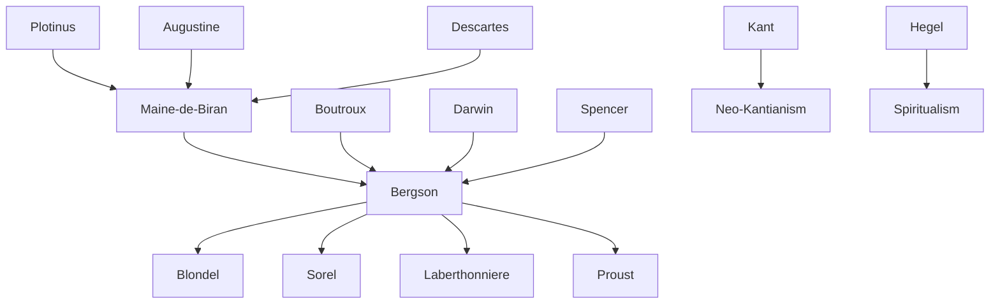

---
cssclasses:
  - Philosophy
  - Psychology
subclasses:
  - 19th-Century-Philosophy
  - Continental-Philosophy
  - Metaphysics
aliases:
  - spiritualism
  - bergson
  - duration
  - vital impulse
  - intuition
  - creative evolution
  - antipositivism
  - open society
  - closed society
  - static religion
  - dynamic religion
  - spatialized time
  - lived time
  - memory consciousness
  - action philosophy
contributions:
  - Conceptual
  - Constructive
authors:
  - "[[Bergson]]"
  - "[[Blondel]]"
  - "[[Sorel]]"
  - "[[Boutroux]]"
  - "[[Biran]]"
  - "[[Laberthonnière]]"
reference: "[[05 The search for thought - Unit 4 Chapter 1.pdf]]"
---

#### Central Problem

The chapter addresses the fundamental question of how to overcome the limitations of positivism, which reduced all reality to natural facts governed by mechanical laws and limited knowledge exclusively to scientific inquiry. This reductionist approach denied the autonomy and originality of the human spirit, including art, moral values, religion, and freedom. The central problem for anti-positivist currents becomes: What is the proper task of philosophy? What reality should it investigate, and through what methods can this reality be accessed?

The crisis emerges from positivism's inability to account for human values and the freedom of the spirit that creates them. If everything is reducible to mechanically determined natural facts, there is no room for individual freedom or the creative dimensions of human existence. Anti-positivist thinkers assert that knowledge is not exhausted by scientific knowledge, that reality extends beyond material facts to include spiritual facts, and that philosophy requires its own distinctive methods irreducible to those of natural science.

Bergson's specific contribution addresses the deeper problem of time and consciousness: how do we understand the lived experience of duration versus the abstract, spatialized time of physics? This leads to fundamental questions about freedom, the nature of life, and the relationship between intellect and intuition.

#### Main Thesis

The anti-positivist movements share a common framework: they deny that science is the only authentic form of knowledge; they affirm the existence of a spiritual reality beyond material facts; they identify consciousness and individual introspection as the path to knowing this reality; and they recognize the unity of the individual as the dimension gathering all spiritual manifestations.

Spiritualism, the first form of reaction against positivism, chooses interior auscultation — consciousness — as its primary philosophical instrument. The authentic subject of philosophy is consciousness itself, understood not as passive contemplation but as a flowing, creative process.

**Bergson's Duration vs. Scientific Time:**
- Scientific time is quantitative, homogeneous, reversible, and composed of distinct moments (symbolized by a string of pearls)
- Lived time (duration) is qualitative, heterogeneous, irreversible, and composed of interpenetrating moments (symbolized by a growing ball of yarn or avalanche)
- Duration represents total conservation of the past combined with total creation of the new
- "To exist means to change, to change means to mature, to mature means to create oneself indefinitely"

**The Élan Vital (Vital Impulse):**
- Life is conceived as a current of consciousness that penetrates matter, seeking to dominate it
- Evolution proceeds through creative divergence, not according to a preformed design
- The unity of nature lies not in coordination toward a goal but in the original impulse that precedes all bifurcations
- Neither mechanism nor finalism adequately explains evolution; only the concept of creative vital impulse suffices

**Intellect vs. Intuition:**
- Intelligence, humanity's distinctive faculty, evolved for practical purposes — fabricating tools and manipulating inorganic matter
- Intelligence is naturally incapable of comprehending movement, becoming, and life itself
- Intuition represents a conscious return of intelligence to instinct — "instinct become disinterested, conscious of itself"
- Intuition is the proper organ of metaphysics, allowing direct access to duration and the creative impulse of life

**Open and Closed Societies:**
- Closed societies are static, where individuals act only as parts of the whole with minimal freedom
- Open societies are dynamic, continuing the creative effort of life
- The morality of obligation (pressure) characterizes closed societies; absolute morality (aspiration) characterizes open societies
- Static religion stems from the myth-making function defending against life's terrors; dynamic religion is mysticism joining the creative impulse

#### Historical Context

The chapter situates anti-positivist thought within the broader crisis of nineteenth-century philosophy dominated by two great movements: idealism (affirming Spirit or Reason as evolving reality) and positivism (affirming matter and force). Both shared a belief in necessary, progressive evolution but differed fundamentally on the nature of ultimate reality.

By the latter half of the nineteenth century, positivism's dominance created a philosophical crisis by reducing philosophy to mere critical reflection on science, thereby losing philosophy's methodological autonomy and distinctive object of inquiry. The reaction emerged initially in Germany with figures like Immanuel Hermann Fichte and Eduard von Hartmann, then spread to France (Maine de Biran, Boutroux, Bergson) and Italy (Martinetti).

The French context was particularly fertile, producing the philosophy of action (Blondel, Sorel) and the modernist movement within Catholicism (Laberthonnière), both emphasizing consciousness as will, activity, and creative moral action rather than mere contemplation.

Bergson's specific intervention came against the backdrop of debates about evolutionary theory (Darwin, Spencer) and the new physics (Einstein's relativity). His 1889 *Essay on the Immediate Data of Consciousness* already announced his distinctive method: liberating the original life of consciousness from fictitious intellectual structures. His 1907 *Creative Evolution* represented "true evolutionism" and the "true prolongation of science."

#### Philosophical Lineage

#### Key Thinkers

| Thinker | Dates | Movement | Main Work | Core Concept |
|---------|-------|----------|-----------|--------------|
| [[Bergson]] | 1859-1941 | [[Spiritualism]] | *Creative Evolution* | Duration, élan vital, intuition |
| [[Maine de Biran]] | 1766-1824 | [[Spiritualism]] | Introspective philosophy | Introspective method |
| [[Boutroux]] | 1845-1921 | [[Spiritualism]] | *The Contingency of Natural Laws* | Contingency, freedom |
| [[Blondel]] | 1861-1949 | [[Philosophy of Action]] | *L'Action* | Action as human expression |
| [[Sorel]] | 1847-1922 | [[Philosophy of Action]] | *Reflections on Violence* | Social myth, general strike |
| [[Laberthonnière]] | 1860-1932 | [[Modernism]] | Catholic reform writings | Immanence of supernatural |
| [[Martinetti]] | 1872-1943 | [[Italian Spiritualism]] | Anti-dogmatic philosophy | Religious intuition of universe |

#### Key Concepts

| Concept | Definition | Related to |
|---------|------------|------------|
| Duration (durée) | The lived time of consciousness — qualitative, heterogeneous, irreversible, where moments interpenetrate rather than stand external to one another | [[Bergson]], time, consciousness |
| Spatialized Time | Scientific/abstract time — quantitative, homogeneous, reversible, composed of distinct moments arranged like beads on a string | [[Bergson]], science, intellect |
| Élan Vital | Vital impulse or life force — consciousness as creative current penetrating matter, source of evolutionary divergence and biological creation | [[Bergson]], evolution, life |
| Intuition | Instinct become disinterested and self-conscious; the organ of metaphysics providing direct access to duration and life | [[Bergson]], metaphysics, knowledge |
| Memory (Pure) | Consciousness itself as automatic, integral conservation of the entire past; distinct from memory-image (specific recalled images) | [[Bergson]], consciousness, time |
| Closed Society | Static society where individuals act as parts of the whole, governed by morality of obligation and static religion | [[Bergson]], sociology, ethics |
| Open Society | Dynamic society continuing life's creative effort, characterized by absolute morality and dynamic religion (mysticism) | [[Bergson]], sociology, mysticism |
| Philosophy of Action | Spiritualist current viewing consciousness primarily as will, activity, and practical/creative engagement rather than contemplation | [[Blondel]], [[Sorel]], spiritualism |
| Contingency | Boutroux's thesis that each level of reality possesses originality irreducible to lower levels, implying freedom against mechanism | [[Boutroux]], freedom, nature |
| Social Myth | Sorel's concept of a collective conviction preparing masses for total destruction of existing reality through revolutionary action | [[Sorel]], revolution, action |

#### Authors Comparison

| Theme | [[Bergson]] | [[Blondel]] | [[Sorel]] |
|-------|-------------|-------------|-----------|
| Nature of consciousness | Duration, creative flow | Will, action | Revolutionary praxis |
| Central concept | Élan vital, intuition | Action toward infinite | Social myth |
| Relation to religion | Dynamic mysticism | Christian transcendence | Secular revolutionary faith |
| View of freedom | Expressed in duration | Manifest in action toward God | Realized in violent negation |
| Attitude toward science | Limited to inorganic matter | Subordinate to spiritual action | Tool for understanding capitalism |
| Social vision | Open society, mystical renewal | Christian community | Revolutionary syndicalism |
| Philosophical method | Intuition | Analysis of action | Critique of ideology |

#### Influences & Connections

- **Predecessors:** [[Bergson]] ← influenced by ← [[Maine de Biran]], [[Boutroux]], [[Darwin]], [[Spencer]]
- **Predecessors:** [[Bergson]] ← influenced by ← [[Plotinus]] (return of soul to itself), [[Augustine]] (noli foras ire), [[Descartes]] (cogito)
- **Contemporaries:** [[Bergson]] ↔ debate with ↔ [[Einstein]] (on simultaneity and relativity)
- **Followers:** [[Bergson]] → influenced → [[Blondel]], [[Sorel]], [[Proust]] (search for lost time)
- **Followers:** [[Bergson]] → influenced → [[Impressionism]] (artistic representation of duration)
- **Opposing views:** [[Bergson]] ← criticized by ← [[Positivism]], [[Einstein]] (on time and simultaneity)

#### Summary Formulas

- **[[Bergson]]:** Reality is duration — a continuous, creative flow of consciousness irreducible to the spatialized time of science; only intuition, not intellect, can grasp the vital impulse that animates all life.

- **[[Boutroux]]:** Each order of reality possesses originality and novelty irreducible to lower orders, demonstrating that nature includes contingency and therefore freedom against mechanical determinism.

- **[[Blondel]]:** Action is the only means of expressing human nature; since every act leaves aspirations unsatisfied, the will tends toward infinity, finding its absolute object only in God.

- **[[Sorel]]:** Freedom realizes itself only through violent, total opposition to established historical reality; when the negating "fantastic world" becomes collective patrimony, it transforms into a social myth preparing total destruction.

#### Timeline

| Year | Event |
|------|-------|
| 1874 | [[Boutroux]] publishes *The Contingency of Natural Laws* |
| 1889 | [[Bergson]] publishes *Essay on the Immediate Data of Consciousness* |
| 1893 | [[Blondel]] publishes *L'Action* |
| 1896 | [[Bergson]] publishes *Matter and Memory* |
| 1900 | [[Bergson]] publishes essay *Laughter* |
| 1905 | Einstein formulates special relativity (challenged by Bergson) |
| 1907 | [[Bergson]] publishes *Creative Evolution* |
| 1907 | Pope Pius X condemns modernism (encyclical *Pascendi*) |
| 1908 | [[Sorel]] publishes *Reflections on Violence* |
| 1922 | [[Bergson]] publishes *Duration and Simultaneity* (critique of Einstein) |
| 1928 | [[Bergson]] receives Nobel Prize for Literature |
| 1932 | [[Bergson]] publishes *The Two Sources of Morality and Religion* |
| 1941 | [[Bergson]] dies in Paris |

#### Notable Quotes

> "For a conscious being, to exist means to change, to change means to mature, to mature means to create oneself indefinitely." — [[Bergson]]

> "We are free when our acts emanate from our entire personality, when they express it, when they have with it that indefinable resemblance sometimes found between the work and the artist." — [[Bergson]]

> "The vital impulse of which we speak consists, in essence, of an exigency for creation. It cannot create absolutely, because it encounters matter before it — that is, the movement contrary to its own; but it seizes this matter and tends to introduce into it the greatest possible sum of indetermination and freedom." — [[Bergson]]

#### See Also

- [[Positivism]]
- [[Evolutionism]]
- [[Neo-Kantianism]]
- [[Historicism]]
- [[Phenomenology]]
- [[Philosophy of Life]]
- [[French Philosophy]]
- [[Mysticism]]
- [[Impressionism]]
- [[Matter and Memory]]
- [[Creative Evolution]]

> [!NOTE]
> *This summary has been created to present the key points from the source text, which was automatically extracted using LLM. Please note that the summary may contain errors. It serves as an essential starting point for study and reference purposes.*
