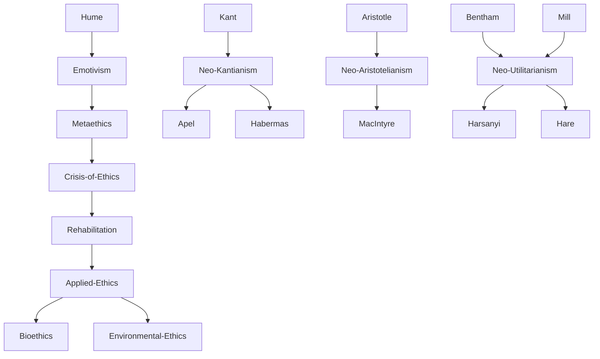

---
cssclasses:
  - Philosophy
subclasses:
  - Ethics
  - Applied-Ethics
  - 20th-Century-Philosophy
related:
  - "[[Metaethics]]"
  - "[[Normative Ethics]]"
  - "[[Applied Ethics]]"
  - "[[Utilitarianism]]"
  - "[[Neo-Kantianism]]"
  - "[[Communitarianism]]"
  - "[[Bioethics]]"
  - "[[Environmental Ethics]]"
  - "[[Emotivism]]"
  - "[[Moral Philosophy]]"
aliases:
  - normative ethics
  - applied ethics
  - moral philosophy
  - ethical theory
  - practical philosophy
  - ethical rehabilitation
reference:
  - "Abbagnano, N., & Fornero, G. (2012). La ricerca del pensiero. Vol. 3C. Dalla crisi della modernità agli sviluppi più recenti. Paravia."
---

#### Central Problem

Contemporary moral philosophy confronts a fundamental crisis of legitimacy inherited from the late nineteenth and early twentieth centuries. The "masters of suspicion"—[[Nietzsche]], [[Freud]], and [[Marx]]—had undermined traditional ethics by revealing moral ideals as "masks" of the will to power, "sublimations" of drives, and "superstructures" of economic interests. This critique dismantled the very notion of a moral subject.

The crisis deepened through multiple theoretical developments:

**Emotivism** (Ayer, Stevenson) assimilated moral propositions to expressions of taste—mere projections of desires or emotions—thereby declaring the impossibility of a rationally grounded, universally valid ethics. This opened the door to subjectivism and irrationalism, paradoxically the reverse side of logical empiricism's "scientific worldview."

**Divisionism** (Hume's Law) insisted on an unbridgeable gap between facts and values, is and ought, descriptions and prescriptions. Reason was denied any competence regarding ends and values; ethical discourse became a matter of "faith" and "decision" (decisionism).

**Metaethics** further distanced philosophers from normative and axiological questions, focusing exclusively on the logical-linguistic analysis of ethical language in a descriptive, value-neutral manner.

The central question becomes: Can philosophy reclaim its original practical vocation? Can moral reasoning provide genuine guidance for action, or must ethics remain confined to description and analysis?

#### Main Thesis

Beginning in the 1960s and accelerating through the 1970s, a "rehabilitation of practical philosophy" (Rehabilitierung der praktischen Philosophie) challenged the ethical neutrality enforced by emotivism, divisionism, and metaethics. Against the "masters of suspicion," proponents argued that ethics cannot be reduced to projections of impulses or interests—it represents a "game that must be played" for humanity's very survival. Against emotivism, even non-cognitivists acknowledged that ethical imperatives possess their own autonomous rationality, consistency, and universality. Against divisionism and the reduction of ethics to metaethics, they vindicated reason's role in morality and philosophers' duty to provide not merely descriptive analyses but **normative guidance**.

The key insight was articulated clearly: "A philosophical ethics makes sense only insofar as it proves relevant to the practical problems of people" (Lecaldano). A reflection on morals "that does not serve in practice must have some theoretical defect, since the task of ethics is precisely to guide practical life" (Singer).

This normative turn produced a remarkable diversity of ethical theories:

- **[[Lévinas]]:** Ethics as "first philosophy"—morality lies in openness to the Other who exceeds the ego
- **Neo-Aristotelianism** (Arendt, [[Gadamer]], [[Ritter]], [[Buber]]): Virtue as practical wisdom within concrete traditions
- **Post-Kantianism** (Apel, Habermas): Universal structures of communicative rationality ground morality
- **[[Jonas]]:** Responsibility toward future generations; ecological ethics as new categorical imperative
- **[[Rawls]]:** Egalitarian neo-contractualism; justice as fairness; deontological anti-utilitarianism
- **Libertarianism** (Nozick, [[Dworkin]]): Defense of individual liberty; minimal state theory
- **Neo-Utilitarianism** ([[Harsanyi]], [[Hare]]): Rule utilitarianism with universalizability requirements
- **Communitarianism** (MacIntyre, Sandel, Taylor): Ethics grounded in concrete éthos of historical communities
- **Postmodernism** (Vattimo): Ethics of charity; reduction of violence
- **Feminism:** Ethics attentive to sexual difference

The result has been an explosion of **applied ethics**—bioethics, environmental ethics, animal ethics, business ethics—and a dramatic expansion of the concept of **moral subject** to include future generations, animals, and even (speculatively) intelligent machines.

#### Historical Context

The "renaissance of ethics" emerged from multiple converging pressures. The devastation of World War II shattered any remaining illusions about progress and made ethical neutrality untenable. As [[Russell]] wrote, one cannot place a discourse about the goodness of oysters on the same plane as a discourse about the permissibility of torturing Jews.

The "rehabilitation of practical philosophy" movement, anticipated by [[Strauss]] and [[Voegelin]] (who attended to the normative dimensions of classical political philosophy), saw in ethical divisionism a logical consequence of modern scientism. They argued for recovering authentic practical philosophy—knowledge that is not merely descriptive, that does not limit itself to knowing facts and establishing laws, but is capable of indicating values and judging reality in terms of good and evil, just and unjust.

The 1970s witnessed the emergence of **applied ethics** as a distinct field. The new figure of the professional "ethicist" appeared, responding to technological developments that could intervene not only on environmental mechanisms but on human biological and psychological constitution itself. The complexity of contemporary life demanded new behavioral codes, while increased sensitivity toward the Other (human and non-human) required ethical frameworks adequate to pluralistic societies.

Contemporary ethics thus operates predominantly within a **dialogical** rather than monological paradigm—viewing humans not in isolated individuality but within the web of relationships that constitute them.

#### Philosophical Lineage

#### Key Thinkers

| Thinker | Dates | Movement | Main Work | Core Concept |
|---------|-------|----------|-----------|--------------|
| [[Harsanyi]] | 1920-2000 | [[Neo-Utilitarianism]] | *Rational Behavior and Bargaining Equilibrium* | Rule utilitarianism, equiprobability |
| [[Hare]] | 1919-2002 | [[Neo-Utilitarianism]] | *Moral Thinking* | Universalizability of moral judgments |
| [[Rawls]] | 1921-2002 | [[Neo-Contractualism]] | *A Theory of Justice* | Justice as fairness |
| [[Jonas]] | 1903-1993 | [[Environmental Ethics]] | *The Imperative of Responsibility* | Responsibility for future generations |
| [[MacIntyre]] | 1929- | [[Communitarianism]] | *After Virtue* | Virtue within tradition |
| [[Apel]] | 1922-2017 | [[Frankfurt School]] | *Transformation of Philosophy* | Ultimate foundation of ethics |

#### Key Concepts

| Concept | Definition | Related to |
|---------|------------|------------|
| Emotivism | Theory that moral precepts express emotions or preferences rather than cognitive content | [[Ayer]], [[Stevenson]] |
| Divisionism | The "great division" (Hume's Law) between descriptive and prescriptive propositions | [[Hume]], [[Metaethics]] |
| Metaethics | Analysis of the logical-linguistic form of ethical discourse, bracketing normative questions | [[Analytic Philosophy]] |
| Normative Ethics | Ethics that provides substantive guidance on what to do, not merely describes moral language | [[Applied Ethics]] |
| Cognitivism | Doctrine that moral principles derive from knowledge (intuitive or demonstrative) | [[Ethics]] |
| Non-Cognitivism | Theory connecting moral judgments to preferences rather than knowledge, while preserving rational elements | [[Hare]], [[Ethics]] |
| Rule Utilitarianism | Actions are good/bad according to conformity to rules; rules are good/bad according to social utility | [[Harsanyi]], [[Utilitarianism]] |
| Equiprobability Principle | Each individual has equal probability of occupying any social position—basis for impartial moral judgment | [[Harsanyi]], [[Neo-Utilitarianism]] |
| Applied Ethics | Ethics applied to specific domains: bioethics, environmental ethics, business ethics | [[Contemporary Ethics]] |
| Rehabilitation of Practical Philosophy | Movement restoring normative function to philosophy against scientistic reduction | [[Strauss]], [[Voegelin]] |

#### Authors Comparison

| Theme | [[Harsanyi]] | [[Hare]] | [[Rawls]] | [[MacIntyre]] |
|-------|--------------|----------|-----------|---------------|
| Ethical foundation | Utility maximization | Universalizability | Contractual agreement | Community tradition |
| Core principle | Rule utilitarianism | Prescriptivism | Justice as fairness | Virtue ethics |
| Impartiality basis | Equiprobability principle | Universal prescriptions | Veil of ignorance | Shared narrative |
| Tradition | [[Utilitarianism]] | [[Utilitarianism]] | [[Kantianism]] | [[Aristotelianism]] |
| View of individual | Rational preference-maximizer | Rational moral agent | Autonomous person | Embedded in community |
| Critique target | Act utilitarianism | Emotivism | Utilitarianism | Liberal individualism |

#### Influences & Connections

- **Predecessors:** Contemporary ethics ← reacting against ← [[Nietzsche]], [[Freud]], [[Marx]] (masters of suspicion)
- **Predecessors:** [[Harsanyi]] ← influenced by ← [[Bentham]], [[Mill]], [[Sidgwick]]
- **Predecessors:** Rehabilitation movement ← anticipated by ← [[Strauss]], [[Voegelin]]
- **Contemporaries:** [[Harsanyi]] ↔ dialogue with ↔ [[Rawls]], [[Hare]]
- **Contemporaries:** Neo-Kantians ↔ debate with ↔ Communitarians
- **Followers:** Applied ethics → developed into → [[Bioethics]], [[Environmental Ethics]], [[Business Ethics]]
- **Opposing views:** Normative ethics ← criticized by ← [[Williams]], [[Mackie]], [[Nagel]] (skeptics)

#### Summary Formulas

- **[[Harsanyi]]:** Moral judgments must be impartial; the equiprobability principle—imagining equal probability of occupying any social position—grounds rule utilitarianism that maximizes average utility while respecting individual preferences.

- **[[Hare]]:** Moral judgments are universal prescriptions; genuine ethical reasoning combines the universalizability requirement (Kantian element) with attention to consequences (utilitarian element).

- **Rehabilitation Movement:** If reason is not identified exhaustively with mathematical-experimental science, practical reason can possess its own peculiar form of rationality capable of grounding normative ethics.

- **Applied Ethics:** Philosophical ethics makes sense only insofar as it proves relevant to practical problems; the task of ethics is to guide practical life, not merely analyze moral language.

#### Timeline

| Year | Event |
|------|-------|
| 1954 | [[Russell]] publishes *Human Society in Ethics and Politics*, challenging emotivism |
| 1960s | Beginning of "rehabilitation of practical philosophy" movement |
| 1971 | [[Rawls]] publishes *A Theory of Justice* |
| 1973 | Smart and Williams publish *Utilitarianism: for and against* |
| 1979 | [[Jonas]] publishes *The Imperative of Responsibility* |
| 1981 | [[Hare]] publishes *Moral Thinking* |
| 1981 | [[MacIntyre]] publishes *After Virtue* |
| 1985 | [[Harsanyi]] publishes *Rational Behavior and Bargaining Equilibrium* |
| 1994 | [[Harsanyi]] receives Nobel Prize in Economics |

#### Notable Quotes

> "A philosophical ethics makes sense only insofar as it proves relevant to the practical problems of people." — [[Lecaldano]]

> "A reflection on morals that does not serve in practice must have some theoretical defect, since the task of ethics is precisely to guide practical life." — [[Singer]]

> "If reason is not made to coincide entirely with science, one can hypothesize that practical reason, while distinct from scientific reason, possesses its own peculiar form of rationality." — [[Berti]]

---
> [!NOTE]
> *This summary has been created to present the key points from the source text, which was automatically extracted using LLM. Please note that the summary may contain errors. It serves as an essential starting point for study and reference purposes.*
