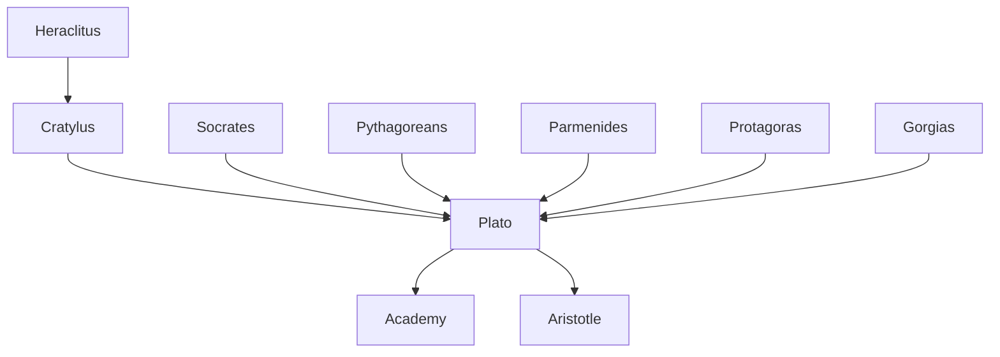

---
cssclasses:
  - Philosophy
subclasses:
  - Ancient-Greek-and-Roman-Philosophy
  - Epistemology
  - Ethics
related:
  - "[[Theory of Ideas]]"
  - "[[Platonic Academy]]"
  - "[[Socratic Method]]"
  - "[[Sophism]]"
  - "[[Greek Ethics]]"
  - "[[Rhetoric]]"
  - "[[Philosophy of Language]]"
  - "[[Political Philosophy]]"
  - "[[Eudemonism]]"
  - "[[Intellectualism]]"
aliases:
  - socratic dialogues
  - platonic philosophy
  - apology socrates
  - protagoras dialogue
  - gorgia dialogue
  - cratilo dialogue
  - virtue knowledge
  - platonic myth
  - academy plato
  - philosophy politics
  - rhetoric sophists
reference:
  - "Abbagnano, N., & Fornero, G. (2012). La ricerca del pensiero. Vol. 1A. Dalle origini ad Aristotele. Paravia."
---

#### Central Problem

The central problem addressed in this chapter is how Platonism emerged as a philosophical response to the profound political and cultural crisis of 4th-century Athens. Following the defeat in the Peloponnesian War (404 BCE), the failed oligarchic experiment of the Thirty Tyrants (404-403 BCE), and the condemnation of [[Socrates]] (399 BCE), [[Plato]] confronted a world in which traditional certainties had collapsed and relativism threatened to undermine all stable values.

The fundamental question becomes: how can philosophy provide stable foundations for ethical and political life in a world where the Sophists have reduced all values to conventions, where rhetoric replaces truth, and where the most just man of all time—Socrates—was condemned to death by his own city? [[Plato]] recognized that the ethical-political crisis derived primarily from an intellectual crisis: without stable truths and universal definitions, society descends into moral and civic chaos.

This leads to the core philosophical problem: can genuine knowledge of virtue be attained? Is virtue teachable? And if so, what kind of knowledge does virtue represent? The chapter traces [[Plato]]'s systematic defense of Socratic intellectualism against sophistical relativism while simultaneously preparing the ground for his own theory of Ideas.

#### Main Thesis

Plato's fundamental thesis, developed through his early dialogues, is that **virtue is one and identical with knowledge (science)**, and therefore it can be taught. This Socratic position is defended against the Sophists through a multi-pronged philosophical strategy:

**1. The Unity of Virtue:** Against the sophistical view that virtues are multiple and separable, [[Plato]] demonstrates (through dialogues like *Eutyphro*, *Laches*, and *Charmides*) that individual virtues—piety, courage, temperance—cannot be defined in isolation. They are all manifestations of a single virtue: knowledge of the good.

**2. The Good as Sole Value:** The *Hippias Major* and *Lysis* show that beauty, utility, and other apparent values cannot be defined independently. The only true value that encompasses all others is the good itself.

**3. Virtue as Teachable Science:** In the *Protagoras*, [[Plato]] establishes that virtue can only be transmitted through teaching insofar as it is science. The Sophists' "virtue" is merely accumulated experience—a private patrimony that cannot be truly communicated.

**4. Philosophy vs. Rhetoric:** The *Gorgias* delivers a devastating critique of rhetoric as mere "flattery" that aims at pleasure rather than truth. True persuasion requires knowledge of the object discussed. The dialogue also introduces an ethics of the afterlife: the soul's immortality becomes the ultimate guarantee of moral life.

**5. Language and Essence:** The *Cratylus* argues against both pure conventionalism and pure naturalism in language, preparing the doctrine of Ideas by insisting that names must aim at expressing the stable essences of things.

#### Historical Context

[[Plato]] was born in 427 BCE to an aristocratic Athenian family during the midst of the Peloponnesian War (431-404 BCE). The golden age of Periclean Athens was drawing to a close, and [[Plato]] witnessed the progressive decline of his city.

The decisive historical events shaping [[Plato]]'s thought include:

- **404 BCE:** Athens defeated by Sparta; establishment of the oligarchic government of the Thirty Tyrants, which included [[Plato]]'s relatives [[Critias]] and Charmides
- **404-403 BCE:** The failed oligarchic experiment, marked by violence and injustice
- **403 BCE:** Restoration of democracy under Thrasybulus
- **399 BCE:** Trial and execution of [[Socrates]]—the event that definitively shaped [[Plato]]'s philosophical vocation

The death of [[Socrates]] represented for [[Plato]] the ultimate proof of societal sickness: if the most just man could be condemned to death, radical reform was necessary. [[Plato]] concluded that neither oligarchy nor democracy could guarantee justice without philosophical foundation.

Culturally, the period was marked by the decline of the Sophistic movement into eristic (contentious argumentation) and the dissolution of Socraticism into minor schools. Against this backdrop of intellectual and political crisis, [[Plato]] founded the Academy (c. 387 BCE) as an institution for philosophical education modeled on Pythagorean communities.

#### Philosophical Lineage

#### Key Thinkers

| Thinker | Dates | Movement | Main Work | Core Concept |
|---------|-------|----------|-----------|--------------|
| [[Plato]] | 427-347 BCE | [[Platonism]] | *Republic*, *Gorgias*, *Protagoras* | Virtue as knowledge, philosopher-kings |
| [[Socrates]] | 469-399 BCE | [[Socratic Philosophy]] | (Oral teaching) | Examined life, dialectical method |
| [[Protagoras]] | c. 490-420 BCE | [[Sophism]] | *Truth* | Man as measure, teachability of virtue |
| [[Gorgias]] | c. 483-375 BCE | [[Sophism]] | *On Non-Being* | Rhetoric as technique of persuasion |
| [[Cratylus]] | 5th c. BCE | [[Heracliteanism]] | (Oral teaching) | Natural correctness of names |
| [[Callicles]] | 5th c. BCE | [[Sophism]] | (Character in *Gorgias*) | Justice as convention, might is right |

#### Key Concepts

| Concept | Definition | Related to |
|---------|------------|------------|
| Virtue as Science | The Socratic thesis that virtue is identical with knowledge—those who know the good necessarily do the good | [[Socrates]], [[Intellectualism]] |
| Platonic Dialogue | The literary form chosen by [[Plato]] to express the open, never-concluded character of philosophical inquiry | [[Plato]], [[Dialectic]] |
| Platonic Myth | Fantastic narratives used to communicate doctrines beyond the limits of rigorous rational investigation | [[Plato]], [[Allegory]] |
| Eristic | The sophistical art of verbal combat, confuting any thesis regardless of its truth | [[Sophism]], [[Euthydemus]] |
| Rhetoric | For Sophists: technique of persuasion independent of content; for [[Plato]]: mere "flattery" lacking genuine knowledge | [[Gorgias]], [[Sophism]] |
| Unwritten Doctrines | [[Plato]]'s oral teachings on metaphysical principles (One and Dyad) not committed to writing | [[Plato]], [[Pythagoreans]] |
| Eudemonism | The Greek ethical principle that virtue and happiness are intrinsically connected | [[Socrates]], [[Greek Ethics]] |

#### Authors Comparison

| Theme | [[Plato]] | [[Protagoras]] | [[Gorgias]] | [[Callicles]] |
|-------|-----------|----------------|-------------|---------------|
| Nature of virtue | One, identical with knowledge | Multiple, teachable skills | Instrumental to persuasion | Irrelevant convention |
| Teachability | Only as science | As accumulated experience | As rhetorical technique | Not needed for the strong |
| Knowledge | Stable, universal definitions | Relative to individual perception | Skepticism about truth | Power over truth |
| Justice | Objective good, soul's harmony | Social convention | Persuasive construct | Convention of the weak |
| Rhetoric | Flattery, not true art | Useful political tool | Supreme art | Tool for domination |
| Happiness | Through virtue and knowledge | Through success and reputation | Through persuasive power | Through unconstrained pleasure |

#### Influences & Connections

- **Predecessors:** [[Plato]] ← influenced by ← [[Socrates]], [[Cratylus]], [[Pythagoreans]], [[Parmenides]]
- **Contemporaries:** [[Plato]] ↔ debate with ↔ [[Protagoras]], [[Gorgias]], [[Antisthenes]], [[Aristippus]]
- **Followers:** [[Plato]] → influenced → [[Aristotle]], [[Academy]], [[Neoplatonism]]
- **Opposing views:** [[Plato]] ← criticized by ← [[Callicles]], [[Eristics]], [[Cynics]]

#### Summary Formulas

- **[[Plato]]:** Philosophy must provide stable intellectual foundations for ethical and political life; only when philosophers rule or rulers philosophize will human societies be freed from evil.
- **[[Socrates]]:** Virtue is knowledge—one who truly knows the good cannot fail to do it; an unexamined life is not worth living.
- **[[Protagoras]]:** Virtue consists in multiple teachable skills acquired through experience and transmitted by those who possess them.
- **[[Gorgias]]:** Rhetoric is the supreme art that enables persuasion on any subject without requiring knowledge of that subject.
- **[[Callicles]]:** Natural justice is the rule of the stronger; conventional morality is merely a device of the weak to constrain the powerful.

#### Timeline

| Year | Event |
|------|-------|
| 427 BCE | [[Plato]] born in Athens to aristocratic family |
| 411 BCE | Death of [[Protagoras]] |
| 407 BCE | [[Plato]] meets [[Socrates]] and becomes his disciple |
| 404 BCE | Athens defeated; Thirty Tyrants take power (including [[Critias]] and Charmides) |
| 403 BCE | Democracy restored in Athens |
| 399 BCE | Trial and execution of [[Socrates]] |
| 399 BCE | [[Plato]] travels to Megara to join [[Euclid]] |
| 388 BCE | [[Plato]]'s first voyage to Sicily; meets Dion at Syracuse |
| 387 BCE | [[Plato]] founds the Academy in Athens |
| 367 BCE | [[Plato]]'s second voyage to Sicily under Dionysius II |
| 361 BCE | [[Plato]]'s third and final voyage to Sicily |
| 347 BCE | Death of [[Plato]] in Athens |

#### Notable Quotes

> "I saw that the human race would never be freed from evil until either true philosophers came to hold political power, or the holders of political power became true philosophers by some divine dispensation." — [[Plato]]

> "A life without inquiry is not worth living for a human being." — [[Socrates]]

> "We need a science in which making and knowing how to use what is made coincide." — [[Socrates]]

---
> [!warning]-
> This annotation was normalised using a large language model and may contain inaccuracies. These texts serve as preliminary study resources rather than exhaustive references.
