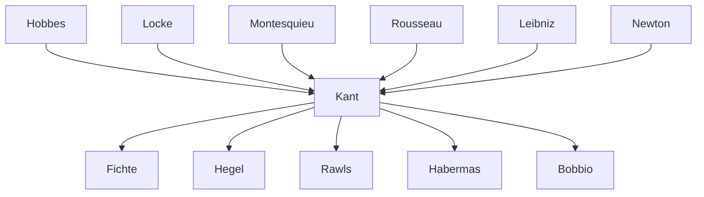

---
cssclasses:
  - Philosophy
  - Political-Science
subclasses:
  - Philosophy-of-Religion
  - Social-and-Political-Philosophy
  - 17th-18th-Century-Philosophy
related:
  - "[[Critique of Practical Reason]]"
  - "[[Liberalism]]"
  - "[[Social Contract Theory]]"
  - "[[Philosophy of History]]"
  - "[[Cosmopolitanism]]"
  - "[[Natural Law]]"
  - "[[Human Rights]]"
  - "[[Enlightenment]]"
  - "[[Perpetual Peace]]"
  - "[[Rawls]]"
  - "[[Habermas]]"
aliases:
  - kantian religion
  - rational religion
  - radical evil
  - kantian state
  - perpetual peace
  - kantian law
  - social contract
  - philosophy history
  - moral religion
  - church invisible
  - world federation
reference:
  - "Abbagnano, N., & Fornero, G. (2012). La ricerca del pensiero. Vol. 2B. Dall'Illuminismo a Hegel. Paravia."
---

#### Central Problem

This chapter addresses the practical application of [[Kant]]'s critical philosophy to religion, law, state, and history. The central problems include: How can religion be rationally justified while preserving moral autonomy? What are the a priori foundations of law and the state? Can history be understood as having a rational direction toward freedom? How can perpetual peace be achieved among nations?

A persistent criticism of Kantian ethics held that it remained abstract, confined to the subjective sphere of intentions without addressing concrete situations, social institutions, or historical progress. Thinkers from [[Hegel]] to [[Nietzsche]] accused [[Kant]] of subjectivism and ahistoricism. The works examined here—*The Metaphysics of Morals* (1797), *Religion within the Limits of Reason Alone* (1793), *Toward Perpetual Peace* (1795), and various historical-political writings—demonstrate that [[Kant]] developed extensive theories of applied ethics, legal philosophy, political theory, and philosophy of history.

The fundamental challenge is to extend the formal, universal principles of critical philosophy into the domains of religious belief, political organization, legal order, and historical teleology while maintaining the autonomy of practical reason and avoiding both dogmatic metaphysics and empirical contingency.

#### Main Thesis

**On Religion:** [[Kant]] develops a **religion within the limits of reason alone**—a purely rational religion that humans can arrive at through reason without requiring revelation. He depicts revealed religion and rational religion as two concentric circles: revealed religion has broader content but must always be subjected to rational critique. Religion does not lead to morality; rather, morality leads to religion as the absolute reference point of values. God is postulated as the guarantor of the *summum bonum*, the union of virtue and happiness.

**On Radical Evil:** [[Kant]] identifies an ineradicable human tendency toward evil (*das radikale Böse*), manifesting in three degrees: frailty (difficulty practicing moral precepts), impurity (mixing moral with ignoble motivations), and malignity (acting entirely from non-moral motivations). This evil is not sensual but stems from freedom itself—humans freely choose to subordinate the moral law to self-love. Yet from the same freedom derives the capacity for *conversion*—an incessant progress from evil toward good.

**On Law and State:** Law is "the totality of conditions under which the will of one can be united with the will of another according to a universal law of freedom." [[Kant]]'s transcendental method seeks a priori foundations for legal institutions rather than historical reconstructions. The **liberal state** must only ensure that citizens can pursue their own religious, ethical, economic ends without violating others' freedom—it is juridical (establishing a legal order) and formal (concerned with how citizens act, not what they do).

**On History:** History has an a priori **destination**—the realization of humanity's rational essence and freedom. Progress results from the dialectic of "unsociable sociability" (*ungesellige Geselligkeit*): humans simultaneously tend toward community and toward antagonism. This conflict drives civilization forward toward a perfect civil constitution.

**On Perpetual Peace:** [[Kant]] proposes a **cosmopolitan order** (*Weltbürgertum*)—a federation of free states bound by international law. Peace requires: (1) republican constitutions within states (because citizens must consent to war), (2) a federation of free states, and (3) universal hospitality rights. This peace is not a natural state but a *task* to be pursued through rational effort.

#### Historical Context

Kant's practical philosophy developed in the context of late Enlightenment optimism about human progress, tempered by critical awareness of conflict and evil. The *Religion within the Limits of Reason Alone* (1793) brought [[Kant]] into conflict with Prussian censorship, reflecting tensions between Enlightenment rationalism and established religious authority.

The French Revolution (1789) profoundly influenced [[Kant]]'s political thought. He initially sympathized with revolutionary ideals but was horrified by the Terror, which he attributed to [[Robespierre]]'s disguising private interests as national will. This led [[Kant]] to reject revolutionary violence while affirming the right to public criticism—the "public use of reason."

*Toward Perpetual Peace* (1795) was written on the occasion of the Peace of Basel between France and Prussia. [[Kant]]'s vision of a federation of nations anticipated twentieth-century institutions like the League of Nations and the United Nations. Contemporary philosophers like Rawls and Habermas have found in [[Kant]]'s cosmopolitanism crucial resources for thinking about international justice, human rights, and global governance.

The [[Leibniz]]-Newton debate on space and time, discussed in the chapter's supplementary materials, provides important background for understanding how [[Kant]]'s transcendental method emerged from earlier philosophical disputes about the foundations of physics and metaphysics.

#### Philosophical Lineage

#### Key Thinkers

| Thinker | Dates | Movement | Main Work | Core Concept |
|---------|-------|----------|-----------|--------------|
| [[Kant]] | 1724-1804 | [[Critical Philosophy]] | *Perpetual Peace* | Cosmopolitan order |
| [[Hobbes]] | 1588-1679 | [[Contractualism]] | *Leviathan* | State of nature, social contract |
| [[Locke]] | 1632-1704 | [[Liberalism]] | *Two Treatises* | Inalienable rights |
| [[Rousseau]] | 1712-1778 | [[Enlightenment]] | *Social Contract* | General will |
| [[Rawls]] | 1921-2002 | [[Liberalism]] | *Theory of Justice* | Original position, veil of ignorance |
| [[Habermas]] | 1929- | [[Critical Theory]] | *Between Facts and Norms* | Post-national constellation |

#### Key Concepts

| Concept | Definition | Related to |
|---------|------------|------------|
| Rational Religion | Religion whose content humans can arrive at through reason alone, constituting the core of revealed religion | [[Kant]], [[Philosophy-of-Religion]] |
| Radical Evil | Ineradicable human tendency toward evil, manifesting as frailty, impurity, or malignity, yet rooted in freedom | [[Kant]], [[Ethics]] |
| Conversion | Incessant progress from evil toward good made possible by the same freedom that enables radical evil | [[Kant]], [[Ethics]] |
| Invisible Church | Ideal community of the righteous under God's moral governance, model for all human institutions | [[Kant]], [[Philosophy-of-Religion]] |
| Transcendental Jurisprudence | A priori foundations of law derived from rational principles rather than historical facts | [[Kant]], [[Philosophy-of-Law]] |
| Liberal State | State whose sole function is enabling citizens to pursue their own ends without violating others' freedom | [[Kant]], [[Liberalism]] |
| Unsociable Sociability | Human tendency both toward community and toward antagonism, driving historical progress | [[Kant]], [[Philosophy of History]] |
| Cosmopolitan Order | Federation of free states bound by international law to achieve perpetual peace | [[Kant]], [[Political Philosophy]] |
| Original Contract | Not a historical fact but an a priori idea of practical reason serving as model for actual contracts | [[Kant]], [[Contractualism]] |
| Public Use of Reason | Freedom to criticize publicly while obeying the law; the only legitimate sphere of dissent | [[Kant]], [[Enlightenment]] |

#### Authors Comparison

| Theme | [[Kant]] | [[Hobbes]] | [[Rousseau]] |
|-------|----------|------------|--------------|
| State of nature | Concept requiring exit, not historical fact | War of all against all | Innocent, corrupted by society |
| Social contract | A priori idea of reason | Historical pact for security | General will formation |
| Sovereignty | Divided powers, rule of law | Absolute, indivisible | Popular, inalienable |
| Purpose of state | Guarantee freedom, not happiness | Security and peace | Express general will |
| Right of revolution | Denied; only public criticism | Denied | Ambiguous |
| Human nature | Radical evil and capacity for good | Selfish, competitive | Naturally good |

#### Influences & Connections

- **Predecessors:** [[Kant]] ← influenced by ← [[Hobbes]], [[Locke]], [[Montesquieu]], [[Rousseau]], [[Leibniz]]
- **Contemporaries:** [[Kant]] ↔ dialogue with ↔ [[Herder]], [[Jacobi]], [[Mendelssohn]]
- **Followers:** [[Kant]] → influenced → [[Fichte]], [[Hegel]], [[Schopenhauer]]
- **Followers:** [[Kant]] → influenced → [[Rawls]], [[Habermas]], [[Bobbio]]
- **Opposing views:** [[Kant]] ← criticized by ← [[Hegel]] (abstract formalism), [[Nietzsche]] (slave morality), [[Scheler]] (formalism)

#### Summary Formulas

- **[[Kant]] on religion:** Morality does not require religion, but leads to it; rational religion forms the core of revealed religion, which must be subjected to critical reason to distinguish authentic faith from superstition.
- **[[Kant]] on evil:** Radical evil is an ineradicable tendency rooted in human freedom, but the same freedom enables conversion—an incessant progress from evil toward good with hope for divine grace.
- **[[Kant]] on law:** Law is the totality of conditions enabling the coexistence of freedoms according to a universal law; the state must be liberal (enabling individual ends), juridical (establishing legal order), and formal (concerned with how, not what).
- **[[Kant]] on history:** History has a rational destination—the full development of human freedom—driven by the dialectic of unsociable sociability toward an ever more perfect civil constitution.
- **[[Kant]] on peace:** Perpetual peace requires republican constitutions, a federation of free states, and universal hospitality; it is not a natural state but a task to be accomplished through rational effort.

#### Timeline

| Year | Event |
|------|-------|
| 1784 | [[Kant]] publishes *Idea for a Universal History with a Cosmopolitan Purpose* |
| 1784 | [[Kant]] publishes *What is Enlightenment?* |
| 1793 | [[Kant]] publishes *Religion within the Limits of Reason Alone* |
| 1795 | [[Kant]] publishes *Toward Perpetual Peace* |
| 1797 | [[Kant]] publishes *The Metaphysics of Morals* |
| 1798 | [[Kant]] publishes *The Conflict of the Faculties* |
| 1971 | [[Rawls]] publishes *A Theory of Justice* (Kantian revival) |
| 1995 | [[Habermas]] publishes reflections on [[Kant]]'s perpetual peace |

#### Notable Quotes

> "The law is the totality of conditions under which the will of one can be united with the will of another according to a universal law of freedom." — [[Kant]]

> "Perpetual peace is not an empty idea but a task that, gradually accomplished, comes steadily nearer its goal." — [[Kant]]

> "That kings should philosophize or philosophers become kings is not to be expected; nor indeed to be wished, for the possession of power inevitably corrupts the free judgment of reason." — [[Kant]]

---
> [!warning]-
> This annotation was normalised using a large language model and may contain inaccuracies. These texts serve as preliminary study resources rather than exhaustive references.
