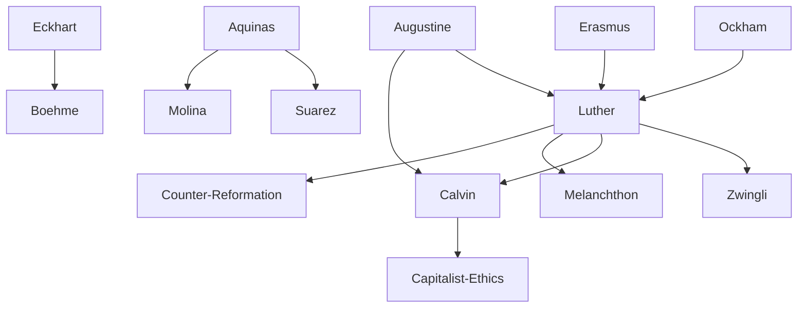

---
cssclasses:
  - Philosophy
subclasses:
  - Medieval-and-Renaissance-Philosophy
  - Philosophy-of-Religion
  - Ethics
related:
  - "[[Augustine]]"
  - "[[Grace and Free Will]]"
  - "[[Sola Fide]]"
  - "[[Predestination]]"
  - "[[Council of Trent]]"
  - "[[Thomism]]"
  - "[[Christian Humanism]]"
  - "[[Protestant Ethics]]"
  - "[[Capitalism and Religion]]"
  - "[[Religious Wars]]"
aliases:
  - protestant reformation
  - free will
  - justification faith
  - sola scriptura
  - counter reformation
  - grace theology
  - christian humanism
  - servo arbitrio
reference:
  - "Abbagnano, N., & Fornero, G. (2012). La ricerca del pensiero. Vol. 2A. Dall'Umanesimo all'empirismo. Paravia."
---

#### Central Problem

The chapter addresses the fundamental religious and philosophical crisis of the sixteenth century: the question of how humanity can achieve salvation and what role human freedom plays in this process. At the heart of this problem lies the tension between two contrasting views: the humanist position that defends human dignity through the affirmation of free will, and the reformers' radical emphasis on divine grace as the sole source of salvation.

This crisis emerged from the perceived corruption of the institutional Church and the desire to return to the authentic sources of Christianity. The central question became: should religious renewal come through philological recovery of original texts (the humanist approach) or through a radical rejection of tradition in favor of direct engagement with Scripture (the Protestant approach)? The debate over free will (liberum arbitrium) versus enslaved will (servum arbitrium) crystallized the deeper conflict between Renaissance humanism's confidence in human capacities and the Reformation's insistence on human helplessness before God.

The problem also extended to ecclesiology: does salvation require the mediating role of the Church, its sacraments, and priestly hierarchy, or is faith alone sufficient for a direct relationship between the individual soul and God?

#### Main Thesis

The chapter presents the Protestant Reformation as a movement characterized by the principle of "return to sources" — specifically, direct return to the Gospel rather than reliance on ecclesiastical tradition. The key thesis of the Reformation, as articulated by [[Luther]], is justification by faith alone (sola fide): humanity is saved not through meritorious works or Church mediation but exclusively through faith in divine grace.

[[Luther]] argues that free will is "nothing, an empty name" when it comes to salvation. Divine foreknowledge and omnipotence exclude any human initiative in the process of redemption. God operates both good and evil in humans, and salvation (like damnation) is solely God's work. This position represents [[Augustine]]'s doctrine of grace pushed to its extreme consequences.

[[Erasmus]], representing Christian humanism, defends a middle position: grace is the "principal cause" of salvation while human will serves as a "secondary cause." The two cooperate, with grace healing the will corrupted by original sin. For Erasmus, without freedom, human dignity loses all meaning.

[[Calvin]] emphasizes predestination even more strongly: God is absolute sovereignty and power, and human salvation depends entirely on divine decree. Yet paradoxically, this certainty of election, rather than producing despair, inspired the heroic religious souls of the Reformation and shaped the active, aggressive spirit of emerging capitalist bourgeoisie.

The Counter-Reformation, through the Council of Trent (1545-1563), rejected Scripture alone as sufficient for salvation, reaffirmed the Church's exclusive right to interpret biblical texts, and defended the mediating function of sacraments and the value of good works.

#### Historical Context

The Protestant Reformation emerged in the early sixteenth century against the backdrop of Renaissance humanism and widespread criticism of ecclesiastical corruption. The period saw intense conflict between emerging national states and papal authority, between traditional feudal structures and nascent capitalist economy.

[[Erasmus]] (1466-1536), the most famous humanist of his era, prepared critical editions of Church Fathers and the New Testament, establishing the philological foundation for religious reform. His *Praise of Folly* (1509) satirized the moral decadence of contemporary society, especially the Church.

[[Luther]] (1483-1546) transformed humanist criticism into revolutionary religious movement. His doctrine of justification by faith challenged the entire sacramental and hierarchical structure of medieval Christianity. The formula "I cry: Gospel, Gospel! And they uniformly respond: Tradition, Tradition! Agreement is impossible" captures the unbridgeable divide.

[[Zwingli]] (1484-1531) in Zurich and [[Calvin]] (1509-1564) in Geneva developed distinct Protestant traditions. Calvin established a quasi-theocratic regime in Geneva, exercising authority with exceptional skill and ruthless firmness — 48 people were executed for religious reasons, including Michael Servetus, burned for denying the Trinity.

The Council of Trent (1545-1563) marked the Catholic response, reaffirming tradition, sacramental mediation, and the value of works while returning to Thomism as the official philosophical framework.

#### Philosophical Lineage

#### Key Thinkers

| Thinker | Dates | Movement | Main Work | Core Concept |
|---------|-------|----------|-----------|--------------|
| [[Erasmus]] | 1466-1536 | [[Christian Humanism]] | *Praise of Folly* | Free will as secondary cause |
| [[Luther]] | 1483-1546 | [[Protestant Reformation]] | *De servo arbitrio* | Justification by faith alone |
| [[Zwingli]] | 1484-1531 | [[Swiss Reformation]] | Theological writings | Universal revelation |
| [[Calvin]] | 1509-1564 | [[Calvinism]] | *Institutes of the Christian Religion* | Predestination |
| [[Melanchthon]] | 1497-1560 | [[Lutheran Orthodoxy]] | Systematic works | Synthesis with ancient philosophy |
| [[Boehme]] | 1575-1624 | [[Protestant Mysticism]] | *Aurora* | God as eternal abyss |
| [[Suarez]] | 1548-1617 | [[Counter-Reformation]] | *Metaphysical Disputations* | Neo-Thomism |
| [[Molina]] | 1535-1600 | [[Counter-Reformation]] | Theological works | Grace cooperates with free will |

#### Key Concepts

| Concept | Definition | Related to |
|---------|------------|------------|
| Justification by faith | Salvation comes through faith in God's grace alone, not through human works or merit | [[Luther]], [[Reformation]] |
| Free will (liberum arbitrium) | Human capacity to choose between salvation and damnation; defended by Erasmus, denied by [[Luther]] | [[Erasmus]], [[Humanism]] |
| Enslaved will (servum arbitrium) | [[Luther]]'s doctrine that human will is captive to sin and cannot contribute to salvation | [[Luther]], [[Augustine]] |
| Predestination | Divine decree determining human salvation or damnation before any human action | [[Calvin]], [[Augustine]] |
| Sola Scriptura | Principle that Scripture alone is the authority for faith, rejecting Church tradition | [[Luther]], [[Reformation]] |
| Grace | Divine favor freely given for salvation; principal cause according to Erasmus, sole cause for [[Luther]] | [[Augustine]], [[Reformation]] |
| Universal revelation | Zwingli's doctrine that all truth, from any source, derives from God's mouth | [[Zwingli]], [[Humanism]] |
| Work as vocation | Protestant concept that secular labor is divine service and testimony of inner faith | [[Luther]], [[Calvin]] |
| Counter-Reformation | Catholic response defending tradition, sacraments, Church authority, and value of works | [[Trent]], [[Catholicism]] |
| Theocracy | Calvin's Geneva model combining religious and civil governance through elected bodies | [[Calvin]], [[Political Theology]] |

#### Authors Comparison

| Theme | [[Erasmus]] | [[Luther]] | [[Calvin]] |
|-------|-------------|------------|------------|
| Central concern | Human dignity through freedom | Total abandonment to God | Divine sovereignty and power |
| Free will | Secondary cause cooperating with grace | Nothing, empty name — excluded by divine omnipotence | Nothing before predestination |
| Salvation | Collaboration between God and human | Exclusively God's work through faith | Through predestination and Christ's merits |
| Church tradition | Return to patristic sources | Rejected in favor of Gospel alone | Return to Old Testament religiosity |
| Good works | Necessary sign of authentic faith | Fruit and sign, not cause of salvation | Proof of divine favor, sacred duty |
| Reason | Valued as humanist tool | "Most fierce enemy of God" | Subordinate to faith |
| Social engagement | Scholarly neutrality, peace advocacy | Conservative; opposed peasant revolts | Active renewal of political-social life |
| Religious ceremonies | Criticized when empty of charity | Reduced to baptism and eucharist | Purely symbolic; no external aids |

#### Influences & Connections

- **Predecessors:** [[Luther]] ← influenced by ← [[Augustine]], [[Ockham]], [[Erasmus]]
- **Predecessors:** [[Calvin]] ← influenced by ← [[Augustine]], Old Testament theology
- **Contemporaries:** [[Erasmus]] ↔ debate with ↔ [[Luther]] (free will controversy 1524-1525)
- **Contemporaries:** [[Luther]] ↔ tension with ↔ [[Zwingli]] (eucharist interpretation)
- **Followers:** [[Luther]] → influenced → [[Melanchthon]], Protestant orthodoxy
- **Followers:** [[Calvin]] → influenced → [[Capitalist ethics]], [[Puritanism]]
- **Opposing views:** [[Luther]] ← opposed by ← [[Counter-Reformation]], [[Suarez]], [[Molina]]
- **Mystical current:** [[Eckhart]] → influenced → [[Boehme]] (Protestant mysticism)

#### Summary Formulas

- **[[Erasmus]]:** Human free will cooperates with divine grace as secondary cause; salvation results from collaboration between God and human, preserving human dignity.
- **[[Luther]]:** Justification by faith alone means total abandonment to God's omnipotence; human will is enslaved to sin and contributes nothing to salvation.
- **[[Zwingli]]:** Revelation is universal — all truth spoken by anyone derives from God's mouth; faith is unshakeable confidence in justifying grace.
- **[[Calvin]]:** God is absolute sovereignty before whom humanity is nothing; predestination determines salvation, yet certainty of election inspires active engagement in worldly affairs.
- **[[Counter-Reformation]]:** Church tradition and sacramental mediation are necessary for salvation; Scripture alone is insufficient without authoritative interpretation.

#### Timeline

| Year | Event |
|------|-------|
| 1503 | [[Erasmus]] publishes *Handbook of the Christian Soldier* |
| 1509 | [[Erasmus]] writes *Praise of Folly* |
| 1517 | [[Erasmus]] publishes *Complaint of Peace*; [[Luther]]'s 95 Theses |
| 1519 | [[Luther]] writes to [[Erasmus]] requesting support for Reformation |
| 1524 | [[Erasmus]] publishes *De libero arbitrio* against [[Luther]] |
| 1525 | [[Luther]] responds with *De servo arbitrio* |
| 1536 | [[Erasmus]] dies in Basel; [[Calvin]] publishes *Institutes* |
| 1545-1563 | Council of Trent defines Counter-Reformation doctrine |
| 1559 | [[Calvin]] publishes definitive edition of *Institutes* |

#### Notable Quotes

> "I cry: Gospel, Gospel! And they uniformly respond: Tradition, Tradition! Agreement is impossible." — [[Luther]]

> "From ceremonies arise dissensions, from charity peace." — [[Erasmus]]

> "No peace is so unjust as not to be preferable to the most just of wars." — [[Erasmus]]

---
> [!warning]-
> This annotation was normalised using a large language model and may contain inaccuracies. These texts serve as preliminary study resources rather than exhaustive references.
