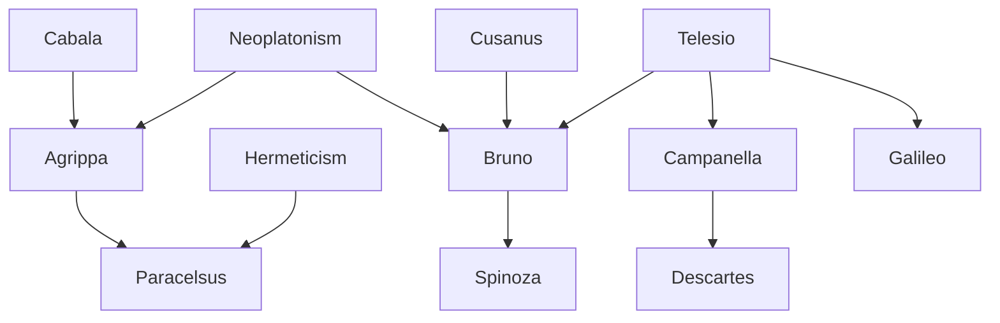

---
cssclasses:
  - Philosophy
subclasses:
  - Medieval-and-Renaissance-Philosophy
  - Metaphysics
  - Philosophy-of-Science
related:
  - "[[Renaissance Magic]]"
  - "[[Neoplatonism]]"
  - "[[Panpsychism]]"
  - "[[Scientific Revolution]]"
  - "[[Hermeticism]]"
  - "[[Natural Religion]]"
  - "[[Infinite Universe]]"
  - "[[Cosmology]]"
  - "[[Utopia]]"
  - "[[Counter-Reformation]]"
aliases:
  - natural philosophy
  - renaissance magic
  - nature philosophy
  - infinite universe
  - macrocosm microcosm
  - world soul
  - heroic fury
reference:
  - "Abbagnano, N., & Fornero, G. (2012). La ricerca del pensiero. Vol. 2A. Dall'Umanesimo all'empirismo. Paravia."
---

#### Central Problem

The chapter addresses the fundamental Renaissance question: how should humanity understand and relate to nature? This problem emerges from the humanist recognition that the relationship with the world is constitutive of human existence — the human being comprehends itself as part of the world, distinguishes itself to claim originality, yet roots itself in nature and recognizes it as its proper domain.

The Renaissance theme of the human as "middle nature" (natura media) expresses the awareness of being essentially inserted in the world and the decision to use this privileged position (similar to God's) to make the world one's kingdom. This generates the need for inquiry into nature as an indispensable instrument for realizing human ends.

The central tension lies between two approaches: magic, which presupposes universal animation of nature and seeks miraculous formulas to dominate natural forces through sympathies and enchantments; and natural philosophy, which maintains the concept of living nature but seeks to understand it through its own principles rather than through violent or miraculous intervention. The question is whether nature should be conquered by assault (magic) or understood through patient, methodical investigation (proto-science).

#### Main Thesis

The chapter presents three distinct approaches to understanding nature:

**Magic (Agrippa, Paracelsus):** Nature is universally animated by forces similar to those operating in humans, coordinated by universal sympathy. The human, situated at the center of three worlds (elemental, celestial, intelligible), can penetrate nature's secrets and dominate its forces through formulas, incantations, and the correspondence between macrocosm and microcosm. Paracelsus anticipates scientific method by insisting that theory and practice must proceed together, but his research retains magical character through the macrocosm-microcosm principle.

**Natural Philosophy (Telesio):** Nature is an autonomous world governed by its own principles (heat, cold, and corporeal mass) and can be explained only through these principles, excluding metaphysical forces. The human, as sensibility, is itself nature — sensation is nature's self-revelation to that part of itself which is human. This establishes the objectivity and autonomy of nature that will become the foundation of scientific research (Leonardo, [[Copernicus]], [[Kepler]], [[Galileo]]).

**Philosophical Religion of Nature (Bruno):** Nature is divine and infinite — "either God himself or divine virtue manifesting in things." The universe is one, infinite, and immobile, containing all contraries in unity. [[Bruno]]'s naturalism is a "religion" of nature, a heroic fury through which the philosopher, going beyond every limit with heroic effort, achieves superhuman identification with the cosmic process. His contemplation of nature is not mystical ecstasy but magical vision of nature's unity and inexhaustible life.

**Theological Politics (Campanella):** Building on Telesio's physics with magical and metaphysical integrations, Campanella grounds his political-religious project in natural philosophy. All things possess innate self-consciousness through the three "primalities" of being: power, wisdom, and love. Natural religion is innate in all humans and serves as the norm for measuring positive religions.

#### Historical Context

The Renaissance recovery of ancient texts — Hermetic writings, Neoplatonic philosophy, cabala — provided the intellectual framework for magical thinking. Figures like Agrippa (1486-1535) and Paracelsus (1493-1541) drew on these traditions to develop comprehensive systems of occult science.

[[Telesio]] (1509-1588) represents a crucial turning point. Working in Naples and publishing *De rerum natura iuxta propria principia* (1565), he established the principle that nature must be explained through nature itself — a principle that opened the way to genuine scientific investigation, even though his physics remained qualitative.

[[Bruno]] (1548-1600) led a dramatic life: Dominican friar, exile across Europe (Geneva, Toulouse, Paris, Oxford, Germany), finally arrested by the Inquisition in Venice (1592) and burned at the stake in Rome (1600) after refusing to recant. His Italian dialogues (*On Cause, Principle, and Unity*, *On the Infinite*, *On the Heroic Frenzies*) and Latin poems (*On the Minimum*, *On the Monad*, *On the Immense*) express passionate love for life and nature in its infinite expansion.

[[Campanella]] (1568-1639) was imprisoned for 27 years for organizing a conspiracy to establish a theocratic republic in Calabria. In prison he wrote his major works, including *The City of the Sun*, describing an ideal state governed by natural religion. He later found refuge in Paris under Louis XIII's protection.

#### Philosophical Lineage

#### Key Thinkers

| Thinker | Dates | Movement | Main Work | Core Concept |
|---------|-------|----------|-----------|--------------|
| [[Agrippa]] | 1486-1535 | [[Renaissance Magic]] | *De occulta philosophia* | Three worlds, macrocosm-microcosm |
| [[Paracelsus]] | 1493-1541 | [[Renaissance Magic]] | Medical writings | Unity of theory and practice |
| [[Telesio]] | 1509-1588 | [[Natural Philosophy]] | *De rerum natura* | Nature according to its own principles |
| [[Bruno]] | 1548-1600 | [[Renaissance Naturalism]] | *On Cause, Principle, and Unity* | Infinite universe, heroic fury |
| [[Campanella]] | 1568-1639 | [[Renaissance Naturalism]] | *Metaphysica*, *City of the Sun* | Three primalities, natural religion |

#### Key Concepts

| Concept | Definition | Related to |
|---------|------------|------------|
| Universal animation | All of nature is alive and moved by forces similar to those in humans | [[Magic]], [[Panpsychism]] |
| Macrocosm-microcosm | Correspondence between the universe (great world) and human being (small world) | [[Agrippa]], [[Paracelsus]] |
| Nature according to its own principles | Nature is autonomous and must be explained through its own forces, not metaphysics | [[Telesio]], [[Natural Philosophy]] |
| Heat and cold | Two incorporeal forces that act on corporeal mass; heat (sun) expands, cold (earth) condenses | [[Telesio]], [[Physics]] |
| Infinite universe | The cosmos is one, infinite, immobile, containing all contraries in unity | [[Bruno]], [[Cosmology]] |
| Heroic fury | Passionate philosophical quest for identification with infinite nature | [[Bruno]], [[Ethics]] |
| World soul | Universal animating principle that operates through universal intellect | [[Bruno]], [[Neoplatonism]] |
| Innate self-knowledge | Original consciousness each being has of itself, condition of all other knowledge | [[Campanella]], [[Epistemology]] |
| Three primalities | Power, wisdom, and love — essential attributes of all being, unlimited in God | [[Campanella]], [[Metaphysics]] |
| Natural religion (religio indita) | Religion innate in all humans, based on reason, norm for positive religions | [[Campanella]], [[Philosophy of Religion]] |

#### Authors Comparison

| Theme | [[Telesio]] | [[Bruno]] | [[Campanella]] |
|-------|-------------|-----------|----------------|
| Method | Sensory observation of nature | Lyrical-religious contemplation | Integration of physics, magic, metaphysics |
| Nature of universe | Autonomous, governed by heat/cold | One, infinite, divine, animated | Organic totality with world soul |
| Human position | Part of nature, knows through senses | Can identify with infinite nature | Has innate self-consciousness |
| God's role | Guarantor of natural order | Immanent (in things) and transcendent | Source of three primalities |
| Relation to science | Opens way to scientific method | Represents halt in scientific naturalism | Returns to magic and theology |
| Practical goal | Understanding nature | Philosophical religion of nature | Universal theocratic state |
| Freedom | Natural necessity | Acceptance of cosmic necessity | Political-religious reform |

#### Influences & Connections

- **Predecessors:** [[Magic]] ← influenced by ← [[Neoplatonism]], [[Cabala]], [[Hermeticism]]
- **Predecessors:** [[Bruno]] ← influenced by ← [[Cusanus]] (coincidence of opposites), [[Telesio]]
- **Contemporaries:** [[Telesio]] ↔ parallel development ↔ [[Bruno]], [[Campanella]]
- **Followers:** [[Telesio]] → influenced → [[Galileo]], scientific method
- **Followers:** [[Bruno]] → influenced → [[Spinoza]] (pantheism)
- **Followers:** [[Campanella]] → influenced → [[Descartes]] (self-consciousness as foundation)
- **Opposing views:** [[Bruno]] ← tension with ← [[Church]], [[Aristotelians]]

#### Summary Formulas

- **[[Agrippa]]:** The human, as microcosm at the center of three worlds, can know and dominate nature through magic, which is the highest science subduing all hidden powers to human will.
- **[[Paracelsus]]:** Research must unite theory and practice, experience and science; medicine must be founded on philosophy, astrology, alchemy, and virtue to heal through knowledge of macrocosm-microcosm correspondence.
- **[[Telesio]]:** Nature is autonomous and reveals itself to human sensation; we must follow "sense and nature, nothing else," explaining nature through its own principles of heat, cold, and corporeal mass.
- **[[Bruno]]:** The universe is one, infinite, and immobile — nature is God or divine virtue manifesting in things; the heroic fury drives the philosopher beyond every limit toward identification with the cosmic process.
- **[[Campanella]]:** All beings possess innate self-knowledge through the three primalities (power, wisdom, love); natural religion is the foundation of a universal theocratic state uniting all humanity.

#### Timeline

| Year | Event |
|------|-------|
| 1533 | [[Agrippa]] publishes *De occulta philosophia* |
| 1541 | [[Paracelsus]] dies in Salzburg |
| 1565 | [[Telesio]] publishes first two books of *De rerum natura* |
| 1576 | [[Bruno]] leaves Naples, begins European wanderings |
| 1584-1585 | [[Bruno]] publishes Italian dialogues in England |
| 1588 | [[Telesio]] dies in Cosenza |
| 1592 | [[Bruno]] arrested by Inquisition in Venice |
| 1599 | [[Campanella]]'s conspiracy discovered; imprisoned |
| 1600 | [[Bruno]] burned at the stake in Rome |
| 1623 | [[Campanella]] completes *Metaphysica* |
| 1639 | [[Campanella]] dies in Paris |

#### Notable Quotes

> "The universe is one, infinite, immobile. One, I say, is the absolute possibility, one the act, one the form or soul, one the matter or body, one the thing, one the being, one the maximum and optimum." — [[Bruno]]

> "We have followed sense and nature, and nothing else; that nature which, always agreeing with itself, always acts and operates in the same way." — [[Telesio]]

> "Nature is either God himself or divine virtue manifesting in things." — [[Bruno]]

---
> [!NOTE]
> *This summary has been created to present the key points from the source text, which was automatically extracted using LLM. Please note that the summary may contain errors. It serves as an essential starting point for study and reference purposes.*
