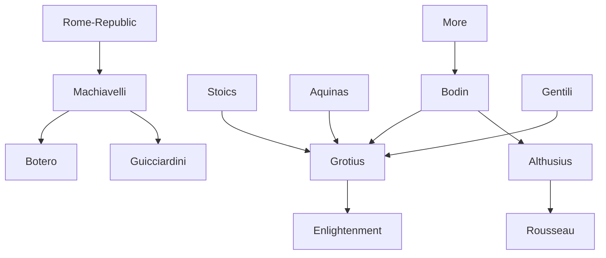

---
cssclasses:
  - Philosophy
  - Political-Science
subclasses:
  - Social-and-Political-Philosophy
  - Ethics
  - Medieval-and-Renaissance-Philosophy
aliases:
  - political realism
  - natural law
  - reason state
  - social contract
  - utopia
  - sovereignty
  - machiavelli
  - political philosophy
  - fortune virtue
  - just war
  - tolerance
  - republicanism
contributions:
  - Conceptual
authors:
  - "[[Machiavelli]]"
  - "[[Guicciardini]]"
  - "[[Botero]]"
  - "[[More]]"
  - "[[Bodin]]"
  - "[[Grotius]]"
  - "[[Althusius]]"
  - "[[Gentili]]"
reference: "[[03 The search for thought - Unit 1 Chapter 4.pdf]]"
---

#### Central Problem

The chapter addresses the fundamental problem of political renewal in the Renaissance: how should states be founded, preserved, and governed? This question divides into two distinct approaches: political realism, which focuses on the effective truth of political action based on historical experience, and natural law theory (giusnaturalismo), which seeks to clarify the permanent, rational nature of the state in order to bring existing political communities into conformity with it.

The tension between fortune and human freedom constitutes the underlying philosophical problem for the realists. Can human action shape political events, or are we at the mercy of blind chance? [[Machiavelli]] and [[Guicciardini]] grapple with this question, seeking to define the scope and limits of political agency in an unstable world.

For the natural law theorists, the central problem is different: what rational and universal principles should govern political life? How can positive laws be grounded in something more fundamental than mere convention or force? This leads to questions about the source of political legitimacy, the nature of sovereignty, and the possibility of religious tolerance based on a common rational foundation.

#### Main Thesis

The chapter presents two contrasting but complementary approaches to political thought:

**Political Realism:** [[Machiavelli]] argues that political action must be grounded in "effective truth" (verità effettuale) rather than imaginary ideals. The prince must learn "how not to be good" and use this knowledge according to necessity. Political morality is immanent — it does not always coincide with private morality. Fortune governs half of human actions, but virtue (orderly preparation) can make the human half decisive. The key to political renewal lies in "returning to origins" — drawing lessons from the past (especially republican Rome) to guide future action.

[[Guicciardini]] takes a more individualistic and skeptical view: fortune is pure chance without providential order. While active engagement remains necessary, success cannot be guaranteed. The politician must balance severity with gentleness, and appearance with genuine moral substance — for "false opinions do not last."

[[Botero]] develops the concept of "reason of state" (ragion di Stato) but integrates moral and religious requirements: virtue in the prince produces obedience in subjects, and prudence must guide all deliberations.

**Natural Law Theory:** [[More]]'s *Utopia* imagines a state conforming to reason: abolition of private property, religious tolerance, six-hour workdays, and solidarity based on the natural principle of pleasure. [[Bodin]] defines sovereignty as one, indivisible, perpetual, and absolute — yet limited by divine and natural law. [[Grotius]] provides the definitive formulation: natural law is founded on human rationality itself, and would be valid "even if God did not exist." The state originates in a social contract, but the sovereign must respect those rational, universal, and immutable principles grounded in human sociability.

#### Historical Context

The Renaissance political thinkers wrote against the backdrop of Italian fragmentation, foreign invasions, and the collapse of medieval political order. [[Machiavelli]] (1469-1527) experienced directly the fall of the Florentine Republic and wrote *The Prince* (1513) and the *Discourses* (1513-1519) from political exile, hoping to contribute to Italian unification.

The religious wars following the Protestant Reformation intensified debates about sovereignty, tolerance, and the relationship between political and religious authority. [[Bodin]] wrote his *Six Books of the Republic* in the context of French civil wars between Catholics and Huguenots. The question of religious tolerance became urgent as confessional conflict threatened social order.

[[More]] (1478-1535) wrote *Utopia* (1516) while criticizing the social conditions of Tudor England, where enclosure movements were driving peasants from their lands. His execution for opposing Henry VIII's divorce demonstrated the dangerous intersection of conscience and political power.

[[Grotius]] (1583-1645) wrote *On the Law of War and Peace* (1625) during the Thirty Years' War, seeking rational foundations for international law that could transcend confessional divisions. His work represents the emergence of a secular conception of natural law independent of theological foundations.

#### Philosophical Lineage

#### Key Thinkers

| Thinker | Dates | Movement | Main Work | Core Concept |
|---------|-------|----------|-----------|--------------|
| [[Machiavelli]] | 1469-1527 | [[Political Realism]] | *The Prince* | Effective truth, virtue vs. fortune |
| [[Guicciardini]] | 1483-1540 | [[Political Realism]] | *Ricordi* | Particular interest, fortune as chance |
| [[Botero]] | 1544-1617 | [[Counter-Reformation]] | *On the Reason of State* | Reason of state with morality |
| [[More]] | 1478-1535 | [[Utopian Thought]] | *Utopia* | Rational state, abolition of property |
| [[Bodin]] | 1529-1596 | [[Natural Law Theory]] | *Six Books of the Republic* | Absolute sovereignty |
| [[Gentili]] | 1552-1608 | [[Natural Law Theory]] | *De iure belli* | Just war, defensive only |
| [[Althusius]] | 1557-1638 | [[Social Contract Theory]] | Political works | Popular sovereignty |
| [[Grotius]] | 1583-1645 | [[Natural Law Theory]] | *De iure belli ac pacis* | Rational natural law |

#### Key Concepts

| Concept | Definition | Related to |
|---------|------------|------------|
| Effective truth (verità effettuale) | Political reality as it actually is, not as imagined in ideal republics | [[Machiavelli]], [[Political Realism]] |
| Fortune | The unpredictable dimension of events; governs half of human actions | [[Machiavelli]], [[Guicciardini]] |
| Virtue (virtù) | Political capacity and preparedness that can resist fortune | [[Machiavelli]], [[Political Realism]] |
| Return to origins | Renewal of communities through recovery of original principles | [[Machiavelli]], [[Republicanism]] |
| Reason of state (ragion di Stato) | Knowledge of means to found, preserve, and expand dominion | [[Botero]], [[Machiavelli]] |
| Sovereignty | Supreme power: one, indivisible, perpetual, absolute — yet bound by natural law | [[Bodin]], [[Natural Law Theory]] |
| Natural law | Rational principles valid independently of positive law, even without God | [[Grotius]], [[Natural Law Theory]] |
| Social contract | Original pact between people and sovereign legitimizing political power | [[Althusius]], [[Grotius]] |
| Popular sovereignty | Sovereignty belongs to the people, who delegate it to governors | [[Althusius]], [[Social Contract Theory]] |
| Religious tolerance | Coexistence of religions based on common rational foundation | [[More]], [[Bodin]], [[Grotius]] |

#### Authors Comparison

| Theme | [[Machiavelli]] | [[Guicciardini]] | [[Grotius]] |
|-------|-----------------|------------------|-------------|
| Central focus | Italian unification, republican virtue | Personal interest (particulare) | Universal rational principles |
| Human nature | Presume all men are bad | Naturally inclined to good but fragile | Naturally sociable and rational |
| Fortune | Half of actions; can be resisted with virtue | Pure chance, no providence | Not central; reason governs law |
| Morality in politics | Immanent; may differ from private morality | Appearance must become substance | Natural law obligates even sovereigns |
| Method | Historical-empirical | Experiential, skeptical | Rational-deductive |
| Religion | Useful for civic virtue | Not central | Natural religion based on reason |
| State origin | Historical necessity | — | Social contract |
| War | Tool of political renewal | — | Just only if defensive; natural law applies |

#### Influences & Connections

- **Predecessors:** [[Machiavelli]] ← influenced by ← Roman republican tradition, [[Livy]]
- **Predecessors:** [[Grotius]] ← influenced by ← [[Stoics]], [[Aquinas]]
- **Contemporaries:** [[Machiavelli]] ↔ dialogue with ↔ [[Guicciardini]]
- **Contemporaries:** [[Bodin]] ↔ parallel development ↔ [[Gentili]], [[Althusius]]
- **Followers:** [[Machiavelli]] → influenced → [[Botero]], modern political science
- **Followers:** [[Althusius]] → influenced → [[Rousseau]], social contract tradition
- **Followers:** [[Grotius]] → influenced → [[Enlightenment]], international law
- **Opposing views:** [[Political Realism]] ← tension with ← [[Natural Law Theory]]

#### Summary Formulas

- **[[Machiavelli]]:** Political action must follow effective truth, not ideal fantasies; the prince must learn "how not to be good" and use it according to necessity, while virtue can make the human half of fortune decisive.
- **[[Guicciardini]]:** Fortune is pure chance; active engagement is necessary but success cannot be guaranteed; the politician must have genuine moral substance since "false opinions do not last."
- **[[Botero]]:** Reason of state requires the excellence of virtue in the prince, for the foundation of the state lies in the obedience of subjects, which virtue alone can inspire.
- **[[More]]:** A rational state requires abolition of private property, religious tolerance, and solidarity founded on the natural principle of pleasure.
- **[[Bodin]]:** Sovereignty is one, indivisible, perpetual, and absolute — yet must conform to divine and natural law, which distinguishes legitimate power from mere force.
- **[[Grotius]]:** Natural law is founded on human rationality and would be valid even if God did not exist; the state originates in a social contract but must respect rational, universal principles.

#### Timeline

| Year | Event |
|------|-------|
| 1513 | [[Machiavelli]] writes *The Prince* |
| 1513-1519 | [[Machiavelli]] writes *Discourses on Livy* |
| 1516 | [[More]] publishes *Utopia* |
| 1532 | [[Machiavelli]]'s *Prince* published posthumously |
| 1535 | [[More]] executed for opposing Henry VIII |
| 1576 | [[Bodin]] publishes *Six Books of the Republic* |
| 1589 | [[Botero]] publishes *On the Reason of State* |
| 1598 | [[Gentili]] publishes *De iure belli* |
| 1625 | [[Grotius]] publishes *De iure belli ac pacis* |

#### Notable Quotes

> "A prince must learn how not to be good, and use this knowledge or not according to necessity." — [[Machiavelli]]

> "Do everything to appear good, for this serves infinite purposes; but since false opinions do not last, you will hardly succeed in appearing good for long if you are not truly so." — [[Guicciardini]]

> "He who has faith achieves great things." — [[Guicciardini]]

#### See Also

- [[Political Realism]]
- [[Natural Law]]
- [[Social Contract]]
- [[Sovereignty]]
- [[Utopia]]
- [[Religious Tolerance]]
- [[Republicanism]]
- [[Reason of State]]
- [[International Law]]
- [[Enlightenment Political Thought]]

> [!NOTE]
> *This summary has been created to present the key points from the source text, which was automatically extracted using LLM. Please note that the summary may contain errors. It serves as an essential starting point for study and reference purposes.*
