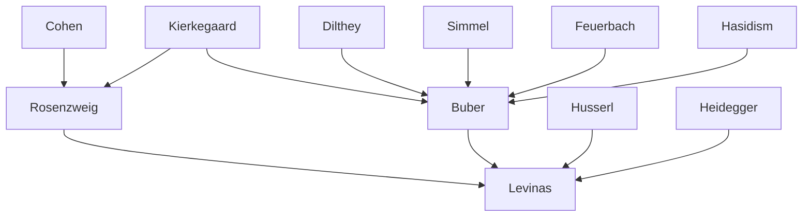

---
cssclasses:
  - Philosophy
subclasses:
  - Ethics
  - Philosophy-of-Religion
  - 20th-Century-Philosophy
related:
  - "[[Phenomenology]]"
  - "[[Existentialism]]"
  - "[[Philosophy of Religion]]"
  - "[[Dialogical Philosophy]]"
  - "[[Ethics of Care]]"
  - "[[Personalism]]"
  - "[[Jewish Philosophy]]"
  - "[[Kabbalah]]"
  - "[[Hasidism]]"
  - "[[Holocaust Philosophy]]"
aliases:
  - jewish philosophy
  - dialogue philosophy
  - alterity ethics
  - face other
  - buber philosophy
  - levinas ethics
  - rosenzweig thought
  - responsibility ethics
  - totality infinity
  - relation philosophy
  - theological philosophy
reference:
  - "Abbagnano, N., & Fornero, G. (2012). La ricerca del pensiero. Vol. 3C. Dalla crisi della modernità agli sviluppi più recenti. Paravia."
---

#### Central Problem

Twentieth-century Jewish philosophy (or "neo-Hebraic thought") addresses the fundamental question of how to philosophize in a manner that respects the concrete existence of the individual, the reality of death and time, and the primacy of ethical relations—all while drawing upon the Jewish religious and cultural tradition. This movement emerged as a deliberate alternative to the totalizing tendencies of Western philosophy, which, from the pre-Socratics to German Idealism, has attempted to subsume all particularity within universal categories, thereby negating the irreducible singularity of the existing individual.

The central tension lies between the philosophical tradition's aspiration to comprehend reality as a totality (the "Whole" or "All") and the Jewish religious emphasis on the absolute transcendence of God, the contingency of the world, and the human being as God's partner in an ongoing dialogue. Traditional philosophy, born from the fear of death, attempts to overcome this fear by dissolving the individual into the universal—"only what is singular can die, and everything mortal is alone." Neo-Hebraic thinkers reject this consolation as false, insisting instead on confronting mortality, temporality, and the concrete ethical demands of the neighbor.

The Holocaust's catastrophic destruction of European Jewry intensified these concerns, as [[Levinas]] suggests that Western philosophy's "imperialism of the Same" and rejection of the Other provided conceptual matrices for such violence against alterity.

#### Main Thesis

The neo-Hebraic philosophers propose that authentic philosophy must abandon totalizing ontology in favor of a "new thinking" that prioritizes dialogue, relation, and ethical responsibility toward the Other.

**[[Rosenzweig]]** argues that philosophy must reject idealistic-pantheistic totalities and recognize three irreducible elements of experience: God, the World, and the Human Being. These are connected through creation (God-World), revelation (God-Human), and redemption (Human-World). Theological concepts become "ontological categories," making religion the structure and truth of being itself. Truth requires not mere knowledge but *testimony*—living witness through ethical-religious commitment.

**[[Buber]]** develops a "relational personalism" or "dialogical philosophy" centered on two fundamental word-pairs (Grundworte): **I-Thou** (Ich-Du) and **I-It** (Ich-Es). The I-It represents impersonal, instrumental, superficial relations with otherness; the I-Thou represents personal, disinterested, profound relations. The authentic I (the person) constitutes itself only through genuine relation with others: "the I becomes I only in the Thou." The I-Thou relation finds its highest manifestation in the relationship with the eternal Thou (God), who is not an object of theology but a living presence addressed in dialogue. God has not died but has been "eclipsed" by modernity's I-It domination—and may return.

**[[Levinas]]** radicalizes this critique, accusing Western philosophy of "imperialism of the Same" and "ontological violence"—reducing the Other to categories of the Same. The escape from this totalizing ontology occurs not through theory but through the ethical encounter with the **face** (visage) of the Other. The face presents itself as absolutely transcendent, bearing in itself the commandment "Thou shalt not kill." The face makes me responsible—infinitely responsible, even for the Other's responsibility. Ethics is not a branch of philosophy but "first philosophy" itself: metaphysics = ethics = religion.

#### Historical Context

The encounter between Judaism and philosophy in the twentieth century had precursors in the late work of neo-Kantian [[Cohen]] (1842-1918), but achieved its distinctive expression in [[Rosenzweig]], [[Buber]], and [[Levinas]]. Jewish philosophy throughout history, influenced by Greek-Hellenistic, Arabic, and modern sources as well as the esoteric mystical tradition of the Kabbalah, was characterized by: the affirmation of God's absolute unity and transcendence; the contingency and relative autonomy of the world; the human being as God's partner; and history as the interweaving of divine will and human freedom.

[[Rosenzweig]] experienced a decisive religious crisis in 1913, planning to convert to Christianity but ultimately rediscovering Judaism. His major work, *The Star of Redemption* (1921), was written during World War I and completed while he suffered from a progressive paralytic illness that left him communicating only by indicating letters to his wife. He died in 1929 at age 43.

[[Buber]] (1878-1965) studied with Simmel and Dilthey, joined the Zionist movement, and after losing his professorship under Nazism emigrated to Jerusalem in 1938, where he advocated peaceful coexistence between Arabs and Jews. His philosophy drew on his studies of Hasidism, the Eastern European Jewish movement emphasizing action.

[[Levinas]] (1905-1995), born in Lithuania, studied with [[Husserl]] and [[Heidegger]] in Freiburg and was among the first to introduce phenomenology to France. Imprisoned in a concentration camp during World War II, his philosophical development was profoundly shaped by the Holocaust's demonstration of what the refusal of the Other can produce.

#### Philosophical Lineage

#### Key Thinkers

| Thinker | Dates | Movement | Main Work | Core Concept |
|---------|-------|----------|-----------|--------------|
| [[Cohen]] | 1842-1918 | [[Neo-Kantianism]] | *Religion of Reason* | Ethical monotheism |
| [[Rosenzweig]] | 1886-1929 | [[Neo-Hebraic Philosophy]] | *The Star of Redemption* | New thinking, creation-revelation-redemption |
| [[Buber]] | 1878-1965 | [[Dialogical Philosophy]] | *I and Thou* | I-Thou relation, eternal Thou |
| [[Levinas]] | 1905-1995 | [[Phenomenology]] | *Totality and Infinity* | Face, responsibility, alterity |

#### Key Concepts

| Concept | Definition | Related to |
|---------|------------|------------|
| New Thinking | Philosophy faithful to experience, uniting philosophy and theology, against totalizing systems | [[Rosenzweig]], [[Neo-Hebraic Philosophy]] |
| I-Thou (Ich-Du) | Word-pair designating personal, disinterested, profound relations with alterity | [[Buber]], [[Dialogical Philosophy]] |
| I-It (Ich-Es) | Word-pair designating impersonal, instrumental, superficial relations with alterity | [[Buber]], [[Dialogical Philosophy]] |
| Eternal Thou | God as living presence addressed in dialogue, not theological object | [[Buber]], [[Philosophy-of-Religion]] |
| Eclipse of God | God's temporary concealment due to the dominance of I-It relations in modernity | [[Buber]], [[Philosophy-of-Religion]] |
| Face (Visage) | The mode in which the Other presents itself, bearing absolute transcendence and ethical command | [[Levinas]], [[Ethics]] |
| Totality | Immanent, englobing being of traditional ontology that reduces alterity to sameness | [[Levinas]], [[Phenomenology]] |
| Infinity | Transcendent reality of the absolutely Other, revealed through the face | [[Levinas]], [[Ethics]] |
| Responsibility | Original structure of subjectivity constituted through being-for-the-Other | [[Levinas]], [[Ethics]] |
| Star of Redemption | Symbol of the interconnection of God, World, Human through creation, revelation, redemption | [[Rosenzweig]], [[Neo-Hebraic Philosophy]] |

#### Authors Comparison

| Theme | [[Rosenzweig]] | [[Buber]] | [[Levinas]] |
|-------|----------------|-----------|-------------|
| Central problem | Philosophy's denial of death and singularity | Loss of authentic relation in modernity | Western philosophy's violence against alterity |
| Key concept | New thinking | I-Thou relation | Face and responsibility |
| View of God | Partner in creation-revelation-redemption | Eternal Thou addressed in dialogue | Trace in the face of the Other |
| Ethics | Testimony through life | Dialogue and relation | First philosophy, responsibility for Other |
| Critique of philosophy | Totalizing idealism from Ionia to Jena | Dominance of I-It, loss of relation | Imperialism of the Same, ontological violence |
| Judaism-Christianity | Complementary incarnations of religious truth | Emphasis on Jewish tradition, Hasidism | Judaism's emphasis on justice |

#### Influences & Connections

- **Predecessors:** [[Rosenzweig]] ← influenced by ← [[Kierkegaard]], [[Cohen]], German Idealism (critically)
- **Predecessors:** [[Buber]] ← influenced by ← [[Feuerbach]], [[Kierkegaard]], [[Dilthey]], [[Simmel]], Hasidism
- **Predecessors:** [[Levinas]] ← influenced by ← [[Husserl]], [[Heidegger]], [[Rosenzweig]], [[Buber]]
- **Contemporaries:** [[Rosenzweig]] ↔ dialogue with ↔ [[Buber]]
- **Contemporaries:** [[Levinas]] ↔ dialogue with ↔ [[Derrida]], [[Ricoeur]]
- **Followers:** [[Buber]] → influenced → [[Levinas]], [[Personalism]], [[Dialogical Theology]]
- **Followers:** [[Levinas]] → influenced → [[Derrida]], [[Marion]], Contemporary Ethics
- **Opposing views:** [[Levinas]] ← critical of ← [[Heidegger]]'s ontology, Western metaphysics

#### Summary Formulas

- **[[Rosenzweig]]:** The fear of death generates philosophy, but philosophy denies death; a "new thinking" must break with totalizing systems to recover the lived relations of God, World, and Human.
- **[[Buber]]:** The authentic I constitutes itself only in the I-Thou relation; God is the eternal Thou addressed in dialogue, not an object of theology, and has been eclipsed but not extinguished.
- **[[Levinas]]:** The face of the Other breaks open totalizing ontology, commanding "Thou shalt not kill" and constituting the subject through infinite responsibility; ethics is first philosophy.

#### Timeline

| Year | Event |
|------|-------|
| 1913 | [[Rosenzweig]]'s religious crisis and rediscovery of Judaism |
| 1920 | [[Rosenzweig]] publishes *[[Hegel]] and the State* |
| 1921 | [[Rosenzweig]] publishes *The Star of Redemption* |
| 1923 | [[Buber]] publishes *I and Thou* |
| 1925 | [[Rosenzweig]] publishes *The New Thinking* |
| 1929 | [[Rosenzweig]] dies at age 43 |
| 1938 | [[Buber]] emigrates to Jerusalem |
| 1947 | [[Levinas]] publishes *Existence and Existents* |
| 1952 | [[Buber]] publishes *Eclipse of God* |
| 1961 | [[Levinas]] publishes *Totality and Infinity* |
| 1965 | [[Buber]] dies in Jerusalem |
| 1974 | [[Levinas]] publishes *Otherwise than Being* |
| 1995 | [[Levinas]] dies |

#### Notable Quotes

> "Only what is singular can die, and everything mortal is alone." — [[Rosenzweig]]

> "All actual life is encounter." — [[Buber]]

> "The face speaks to me and thereby invites me to a relation that has no common measure with a power that is exercised." — [[Levinas]]

---
> [!NOTE]
> *This summary has been created to present the key points from the source text, which was automatically extracted using LLM. Please note that the summary may contain errors. It serves as an essential starting point for study and reference purposes.*
