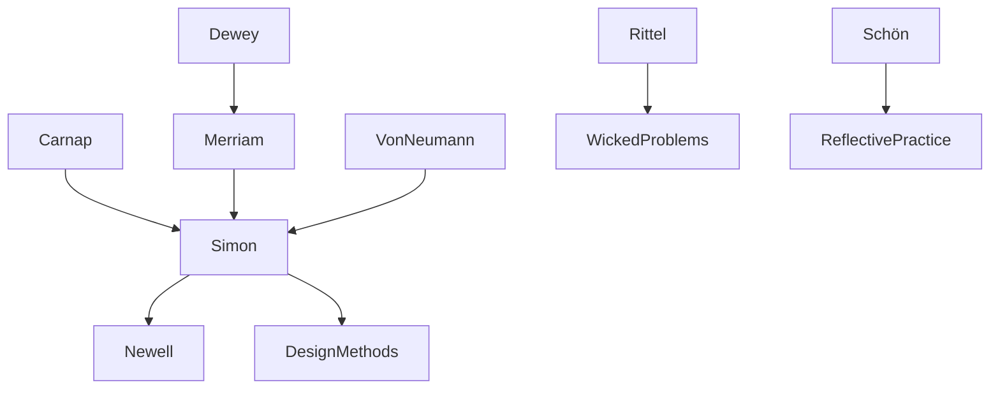

---
cssclasses:
  - Philosophy
  - Computer-Science
  - Arts
subclasses:
  - Design-Theory
  - Philosophy-of-Science
  - Design-History
related:
  - "[[Design Methods]]"
  - "[[Artificial Intelligence]]"
  - "[[Problem Solving]]"
  - "[[Bounded Rationality]]"
  - "[[Wicked Problems]]"
aliases:
  - herbert simon
  - sciences artificial
  - design science
  - bounded rationality
  - problem solving
  - satisficing
  - cold war
  - rand corporation
  - design methods
  - technocracy
reference:
  - Huppatz, D. (2015). Revisiting Herbert Simon’s “Science of Design.” Design Issues, 31(2), 29–40. https://doi.org/10.1162/DESI_a_00320
---

#### Central Problem

[[Huppatz]] addresses the uncritical acceptance of [[Herbert Simon]]'s *The Sciences of the Artificial* (1969) as foundational text for design research. The central problem is twofold: first, the historical context that shaped Simon's "science of design" has been largely forgotten or ignored by design researchers who continue to cite his work; second, the implications of Simon's framework—which represses judgment, intuition, experience, and social interaction in favor of logical optimization—continue to shape design research and practice in problematic ways.

The article asks: Why has Simon's model remained so influential despite early critiques from design methods researchers like [[Rittel]] and [[Alexander]] who abandoned similar approaches in the 1960s? And what are the consequences of defining design as "scientific" problem solving modeled on artificial intelligence and military systems analysis?

[[Huppatz]] argues that Simon's framework was not value-neutral but emerged from a specific Cold War military-industrial-academic complex, particularly his consultancy at the RAND Corporation, where the goal was to mechanize decision-making for weapons systems and command-and-control operations.

#### Main Thesis

[[Huppatz]] argues that Simon's "science of design" is fundamentally a technocratic model rooted in Cold War military research, not a neutral scientific framework. Simon's definition of design as problem solving—where "solving a problem simply means representing it so as to make the solution transparent"—strips design of its essentially social, political, cultural, and embodied dimensions.

The article demonstrates that Simon's intellectual trajectory moved from political science at the "Chicago School" (with its faith in scientific methods for social control) through management theory to artificial intelligence research at RAND. His "bounded rationality" concept—for which he won the Nobel Prize—emerged from this military context, where human cognitive limitations could be augmented by computer processing power. The "science of design" was simply an extension of this project to engineering education.

[[Huppatz]] shows that Simon's contemporaries in the Design Methods movement—including [[Rittel]], [[Alexander]], and [[Archer]]—had already tried and abandoned similar approaches by the time Simon delivered his 1968 lectures. [[Rittel]]'s concept of "wicked problems" offered an alternative acknowledging that design problems are fundamentally political and require judgment rather than optimization. Yet Simon ignored these developments entirely.

The article concludes that Simon's legacy persists because his "logic of optimization" promises prediction and control—appealing to management and business contexts—while alternative models emphasizing judgment, intuition, experience, and social interaction have since emerged through [[Schön]]'s "reflection-in-practice" and participatory design approaches.

#### Historical Context

The article situates Simon's work within the post-WWII American "military-industrial-academic complex." The RAND Corporation, established by the Air Force in 1948, became the central institution where Simon developed his problem-solving research during the 1950s-60s. RAND's mission was developing a "science of warfare" including nuclear deterrence strategy ("Mutually Assured Destruction") and command-and-control systems.

Simon was part of an elite network of "brokers" who channeled research funding from military institutes (RAND, Office of Naval Research, Air Force Office of Scientific Research), private foundations (Ford, Carnegie, Rockefeller), and government bodies toward mathematical, behavioral, problem-centered research. His collaborator [[Allen Newell]] and others at RAND developed artificial intelligence specifically to automate problem solving in strategic military situations—promising more reliable outcomes than fallible human intelligence.

The broader intellectual climate included a "quantitative revolution" in social sciences, where scientific legitimacy required formal theoretical models, controlled experiments, and sophisticated equipment. Simon's vision was to unify all social sciences under problem solving as "the glue."

By the late 1960s, intellectuals like [[Marcuse]] and [[Maldonado]] were critiquing "technological rationality" and the supposed "ideological neutrality" of systems designers. Yet Simon's *Sciences of the Artificial* ignored both these critiques and the internal critiques from design methods researchers who had already abandoned optimization approaches.

#### Philosophical Lineage

#### Key Thinkers

| Thinker | Dates | Movement | Main Work | Core Concept |
|---------|-------|----------|-----------|--------------|
| [[Simon]] | 1916-2001 | [[Cognitive Science]] | *The Sciences of the Artificial* | Bounded rationality, satisficing |
| [[Rittel]] | 1930-1990 | [[Design Methods]] | "Wicked Problems" | Design as argumentation |
| [[Alexander]] | 1936– | [[Design Methods]] | *Notes on the Synthesis of Form* | Pattern language (later) |
| [[Schön]] | 1930-1997 | [[Reflective Practice]] | *The Reflective Practitioner* | Reflection-in-action |
| [[Newell]] | 1927-1992 | [[Artificial Intelligence]] | *Human Problem Solving* | General Problem Solver |
| [[Marcuse]] | 1898-1979 | [[Critical Theory]] | *One-Dimensional Man* | Critique of technological rationality |

#### Key Concepts

| Concept | Definition | Related to |
|---------|------------|------------|
| Science of design | Simon's proposal to formalize design as logical optimization methods solvable by computer programs | [[Simon]], [[AI]] |
| Bounded rationality | Human cognitive limitations in processing information; humans "satisfice" rather than optimize | [[Simon]], [[Economics]] |
| Satisficing | Making satisfactory rather than optimal choices due to cognitive limitations | [[Simon]], [[Decision Theory]] |
| Wicked problems | Design/planning problems that are social, political, and cannot be definitively solved | [[Rittel]], [[Design Methods]] |
| Reflection-in-practice | Professional expertise combining knowledge with intuition and judgment in action | [[Schön]], [[Design Education]] |
| Military-industrial-academic complex | Post-WWII network of defense funding, universities, and think tanks shaping American research | [[Cold War]], [[RAND]] |
| Technocracy | Rule by technical experts who translate substantive decisions into efficiency calculations | [[Simon]], [[Critique]] |

#### Authors Comparison

| Theme | [[Simon]] | [[Rittel]] |
|-------|----------|-----------|
| Design problems | Well-structured, decomposable into sub-problems | Wicked, essentially contested |
| Design process | Logical optimization, formalized search | Argumentative, negotiated |
| Role of judgment | Eliminated, replaced by algorithms | Central, irreducible |
| Politics | Hidden behind technical neutrality | Acknowledged as fundamental |
| Designer | Expert coder, information processor | Participant in social negotiation |
| Computer role | Augments/replaces human cognition | Tool among many |

#### Influences & Connections

- **Predecessors:** [[Simon]] ← influenced by ← [[Carnap]], [[Merriam]], [[von Neumann]]
- **Contemporaries:** [[Simon]] ↔ debate with ↔ [[Rittel]], [[Alexander]], [[Dreyfus]]
- **Followers:** [[Simon]] → influenced → [[Design Science]], [[Management Theory]], [[AI]]
- **Opposing views:** [[Simon]] ← criticized by ← [[Rittel]], [[Schön]], [[Marcuse]], [[Maldonado]]

#### Summary Formulas

- **[[Simon]]:** Design is problem solving; solving a problem means representing it so as to make the solution transparent; computer programs can design without human intervention.
- **[[Rittel]]:** Design problems are "wicked"—they rely on elusive political judgment for resolution; designing is an argumentative process where all stakeholders have agency.
- **[[Schön]]:** Professional expertise involves "reflection-in-action"—a knowing-in-practice that cannot be reduced to technical rationality.
- **[[Huppatz]]:** Simon's "science of design" is a Cold War technocratic model that promised control by stripping judgment, intuition, and social interaction from design—a model that persists in contemporary "design thinking" discourse.

#### Timeline

| Year | Event |
|------|-------|
| 1947 | [[Simon]] publishes *Administrative Behavior* |
| 1948 | RAND Corporation established |
| 1955 | [[Simon]] publishes "A Behavioral Model of Rational Choice" |
| 1960 | [[Simon]] and [[Newell]] develop General Problem Solver |
| 1962 | [[Alexander]] presents mathematical design methods at London conference |
| 1968 | [[Simon]] delivers "The Science of Design" lecture at MIT |
| 1969 | [[Rittel]] and Weber publish "Wicked Problems" paper |
| 1978 | [[Simon]] wins Nobel Prize in Economics |
| 1983 | [[Schön]] publishes *The Reflective Practitioner* |

#### Notable Quotes

> "Everyone designs who devises courses of action aimed at changing existing situations into preferred ones." — [[Simon]]

> "Solving a problem simply means representing it so as to make the solution transparent." — [[Simon]]

> "What really bounds rationality in human action is nothing more than all the other parts which comprise the human existence as a whole: poetics, rhetoric, hermeneutics, and ethics; because, when humans act, they act as whole humans." — [[Bousbaci]], cited by [[Huppatz]]
