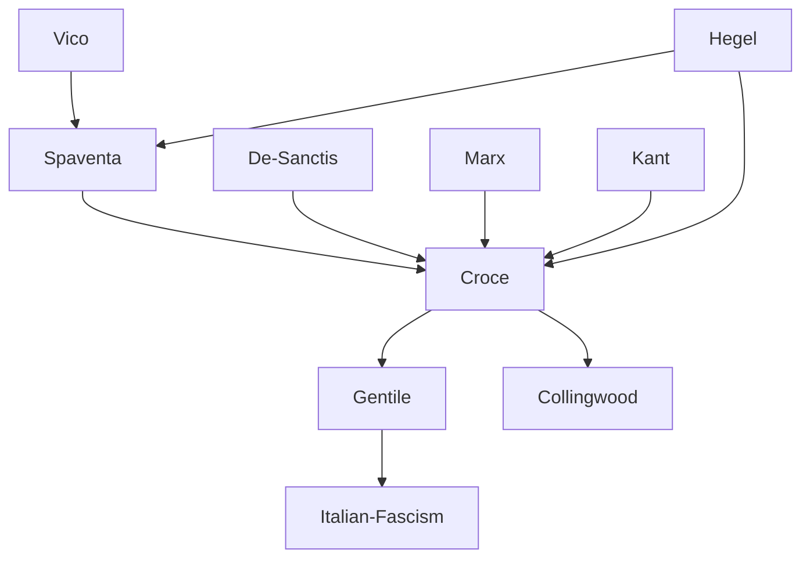

---
cssclasses:
  - Philosophy
subclasses:
  - Epistemology
  - Aesthetics
  - 19th-Century-Philosophy
aliases:
  - neo idealism
  - philosophy spirit
  - intuition expression
  - ideal types
  - circular spirit
  - absolute historicism
  - art autonomy
  - philosophy history
  - lyrical intuition
  - distinct forms
contributions:
  - Conceptual
authors:
  - "[[Croce]]"
  - "[[Gentile]]"
  - "[[Hegel]]"
  - "[[Vico]]"
  - "[[Sanctis]]"
  - "[[Spaventa]]"
reference: "Abbagnano, N., & Fornero, G. (2012). La ricerca del pensiero. Vol. 3A. Da Schopenhauer a Freud. Paravia."
related:
  - "[[Absolute Idealism]]"
  - "[[Historicism]]"
  - "[[Aesthetics]]"
  - "[[Italian Philosophy]]"
  - "[[Hegelianism]]"
  - "[[Philosophy of Spirit]]"
  - "[[Intuition]]"
  - "[[Expression]]"
  - "[[Liberalism]]"
  - "[[Fascism]]"
---

#### Central Problem

What is the structure of spiritual reality, and how are the different forms of human activity — art, philosophy, economics, and ethics — related to one another? The Italian Neo-Idealists, particularly Croce, sought to develop a comprehensive "philosophy of Spirit" that would overcome the limitations of both positivism and the earlier forms of idealism while preserving [[Hegel]]'s fundamental insight into the rational structure of reality and the identity of the real with the rational.

The central question concerns the unity and distinction of the forms of Spirit: How can Spirit be one yet manifest itself in irreducibly distinct forms? How do these forms relate to one another — through dialectical opposition or through a different kind of connection? And what are the implications of this doctrine for understanding art, science, history, morality, politics, and religion?

For Croce specifically, the problem also concerns the autonomy of art: Can aesthetics establish itself as an autonomous philosophical discipline with its own irreducible object? Against both moralistic and intellectualistic conceptions of art, Croce argues for the complete autonomy of aesthetic activity, understood as intuition-expression of the individual.

#### Main Thesis

Croce develops a "philosophy of Spirit" that identifies reality with the eternal circular development of Spirit through four distinct forms or grades, organized in two fundamental activities (theoretical and practical), each subdivided into two grades:

**The Four Forms of Spirit:**
1. **Art** (theoretical/individual): intuitive knowledge of the individual, producing images
2. **Philosophy/Logic** (theoretical/universal): conceptual knowledge of the universal, producing concepts
3. **Economics** (practical/individual): volition of the individual, pursuing utility
4. **Ethics** (practical/universal): volition of the universal, pursuing the good

**The Doctrine of Distincts vs. Opposites:** Croce distinguishes between the relation of "distincts" (the four forms of Spirit) and "opposites" (positive and negative within each form: beautiful/ugly, true/false, useful/harmful, good/evil). The distincts condition each other in a linear order (art conditions philosophy, knowledge conditions action, economics conditions ethics), while opposites engage in dialectical conflict within each form.

**The Circularity of Spirit:** Spirit eternally circulates through its forms, each moment conditioning the next, with every point serving as both first and last. This is not repetition but progressive enrichment — Spirit grows upon itself.

**Art as Intuition-Expression:** Art is the lyrical intuition of the individual — the contemplation of feeling transformed into image. The identity of intuition and expression means that an unexpressed intuition is nothing. Art is completely autonomous from logic, morality, and utility; its only criterion is beauty, which coincides with successful expression.

**The Identity of Philosophy and History:** Every true philosophy is historical and every true history is philosophical. The "synthesis a priori" of logic unites the definitional judgment (universal) with the individual judgment (particular), revealing that all genuine thought is simultaneously philosophical and historical.

**Against [[Hegel]]:** Croce accepts [[Hegel]]'s immanentism, historicism, and doctrine of opposites, but rejects: the triadic schema, the confusion of distincts with opposites, the philosophy of nature, and the doctrine of the "end of history."

#### Historical Context

Italian Neo-Idealism emerged in the late nineteenth and early twentieth centuries as part of the broader European reaction against positivism. In Italy, this reaction took a distinctive form due to the prior presence of Hegelianism, which had been introduced and developed at the University of Naples by figures like Bertrando Spaventa and Augusto Vera.

Spaventa had argued for reconnecting Italian philosophy with European (especially German) thought, against the provincial spiritualism that dominated mid-nineteenth-century Italy. He traced a parallel development between Italian philosophy (Bruno, Vico, Gioberti) and German idealism (Spinoza, [[Kant]], [[Hegel]]), arguing that Italy had initiated modern philosophy in the Renaissance.

Croce came to philosophy from literary and historical studies, particularly under the influence of the literary critic De Sanctis. His systematic philosophy developed gradually through his journals "La critica" (founded 1903) and his engagement with [[Marx]], [[Hegel]], and Vico.

During the Fascist period (1922-1943), Croce became a symbol of liberal opposition, while his former collaborator Gentile became the regime's official philosopher. This political divergence reflected deeper philosophical differences between Croce's absolute historicism and Gentile's actualism.

#### Philosophical Lineage

#### Key Thinkers

| Thinker | Dates | Movement | Main Work | Core Concept |
|---------|-------|----------|-----------|--------------|
| [[Croce]] | 1866-1952 | [[Neo-Idealism]] | *Aesthetic as Science of Expression* | Intuition-expression, circularity of Spirit |
| [[Gentile]] | 1875-1944 | [[Actualism]] | *Theory of Spirit as Pure Act* | Pensiero pensante, ethical state |
| [[Spaventa]] | 1817-1883 | [[Italian Hegelianism]] | *La filosofia italiana* | Universality of Italian philosophy |
| [[Hegel]] | 1770-1831 | [[Absolute Idealism]] | *Phenomenology of Spirit* | Dialectic of opposites |
| [[De Sanctis]] | 1817-1883 | [[Literary Criticism]] | *History of Italian Literature* | Autonomy of art criticism |
| [[Bradley]] | 1846-1924 | [[British Idealism]] | *Appearance and Reality* | Absolute as infinite consciousness |

#### Key Concepts

| Concept | Definition | Related to |
|---------|------------|------------|
| Distincts (distinti) | The four irreducible forms of Spirit (art, philosophy, economics, ethics) that condition each other in ordered succession | [[Croce]], philosophy of Spirit |
| Opposites (opposti) | Dialectical pairs within each form (beautiful/ugly, true/false, useful/harmful, good/evil) | [[Croce]], [[Hegel]] |
| Intuition-expression | Identity of artistic intuition with its expression; unexpressed intuition is nothing | [[Croce]], aesthetics |
| Lyrical intuition | Art as contemplation of feeling transformed into image; synthesis of sentiment and form | [[Croce]], aesthetics |
| Pure concepts | Universal and concrete concepts of philosophy, distinguished from pseudo-concepts of science | [[Croce]], logic |
| Pseudo-concepts | Empirical or abstract concepts (of common sense and science) that lack true universality or concreteness | [[Croce]], logic |
| Circularity of Spirit | Eternal circular movement through the four forms, each moment being both first and last | [[Croce]], philosophy of Spirit |
| Contemporaneity of history | All true history is contemporary history; past becomes living when illuminated by present interests | [[Croce]], historicism |
| Cosmicity of art | Each particular artistic image reflects the totality of human destiny and universal reality | [[Croce]], aesthetics |
| Ethical State | Gentile's concept of the State as the realization of morality and the fulfillment of individual personality | [[Gentile]], political philosophy |

#### Authors Comparison

| Theme | [[Croce]] | [[Gentile]] | [[Hegel]] |
|-------|-----------|-------------|-----------|
| Structure of Spirit | Four distinct forms in circular relation | Spirit as pure act of thinking | Triadic dialectic (thesis-antithesis-synthesis) |
| Art and philosophy | Distinct forms; art is autonomous | Art and religion are "inactual" moments absorbed in philosophy | Art, religion, philosophy as ascending forms of Absolute |
| History | Identity of philosophy and history | Contemporaneity of all history to the thinking act | Dialectical progress toward freedom |
| State and ethics | State belongs to economics (utility, force); ethics transcends it | Ethical State; morality realized only in State | State as actualization of ethical life |
| Dialectic | Opposites within distincts; no triadic schema | Dialectic of pensiero pensante/pensiero pensato | Triadic dialectic throughout |
| Religion | Not an autonomous form; mixture of other forms | Inactual moment absorbed in philosophy | Representation of Absolute, surpassed by philosophy |

#### Influences & Connections

- **Predecessors:** [[Croce]] ← influenced by ← [[Hegel]], [[Vico]], [[De Sanctis]], [[Marx]], [[Spaventa]]
- **Contemporaries:** [[Croce]] ↔ dialogue with ↔ [[Gentile]], [[Pareto]], [[Mosca]]
- **Followers:** [[Croce]] → influenced → [[Collingwood]], Italian liberalism, literary criticism
- **Opposing views:** [[Croce]] ← criticized by ← [[Gramsci]] (for separation of philosophy and politics), [[Positivists]]

#### Summary Formulas

- **[[Croce]]:** Spirit eternally circulates through four distinct forms (art, philosophy, economics, ethics); art is autonomous intuition-expression of the individual; philosophy and history are identical; the real is rational and the rational is real, but without [[Hegel]]'s triadic apparatus.

- **[[Gentile]]:** Reality is the pure act of thinking (pensiero pensante); everything that exists is immanent to this act; the State is the ethical realization of individual personality; art and religion are "inactual" moments absorbed in philosophy.

- **[[Hegel]]:** The Absolute develops dialectically through nature and Spirit toward self-consciousness; reality is the progressive self-realization of Reason through thesis-antithesis-synthesis.

- **[[Spaventa]]:** Italian philosophy must reconnect with European (German) thought; [[Bruno]], Vico, and Gioberti parallel [[Spinoza]], [[Kant]], and Hegel; the universality of Italian thought lies in its capacity to synthesize all oppositions.

#### Timeline

| Year | Event |
|------|-------|
| 1817 | [[Spaventa]] born; [[De Sanctis]] born |
| 1866 | [[Croce]] born in Pescasseroli, Abruzzo |
| 1875 | [[Gentile]] born in Castelvetrano, Sicily |
| 1883 | [[Spaventa]] dies; [[De Sanctis]] dies |
| 1900 | [[Croce]] publishes *Historical Materialism and Marxist Economics* |
| 1902 | [[Croce]] publishes *Aesthetic as Science of Expression and General Linguistics* |
| 1903 | [[Croce]] founds the journal "La critica" |
| 1906 | [[Croce]] publishes *What is Living and What is Dead in [[Hegel]]'s Philosophy* |
| 1909 | [[Croce]] publishes *Logic* and *Philosophy of the Practical* |
| 1916 | [[Gentile]] publishes *Theory of Spirit as Pure Act* |
| 1925 | [[Croce]] publishes anti-Fascist manifesto; breaks with [[Gentile]] |
| 1938 | [[Croce]] publishes *History as Thought and as Action* |
| 1944 | [[Gentile]] assassinated by partisans |
| 1952 | [[Croce]] dies in Naples |

#### Notable Quotes

> "Art is vision or intuition. The artist produces an image or phantasm; and he who enjoys art turns his gaze to the point which the artist has indicated, looks through the aperture which the artist has opened, and reproduces that image in himself." — [[Croce]]

> "Every true history is contemporary history... Only an interest of present life can move us to investigate a past fact." — [[Croce]]

> "Philosophy and history are not two forms, but one form alone; they are not two related but nonetheless different forms, but a single form, absolutely identical." — [[Croce]]

---
> [!NOTE]
> *This summary has been created to present the key points from the source text, which was automatically extracted using LLM. Please note that the summary may contain errors. It serves as an essential starting point for study and reference purposes.*
