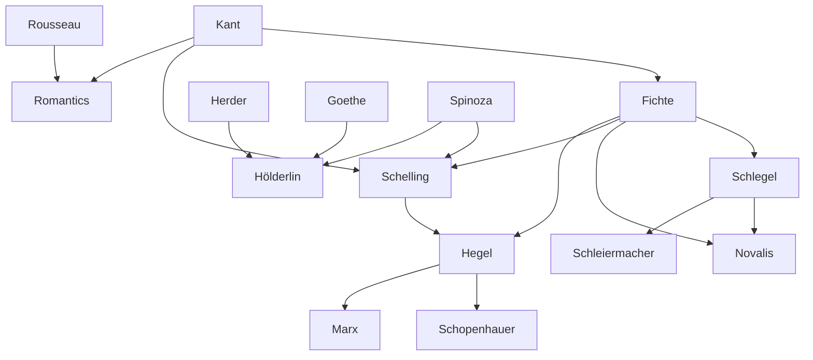

---
cssclasses:
  - Philosophy
  - Languages-Literature
subclasses:
  - 17th-18th-Century-Philosophy
  - 19th-Century-Philosophy
  - Aesthetics
related:
  - "[[German Idealism]]"
  - "[[Sturm und Drang]]"
  - "[[Enlightenment]]"
  - "[[Critique of Pure Reason]]"
  - "[[Pantheism]]"
  - "[[Aesthetics]]"
  - "[[Philosophy of History]]"
  - "[[Traditionalism]]"
  - "[[Spiritualism]]"
  - "[[Positivism]]"
aliases:
  - german idealism
  - infinite longing
  - irony philosophy
  - romantic love
  - romantic art
  - sentiment feeling
  - dialectical reason
  - pantheism immanence
reference:
  - "[Abbagnano, N., & Fornero, G. (2012). La ricerca del pensiero. Vol. 2B. Dall'Illuminismo a Hegel. Paravia.](https://archive.org/download/ssp-s04-e12/The%20search%20for%20thought%20-%20Unit%208%20Chapter%202.pdf)"
tags:
  - Podcast
---

#### Podcast

<iframe src="https://archive.org/embed/ssp-s04-e12" width="100%" height="30" frameborder="0" webkitallowfullscreen="true" mozallowfullscreen="true" allowfullscreen></iframe>

---

#### Central Problem

The chapter confronts the fundamental historiographical and philosophical problem of defining "Romanticism" as a cultural phenomenon. The term, originally referring to chivalric romances full of adventures and love, designates the philosophical, literary, and artistic movement born in Germany in the last years of the eighteenth century, reaching its maximum flourishing throughout Europe in the first decades of the nineteenth century and shaping the mentality of much of that century.

The critical elucidation of the concept of Romanticism proves even more complex than that of "Renaissance" or "Enlightenment," encountering seemingly insurmountable obstacles deriving primarily from the difficulty of adequately defining its historiographical scope. Two fundamental interpretations have been elaborated: a narrow view identifying Romanticism with the exaltation of sentiment (codified by [[Hegel]]), and a broader interpretation viewing it as a historical atmosphere or general mental situation reflected in literature, philosophy, politics, and painting alike.

The central philosophical tension lies in Romanticism's rejection of Enlightenment reason and its search for alternative paths to access reality and the Absolute—whether through sentiment, art, religious faith, or dialectical reason. This involves understanding Romanticism not merely as a literary school but as an "epoch," "civilization," and "culture" with its characteristic worldview (Weltanschauung).

#### Main Thesis

The chapter advances a nuanced interpretation of Romanticism as a cultural atmosphere containing recurring attitudes and themes that characterize authors of the first half of the nineteenth century, while acknowledging its internal plurality and ambivalences. The thesis maintains that despite containing antithetical elements (individualism and communitarianism, past-worship and messianic future-expectation, fantasy-evasion and realism, titanism and victimism), all these motifs fall within a common horizon and express a kind of "shared air" that characterizes them unmistakably as "romantic."

**Rejection of Enlightenment Reason:** Romantics unanimously reject the empiricist-scientific reason of the Enlightenment and Kantian criticism, which had barred the doors to metaphysics. Already accused of the "bloodbath" of the French Revolution and Napoleonic militarism, the reason of the philosophes is also deemed incapable of understanding the profound reality of man, the universe, and God.

**Alternative Paths to the Absolute:** The Romantics pursue multiple alternative routes: (1) the exaltation of sentiment as the most functional organ for relating to life and penetrating the universe's essence; (2) the cult of art as "wisdom of the world" and anticipation of logical discourse; (3) the celebration of religious faith as privileged access to reality; (4) the affirmation of dialectical reason (Hegel), which through logic rather than poetic or mystical nebulousness can achieve founded discourse on the infinite.

**The Sense of the Infinite:** Unlike [[Kant]], who constructed a philosophy of the finite and the limit, Romantics everywhere seek the beyond-limit—that which flees defined contours and escapes the laws of order and measure. This "intoxication of the infinite" colors all romantic experiences, generating characteristic states such as Sehnsucht (infinite longing), irony (consciousness of the finite's nothingness before the infinite), titanism (defiant rebellion despite inevitable defeat), and the tendency toward evasion into remote worlds or dreams.

**Two Phases of Romanticism:** The first Romanticism is immanentist and pantheist (emphasizing identity between finite and infinite), while the second is transcendentist and theist (emphasizing distinction between infinite and its manifestations), often accompanied by acceptance of positive religions like Catholicism.

#### Historical Context

German Romanticism was born in Jena in the last years of the eighteenth century, with the founding of the "Athenaeum" journal (1798-1800) in [[Berlin]]. The movement emerged as a reaction against the failures of the French Revolution and Napoleonic militarism, which discredited Enlightenment reason. The Romantics developed ideas that had been germinating in the Sturm und Drang movement, which first denounced reason's incapacity (within the limits [[Kant]] imposed) to attain the substance of things and higher divine realities.

The circle at Jena included Friedrich von [[Schlegel]] (1772-1829), the movement's theorist; August Wilhelm von [[Schlegel]] (1767-1845); Caroline Michaelis (1763-1809), later wife of [[Schelling]]; and [[Novalis]] (Friedrich von Hardenberg, 1772-1801). Hölderlin (1770-1843) also participated in this intellectual atmosphere despite remaining officially apart. The Schlegels established contacts with [[Fichte]] (met in Jena 1796), whom they credited with the paternity of the Romantic movement, and with [[Schelling]], whose thought seemed the most complete philosophical incarnation of the new ideas.

After Novalis's death in 1801, the Jena group dissolved, but its ideas rapidly spread to other German centers (Munich, Dresden, Heidelberg) and abroad. The second phase saw conversions to positive religions (Friedrich von [[Schlegel]] to Catholicism) and increasing conservatism in political and social thought. Throughout nineteenth-century Europe, Romantic mentality influenced diverse movements including French traditionalism (de Bonald, de Maistre, Lamennais), spiritualism (Maine de [[Biran]]), and Italian Risorgimento philosophy (Rosmini, Gioberti, Mazzini).

#### Philosophical Lineage

#### Key Thinkers

| Thinker | Dates | Movement | Main Work | Core Concept |
|---------|-------|----------|-----------|--------------|
| [[Schlegel]] | 1772-1829 | [[Romanticism]] | *Athenaeum Fragments* | Romantic irony, poetry-philosophy unity |
| [[Novalis]] | 1772-1801 | [[Romanticism]] | *Hymns to the Night* | Magical idealism, feeling primacy |
| [[Hölderlin]] | 1770-1843 | [[Romanticism]] | *Hyperion* | Lost harmony, poetic prophecy |
| [[Fichte]] | 1762-1814 | [[German Idealism]] | *Science of Knowledge* | Streben, infinite Ego |
| [[Schelling]] | 1775-1854 | [[German Idealism]] | *System of Transcendental Idealism* | Art as Absolute's revelation |
| [[Hegel]] | 1770-1831 | [[German Idealism]] | *Phenomenology of Spirit* | Dialectical reason |
| [[Schleiermacher]] | 1768-1834 | [[Romanticism]] | *On Religion* | Religion as intuition of infinite |
| [[Schiller]] | 1759-1805 | [[Weimar Classicism]] | *Naive and Sentimental Poetry* | Lost harmony with nature |

#### Key Concepts

| Concept | Definition | Related to |
|---------|------------|------------|
| Sehnsucht | Infinite longing, passionate aspiration for the unattainable; desire raised to second power | [[Romanticism]], [[Novalis]] |
| Romantic Irony | Superior consciousness that every finite reality is nothing before the infinite | [[Schlegel]], [[Romanticism]] |
| Titanism | Attitude of defiance and rebellion against finitude despite inevitable defeat | [[Romanticism]], [[Prometheism]] |
| Streben | Infinite striving, the Ego's perpetual overcoming of limits | [[Fichte]], [[German Idealism]] |
| Pantheism | Identity of finite and infinite; the finite as living realization of infinite | [[Spinoza]], [[Schelling]] |
| Dialectical Reason | Reason that transcends analytical intellect to grasp infinite synthetically | [[Hegel]], [[German Idealism]] |
| Naive Poetry | Poetry of ancients who "were" nature in immediate unity | [[Schiller]], [[Romanticism]] |
| Sentimental Poetry | Modern poetry where nature is object of memory and aspiration | [[Schiller]], [[Romanticism]] |
| Magical Idealism | Sovereignty of the creative Ego over the world through imagination | [[Novalis]], [[Romanticism]] |
| Traditionalism | Defense of tradition as unique repository of truth and values | [[De Bonald]], [[De Maistre]] |

#### Authors Comparison

| Theme | [[Schlegel]] | [[Novalis]] | [[Hegel]] |
|-------|--------------|-------------|-----------|
| Path to Absolute | Poetry and irony | Sentiment and magic | Dialectical reason |
| View of art | Creative freedom without laws | Wisdom of the world, dream | Sensuous manifestation of Idea |
| Finite-infinite relation | Early: identity; Later: transcendence | Pantheistic identity | Identity as dialectical process |
| Religion | Converted to Catholicism | Mystical Christianity | Philosophical religion |
| Individualism | Early: individual genius; Later: community | Both individual and organic | Anti-individualist, State-centered |
| View of love | Total fusion, feminine emancipation | Cosmic symbol, life's purpose | Subjective moment needing institution |

#### Influences & Connections

- **Predecessors:** [[Romantics]] ← influenced by ← [[Kant]], [[Fichte]], [[Rousseau]], [[Spinoza]], [[Sturm und Drang]]
- **Contemporaries:** [[Schlegel]] ↔ dialogue with ↔ [[Novalis]], [[Schleiermacher]], [[Schelling]]
- **Contemporaries:** [[Hegel]] ↔ critical dialogue with ↔ [[Schlegel]], [[Hölderlin]], [[Schelling]]
- **Followers:** [[German Idealism]] → influenced → [[Schopenhauer]], [[Marx]], [[Comte]], [[Spencer]]
- **Followers:** [[Romanticism]] → influenced → [[Maine de Biran]], [[Rosmini]], [[Gioberti]], [[Mazzini]]
- **Opposing views:** [[Hegel]] ← criticized ← [[Romantics]] (primacy of sentiment)
- **Opposing views:** [[Romantics]] ← criticized by ← [[Enlightenment]] (reason vs. sentiment)

#### Summary Formulas

- **[[Schlegel]]:** Poetry and philosophy must be united; romantic irony reveals that every finite manifestation is provisional before the infinite, while the poet-philosopher stands as prophet.
- **[[Novalis]]:** "Thought is only a dream of feeling"—sentiment opens access to primordial sources of being, and magical idealism makes life itself a self-authored novel.
- **[[Hölderlin]]:** Modern humanity lives in a "time of poverty" after losing harmony with nature; the poet watches in the "midnight of the world" awaiting the return of the divine.
- **[[Fichte]]:** The infinite Ego engages in perpetual striving (Streben) to overcome limits, discovering that morality requires obstacles for its exercise.
- **[[Hegel]]:** Only through dialectical reason—not sentiment or mystical rapture—can we achieve founded discourse on the infinite and grasp the identity of rational and real.
- **[[Schleiermacher]]:** Religion is intuition of the infinite in the finite; in lovers' embrace we sense divinity itself and the mystery of universal harmony.

#### Timeline

| Year | Event |
|------|-------|
| 1794 | [[Fichte]] publishes *Science of Knowledge*, discovering romantic concept of infinite Spirit |
| 1795 | [[Schiller]] publishes *On Naive and Sentimental Poetry* |
| 1796 | [[Schlegel]] brothers meet [[Fichte]] at Jena |
| 1797 | [[Schlegel]] moves to [[Berlin]], founds "Athenaeum" circle |
| 1798 | "Athenaeum" journal begins publication (until 1800) |
| 1799 | [[Schleiermacher]] publishes *On Religion: Speeches to Its Cultured Despisers* |
| 1799 | [[Schlegel]] publishes *Lucinde* |
| 1800 | [[Novalis]] publishes *Hymns to the Night* |
| 1800 | [[Schelling]] publishes *System of Transcendental Idealism* |
| 1801 | Death of [[Novalis]]; Jena circle dissolves |
| 1808 | [[Schlegel]] converts to Catholicism |
| 1821 | [[Hegel]] publishes *Philosophy of Right*, critiquing romantic individualism |

#### Notable Quotes

> "Thought is only a dream of feeling." — [[Novalis]]

> "A God is man when he dreams, a beggar when he thinks." — [[Hölderlin]]

> "Romantic poetry is still becoming […] it alone is infinite, as it alone is free, and recognizes as its first law that the poet's arbitrary will suffers no law." — [[Schlegel]]

---
> [!warning]-
> This annotation was normalised using a large language model and may contain inaccuracies. These texts serve as preliminary study resources rather than exhaustive references.
