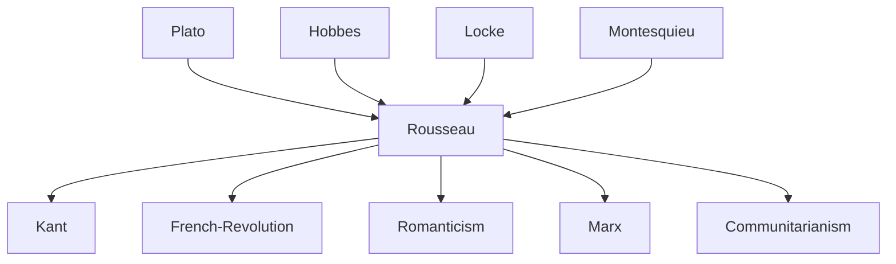

---
cssclasses:
  - Philosophy
subclasses:
  - Social-and-Political-Philosophy
  - Ethics
  - 17th-18th-Century-Philosophy
aliases:
  - rousseau
  - social contract
  - general will
  - state nature
  - natural man
  - noble savage
  - inequality origins
  - emile education
  - civil society
  - volont gnrale
  - amour propre
  - natural goodness
  - corrupting civilization
  - perfectibility
contributions:
  - Conceptual
authors:
  - "[[Rousseau]]"
  - "[[Hobbes]]"
  - "[[Locke]]"
  - "[[Montesquieu]]"
  - "[[Diderot]]"
  - "[[Voltaire]]"
reference: "[[04 The search for thought - Unit 6 Chapter 5.pdf]]"
---

#### Central Problem

Jean-Jacques Rousseau (1712-1778) confronts a fundamental paradox at the heart of modern civilization: how can humans, who are naturally free and good, become enslaved and corrupted through the very process intended to improve their condition? While the Enlightenment celebrated progress in arts and sciences as markers of human advancement, Rousseau questions whether this progress has genuinely benefited humanity or instead corrupted its original innocence.

The central problem manifests in several interconnected questions: What is the origin of inequality among human beings? Is such inequality sanctioned by natural law? How did humans transition from a state of natural freedom and equality to one of artificial bondage and hierarchy? And crucially, given this historical corruption, how can society be reconstituted to restore human freedom and authenticity within the framework of civil association?

Rousseau's inquiry challenges the foundational assumptions of both his philosophical predecessors (the natural law theorists like Hobbes, Locke, and Pufendorf) and his Enlightenment contemporaries, whom he accuses of confusing civilized humanity with natural humanity and thereby legitimizing existing social arrangements that perpetuate oppression.

#### Main Thesis

Rousseau's revolutionary thesis unfolds across multiple interconnected claims that together constitute a comprehensive critique of civilization and a program for political regeneration:

**Critique of Progress:** In the *Discourse on the Sciences and Arts* (1750), Rousseau argues that scientific and artistic progress, far from purifying morals, has corrupted them. Sciences and arts serve as "garlands of flowers" concealing the "iron chains" that bind humanity, promoting appearance over being, uniformity over natural diversity, and vice over virtue.

**Natural Goodness:** Human beings in their original state of nature are neither good nor evil in moral terms, but exist in a pre-moral condition of innocence. They possess two fundamental principles: *amour de soi* (self-love directed toward self-preservation) and *pitié* (natural compassion that produces instinctive repugnance at seeing others suffer).

**Origin of Inequality:** In the *Discourse on the Origin of Inequality* (1755), Rousseau traces how external circumstances (environmental pressures, scarcity) activated humanity's distinctive faculty of *perfectibility*, leading to social developments that culminated in property, division of labor, and ultimately radical inequality. "The first person who, having enclosed a plot of land, took it into his head to say 'This is mine' and found people simple enough to believe him, was the true founder of civil society."

**The Iniquitous Pact:** The establishment of political society through an implicit "pact" represents not the rational solution to natural conflict (as Hobbes claimed) but rather a cunning stratagem by the rich to legitimize their usurpation, creating legal structures that "gave new fetters to the weak and new forces to the rich."

**The Social Contract Solution:** In *The Social Contract* (1762), Rousseau proposes a legitimate foundation for political authority through a pact in which individuals alienate all their rights to the community as a whole, thereby creating a "general will" (*volonté générale*) that represents the common good. This total alienation paradoxically preserves freedom because citizens obey only themselves as members of the sovereign body.

**Educational Reform:** In *Emile* (1762), Rousseau argues that proper education must respect the natural development of the child, providing "negative education" that allows innate capacities to unfold according to their own rhythm rather than imposing artificial social conventions prematurely.

#### Historical Context

Rousseau emerged from humble origins in Geneva (1712), experiencing a turbulent youth marked by abandonment (his mother died in childbirth), brief apprenticeships, religious conversion to Catholicism (1728), and years of wandering. His encounter with Madame de Warens provided crucial formative years of study at Les Charmettes (1735-1736), where he immersed himself in philosophy, religion, and sciences.

Arriving in Paris in the 1740s, Rousseau entered the intellectual circles of the *philosophes*, contributing musical articles to the *Encyclopédie* and forming relationships with Diderot and Condillac. His "illumination" came in 1749 while walking to visit the imprisoned Diderot at Vincennes: reading the Academy of Dijon's essay question about whether the restoration of arts and sciences had purified morals, he experienced a transformative vision that determined his intellectual destiny.

The *Discourse on Sciences and Arts* (1750) won the Academy's prize and brought instant fame, but also initiated Rousseau's increasingly conflicted relationship with Enlightenment orthodoxy. His subsequent works—the *Discourse on Inequality* (1755), *Julie, or the New Heloise* (1761), *The Social Contract* (1762), and *Emile* (1762)—systematically developed his critique of civilization while proposing alternatives through reformed politics, education, and personal relationships.

The publication of *Emile* and *The Social Contract* in 1762 provoked immediate condemnation from both Catholic authorities (the Paris Parliament and Archbishop) and Calvinist Geneva, forcing Rousseau into exile. His later years were marked by psychological instability, persecution mania, a brief stay with Hume in England (ending in bitter accusations), and the composition of his autobiographical *Confessions*. He died in 1778 at Ermenonville; during the Revolution, his remains were transferred to the Panthéon.

#### Philosophical Lineage

#### Key Thinkers

| Thinker | Dates | Movement | Main Work | Core Concept |
|---------|-------|----------|-----------|--------------|
| [[Rousseau]] | 1712-1778 | [[Enlightenment]] | *The Social Contract* | General will, natural goodness |
| [[Hobbes]] | 1588-1679 | [[Contractualism]] | *Leviathan* | State of nature as war |
| [[Locke]] | 1632-1704 | [[Liberalism]] | *Two Treatises* | Natural rights, limited government |
| [[Montesquieu]] | 1689-1755 | [[Enlightenment]] | *Spirit of the Laws* | Separation of powers |
| [[Diderot]] | 1713-1784 | [[Enlightenment]] | *Encyclopédie* | Empirical knowledge compilation |
| [[Voltaire]] | 1694-1778 | [[Enlightenment]] | *Philosophical Letters* | Religious tolerance, progress |

#### Key Concepts

| Concept | Definition | Related to |
|---------|------------|------------|
| State of Nature | Hypothetical original condition—not historical reality but theoretical model for judging present society; characterized by freedom, equality, and independence | [[Rousseau]], [[Contractualism]] |
| Natural Goodness | Pre-moral innocence of primitive humans who possess self-love and compassion but lack moral categories of good and evil | [[Rousseau]], [[Enlightenment]] |
| Amour de soi | Natural self-love directed toward self-preservation; healthy instinct shared with animals | [[Rousseau]], [[Ethics]] |
| Amour propre | Artificial self-regard born in society; competitive concern for one's image relative to others; source of vice | [[Rousseau]], [[Social-and-Political-Philosophy]] |
| Perfectibility | Distinctively human faculty of self-improvement that, combined with external circumstances, enabled departure from natural condition | [[Rousseau]], [[Philosophy-of-Mind]] |
| General Will | Collective will of citizens oriented toward common good; sovereign authority in legitimate state; not mere aggregation of particular wills | [[Rousseau]], [[Republicanism]] |
| Social Contract | Pact through which individuals alienate all rights to community, becoming citizens who remain free by obeying only the general will | [[Rousseau]], [[Contractualism]] |
| Negative Education | Pedagogical approach respecting natural developmental stages; protecting child from premature social corruption rather than imposing doctrines | [[Rousseau]], [[Education]] |
| Appearing vs. Being | Dichotomy between artificial social masks and authentic natural self; civilization forces uniformity and deception | [[Rousseau]], [[Ethics]] |
| Iniquitous Pact | Cunning agreement proposed by rich to legitimize property through political institutions; origin of illegitimate inequality | [[Rousseau]], [[Social-and-Political-Philosophy]] |

#### Authors Comparison

| Theme | [[Rousseau]] | [[Hobbes]] | [[Locke]] |
|-------|--------------|------------|-----------|
| State of nature | Pre-social isolation, innocence, freedom | War of all against all, mutual fear | Peaceful coexistence, natural rights |
| Human nature | Naturally good (pre-moral); corrupted by society | Naturally aggressive and egoistic | Naturally rational and sociable |
| Origin of evil | Society, property, inequality | Inherent human passions | Violation of natural law |
| Purpose of contract | Restore freedom through legitimate authority | Escape violence through absolute power | Protect property through limited government |
| Sovereignty | Inalienable general will of people | Absolute sovereign (individual or assembly) | Limited, revocable trust |
| Property | Source of inequality and corruption | Protected by sovereign | Natural right preceding government |
| Right of resistance | Revolution when general will violated | None (except self-preservation) | When government breaks trust |

#### Influences & Connections

- **Predecessors:** [[Rousseau]] ← influenced by ← [[Plato]] (state education), [[Hobbes]] (contract theory), [[Locke]] (natural freedom), [[Montesquieu]] (political philosophy)
- **Contemporaries:** [[Rousseau]] ↔ collaboration then rupture with ↔ [[Diderot]], [[d'Alembert]], [[Voltaire]]
- **Followers:** [[Rousseau]] → influenced → [[Kant]] (moral autonomy), [[Robespierre]] (revolutionary politics), [[Romanticism]] (nature, sentiment)
- **Opposing views:** [[Rousseau]] ← criticized by ← [[Voltaire]] (civilization defense), [[Burke]] (conservative critique)

#### Summary Formulas

- **[[Rousseau]]:** Humans are naturally good and free but corrupted by civilization; legitimate political society requires a social contract creating a general will through which citizens, obeying collective decisions, remain free because they obey only themselves.

- **[[Hobbes]]:** The natural condition is war of all against all; rational self-interest requires absolute submission to sovereign power through an irrevocable contract that exchanges liberty for security.

- **[[Locke]]:** Natural rights to life, liberty, and property precede government; the social contract creates limited authority that can be revoked if it violates the trust to protect these rights.

#### Timeline

| Year | Event |
|------|-------|
| 1712 | [[Rousseau]] born in Geneva |
| 1728 | Converts to Catholicism; meets Madame de Warens |
| 1742 | Arrives in Paris; enters intellectual circles |
| 1749 | "Illumination" on road to Vincennes |
| 1750 | *Discourse on Sciences and Arts* wins Dijon Academy prize |
| 1755 | *Discourse on the Origin of Inequality* published |
| 1758 | *Letter to d'Alembert on the Theatre*; break with *philosophes* |
| 1761 | *Julie, or the New Heloise* published |
| 1762 | *The Social Contract* and *Emile* published; both condemned; exile begins |
| 1764 | *Letters Written from the Mountain* |
| 1766 | Brief asylum with [[Hume]] in England |
| 1778 | [[Rousseau]] dies at Ermenonville |
| 1794 | Remains transferred to Panthéon during French Revolution |

#### Notable Quotes

> "Man is born free, and everywhere he is in chains. One who believes himself the master of others is nonetheless a greater slave than they." — [[Rousseau]]

> "The first person who, having enclosed a plot of land, took it into his head to say 'This is mine' and found people simple enough to believe him, was the true founder of civil society." — [[Rousseau]]

> "Everything is good as it leaves the hands of the Author of things; everything degenerates in the hands of man." — [[Rousseau]]

#### See Also

- [[Social Contract Theory]]
- [[Enlightenment]]
- [[Natural Law]]
- [[State of Nature]]
- [[General Will]]
- [[French Revolution]]
- [[Romanticism]]
- [[Political Philosophy]]
- [[Philosophy of Education]]
- [[Republicanism]]

> [!NOTE]
> *This summary has been created to present the key points from the source text, which was automatically extracted using LLM. Please note that the summary may contain errors. It serves as an essential starting point for study and reference purposes.*
