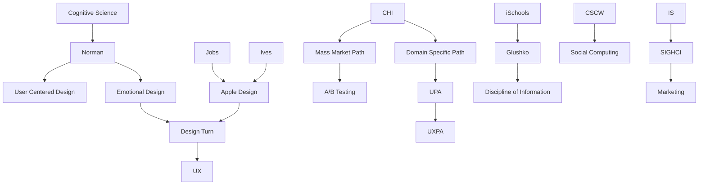

---
cssclasses:
  - Computer-Science
  - History
  - Sociology
subclasses:
  - Human-Computer-Interaction
  - Information-Retrieval
  - Design-Theory
related:
  - "[[Norman]]"
  - "[[Jobs]]"
  - "[[Glushko]]"
  - "[[Apple]]"
  - "[[iSchools]]"
  - "[[Social Media]]"
aliases:
  - scaling era
  - ux profession
  - user experience
  - ischool movement
  - social computing
  - mobile devices
  - smartphone era
  - crowdsourcing platforms
  - design leadership
  - chi divergence
  - information discipline
  - ab testing
reference:
  - "Grudin, J. (2017). From tool to partner: the evolution of human-computer interaction. Morgan & Claypool Publishers. (pp. 81-89)"
---

#### Central Problem

This section of Grudin's historical account addresses the period 2005–2015, when computer and phone access scaled from 1 billion to 3 billion users globally. The central problem concerns how this massive expansion paradoxically weakened professional HCI organizations while transforming the nature of HCI work itself, creating divergent paths within CHI and forcing fundamental reconfigurations across all four HCI fields.

The decade posed institutional identity crises. CHI bifurcated into mass-market consumer application research (Facebook, Google, games) and domain-specific organizational work (healthcare, finance, retail)—paths requiring fundamentally different methods (A/B testing vs. ethnography). The iSchool movement debated whether "information" constituted a new discipline or merely a forum for pre-existing disciplines. Information Systems faced pressure as IT innovation "left the company" to cloud services and vendors. Human Factors saw technology surface across all technical groups as the field's core identity diffused.

Apple's success under Jobs/Ives transformed professional hierarchies: visual designers rose from subordinates (1980s) to peers (1990s) to superiors (2015), with other HCI professionals increasingly reporting to designers. The "UX Unicorn" meme captured the impossible search for individuals combining graphic design, prototyping, CSS, HTML, jQuery, multivariate testing, and marketing—skills no training program unified.

#### Main Thesis

Grudin argues that the 2005–2015 scaling era saw HCI fields buffeted by change as technology diffused into other disciplines, professional organizations stagnated or declined even as relevant work expanded, and fundamental questions about disciplinary identity remained unresolved across all four fields.

The thesis develops across several institutional trajectories:

**CHI's forking paths:** Two distinct trajectories emerged—mass-market consumer applications amenable to A/B testing with millions of users, and domain-specific organizational work requiring ethnographic and prototyping methods. CHI concentrated on the first path; UPA/UXPA absorbed much domain work. Of ~150 CHI 2015 sessions, "usability" appeared only in one tutorial title, "UX" in two session titles.

**Apple's design ascendancy:** iPhone (2007) and iPad (2010) demonstrated that stylish design could dominate usability and utility in consumer technology. Visual and industrial designers rose in organizational hierarchies. Job titles churned: Usability Specialist → Usability Engineer → User Researcher → UX Researcher → Design Researcher. UPA became UXPA (2012), but "UX" lacked consensus definition.

**iSchool formation:** The iCaucus (12 universities, 2005) grew to 70 by 2015, with overseas members comprising the majority. The unresolved question: new discipline, or multidisciplinary forum? Wersig (1992) and Cronin (1995) had suggested concepts around information could function "like magnets or attractors, sucking the focus-oriented materials out of the disciplines." Glushko's *Discipline of Information* (2013) proposed unifying terminology.

**IS pressure:** As IT innovation moved to cloud services and vendors, IS faced challenges from other management disciplines that acquired technical savvy. SIGHCI's 2009 "related fields" list omitted CHI entirely—the bridging effort had "foundered."

**CSCW re-divergence:** After 1990s convergence, CSCW (North America) and ECSCW diverged again as social media and games attracted CSCW researchers while ECSCW remained workplace-focused. The name "Computer Supported Cooperative Work" was examined: smartphones aren't "computers," software moved beyond "support" to automation, use extended beyond "work" to games and entertainment.

#### Historical Context

The decade followed the dot-com bubble's aftermath recovery. Wikipedia's 2005 Nature study challenging publishing establishment authority was unprecedented since Gutenberg. YouTube (2005), Khan Academy and TED Talks online (2006), and MOOCs (2008) transformed educational possibilities while "most secondary and higher education held fast to game plans designed in the chalkboard era."

The term "crowdsourcing" was coined in 2005, the year Mechanical Turk launched. Kickstarter (2009) established crowdfunding. Twitter grew from 50 million daily tweets (2010) to 500 million six years later. Graduate students "swarmed over the Wikipedia mountain" with its complete public revision history.

Virtual reality experienced ten-year cycles: AlphaWorlds (1995), Second Life (Business Week cover May 2006, peaked 2009), headset-based VR (HTC Vive, Microsoft Hololens, Oculus Rift announced 2015). IBM and NSF created and then abandoned Second Life islands for meetings.

Norman's career trajectory mirrored CHI's evolution: cognitive scientist founding academic HCI group (1980), introducing "cognitive engineering" and "user satisfaction functions" (CHI'83), organizing *User Centered System Design* (1985), *Psychology of Everyday Things* (1988) marking shift to pragmatic usability, Apple User Experience Architect, *Emotional Design* (2004) emphasizing aesthetics, UC San Diego Design Laboratory Director (2014).

#### Philosophical Lineage

#### Key Thinkers

| Thinker | Dates | Movement | Main Work | Core Concept |
|---------|-------|----------|-----------|--------------|
| [[Norman]] | 1935– | [[Cognitive Engineering]] | *Emotional Design* (2004) | Aesthetics in design, UX evolution |
| [[Jobs]] | 1955–2011 | [[Industrial Design]] | iPhone (2007), iPad (2010) | Design-driven technology |
| [[Ives]] | 1967– | [[Industrial Design]] | Apple product design | Form-function integration |
| [[Glushko]] | – | [[Information Science]] | *Discipline of Information* (2013) | Unifying information terminology |
| [[Kay]] | 1940– | [[Computer Science]] | "Best way to predict future is to invent it" | Invention over analysis |
| [[Wersig]] | 1942–2006 | [[Information Science]] | Information as attractor (1992) | Discipline formation theory |
| [[Cronin]] | – | [[Information Science]] | Information magnetic attraction (1995) | Interdisciplinary restructuring |

#### Key Concepts

| Concept | Definition | Related to |
|---------|------------|------------|
| UX (User Experience) | Umbrella term spanning usability, qualitative approaches, data mining, interaction design, visual design—no consensus definition | [[Norman]], [[Design]], [[Usability]] |
| A/B testing | Exposing multiple design options to randomly selected users; effective for mass-market web applications | [[Google]], [[Facebook]], [[Amazon]] |
| UX Unicorn | Mythical professional combining graphic design, prototyping, CSS, HTML, jQuery, testing, marketing | [[UX]], [[Job Market]] |
| iSchools | Information schools movement; 70 members by 2015, unresolved discipline vs. forum question | [[Information Science]], [[Library Science]] |
| Crowdsourcing | Web-based recruitment of labor, ideas, or funds; coined 2005 | [[Mechanical Turk]], [[Kickstarter]] |
| Social Computing | CSCW extension to social media, games, non-workplace contexts | [[CSCW]], [[Twitter]], [[Facebook]] |
| Design Laboratory | Norman's 2014 UC San Diego initiative placing people at center of design | [[Norman]], [[Human-Centered Design]] |
| Crisis informatics | Analysis of social media traffic during political crises and disasters | [[CHI]], [[Social Media]] |
| Internet of Things | Embedded sensors and effectors in everyday objects; constrained by power and networking | [[Ubiquitous Computing]], [[Moore's Law]] |
| Discipline of Information | Glushko's 2013 attempt to identify commonalities and unifying terminology across information fields | [[iSchools]], [[Information Science]] |

#### Authors Comparison

| Theme | [[Grudin]] | [[Norman]] | [[Glushko]] |
|-------|-----------|------------|-------------|
| Central concern | Historical sociology of HCI field divergence | Evolution of design from cognition to aesthetics | Unification of information discipline |
| Disciplinary identity | Documents fragmentation and stagnation | Personal trajectory mirrors field evolution | Proposes common language across fields |
| On design | Observes design ascendancy over engineering | Advocates design-centered, aesthetic approaches | Information organization as design |
| Method | Archival, interview-based history | Practitioner reflection, popular writing | Conceptual unification, textbook |
| Prescription | Descriptive analysis | Human-centered design advocacy | Terminological standardization |

#### Influences & Connections

- **Predecessors:** [[Norman]] ← cognitive science → emotional design; [[Jobs]] ← Bauhaus traditions → Apple design
- **Contemporaries:** [[Norman]] ↔ Apple ↔ [[Ives]]; [[iSchools]] ↔ compete with ↔ [[ASIS&T]]
- **Institutional formations:** [[UXPA]] ← renamed from ← [[UPA]] (2012); [[iCaucus]] → expanded to → 70 schools
- **Divergences:** [[CSCW]] ↔ diverged from ↔ [[ECSCW]] (2010); [[CHI]] → forked into → mass-market and domain-specific paths
- **Failed bridges:** [[SIGHCI]] ← bridging effort foundered with ← [[SIGCHI]]

#### Summary Formulas

- **[[Grudin]]:** The 2005–2015 scaling era saw CHI fork between mass-market and domain-specific paths, iSchools debate disciplinary identity, IS face pressure from IT outsourcing, and design ascend over engineering—while professional organization membership stagnated despite expanding relevant work.

- **[[Norman]]:** HCI evolved from cognitive engineering through pragmatic usability to emotional design; aesthetics matter as much as function; the best way to design is to place people at the center.

- **[[Glushko]]:** Information can constitute a new discipline if commonalities across fields are identified and unified terminology adopted; *The Discipline of Information* achieved 50+ university course adoptions in three years.

- **[[Kay]]:** "The best way to predict the future is to invent it"—contribution to theory cannot match the appeal of contributing to commercial startups in an era of easy software distribution.

#### Timeline

| Year | Event |
|------|-------|
| 2005 | iCaucus (12 universities); Wikipedia Nature study; YouTube; "crowdsourcing" coined; Mechanical Turk; Webkinz |
| 2006 | Nokia shifts to entertainment phones; Khan Academy/TED online; Second Life Business Week cover |
| 2007 | iPhone |
| 2008 | Android phones; MOOCs |
| 2009 | Kickstarter; Second Life peaks; iCaucus has 21 members |
| 2010 | iPad; 50 million daily tweets; CSCW/ECSCW re-diverge |
| 2012 | UPA becomes UXPA |
| 2013 | Glushko *Discipline of Information*; ASIS American→Association |
| 2014 | CSCW adds "Social Computing" to name; Norman founds Design Laboratory |
| 2015 | ~70 iSchool members; HTC Vive/Hololens/Oculus announced; 3 billion computer/phone users |

#### Notable Quotes

> "I don't know what CHI is anymore." — Senior colleague returning from conference

> "Most of the IT innovation, once only found in large scale organizations, has left the company." — IS professor

> "The best way to predict the future is to invent it." — [[Kay]]

---
> [!warning]-
> This annotation was normalised using a large language model and may contain inaccuracies. These texts serve as preliminary study resources rather than exhaustive references.
