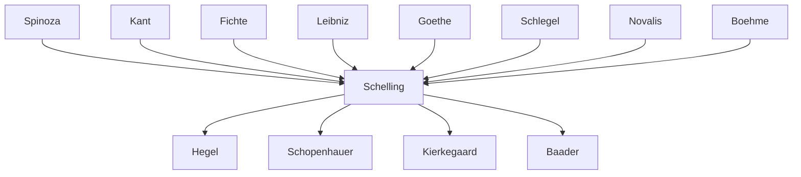

---
cssclasses:
  - Philosophy
subclasses:
  - 17th-18th-Century-Philosophy
  - Metaphysics
  - Aesthetics
aliases:
  - absolute idealism
  - philosophy nature
  - identity philosophy
  - transcendental idealism
  - objective idealism
  - aesthetic idealism
  - world soul
  - absolute identity
  - natura naturans
contributions:
  - Conceptual
authors:
  - "[[Schelling]]"
  - "[[Fichte]]"
  - "[[Spinoza]]"
  - "[[Kant]]"
  - "[[Hegel]]"
  - "[[Goethe]]"
reference: "Abbagnano, N., & Fornero, G. (2012). La ricerca del pensiero. Vol. 2B. Dall'Illuminismo a Hegel. Paravia."
related:
  - "[[German Idealism]]"
  - "[[Naturphilosophie]]"
  - "[[Romanticism]]"
  - "[[Fichte]]"
  - "[[Hegel]]"
  - "[[Spinoza]]"
  - "[[Philosophy of Art]]"
  - "[[Absolute]]"
  - "[[Identity Philosophy]]"
  - "[[Transcendental Philosophy]]"
---

#### Central Problem

The central problem that [[Schelling]] addresses concerns the fundamental split between nature and spirit, object and subject, that plagued both Kantian critical philosophy and Fichtean idealism. While [[Fichte]] had established the primacy of the Absolute I as the foundation of all reality, his system sacrificed nature to the realm of the merely instrumental — nature existed solely as the "theater of moral action" or even as "pure nothingness" from a religious standpoint. This left philosophy unable to account for the intrinsic value, rationality, and autonomous life of the natural world.

[[Schelling]] recognized that a purely subjective principle (Fichte's Io) could not explain the emergence of the natural world, just as a purely objective principle (Spinoza's Substance) could not explain the origin of intelligence and self-consciousness. The challenge was to discover a supreme principle that would be simultaneously subject and object, reason and nature — an undifferentiated identity of both. This required overcoming the dualism inherent in [[Kant]]'s distinction between phenomenon and noumenon, as well as [[Fichte]]'s privileging of the subjective pole, to arrive at an Absolute that precedes and grounds the very distinction between subjectivity and objectivity.

Additionally, [[Schelling]] sought to account for the relationship between conscious and unconscious production, between freedom and necessity, and ultimately to explain how the finite arises from the infinite without sacrificing either the integrity of nature or the creativity of spirit.

#### Main Thesis

Schelling's main thesis establishes the Absolute as the original identity or indifference of spirit and nature, subject and object, conscious and unconscious. This Absolute is neither reducible to subjectivity (as in [[Fichte]]) nor to objectivity (as in [[Spinoza]]'s Substance), but constitutes the undifferentiated ground from which both emerge.

From this fundamental insight, [[Schelling]] develops two complementary philosophical directions:
1. **Philosophy of Nature** (Naturphilosophie): demonstrates how nature resolves itself into spirit, showing nature as "visible spirit"
2. **Transcendental Philosophy**: demonstrates how spirit resolves itself into nature, showing spirit as "invisible nature"

**The Philosophy of Nature** rejects both traditional mechanism (which cannot explain living organisms) and external teleology (which compromises nature's autonomy by appealing to divine intervention). Instead, [[Schelling]] proposes an immanent finalism and organicism: nature is a self-organizing organism with internal purposiveness. At its foundation lies an unconscious spiritual principle — the **World Soul** (Anima Mundi) — which sustains the continuity between organic and inorganic realms and unifies all of nature into a single universal organism.

Nature exhibits a dialectical structure of opposing forces — **attraction and repulsion** — manifesting as magnetism, electricity, and chemical process. These correspond in the organic world to sensibility, irritability, and reproduction. Nature develops through three **potencies** or levels: the inorganic world, light (nature becoming visible to itself), and the organic world with its anticipation of self-consciousness.

**The Transcendental Philosophy**, developed in the *System of Transcendental Idealism* (1800), traces how the self-constitution of spirit mirrors the self-constitution of nature. Starting from self-consciousness as intellectual intuition (wherein the I, in knowing itself, simultaneously produces itself), [[Schelling]] delineates three epochs of the I's development: from sensation to productive intuition, from productive intuition to reflection, and from reflection to will.

The crucial synthesis occurs in **art**, which [[Schelling]] identifies as the "organ of revelation of the Absolute." In aesthetic creation, the artist embodies the unity of conscious execution and unconscious inspiration, producing finite works that contain infinite meaning. Art thus accomplishes what philosophy can only comprehend theoretically: the immediate manifestation of the Absolute as the identity of nature and spirit.

#### Historical Context

[[Schelling]] (1775-1854) was born in Leonberg and entered the theological seminary at Tübingen at age 16, where he formed crucial friendships with Hölderlin and Hegel (both five years his senior). After studying mathematics and natural sciences at Leipzig and attending [[Fichte]]'s lectures at Jena, [[Schelling]] was appointed [[Fichte]]'s assistant in 1798 at just 23 years old, thanks to Goethe's support.

At Jena, [[Schelling]] experienced his most productive years and engaged with the Romantic circle — August Wilhelm von [[Schlegel]], [[Tieck]], and [[Novalis]]. He married [[Schlegel]] in 1803 after she divorced her husband. Following positions at Würzburg (1803-1806) and Munich, Schelling's friendship with [[Hegel]] ruptured following [[Hegel]]'s attack in the Preface to the *Phenomenology of Spirit* (1807), after which [[Schelling]] witnessed, embittered, the triumph of Hegelianism and his own declining reputation.

The period saw revolutionary scientific developments in chemistry, electricity, and magnetism that influenced Schelling's Naturphilosophie. His philosophical development passed through distinct phases: Fichtean idealism (1795-96), philosophy of nature (1797-99), transcendental idealism (1800), identity philosophy (1801-04), theosophic philosophy and philosophy of freedom, and finally positive philosophy and philosophy of religion. In Munich, [[Schelling]] befriended the theosophist Franz von Baader, who introduced him to Jakob Böhme's mystical writings.

In 1841, [[Schelling]] was called to [[Berlin]] to succeed Hegel, leading the reaction against Hegelianism. Among his auditors were Kierkegaard, [[Feuerbach]], and Engels. He died in 1854 in Bad Ragaz, Switzerland.

#### Philosophical Lineage

#### Key Thinkers

| Thinker | Dates | Movement | Main Work | Core Concept |
|---------|-------|----------|-----------|--------------|
| [[Schelling]] | 1775-1854 | [[German Idealism]] | *System of Transcendental Idealism* | Absolute as identity of nature and spirit |
| [[Fichte]] | 1762-1814 | [[German Idealism]] | *Doctrine of Science* | Absolute I, Tathandlung |
| [[Spinoza]] | 1632-1677 | [[Rationalism]] | *Ethics* | Substance as objective infinity |
| [[Kant]] | 1724-1804 | [[Critical Philosophy]] | *Critique of Judgment* | Teleology of organisms |
| [[Hegel]] | 1770-1831 | [[German Idealism]] | *Phenomenology of Spirit* | Absolute Spirit, dialectic |
| [[Goethe]] | 1749-1832 | [[Romanticism]] | *Faust* | Organic unity of nature and spirit |

#### Key Concepts

| Concept | Definition | Related to |
|---------|------------|------------|
| Absolute | The supreme principle that is undifferentiated identity of subject and object, spirit and nature, conscious and unconscious | [[Schelling]], [[German Idealism]] |
| World Soul (Anima Mundi) | The unconscious spiritual entity immanent in nature that sustains continuity between organic and inorganic and unifies nature into a universal organism | [[Schelling]], [[Naturphilosophie]] |
| Potencies (Potenzen) | The three levels of natural development: inorganic world, light, and organic world, representing progressively higher manifestations of spirit | [[Schelling]], [[Naturphilosophie]] |
| Intellectual Intuition | The form of self-knowledge in which the I, by knowing itself, simultaneously produces itself — the unity of subject and object in self-consciousness | [[Schelling]], [[Fichte]] |
| Immanent Finalism | The doctrine that nature possesses internal purposiveness without external divine programming — nature as self-organizing organism | [[Schelling]], [[Naturphilosophie]] |
| Speculative Physics | Schelling's method of philosophizing about nature that proceeds systematically, showing how each empirical phenomenon belongs necessarily to an organic totality | [[Schelling]], [[Naturphilosophie]] |
| Unconscious Production | The pre-conscious activity (like [[Fichte]]'s productive imagination) through which the subject generates its objects without awareness | [[Schelling]], [[German Idealism]] |
| Objective Idealism | Schelling's idealism that gives equal weight to nature (objective) alongside spirit, as opposed to [[Fichte]]'s subjective idealism | [[Schelling]], [[German Idealism]] |
| Aesthetic Intuition | The supreme form of cognition that unites conscious and unconscious, revealing the Absolute in the artwork's synthesis of inspiration and execution | [[Schelling]], [[Aesthetics]] |

#### Authors Comparison

| Theme | [[Fichte]] | [[Schelling]] | [[Spinoza]] |
|-------|-----------|--------------|-------------|
| Supreme Principle | Absolute I (subjective infinity) | Absolute as identity of subject/object | Substance (objective infinity) |
| Status of Nature | Theater of moral action, "pure nothingness" | Visible spirit, autonomous reality with intrinsic value | Mode of Substance, mechanistically determined |
| Relation Subject/Object | Object derived from subject | Subject and object are originally identical | Subject as finite mode of infinite Substance |
| Method | Genetic-deductive from I | Dual: philosophy of nature + transcendental philosophy | Geometric demonstration |
| Role of Art | Not central | Organ of revelation of the Absolute | Not philosophically significant |
| Conscious/Unconscious | Productive imagination produces unconsciously | Unconscious production in nature, conscious in spirit, unified in art | No distinction (natura naturans operates necessarily) |
| Freedom | Moral striving, overcoming non-I | Synthesized with necessity in history and art | Illusion arising from ignorance of causes |

#### Influences & Connections

- **Predecessors:** [[Schelling]] ← influenced by ← [[Kant]] (teleology of organisms), [[Fichte]] (absolute I, intellectual intuition), [[Spinoza]] (substance), [[Leibniz]] (pre-established harmony, sleeping monads)
- **Contemporaries:** [[Schelling]] ↔ dialogue with ↔ [[Goethe]], [[Schlegel]], [[Novalis]], [[Hölderlin]]; [[Schelling]] ↔ friendship then rupture with ↔ [[Hegel]]
- **Followers:** [[Schelling]] → influenced → [[Hegel]] (early phase), [[Schopenhauer]] (will in nature), [[Kierkegaard]] (positive philosophy), natural scientists (Oken, morphology)
- **Opposing views:** [[Schelling]] ← criticized by ← [[Hegel]] (indifference as "night in which all cows are black"), scientists (accused of abandoning Galilean-Newtonian method)

#### Summary Formulas

- **[[Schelling]]:** The Absolute is the original identity of spirit and nature, manifesting through two complementary paths: nature as visible spirit ascending toward consciousness, and spirit as invisible nature descending into matter — a unity most perfectly revealed in artistic creation.

- **[[Fichte]]:** The Absolute I posits itself and its other (non-I) as the condition for its infinite striving; nature exists only as the material for moral action, subordinated entirely to subjective activity.

- **[[Spinoza]]:** The one infinite Substance, which is God or Nature, exists necessarily and expresses itself through infinite attributes and finite modes, leaving no room for a distinct subjective principle.

#### Timeline

| Year | Event |
|------|-------|
| 1775 | [[Schelling]] born in Leonberg |
| 1790 | [[Schelling]] enters theological seminary at Tübingen, meets [[Hölderlin]] and Hegel |
| 1794 | [[Fichte]] publishes *Foundations of the Entire Doctrine of Science* |
| 1797 | [[Schelling]] publishes *Ideas for a Philosophy of Nature* |
| 1798 | [[Schelling]] publishes *On the World Soul*; appointed [[Fichte]]'s assistant at Jena |
| 1799 | [[Schelling]] publishes *First Outline of a System of the Philosophy of Nature* |
| 1800 | [[Schelling]] publishes *System of Transcendental Idealism* |
| 1802 | [[Schelling]] publishes dialogue *Bruno* |
| 1803 | [[Schelling]] marries [[Schlegel]]; moves to Würzburg |
| 1806 | [[Schelling]] becomes secretary of the Academy of Fine Arts in Munich |
| 1807 | [[Hegel]] attacks [[Schelling]] in preface to *Phenomenology of Spirit*; Karoline dies (1809) |
| 1809 | [[Schelling]] publishes *Philosophical Investigations into the Essence of Human Freedom* |
| 1841 | [[Schelling]] succeeds [[Hegel]]'s chair in Berlin; Kierkegaard, [[Feuerbach]], Engels attend |
| 1854 | [[Schelling]] dies in Bad Ragaz, Switzerland |

#### Notable Quotes

> "Nature must be visible spirit, spirit invisible nature. Here then, in the absolute identity of the spirit within us and nature without us, the problem of how nature outside us is possible must be resolved." — [[Schelling]]

> "Art is for the philosopher the highest, because it opens to him the holy of holies, where in eternal and original union there burns as in one flame what in nature and history is separated." — [[Schelling]]

> "The dead and unconscious products of nature are merely failed attempts of nature to reflect itself; so-called dead nature is above all an immature intelligence." — [[Schelling]]

---
> [!NOTE]
> *This summary has been created to present the key points from the source text, which was automatically extracted using LLM. Please note that the summary may contain errors. It serves as an essential starting point for study and reference purposes.*
