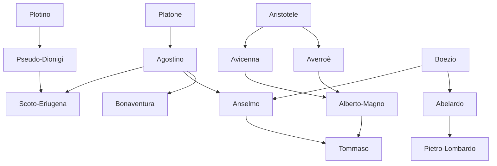

---
cssclasses:
  - Philosophy
subclasses:
  - Medieval-and-Renaissance-Philosophy
  - Epistemology
  - Logic-and-Philosophy-of-Logic
related:
  - "[[Scholasticism]]"
  - "[[Ontological Argument]]"
  - "[[Problem of Universals]]"
  - "[[Medieval Logic]]"
  - "[[Faith and Reason]]"
  - "[[Islamic Philosophy]]"
  - "[[Jewish Philosophy]]"
  - "[[Aristotelianism]]"
  - "[[Augustinianism]]"
  - "[[Divine Illumination]]"
  - "[[Mysticism]]"
  - "[[Nominalism]]"
aliases:
  - faith reason
  - ontological argument
  - realism nominalism
  - anselm proof
  - medieval logic
reference:
  - "[Abbagnano, N., & Fornero, G. (2012). La ricerca del pensiero. Vol. 1B. Dall'ellenismo alla scolastica. Paravia.](https://archive.org/download/ssp-s02-e08/The%20search%20for%20thought%20-%20Unit%207%20Chapter%201.pdf)"
tags:
  - Podcast
---

#### Podcast

<iframe src="https://archive.org/embed/ssp-s02-e08" width="100%" height="30" frameborder="0" webkitallowfullscreen="true" mozallowfullscreen="true" allowfullscreen></iframe>

---

#### Central Problem

Scholasticism confronts the fundamental question of the relationship between faith and reason (*fides et ratio*): how can human rational inquiry engage with revealed religious truth without either subordinating reason to dogma or undermining the authority of divine revelation? This problem emerged from the medieval educational context, where philosophy served the formation of clergy and the comprehension of sacred doctrine.

The central tension involves multiple dimensions: the speculative question of how philosophical concepts can illuminate theological truths; the practical question of what autonomous role individual rational initiative can claim in the pursuit of truth; and the institutional question of how secular inquiry relates to ecclesiastical hierarchies. The problem thus encompasses not merely abstract epistemology, but the entire structure of medieval intellectual life, including the emergence of universities, the reception of Greek philosophy through Arabic intermediaries, and the ongoing debate over the legitimacy of dialectical methods applied to sacred matters.

Unlike ancient Greek philosophy, which asserted its critical independence from tradition, Scholastic thought takes religious tradition as the foundation and norm of inquiry. Truth has been revealed through Scripture, dogmatic definitions, and the teachings of Church Fathers. The philosopher's task is to access and comprehend this truth through natural faculties assisted by divine grace, always within the guidance of ecclesiastical authority. Philosophy becomes *ancilla theologiae* (handmaid of theology), a means rather than an autonomous end.

#### Main Thesis

Scholastic philosophy, despite its variety of solutions, is unified by a single dominant problem: understanding the relationship between faith and reason and determining the scope of rational autonomy within a framework of revealed truth. The periodization of Scholasticism tracks the evolution of proposed solutions to this problem:

**Pre-Scholasticism (Carolingian Renaissance):** Faith and reason are assumed to be identical without problematization. [[Scoto Eriugena]] develops a metaphysics of the four natures (creating/uncreated, created/creating, created/non-creating, neither creating nor created) in which the world appears as divine theophany.

**High Scholasticism (11th-12th centuries):** The problem of faith-reason relationship emerges explicitly. Dialecticians like Berengario affirm reason's dignity as the image of God, while anti-dialecticians like [[Pier Damiani]] deny rational value entirely, claiming God transcends even logical laws. [[Anselm]] seeks harmony through *credo ut intelligam* (I believe in order to understand), developing the ontological argument to demonstrate God's existence by reason alone.

**Flowering of Scholasticism (13th century):** The great systems emerge where faith and reason, though distinct, are conceived as harmoniously leading to the same results. [[Alberto Magno]] and later [[Tommaso]] incorporate Aristotelianism while maintaining theological primacy.

**Dissolution (14th century):** The problem is recognized as insoluble; faith and reason are deemed heterogeneous domains. This leads to the dissolution of the Scholastic synthesis.

The dispute over universals represents a crucial moment of Scholastic self-reflection, moving from the theological to the philosophical standpoint, asking not merely how God creates through archetypal ideas but how human knowledge operates through universal concepts.

#### Historical Context

The intellectual revival of Western Europe began in the 8th-9th centuries under the Carolingian Empire, when [[Carlo Magno]] promoted studies to ensure administrative unity. [[Alcuino di York]] organized education according to the seven liberal arts (*trivium* and *quadrivium*), calling them the "seven columns of wisdom." After the empire's dissolution in the 10th century, intellectual activity stalled until the restoration under Otto the Great.

The 11th and 12th centuries witnessed the birth of true Scholasticism, initially in cathedral and abbey schools, later in the emerging universities. This period saw economic and social renaissance: the formation of maritime republics and communes, expanded trade, and the emergence of a lay, enterprising spirit. The dispute over universals reflects this new intellectual freedom and attention to human capacities.

Contact with the Arab world proved transformative. Arab philosophers had already assimilated Greek philosophy and science, particularly Neoplatonism and Aristotelianism. They confronted the same fundamental problem as Christian thinkers: finding rational access to revealed truth (in their case, the Quran). Works by [[Avicenna]], [[Averroè]], and others were translated into Latin from the 12th century, introducing the full Aristotelian corpus to the West.

The initial reaction to Aristotelianism was hostile, given its apparent conflicts with Christian doctrine: the necessity and eternity of the world, the unity of the intellect. This provoked a defensive return to Augustinian-Platonic positions (represented by [[Alessandro di Hales]], [[Roberto Grossatesta]], and [[Bonaventura]]) before the more accommodating synthesis achieved by [[Alberto Magno]] and [[Tommaso]].

#### Philosophical Lineage

#### Key Thinkers

| Thinker | Dates | Movement | Main Work | Core Concept |
|---------|-------|----------|-----------|--------------|
| [[Scoto Eriugena]] | 810-870 | [[Neoplatonism]] | *De divisione naturae* | Four natures, theophany |
| [[Anselm]] | 1033-1109 | [[Scholasticism]] | *Proslogion* | Ontological argument |
| [[Abelardo]] | 1079-1142 | [[Scholasticism]] | *Sic et Non* | Conceptualism, intentionality |
| [[Bonaventura]] | 1221-1274 | [[Augustinianism]] | *Itinerarium mentis in Deum* | Divine illumination |
| [[Alberto Magno]] | 1193-1280 | [[Aristotelianism]] | *Commentaries on [[Aristotle]]* | Philosophy-theology distinction |
| [[Avicenna]] | 980-1037 | [[Islamic Philosophy]] | *Book of Healing* | Necessary being |
| [[Averroè]] | 1126-1198 | [[Aristotelianism]] | *Commentaries on [[Aristotle]]* | Unity of intellect |
| [[Maimonide]] | 1135-1204 | [[Jewish Philosophy]] | *Guide for the Perplexed* | Contingency of creation |

#### Key Concepts

| Concept | Definition | Related to |
|---------|------------|------------|
| Credo ut intelligam | "I believe in order to understand" — faith precedes and enables rational comprehension | [[Anselm]], [[Scholasticism]] |
| Ontological argument | Proof of God's existence from the concept of that than which nothing greater can be thought | [[Anselm]], [[Metaphysics]] |
| Universals | General concepts (genera, species) whose ontological status is disputed | [[Abelardo]], [[Logic-and-Philosophy-of-Logic]] |
| Realism | Doctrine that universals exist outside the mind, either separated (*ante rem*) or in things (*in re*) | [[Guglielmo di Champeaux]], [[Platonism]] |
| Nominalism | Doctrine that universals are merely names (*flatus vocis*) without real correlates | [[Roscellino]], [[Logic-and-Philosophy-of-Logic]] |
| Conceptualism | Universals are *sermones* (discourses) — mental concepts with intentional reference to things | [[Abelardo]], [[Scholasticism]] |
| Intentionality | The property of concepts to refer to, or "intend," signified objects | [[Abelardo]], [[Philosophy-of-Mind]] |
| Supposizione | The use of a term to indicate something different from the term itself | [[Pietro Ispano]], [[Logic-and-Philosophy-of-Logic]] |
| Ancilla theologiae | Philosophy as "handmaid of theology" — instrumental rather than autonomous | [[Scholasticism]], [[Medieval-and-Renaissance-Philosophy]] |
| Double truth | (Erroneously attributed to [[Averroè]]) Doctrine of separate truths of reason and faith | [[Averroism]], [[Epistemology]] |

#### Authors Comparison

| Theme | [[Anselm]] | [[Abelardo]] | [[Bonaventura]] |
|-------|-------------|--------------|-----------------|
| Faith-reason relation | Harmony through *credo ut intelligam* | Rational scrutiny of authorities | Return to Augustinian illumination |
| God's existence | Ontological argument *a priori* | Rational necessity of faith | Accepts ontological argument |
| Universals | Realistic (ante rem) | Conceptualist (sermo) | Realistic-Augustinian |
| Freedom | Preserved despite original sin | Basis of moral responsibility | Guided by divine light (synderesis) |
| Method | Rational demonstration within faith | *Sic et non* — dialectical | Mystical ascent through six degrees |
| Greek philosophy | Limited use of dialectic | Valued, accordant with Christianity | Platonic framework preferred |

#### Influences & Connections

- **Predecessors:** [[Anselm]] ← influenced by ← [[Agostino]], [[Boezio]], [[Pseudo-Dionigi]]
- **Predecessors:** [[Abelardo]] ← influenced by ← [[Boezio]], [[Roscellino]], [[Guglielmo di Champeaux]]
- **Contemporaries:** [[Anselm]] ↔ opposed by ↔ [[Gaunilone]] (critique of ontological argument)
- **Contemporaries:** [[Abelardo]] ↔ opposed by ↔ [[Bernardo di Chiaravalle]] (mysticism vs. dialectic)
- **Followers:** [[Abelardo]] → influenced → [[Pietro Lombardo]], University of Paris tradition
- **Followers:** [[Averroè]] → influenced → Latin Averroism, [[Sigieri di Brabante]]
- **Opposing views:** Dialecticians ← opposed by ← Anti-dialecticians ([[Pier Damiani]])

#### Summary Formulas

- **[[Scoto Eriugena]]:** The world is a divine theophany, proceeding from and returning to God through four natures in a necessary cosmic cycle.
- **[[Anselm]]:** Faith seeks rational understanding; God's existence can be demonstrated from the very concept of that than which nothing greater can be thought.
- **[[Abelardo]]:** Authority is provisional until reason discovers truth; universals are conceptual *sermones* with intentional reference to common conditions (*status*) among individuals.
- **[[Bonaventura]]:** Knowledge and moral guidance require divine illumination; the mind ascends to God through six degrees culminating in mystical ecstasy.
- **[[Averroè]]:** The world is eternal and necessary; the intellect is one for all humanity; philosophy expresses in demonstrative form what religion teaches simply.

#### Timeline

| Year | Event |
|------|-------|
| 781 | [[Carlo Magno]] calls [[Alcuino]] to direct the Palace School |
| 867 | [[Scoto Eriugena]] completes *De divisione naturae* |
| 1076-1078 | [[Anselm]] writes *Monologion* and *Proslogion* |
| 1093 | [[Roscellino]] condemned at Council of Soissons for triteism |
| 1113 | [[Abelardo]] begins teaching theology in Paris |
| 1120 | [[Abelardo]]'s trinitarian doctrine condemned at Soissons |
| 1141 | [[Abelardo]]'s ethics condemned at Council of Sens |
| 1198 | Death of [[Averroè]] |
| 1204 | Death of [[Maimonide]] |
| 1259 | [[Bonaventura]] writes *Itinerarium mentis in Deum* |
| 1280 | Death of [[Alberto Magno]] |

#### Notable Quotes

> "I believe in order to understand." — [[Anselm]]

> "If I had not believed, I would not understand." — [[Anselm]], citing Isaiah 7:9

> "He who does not resort to reason, by which man is the image of God, abandons his own dignity." — [[Berengario di Tours]]

---
> [!warning]-
> This annotation was normalised using a large language model and may contain inaccuracies. These texts serve as preliminary study resources rather than exhaustive references.
