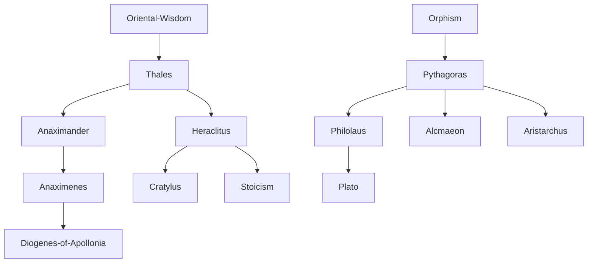

---
cssclasses:
  - Philosophy
subclasses:
  - Ancient-Greek-and-Roman-Philosophy
  - Metaphysics
  - Philosophy-of-Science
related:
  - "[[Presocratic Philosophy]]"
  - "[[Milesian School]]"
  - "[[Pythagoreanism]]"
  - "[[Orphism]]"
  - "[[Ancient Greek Philosophy]]"
  - "[[Eleatic School]]"
  - "[[Stoicism]]"
  - "[[Cosmology]]"
  - "[[Metaphysics]]"
  - "[[Philosophy of Nature]]"
aliases:
  - presocratic philosophy
  - milesian school
  - thales water
  - anaximander apeiron
  - anaximenes air
  - pythagoras number
  - heraclitus fire
reference:
  - "Abbagnano, N., & Fornero, G. (2012). La ricerca del pensiero. Vol. 1A. Dalle origini ad Aristotele. Paravia."
---

#### Central Problem

The Presocratic philosophers confronted a fundamental question: what is the ultimate principle (arché) underlying the multiform and ever-changing world of appearances? Faced with the spectacle of a manifold and mutable cosmos, constituted by a multiplicity of things in continuous transformation, they became convinced that beyond what appears there exists a single, eternal reality of which all existing things are but passing manifestations.

This search for the arché represented the first systematic attempt to explain the natural world through rational inquiry rather than mythological narrative. The term arché itself denotes simultaneously: (1) the material from which all things derive, (2) the force that animates them, and (3) the law that explains their birth and death.

The central tension in Presocratic thought emerges between unity and multiplicity, permanence and change. How can the apparent diversity and flux of the world be reconciled with an underlying principle of unity and stability? Different schools offered competing answers: the Milesians proposed material elements (water, the infinite, air); the Pythagoreans proposed number and mathematical structure; [[Heraclitus]] proposed fire and the logos as the rational law governing the unity of opposites.

#### Main Thesis

The Presocratic philosophers developed several interconnected theses about the nature of reality:

**Milesian Monism:** The Ionian philosophers of Miletus (Thales, Anaximander, Anaximenes) maintained that all things derive from a single primordial substance (arché). This position entails:

- **Monism:** Behind the becoming of the world lies a unique principle
- **Hylozoism:** Primordial matter possesses an intrinsic force that makes it move
- **Pantheism:** The eternal principle of the world tends to be identified with divinity

[[Thales]] identified the arché with water, observing that nourishment of all things is moist and that the seeds of all things have a humid nature. [[Anaximander]] proposed the ápeiron (infinite/indefinite)—a boundless, indeterminate substance from which opposites separate and to which all things return according to a law of cosmic justice. [[Anaximenes]] identified the principle with air, which through rarefaction becomes fire and through condensation becomes wind, cloud, water, earth, and stone.

**Pythagorean Mathematical Cosmology:** [[Pythagoras]] and his followers maintained that number is the substance of things. This means the true nature of the world consists in a measurable geometric order. Through number, one can explain the most disparate phenomena: from the movement of stars to musical harmonies. The Pythagoreans developed a fundamental dualism between limit (péras) and unlimited (ápeiron), with limit representing perfection and the unlimited representing imperfection.

**Heraclitean Flux and Unity of Opposites:** [[Heraclitus]] conceived the world as perpetual flux ("everything flows" — pánta rheî), with fire as the principle symbolizing this eternal transformation. However, his most original contribution is the doctrine of the unity of opposites: opposites fight against each other yet cannot exist without one another. This hidden law of interdependence is the logos—reason itself—which governs all things. War (Polemos) is "father of all things," yet harmony emerges from conflict.

#### Historical Context

The Presocratic philosophers emerged in 6th century BCE Ionia, on the coast of Asia Minor colonized by the Greeks. This region had developed a flourishing civilization centered in cities like Miletus, Ephesus, Colophon, Clazomenae, Samos, and Chios.

Several factors contributed to making Ionia the birthplace of philosophy:

1. **Economic prosperity:** An enterprising class of merchants had built a commercial fleet operating from the Black Sea to Egypt, from the Caucasus to southern France, from Sicily to Spain
2. **Democratic political development:** Rapid development of democratic political forms
3. **Technical advancement:** Flourishing of various techniques and crafts
4. **Cultural contact:** Exchange with Near Eastern civilizations
5. **Expanding worldview:** The population was habituated to extreme variety of customs and beliefs

From this context emerged a new type of intellectual combining traits of philosopher, scientist, and technician, engaged in liberating culture from magical, mythical, and religious beliefs, and oriented toward more attentive and rational observation of natural phenomena.

The Pythagorean school, founded by Pythagoras at Crotone in southern Italy around 532-531 BCE, functioned not only as a philosophical school but also as a religious association and political organization. When democratic movements arose in Greek cities of southern Italy, the Pythagoreans were massacred or forced to flee.

Heraclitus of Ephesus (late 6th to early 5th century BCE) represented a different strand—an aristocratic thinker who distinguished sharply between the philosophical few who are "awake" and the many who "sleep," living in illusion.

#### Philosophical Lineage

#### Key Thinkers

| Thinker | Dates | Movement | Main Work | Core Concept |
|---------|-------|----------|-----------|--------------|
| [[Thales]] | c. 624-546 BCE | [[Milesian School]] | — | Water as arché |
| [[Anaximander]] | 611-547 BCE | [[Milesian School]] | *On Nature* | Ápeiron (infinite/indefinite) |
| [[Anaximenes]] | fl. 546-525 BCE | [[Milesian School]] | — | Air as arché |
| [[Pythagoras]] | c. 571-490 BCE | [[Pythagoreanism]] | — | Number as principle, metempsychosis |
| [[Philolaus]] | fl. 450 BCE | [[Pythagoreanism]] | — | Central fire, harmony |
| [[Heraclitus]] | c. 535-475 BCE | [[Presocratic Philosophy]] | *On Nature* | Fire, logos, unity of opposites |

#### Key Concepts

| Concept | Definition | Related to |
|---------|------------|------------|
| Arché | First principle; the material origin, animating force, and explanatory law of all things | [[Thales]], [[Presocratic Philosophy]] |
| Ápeiron | The infinite and indeterminate; boundless primordial substance from which opposites separate | [[Anaximander]], [[Milesian School]] |
| Monism | Doctrine recognizing a single principle behind the world's becoming | [[Milesian School]], [[Metaphysics]] |
| Hylozoism | Doctrine that primordial matter possesses intrinsic animating force | [[Presocratic Philosophy]], [[Thales]] |
| Pantheism | Identification of the eternal world-principle with divinity | [[Presocratic Philosophy]], [[Heraclitus]] |
| Number | For Pythagoreans, the constitutive principle of all things; measurable geometric order | [[Pythagoras]], [[Pythagoreanism]] |
| Harmony | Unity of the multiple composed; concordance of discordances | [[Pythagoras]], [[Heraclitus]] |
| Metempsychosis | Transmigration of souls into other bodies after death | [[Pythagoras]], [[Orphism]] |
| Logos | Word, discourse, reason; the rational law governing the universe | [[Heraclitus]], [[Stoicism]] |
| Pánta rheî | "Everything flows"; doctrine that reality is perpetual flux | [[Heraclitus]], [[Cratylus]] |

#### Authors Comparison

| Theme | [[Thales]] | [[Anaximander]] | [[Anaximenes]] | [[Pythagoras]] | [[Heraclitus]] |
|-------|-----------|-----------------|----------------|----------------|----------------|
| Arché | Water | Ápeiron (infinite) | Air | Number | Fire/Logos |
| Method | Empirical observation | Rational speculation | Physical process | Mathematics | Philosophical introspection |
| Cosmic process | — | Separation of opposites | Rarefaction/condensation | Limit vs unlimited | Unity of opposites |
| Worldview | Monist, hylozoist | Monist, cyclical | Monist, hylozoist | Dualist (limit/unlimited) | Monist, dialectical |
| Knowledge | Sense experience | Rational deduction | Physical observation | Mathematical contemplation | Beyond appearances |
| Divine | "All is full of gods" | Ápeiron is divine | Air is divine | Purification of soul | Fire-cosmos is God |

#### Influences & Connections

- **Predecessors:** [[Thales]] ← influenced by ← [[Egyptian Mathematics]], [[Babylonian Astronomy]]
- **Predecessors:** [[Pythagoras]] ← influenced by ← [[Orphism]], [[Egyptian Wisdom]]
- **Contemporaries:** [[Thales]] ↔ dialogue with ↔ [[Anaximander]] ↔ [[Anaximenes]]
- **Followers:** [[Anaximenes]] → influenced → [[Diogenes of Apollonia]]
- **Followers:** [[Pythagoras]] → influenced → [[Philolaus]], [[Plato]], [[Aristarchus of Samos]]
- **Followers:** [[Heraclitus]] → influenced → [[Cratylus]], [[Stoicism]]
- **Opposing views:** [[Heraclitus]] ← criticized by ← [[Parmenides]], [[Eleatic School]]

#### Summary Formulas

- **[[Thales]]:** Water is the principle of all things—the substance that underlies and sustains all reality, from which everything originates and by which everything lives.
- **[[Anaximander]]:** The infinite (ápeiron) is the eternal, divine principle from which all things emerge through separation of opposites and to which they return, paying the penalty for their "injustice."
- **[[Anaximenes]]:** Air is the infinite, ever-moving principle; through rarefaction it becomes fire, through condensation it becomes water and earth—the world breathes like a living animal.
- **[[Pythagoras]]:** All things are numbers—the true nature of reality is measurable geometric order; philosophy is the path to purify the soul from the prison of the body.
- **[[Heraclitus]]:** Everything flows according to the logos; war is father of all things, yet opposites are secretly united—from discord comes the most beautiful harmony.

#### Timeline

| Year | Event |
|------|-------|
| c. 624 BCE | Birth of [[Thales]] of Miletus |
| 611 BCE | Birth of [[Anaximander]] |
| 585 BCE | [[Thales]] predicts solar eclipse (May 28) |
| c. 571 BCE | Birth of [[Pythagoras]] on Samos |
| c. 547 BCE | Death of [[Anaximander]] |
| c. 546 BCE | Floruit of [[Anaximenes]] |
| c. 532 BCE | [[Pythagoras]] arrives in Croton, founds school |
| c. 528 BCE | Death of [[Anaximenes]] |
| c. 535 BCE | Birth of [[Heraclitus]] at Ephesus |
| c. 490 BCE | Death of [[Pythagoras]] |
| c. 475 BCE | Death of [[Heraclitus]] |

#### Notable Quotes

> "The principle is water [...] perhaps because he saw that the nourishment of all things is moist." — [[Aristotle]] on [[Thales]]

> "All beings must, according to the order of time, pay to one another the penalty for their injustice." — [[Anaximander]]

> "War is father of all things, of all king; and some it shows as gods, others as men, some it makes slaves, others free." — [[Heraclitus]]

---
> [!NOTE]
> *This summary has been created to present the key points from the source text, which was automatically extracted using LLM. Please note that the summary may contain errors. It serves as an essential starting point for study and reference purposes.*
