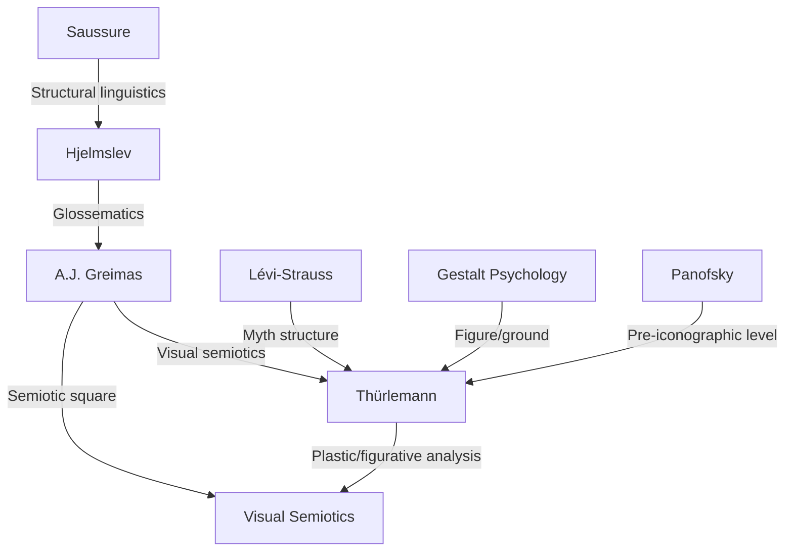

---
cssclasses:
  - Philosophy
subclasses:
  - Aesthetics
  - Phenomenology
  - 20th-Century-Philosophy
related:
  - "[[Semiotics]]"
  - "[[Visual Semiotics]]"
  - "[[Klee]]"
  - "[[Greimas]]"
  - "[[Gestalt Psychology]]"
  - "[[Figurative Painting]]"
aliases:
  - thurlemann 1982
  - blumenmythos analysis
  - visual semiotics
  - plastic categories
  - chromatic categories
  - eidetic categories
  - semiotic painting
  - figurative plastic
  - connector codes
  - myth structure
reference:
  - "Thùrlemann, F. (1991). Paul Klee: Analisi semiotica di Blumen-Mythos—1918. 106–134."
---

#### Central Problem

How does figurative painting produce meaning? Thürlemann addresses this fundamental question through a rigorous semiotic analysis of Paul Klee's 1918 watercolor *Blumen-Mythos* (Flower Myth). The challenge is to develop a methodology that can describe both the *plastic level* (pure visual expression: color, form, position) and the *figurative level* (recognized objects: flower, bird, stars), and then identify the *codes* that connect these two planes. Unlike impressionistic art criticism, semiotics seeks to formalize the mechanisms through which pictorial surfaces generate complex meanings, including mythical and symbolic dimensions.

#### Main Thesis

Figurative painting operates through a dual articulation: a **plastic plane** (expression) composed of elements defined by chromatic and eidetic categories, and a **figurative plane** (content) where these elements are recognized as objects. The relationship between these planes is governed by **connector-codes** (codici-connettori)—systematic homologies such as *curved:straight :: celestial:terrestrial*. Klee's *Blumen-Mythos* exemplifies how painting can achieve a "semi-symbolic" system where plastic oppositions correlate with semantic oppositions. The central composite objects—the "flower" and the "bird"—function as mediating figures that bridge the cosmic ('inanimate'/'celestial') and the animated ('terrestrial'/'human') realms, thus embodying the formal structure of myth as defined by Lévi-Strauss: a mediation between logically irreconcilable categories.

#### Historical Context and Intellectual Background

Thürlemann's analysis emerges from the **Paris School of Semiotics** founded by A.J. Greimas, which sought to extend Saussurean structural linguistics to all sign systems. The 1970s-80s saw intensive efforts to develop a *visual semiotics* capable of analyzing images with the same rigor applied to verbal texts. Key influences include:

1. **Hjelmslev's glossematics**: The distinction between expression and content planes, and between form and substance at each level
2. **Greimas's narrative semiotics**: The concept of *figure* as minimal units, isotopies, and the semiotic square
3. **Gestalt psychology**: Especially figure/ground distinctions and perceptual organization principles
4. **Lévi-Strauss's structural anthropology**: Myth as a logical structure mediating binary oppositions
5. **Panofsky's iconology**: The pre-iconographic level corresponds to the plastic level

This approach reacts against impressionistic art criticism, seeking instead to describe the *formal mechanisms* of meaning production in visual texts.

#### Philosophical Lineage

#### Key Thinkers

| Thinker | Dates | Movement | Main Work | Core Concept |
|---------|-------|----------|-----------|--------------|
| [[Greimas]] | 1917-1992 | [[Paris School Semiotics]] | *Sémiotique. Dictionnaire* | Figure, isotopy, semiotic square |
| [[Hjelmslev]] | 1899-1965 | [[Glossematics]] | *Prolegomena to a Theory of Language* | Expression/content planes |
| [[Lévi-Strauss]] | 1908-2009 | [[Structural Anthropology]] | *Mythologiques* | Myth as mediation structure |
| [[Panofsky]] | 1892-1968 | [[Iconology]] | *Studies in Iconology* | Pre-iconographic level |
| [[Klee]] | 1879-1940 | [[Bauhaus]] | *Blumen-Mythos* | Pictorial poetry |

#### Key Concepts

| Concept | Definition | Related to |
|---------|------------|------------|
| Plastic level | The plane of visual expression analyzed independently of object recognition; composed of chromatic and eidetic categories | [[Hjelmslev]], [[Visual Semiotics]] |
| Figurative level | The plane where plastic elements are recognized as objects (flower, bird, star) through cultural codes | [[Panofsky]], [[Iconology]] |
| Element | Minimal unit of the plastic level: a combination of chromatic figure and eidetic figure(s) | [[Greimas]], [[Visual Semiotics]] |
| Chromatic categories | Constitutive qualities that discriminate elements: hue, value, saturation, texture (matte vs glossy) | [[Thürlemann]], [[Color Theory]] |
| Eidetic categories | Form-related categories: straight vs curved, angular vs rounded | [[Gestalt Psychology]] |
| Topological categories | Non-constitutive positional categories: high vs low, left vs right, central vs peripheral | [[Visual Semiotics]] |
| Connector-code | A rule establishing homologies between plastic oppositions and semantic oppositions | [[Greimas]], [[Thürlemann]] |
| Semi-symbolic system | A sign system where expression and content planes have correlated, non-arbitrary relations (like poetry) | [[Greimas]], [[Semiotics]] |

#### Authors Comparison

| Theme | Thürlemann | Greimas | Panofsky |
|-------|------------|---------|----------|
| Unit of analysis | Element (chromatic + eidetic) | Figure (minimal unit) | Motif (pre-iconographic) |
| Method | Formal decomposition + code identification | Narrative grammar | Historical interpretation |
| Goal | Describe meaning mechanisms | General theory of meaning | Cultural meaning of images |
| Relation to content | Codes connect planes systematically | Isotopies structure content | Symbolic values from tradition |
| Myth | Structural mediation (Lévi-Strauss) | Narrative structure | Iconographic tradition |

#### Influences & Connections

#### Predecessors
- **[[Saussure]]**: Sign = signifier + signified; langue vs parole distinction
- **[[Hjelmslev]]**: Expression plane / content plane; form / substance distinction
- **[[Panofsky]]**: Three levels of iconographic analysis; pre-iconographic = plastic

#### Contemporaries
- **[[Greimas]]**: Narrative semiotics, semiotic square, isotopy
- **[[Barthes]]**: "Rhetoric of the image," anchorage function of text
- **[[Foucault]]**: "Ceci n'est pas une pipe" — image/text paradox

#### Successors
- **[[Groupe µ]]**: *Traité du signe visuel* — systematic visual rhetoric
- **[[Floch]]**: Applied visual semiotics to advertising and design
- **[[Fontanille]]**: Tensivity and semiotics of perception

#### Summary Formulas

1. **Dual Articulation**: Painting = Plastic plane (expression) + Figurative plane (content), connected by codes.

2. **Constitutive Categories**: Chromatic categories (color, value, texture) *constitute* elements by creating contrasts; eidetic categories (straight/curved) define form.

3. **Connector-Codes in Blumen-Mythos**:
   - Code 1: curved : straight :: 'celestial' : 'terrestrial'
   - Code 2: high : low :: 'celestial' : 'terrestrial' (peripheral zone only)
   - Code 3: linear elements : surface elements :: 'animate' : 'inanimate'

4. **Mythical Mediation**: The "flower" is a complex object combining 'animate'/'inanimate' and 'celestial'/'terrestrial' traits, functioning as mediator between cosmic and human realms—embodying myth's structural function.

5. **Pictorial Poetry**: When plastic and semantic oppositions correlate systematically (semi-symbolic system), painting achieves the motivated relationship between expression and content characteristic of poetic language.

#### Timeline

| Year | Event |
|------|-------|
| 1918 | [[Klee]] creates *Blumen-Mythos* watercolor |
| 1943 | [[Hjelmslev]] publishes *Prolegomena to a Theory of Language* |
| 1964 | [[Barthes]] publishes "Rhetoric of the Image" |
| 1966 | [[Greimas]] publishes *Sémantique structurale* |
| 1968 | [[Foucault]] publishes "Ceci n'est pas une pipe" |
| 1970 | [[Greimas]] publishes *Du sens* |
| 1979 | [[Greimas]] & Courtés publish *Sémiotique. Dictionnaire* |
| 1982 | [[Thürlemann]] publishes *Paul Klee. Analyse sémiotique de trois peintures* |
| 1992 | [[Groupe µ]] publishes *Traité du signe visuel* |

#### Notable Quotes

> "La pittura figurativa, manipolando dei mezzi propriamente pittorici, può giungere a mettere in relazione campi del mondo che la logica comune manterrebbe distinti." — [[Thürlemann]]

> "La pittura, nello spazio di alcuni decimetri quadrati, è capace di dare l'illusione di un mondo nuovo, di un mondo dove tutte le contraddizioni appaiono come risolte." — [[Thürlemann]]

> "Un quadro è una cosa molto complessa, costituita da un insieme di elementi che occorre prima denominare, per sottometterli in seguito ad una gerarchia, al tempo stesso, sensibile e razionale." — [[Lhote]], cited by Thürlemann

---
> [!warning]-
> This annotation was normalised using a large language model and may contain inaccuracies. These texts serve as preliminary study resources rather than exhaustive references.
