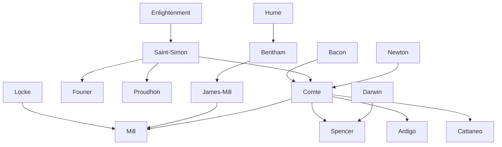

---
cssclasses:
  - Philosophy
  - Sociology
subclasses:
  - 19th-Century-Philosophy
  - Philosophy-of-Science
  - Social-and-Political-Philosophy
related:
  - "[[Enlightenment]]"
  - "[[Utilitarianism]]"
  - "[[Sociology]]"
  - "[[Philosophy of Science]]"
  - "[[Induction]]"
  - "[[Social Philosophy]]"
  - "[[Industrial Society]]"
  - "[[Empiricism]]"
  - "[[Scientism]]"
  - "[[Spencer]]"
aliases:
  - positive philosophy
  - law three
  - social physics
  - scientific method
  - industrial society
  - encyclopaedia sciences
  - uniformity nature
reference:
  - "Abbagnano, N., & Fornero, G. (2012). La ricerca del pensiero. Vol. 3A. Da Schopenhauer a Freud. Paravia."
---

#### Central Problem

Positivism confronts the fundamental problem of how to reconstruct social order and intellectual unity in the aftermath of the Enlightenment and the French Revolution. The movement emerges from a profound awareness of historical crisis: traditional theological and metaphysical foundations have collapsed, yet no new organizing principle has taken their place. The central question becomes: how can science provide the basis for a new social, moral, and political organization that will overcome the "anarchy" of the modern world?

The positivists identify two interrelated crises: an intellectual crisis (the coexistence of incompatible worldviews—theological, metaphysical, and scientific—preventing any coherent organization of knowledge) and a social-political crisis (the dissolution of traditional institutions without adequate replacements). They propose that only "positive" knowledge—based on observable facts and verifiable laws rather than abstract speculation—can provide the foundation for a new synthesis capable of reunifying human knowledge and reorganizing society on rational, scientific principles.

A secondary problem concerns the relationship between science and philosophy: if metaphysics is rejected as empty speculation about inaccessible causes, what role remains for philosophy? The positivists answer that philosophy must become the systematic coordination of scientific results, providing the unified worldview that individual sciences cannot offer.

#### Main Thesis

The positivist thesis holds that science is the only valid form of knowledge, and that the scientific method must be extended to all domains of inquiry, including the study of human beings and society. This position crystallizes in several interconnected claims:

**The Law of Three Stages:** [[Comte]]'s fundamental "discovery" asserts that every branch of knowledge passes through three successive theoretical stages: the theological (explaining phenomena through supernatural agents), the metaphysical (explaining through abstract forces or essences), and the positive or scientific (describing invariable relations between observable phenomena). Each stage corresponds to a specific social organization: theocratic monarchy, popular sovereignty, and scientific-industrial society respectively. The positive stage represents humanity's intellectual maturity, definitively abandoning the search for absolute causes in favor of discovering laws.

**The Unity of Science:** All genuine knowledge belongs to a single hierarchy of sciences, ordered by increasing complexity and decreasing generality: mathematics, astronomy, physics, chemistry, biology, and sociology. Each science depends on those below it in the hierarchy while adding its own specific methods and content. Philosophy's task is to unify and coordinate these sciences into a comprehensive "encyclopedia."

**Social Physics:** The culmination of the positivist project is sociology—the scientific study of society. Just as physics discovers laws governing natural phenomena, sociology must discover laws governing social phenomena. This enables prediction and, ultimately, rational intervention in social affairs. [[Comte]] divides sociology into statics (studying social order and the interdependence of social parts) and dynamics (studying progress and historical development).

**Utilitarianism:** The English positivists, particularly [[Bentham]] and [[Mill]], apply scientific principles to ethics. The principle of utility holds that actions are good insofar as they promote "the greatest happiness of the greatest number." This transforms morality from metaphysical speculation into an empirically grounded calculus of pleasures and pains. [[Mill]] extends this framework with sophisticated analyses of induction and the logic of the moral sciences.

#### Historical Context

Positivism emerges in France during the first half of the nineteenth century and becomes the dominant philosophy of European culture in the second half. The term "positive" (first used systematically by [[Saint-Simon]] in his *Catechism of Industrialists*, 1823-1824) carries two fundamental meanings: first, what is real, effective, and experimental (as opposed to abstract, chimerical, or metaphysical); second, what is fecund, practical, and efficacious (as opposed to useless and idle).

The movement's genesis reflects the post-revolutionary crisis. The French Revolution had destroyed the old regime but failed to establish stable new institutions. [[Saint-Simon]] and [[Comte]] saw modern society caught between a dying theological-feudal order and a not-yet-born positive order—an "anarchic interregnum" requiring scientific resolution. In this first phase (Restoration era through mid-century), positivism presents itself as a program for overcoming socio-political crisis.

The second phase (latter half of the century) coincides with the triumph of industrial capitalism, the expansion of scientific knowledge, and technological progress. Positivism now reflects and stimulates ongoing progress rather than proposing solutions to crisis. The "heroes" celebrated by positivism—the scientist, the industrialist, the engineer, the physician, the teacher—embody the values of this industrial bourgeois civilization. The movement develops primarily in industrially advanced nations (England, France, Germany) and expresses, despite internal variations, the ideology of liberal bourgeoisie: optimistic about industrial society, reformist rather than revolutionary, opposed both to conservative reaction and to socialist revolution.

#### Philosophical Lineage

#### Key Thinkers

| Thinker | Dates | Movement | Main Work | Core Concept |
|---------|-------|----------|-----------|--------------|
| [[Saint-Simon]] | 1760-1825 | [[Social positivism]] | *The Industrial System* | Industrial society, organic/critical epochs |
| [[Comte]] | 1798-1857 | [[Positivism]] | *Course of Positive Philosophy* | Law of three stages, sociology |
| [[Fourier]] | 1772-1837 | [[Utopian Socialism]] | Various writings | Phalansteries, attractive labor |
| [[Proudhon]] | 1809-1865 | [[Anarchism]] | *What Is Property?* | Property is theft, mutualism |
| [[Bentham]] | 1748-1832 | [[Utilitarianism]] | Various writings | Greatest happiness principle |
| [[Mill]] | 1773-1836 | [[Utilitarianism]] | *Analysis of the Human Mind* | Associationist psychology |
| [[Mill]] | 1806-1873 | [[Utilitarianism]] | *System of Logic* | Induction, moral sciences |
| [[Cattaneo]] | 1801-1869 | [[Italian Positivism]] | *Psychology of Associated Minds* | Experimental philosophy |

#### Key Concepts

| Concept | Definition | Related to |
|---------|------------|------------|
| Positive | The real and effective (vs. chimerical) and the fecund and practical (vs. useless); knowledge based on observable facts | [[Comte]], [[Positivism]] |
| Law of Three Stages | Every branch of knowledge passes through theological, metaphysical, and positive stages | [[Comte]], [[Philosophy of History]] |
| Sociology | "Social physics"—the scientific study of society's laws of order (statics) and progress (dynamics) | [[Comte]], [[Social Science]] |
| Encyclopedia of Sciences | Hierarchical classification of sciences by complexity: mathematics, astronomy, physics, chemistry, biology, sociology | [[Comte]], [[Philosophy of Science]] |
| Sociocrasy | Regime founded on sociology corresponding to medieval theocracy; Comte's ideal positive society | [[Comte]], [[Political Philosophy]] |
| Utility Principle | Actions are good insofar as they promote the greatest happiness of the greatest number | [[Bentham]], [[Utilitarianism]] |
| Induction | Reasoning from particular observations to general laws; foundation of all empirical knowledge | [[Mill]], [[Logic]] |
| Uniformity of Nature | Principle that nature exhibits regularities (laws) which justify inductive inference | [[Mill]], [[Philosophy of Science]] |
| Religion of Humanity | Comte's late doctrine divinizing humanity as "Great Being" with its own cult and calendar | [[Comte]], [[Positivism]] |
| Altruism | "Living for others"—the fundamental moral maxim of positivist ethics | [[Comte]], [[Ethics]] |

#### Authors Comparison

| Theme | [[Comte]] | [[Mill]] | [[Bentham]] |
|-------|-----------|----------|-------------|
| Central project | Scientific reorganization of society | Logic of induction and moral sciences | Utilitarian reform of law and morals |
| Philosophy's task | Coordination and synthesis of sciences | Critical examination of knowledge claims | Calculation of social utility |
| View of knowledge | Rationalist-empiricist synthesis; laws are certain once established | Radically empiricist; all knowledge revisable | Empiricist; hedonistic psychology |
| Social organization | Sociocrasy; authoritarian positive order | Liberal democracy; individual freedom | Democratic reform; greatest happiness |
| Method | Deductive from established laws | Inductive; particular to particular | Utilitarian calculus |
| Religion | Religion of Humanity; new priesthood | Secular; critical of Comte's religiosity | Secular; anti-clerical |
| Individual freedom | Subordinated to social order | Supreme value; limits on authority | Protected through legal reform |

#### Influences & Connections

- **Predecessors:** [[Comte]] ← influenced by ← [[Bacon]], [[Descartes]], [[Galilei]], [[Saint-Simon]], [[Enlightenment]]
- **Predecessors:** [[Mill]] ← influenced by ← [[Hume]], [[Locke]], [[Mill]], [[Comte]], [[Saint-Simon]]
- **Contemporaries:** [[Comte]] ↔ dialogue with ↔ [[Mill]] (correspondence, later critique)
- **Contemporaries:** [[Saint-Simon]] → influenced → [[Fourier]], [[Proudhon]], socialist movements
- **Followers:** [[Comte]] → influenced → [[Spencer]], [[Ardigò]], [[Cattaneo]], sociological tradition
- **Opposing views:** [[Comte]] ← criticized by ← [[Mill]] (authoritarianism), Romantics (scientism)
- **Opposing views:** [[Positivism]] ← criticized by ← [[Marx]] (bourgeois ideology), Neo-Kantians

#### Summary Formulas

- **[[Saint-Simon]]:** History follows a law of progress alternating between organic epochs (stable beliefs) and critical epochs (dissolution); the new organic era will be founded on positive science and led by scientists and industrialists.

- **[[Comte]]:** All knowledge passes through theological, metaphysical, and positive stages; in the positive stage, science replaces metaphysics, sociology crowns the hierarchy of sciences, and humanity itself becomes the object of religious veneration.

- **[[Bentham]]:** The principle of utility—the greatest happiness of the greatest number—provides the sole rational foundation for morals, law, and politics, replacing theological and metaphysical fictions.

- **[[Mill]]:** All knowledge derives from experience through induction; even logical and mathematical truths are generalizations from observed regularities; the uniformity of nature justifies inference but is itself an inductive conclusion.

#### Timeline

| Year | Event |
|------|-------|
| 1798 | [[Malthus]] publishes *Essay on Population* |
| 1817 | [[Saint-Simon]] publishes *Industry*; [[Ricardo]] publishes *Principles of Political Economy* |
| 1822 | [[Comte]] publishes *Plan of Scientific Works Necessary to Reorganize Society* |
| 1825 | [[Saint-Simon]] publishes *New Christianity* and dies |
| 1830 | [[Comte]] begins publishing *Course of Positive Philosophy* (completed 1842) |
| 1840 | [[Proudhon]] publishes *What Is Property?* |
| 1843 | [[Mill]] publishes *System of Logic* |
| 1844 | [[Comte]] publishes *Discourse on the Positive Spirit* |
| 1851-54 | [[Comte]] publishes *System of Positive Politics* |
| 1857 | [[Comte]] dies in Paris |
| 1859 | [[Mill]] publishes *On Liberty*; [[Cattaneo]] begins *Psychology of Associated Minds* |
| 1863 | [[Mill]] publishes *Utilitarianism* |
| 1873 | [[Mill]] dies in Avignon |

#### Notable Quotes

> "Science, whence prevision; prevision, whence action: such is the simplest formula expressing the general relation between science and art." — [[Comte]]

> "Every proposition that is not strictly reducible to the simple enunciation of a fact, particular or general, can present no real and intelligible meaning." — [[Comte]]

> "The sole end for which mankind are warranted in interfering with the liberty of action of any of their number, is self-protection." — [[Mill]]

---
> [!warning]-
> This annotation was normalised using a large language model and may contain inaccuracies. These texts serve as preliminary study resources rather than exhaustive references.
